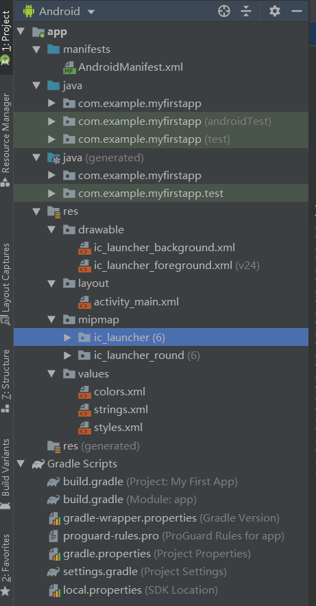
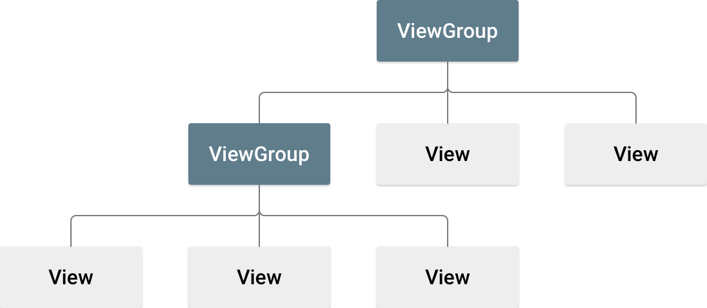
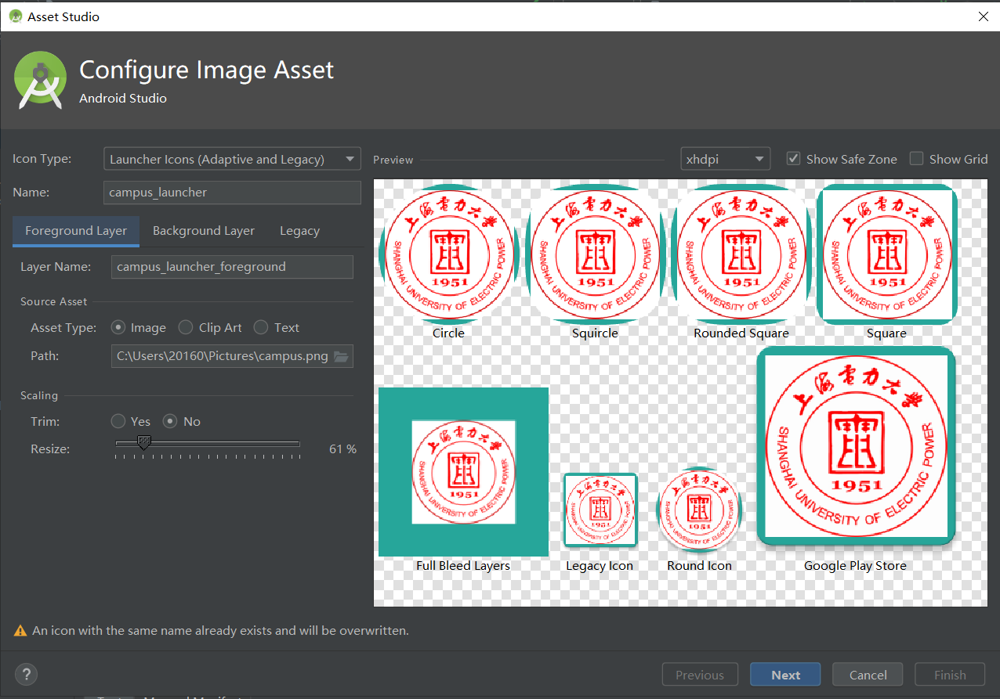

# Android 四大组件

1. Activity(活动)，用于表现功能
2. Service(服务)，后台运行服务，不提供界面呈现
3. BroadcastReceiver(广播接收器)，由于接受广播
4. ContentProvider(内容提供器)，支持在多个应用中存储和读取数据，相当于数据库。

# Android 程序结构

1. app文件夹：这是工程产生后，Android Studio 自动创建的module所在文件夹,应用程序的源代码和资源文件就放在这个module当中.

2. build: 编译后的文件存放的位置,最终生成的apk文件就在这个目录中。

3. libs: 添加的*.jar或*.so等文件存放的位置。

4. src文件夹：androidTest和test（测试相关的内容）
            main文件夹（java源代码、res资源文件）
            AndroidManifest.xml文件是当前Android应用的配置文件，包括程序名称、图标、访问权限等整体信息，另外，程序中定义的组件（Activity、Service、ContentProvider和BroadcastReceiver）需要在AndroidMainfest.xml文件中注册后才能使用。
**AndroidMainfest.xml**

```xml
<?xml version="1.0" encoding="utf-8"?>
<manifest xmlns:android="http://schemas.android.com/apk/res/android"
    package="com.example.myfirstapp">
<!--xmlns:android:定义android的命名空间-->
<!--package:指定本应用内java主程序的包名-->
<!--<application/>：声明了每个应用程序的组件及其属性-->
<!--android:allowBackup="true":将程序加入系统的备份和恢复架构中-->
<!--android:icon="@mipmap/ic_launcher"表示App的图标-->
<!--android:label="@string/app_name"许可列表-->
<!--android:supportsRtl="true"启用各种RTL API来用RTL布局显示应用，这是Android 4.2版本的新特性-->
<!--android:theme="@style/AppTheme" android的主题-->
<!--android:name=".MainActivity"表示当前activity-->
<!-- <intent-filter>
           action 只有android:name属性，常见的是android.intent.action.MAIN
            category: android:name属性，常见的是android.intent.category.LAUNCHER
            决定应用程序是否显示在程序列表里-->
    <application
        android:allowBackup="true"
        android:icon="@mipmap/ic_launcher"
        android:label="@string/app_name"
        android:roundIcon="@mipmap/ic_launcher_round"
        android:supportsRtl="true"
        android:theme="@style/AppTheme">
        <activity android:name=".MainActivity">
            <intent-filter>
                <action android:name="android.intent.action.MAIN" />

                <category android:name="android.intent.category.LAUNCHER" />
            </intent-filter>
        </activity>
    </application>

</manifest>
```

build.gradle

```gradle
apply plugin: 'com.android.application'
// minSdkVersion 19  表示应用程序允许安装的最低API
// targetSdkVersion 表示这个应用的理想运行系统版本
// versionName表示版本号，可以通过查看该应用在设备上的详细信息获取
android {
    compileSdkVersion 28
    buildToolsVersion "29.0.0"
    defaultConfig {
        applicationId "com.example.myfirstapp"
        minSdkVersion 19
        targetSdkVersion 28
        versionCode 1
        versionName "1.0"
        testInstrumentationRunner "androidx.test.runner.AndroidJUnitRunner"
    }
    buildTypes {
        release {
            minifyEnabled false
            proguardFiles getDefaultProguardFile('proguard-android-optimize.txt'), 'proguard-rules.pro'
        }
    }
}

dependencies {
    implementation fileTree(dir: 'libs', include: ['*.jar'])
    implementation 'androidx.appcompat:appcompat:1.0.2'
    implementation 'androidx.constraintlayout:constraintlayout:1.1.3'
    testImplementation 'junit:junit:4.12'
    androidTestImplementation 'androidx.test:runner:1.1.1'
    androidTestImplementation 'androidx.test.espresso:espresso-core:3.1.1'
}
```



res-->drawable  存放一些xml文件，*dpi表示存储分辨率的图片，用于适配不同的屏幕

* `mdpi`: 320x480;
* `hdpi`: 480x800、480x854;
* `xhdpi`: 至少960x720;
* `xxhdpi`: 1280x720

res-->layout 存放布局文件

mipmap--> 存放原声图片资源

values--> 存放APP引用的一些值

* colors.xml 存放了一些color样式；
* dimens.xml 存放了一些公用的dp值
* strings.xml 存放了引用的string值
* styles.sml 存放了APP需要用到的一些样式

MainActivity.java

```java
package com.example.myfirstapp;

import androidx.appcompat.app.AppCompatActivity;
import android.os.Bundle;

public class MainActivity extends AppCompatActivity {

    @Override
    protected void onCreate(Bundle savedInstanceState) {
        super.onCreate(savedInstanceState);
        setContentView(R.layout.activity_main);
    }
}
```

# 构建简单的界面

Android 应用的界面使用布局（ViewGroup 对象）和微件（View 对象）的层次结构构建而成。布局是一种容器，用于控制其子视图在屏幕上的放置方式。微件是界面组件，如按钮和文本框。



Android 提供了 ViewGroup 和 View 类的 XML 词汇表，因此界面的大部分内容都在 XML 文件中定义。不过，本课将向您介绍如何使用 Android Studio 的布局编辑器创建布局，而不是教您编写一些 XML 代码。在布局编辑器中，只需拖放视图即可构建布局，操作变得非常简单。

构建一个 Intent

Intent 是在相互独立的组件（如两个 Activity）之间提供运行时绑定功能的对象。

Intent 表示某个应用“执行某项操作的意图”。您可以使用 Intent 来执行多种任务，但在本课中，您的 Intent 将用于启动另一个 Activity.

# Activity 使用

## Activity的启动方式

启动Activity需要使用Intent对象，Android系统通过Intent对象找到需要启动的目标组件。根据被启动Activity是否有数据返回，可以将Activity的启动方式分为两种。**直接启动Activity，没有返回值**；另一种是**启动Activity**后，目标Activity有数据返回源Activity.

1. 直接启动

```java
Intent intent = new Intent(A.this,B.class);
startActivity(intent);
```

上述代码通过Intent的构造方法创建一个intent对象。该构造方法接受两个参数，第一个参数是Context是启动Activity的上下文，此处为A.this;第二个参数Class是指定要启动的目标Activity,此处为B.class。

2. 启动一个Activity并返回结果

使用`startActivityForResult()`方法启动Activity,并且当前Activity需要重写`onActivityResult()`方法处理返回的结果数据。

为了获取被启动Activity的返回结果，需要执行以下两个步骤：

1. 被启动的Activity需要调用`setResult(int resultCode, Intent data)`方法设置返回的结果数据。
2. 当前的Activity要重写`onActivityResult(int requestCode, int resultCode, Intent intent)`方法，其中requestCode代表请求码，用于判断是哪个请求的返回结果触发；resultCode代表返回的结果码，判断返回结果的状态。

## Activity之间数据交换

Intent可以用来启动Activity，也可以用来在Activity之间传递数据。使用Intent传递数据只需要调用Intent提供的`putExtra（String name, Xxx data）`方法


# 启动图标制作

1. res--->new--->`ImageAsset`



2. 修改`app/src/main/AndroidManifest.xml` 文件

```xml
 <application
android:icon="@mipmap/campus_launcher"
android:roundIcon="@mipmap/campus_launcher_round"
 </application>
```

# 制作Android Splash闪屏

当我们的APP已经启动但尚未在内存中时，用户点击app图标启动应用程序于实际调用启动程序Activity的`onCreate()`之间可能会有一些延迟，在“冷启动”期间，`WindowManager`尝试使用应用程序主题中的元素（如`windowBackground`）绘制占位符UI。因此，我们可以将其更改为显示启动的drawable, 而不是显示默认的`windowBackground`(通常为白色或黑色)。这样，启动画面仅在需要时显示,而且不会减慢用户启动APP数据。

# Android 客户端开发

Android客户端代码包说明

| 包名                                | 说明                                       |
| ----------------------------------- | ------------------------------------------ |
| cn.sharesdk.onekeyshare             | 社会化分享依赖包                           |
| food.neusoft.com.food               | 总包                                       |
| food.neusoft.com.food.activity      | 存放所有的Activity类                       |
| food.neusoft.com.food.adapter       | 存放适配器类                               |
| food.neusoft.com.food.domain        | 存放相关的实体类，如商品信息、订单信息等   |
| food.neusoft.com.food.Fragment.main | 存放Fragment类，Fragment主要用于页面的导航 |
| food.neusoft.com.food.thread        | 线程，网络相关的工具类                     |
| food.neusoft.com.food.utils         | 通用工具包                                 |
| food.neusoft.com.food.view          | 自定义控件，自定义ViewPager顶部轮播图      |
| food.neusoft.com.food.widget        | 自定义组件                                 |
| food.neusoft.com.food.wxapi         | 微信API,项目集成微信时采用                 |

## Android框架使用

### AsyncHttpClient 框架

​	AsyncHttpClient 基于Apache HttpClient, 所有的请求都独立在UI主线程之外，通过回调方法处理请求结果，采用**Handler**机制传递信息。

​	创建异步请求，一般使用静态的HttpClient 对象，调用相应的方法，通常涉及**AsyncHttpClient**, **RequestParams**, **AsyncHttpResponseHandler** 3个类的使用。

​	**AsyncHttpClient**类通常用于在Android应用程序中创建异步请求，如GET、POST、PUT 和 DELETE 等，请求参数通过RequestParams实例创建，响应通过重写匿名内部类ResponseHandlerInterface的方法处理。使用AsyncHttpClient执行网络请求时，最终都会调用sendRequest（）方法，在这个方法内部将请求参数封装成AsyncHttpRequest交由内部的线程池执行。

​	**RequestParams**类用于创建AsyncHttpClient 实例中请求参数的集合，参数可以是String、File和InputStream等等。

​	**AsyncHttpResponseHandler**继承自ResponseHandlerInterface类，主要用于拦截和处理由AsyncHttpClient创建的请求。在匿名类AsyncHttpResponseHandler中重写`onSuccess(int, org.apache.http.Header[],byte[],Throwable)`, onStart(), onFinish(), onRetry() 和 onProgress(int, int)等方法。

# Android Http 通信

要在您的应用中执行网络操作，您的清单必须包含以下权限

```xml
<uses-permission android:name="android.permission.INTERNET" />
<uses-permission android:name="android.permission.ACCESS_NETWORK_STATE" />
```

## 设计安全的网络通信

在向应用添加网络功能之前，您需要确保应用中的数据和信息在通过网络传输时处于安全状态。为此，请遵循以下网络安全最佳做法

* 最大限度地减少您通过网络传输的敏感或个人[用户数据](https://developer.android.google.cn/training/articles/security-tips.html#UserData)的数量
* 通过 [SSL](https://developer.android.google.cn/training/articles/security-ssl.html) 发送来自您应用的所有网络流量
* 考虑创建一个[网络安全配置](https://developer.android.google.cn/training/articles/security-config.html)，该配置允许您的应用信任自定义 CA 或限制在安全通信方面取得其信任的系统 CA 集。

Android 对于Http 网络通信，提供了标准的Java接口——`HttpURLConnection`接口和Apache的接口——`HttpClient`接口。

## URL 加载网络资源

URL类提供了多个构造器用于创建URL对象。

获得对象后，可以使用下列表所示的方法来访问该URL资源。

| 方法                           | 说明                                               |
| ------------------------------ | -------------------------------------------------- |
| String getFile()               | 获取此URL的资源名                                  |
| String getHost()               | 获取此URL的主机名                                  |
| String getPath()               | 获取此URL的路径部分                                |
| int getPort()                  | 获取此URL的端口号                                  |
| String getProtocol()           | 获取此URL的协议名                                  |
| String getQuery()              | 获取此URL的查询字符串部分                          |
| URLConnection openConnection() | 表示到URL所用引用的远程对象的连接                  |
| InputStream openStream()       | 打开与此URL的连接，返回用于读取该资源的InputStream |

使用URL加载网络资源的一般步骤如下

1. 获取URL对象。
2. 调取openStream() 方法打开URL的连接，获取URL的资源输入流。
3. 通过输入流InputStream进行文件读写。
4. 关闭输入流。

