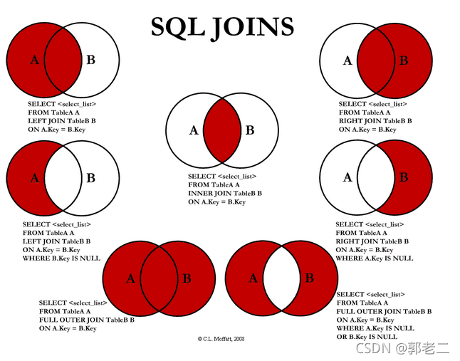

# update 

```sql
update tb set UserName="XXXXX" where UserID="aasdd"
```

# insert

```sql
insert into tb('clum') valus ();
```

# delete

```sql
delete from tb 
```

# select 

```sql
select * from tb where
```

left join(左联接) 返回包括左表中的所有记录和右表中联结字段相等的记录
right join(右联接) 返回包括右表中的所有记录和左表中联结字段相等的记录
inner join(等值连接) 只返回两个表中联结字段相等的行



```
表A记录如下：
aID　　　　　aNum
1　　　　　a20050111
2　　　　　a20050112
3　　　　　a20050113
4　　　　　a20050114
5　　　　　a20050115

表B记录如下:
bID　　　　　bName
1　　　　　2006032401
2　　　　　2006032402
3　　　　　2006032403
4　　　　　2006032404
8　　　　　2006032408
```

```sql
select * from A
left join B
on A.aID = B.bID
```

```
aID　　　　　aNum　　　　　bID　　　　　bName
1　　　　　a20050111　　　　1　　　　　2006032401
2　　　　　a20050112　　　　2　　　　　2006032402
3　　　　　a20050113　　　　3　　　　　2006032403
4　　　　　a20050114　　　　4　　　　　2006032404
5　　　　　a20050115　　　　NULL　　　　　NULL
```


```sql
select * from A
right join B
on A.aID = B.bID
```

```
aID　　　　　aNum　　　　　bID　　　　　bName
1　　　　　a20050111　　　　1　　　　　2006032401
2　　　　　a20050112　　　　2　　　　　2006032402
3　　　　　a20050113　　　　3　　　　　2006032403
4　　　　　a20050114　　　　4　　　　　2006032404
NULL　　　　　NULL　　　　　8　　　　　2006032408
```

3.inner join

sql语句如下:

```sql
select * from A
innerjoin B
on A.aID = B.bID
```

结果如下:

```
aID　　　　　aNum　　　　　bID　　　　　bName
1　　　　　a20050111　　　　1　　　　　2006032401
2　　　　　a20050112　　　　2　　　　　2006032402
3　　　　　a20050113　　　　3　　　　　2006032403
4　　　　　a20050114　　　　4　　　　　2006032404
```