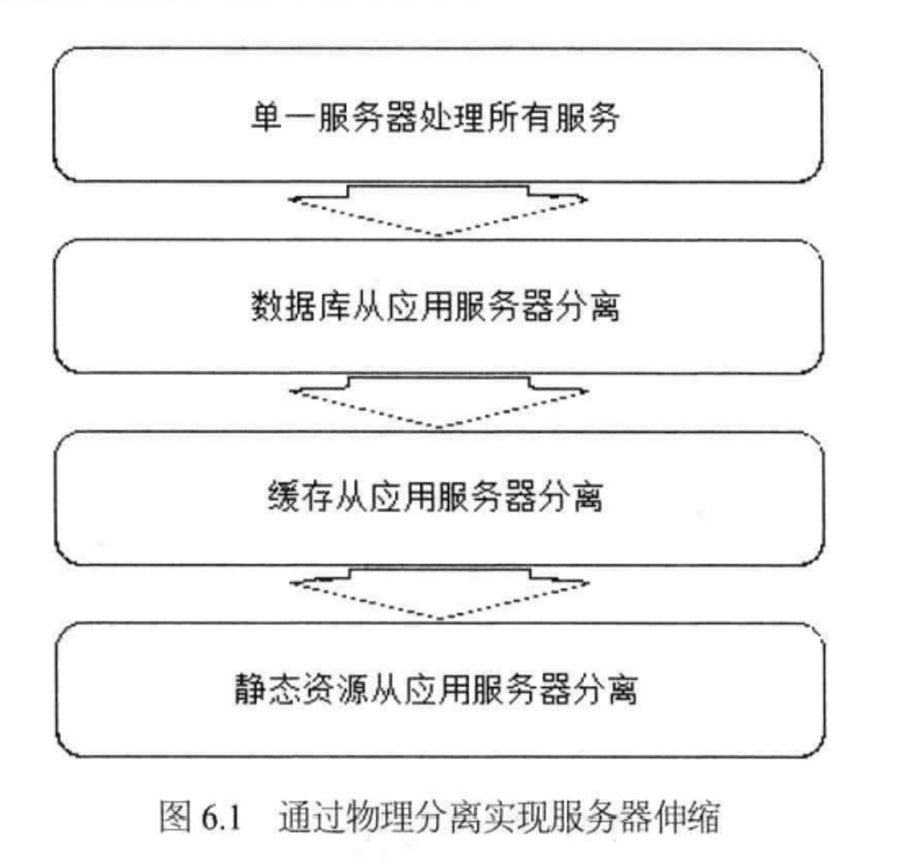

# 1. 大型网站架构演化

## 1.2 大型网站架构演化发展历程

### 1.2.1 初始阶段的网站架构

大型网站都是从小型网站发展而来，网站架构也是一样，是从小型网站架构逐步演化而来。

小型网站最开始时没有太多人访问，只需要一台服务器就绰绰有余，这时的网站架构如图 1.1 所示。


应用程序、数据库、文件等所有的资源都在一台服务器上。通常服务器操作系统使用 Linux，应用程序使用 PHP 开发，然后部署在 Apache 上，数据库使用 MySQL，汇集各种免费开源软件及一台廉价服务器就可以开始网站的发展之路了。

### 1.2.2 应用服务和数据服务分离

随着网站业务的发展，一台服务器逐渐不能满足需求:越来越多的用户访问导致性能越来越差越来越多的数据导致存储空间不足。这时就需要将应用和数据分离。应用和数据分离后整个网站使用三台服务器: **应用服务器**、**文件服务器**和**数据库服务器**。

如图 1.2 所示。这三台服务器对硬件资源的要求各不相同，**应用服务器需要处理大量的业务逻辑，因此需要更快更强大的 CPU**;**数据库服务器需要快速磁盘检索和数据缓存，因此需要更快的硬盘和更大的内存**;**文件服务器需要存储大量用户上传的文件，因此需要更大的硬盘**。


### 1.2.3 使用缓存改善网站性能

网站访问特点和现实世界的财富分配一样遵循二八定律，**80%的业务访问集中在 20%**的数据上。

淘宝买家浏览的商品集中在少部分成交数多、评价良好的商品上;

百度搜索关键词集中在少部分热门词汇上;

只有经常登录的用户才会发微博、看微博，而这部分用户也只占总用户数目的一小部分。

既然大部分的业务访问集中在一小部分数据上，那么如果把这一小部分数据缓存在内存中，是不是就可以减少数据库的访问压力，提高整个网站的数据访问速度，改善数据库的写入性能了呢?

网站使用的缓存可以分为两种:

**缓存在应用服务器上的本地缓存**和**缓存在专门的分布式缓存服务器上的远程缓存**。

> ℹ️ 本地缓存
>
> 本地缓存的访问速度更快一些，但是受应用服务器内存限制，其缓存数据量有限，而且会出现和应用程序争用内存的情况。

> ℹ️ 远程缓存
>
> 远程分布式缓存可以使用集群的方式，部署大内存的服务器作为专门的缓存服务器，可以在理论上做到不受内存容量限制的缓存服务，如图 1.3 所示。


> ⚠️ 小心
> 使用缓存后，**数据访问压力得到有效缓解，但是单一应用服务器能够处理的请求连接有限，在网站访问高峰期，应用服务器成为整个网站的瓶颈**。


### 1.2.4 使用应用服务器集群改善网站的并发处理能力

**使用集群是网站解决高并发、海量数据问题的常用手段**。

当一台服务器的处理能力、存储空间不足时，不要企图去换更强大的服务器，对大型网站而言，不管多么强大的服务器，都满足不了网站持续增长的业务需求。这种情况下，更恰当的做法是增加一台服务器分担原有服务器的访问及存储压力。

对网站架构而言，只要能通过增加一台服务器的方式改善负载压力，就可以同样的方式持续增加服务器不断改善系统性能，从而实现系统的可伸缩性。

应用服务器实现集群是网站可伸缩集群架构设计中较为简单成熟的一种，如图 1.4 所示。


通过负载均衡调度服务器，可将来自用户浏览器的访问请求分发到应用服务器集群中的任何一台服务器上，如果有更多的用户，就在集群中加入更多的应用服务器，使应用服务器的负载压力不再成为整个网站的瓶颈。


### 1.2.5 数据库读写分离

网站在使用缓存后，使绝大部分数据读操作访问都可以不通过数据库就能完成，但是仍有一部分读操作（缓存访问不命中、缓存过期)和全部的写操作需要访问数据库，在网站的用户达到一定规模后，**数据库因为负载压力过高而成为网站的瓶颈**。

**目前大部分的主流数据库都提供主从热备功能，通过配置两台数据库主从关系，可以将一台数据库服务器的数据更新同步到另一台服务器上**。

网站利用数据库的这一功能,实现数据库读写分离，从而改善数据库负载压力，如
图 1.5 所示。


**应用服务器在写数据的时候，访问主数据库，主数据库通过主从复制机制将数据更新同步到从数据库，这样当应用服务器读数据的时候，就可以通过从数据库获得数据**。

**为了便于应用程序访问读写分离后的数据库，通常在应用服务器端使用专门的数据访问模块，使数据库读写分离对应用透明**。


### 1.2.6 使用反向代理和 CDN(Content Delivery Network)加速网站响应

随着网站业务不断发展，用户规模越来越大，由于中国复杂的网络环境，不同地区的用户访问网站时，速度差别也极大。有研究表明，网站访问延迟和用户流失率正相关，网站访问越慢，用户越容易失去耐心而离开。

[CDN 是什么？使用 CDN 有什么优势？](https://www.zhihu.com/question/36514327?rf=37353035)

> ℹ️ CDN
>
> Content Delivery Network，即内容分发网络
>
> CDN 是构建在现有网络基础之上的智能虚拟网络，依靠部署在各地的边缘服务器，通过中心平台的负载均衡、内容分发、调度等功能模块，**使用户就近获取所需内容，降低网络拥塞，提高用户访问响应速度和命中率**。CDN 的关键技术主要有内容存储和分发技术。

> ℹ️
>
> 为了提供更好的用户体验，留住用户，网站需要加速网站访问速度。主要手段有**使用 CDN 和反向代理**.

如图 1.6 所示。


**CDN 和反向代理的基本原理都是缓存**,区别在于

CDN 部署在网络提供商的机房,使用户在请求网站服务时，可以从距离自己最近的网络提供商机房获取数据;

而反向代理则部署在网站的中心机房，当用户请求到达中心机房后，
首先访问的服务器是反向代理服务器，如果反向代理服务器中缓存着用户请求的资源，就将其直接返回给用户。

> ℹ️
>
> 使用 CDN 和反向代理的目的都是尽早返回数据给用户，一方面加快用户访问速度，另一方面也减轻后端服务器的负载压力。


### 1.2.7 使用分布式文件系统和分布式数据库系统

任何强大的单一服务器都满足不了大型网站持续增长的业务需求。

**数据库经过读写分离后，从一台服务器拆分成两台服务器，但是随着网站业务的发展依然不能满足需求,这时需要使用分布式数据库**。

**文件系统也是一样,需要使用分布式文件系统**，如图 1.7 所示。

**分布式数据库是网站数据库拆分的最后手段，只有在单表数据规模非常庞大的时候才使用**。

**不到不得已时，网站更常用的数据库拆分手段是业务分库**，将不同业务的数据库部署在不同的物理服务器上。


### 1.2.8 使用 NoSQL 和搜索引擎

随着网站业务越来越复杂，对数据存储和检索的需求也越来越复杂，网站需要采用一些非关系数据库技术如 NoSQL 和非数据库查询技术如搜索引擎，如图 1.8 所示。

NoSQL

NoSQL 和搜索引擎都是源自互联网的技术手段，对可伸缩的分布式特性具有更好的支持。

**应用服务器则通过一个统一数据访问模块访问各种数据**，减轻应用程序管理诸多数据源的麻烦。


### 1.2.9 业务拆分

大型网站为了应对日益复杂的业务场景，通过使用分而治之的手段将整个网站业务分成不同的产品线，如大型购物交易网站就会将首页、商铺、订单、买家、卖家等拆分成不同的产品线，分归不同的业务团队负责。

具体到技术上，也会根据产品线划分，将一个网站拆分成许多不同的应用，每个应用独立部署维护。应用之间可以通过一个超链接建立关系（在首页上的导航链接每个都指向不同的应用地址)，也可以通过消息队列进行数据分发，当然最多的还是通过访问同一个数据存储系统来构成一个关联的完整系统，如图 1.9 所示。


### 1.2.10 分布式服务

随着业务拆分越来越小，存储系统越来越庞大，应用系统的整体复杂度呈指数级增加，部署维护越来越困难。由于所有应用要和所有数据库系统连接，在数万台服务器规模的网站中，这些连接的数目是服务器规模的平方，导致存数据库接资源不足，拒绝服务。

既然每一个应用系统都需要执行许多相同的业务操作，比如用户管理、商品管理等，那么可以将这些共用的业务提取出来，独立部署。**由这些可复用的业务连接数据库，提供共用业务服务**，**而应用系统只需要管理用户界面，通过分布式服务调用共用业务服务完成具体业务操作**，如图 1.10 所示。


## 1.3 大型网站架构演化的价值观

这个世界没有哪个网站从诞生起就是大型网站;也没有哪个网站第一次发布就拥有庞大的用户，高并发的访问，海量的数据;大型网站都是从小型网站发展而来。

网站的价值在于它能为用户提供什么价值，在于网站能做什么，而不在于它是怎么做的，所以在网站还很小的时候就去追求网站的架构是舍本逐末，得不偿失的。

小型网站最需要做的就是为用户提供好的服务来创造价值，得到用户的认可，活下去，野蛮生长。

所以我们看到，一方面是随着互联网的高速发展，越来越多新的软件技术和产品从互联网公司诞生，挑战传统软件巨头的江湖地位。

另一方面却是中小网站十几年如一日地使用 LAMP 技术(Linux+Apache+MySQL+PHP)开发自己的网站，因为 LAMP 既便宜又简单，而且对付一个中小型网站绰绰有余。

## 1.4 网站架构设计误区

在大型网站架构发展过程中有如下几个容易出现的误区。

1. 一味追随大公司的解决方案

2. 为了技术而技术

3. 企图用技术解决所有问题

最典型的例子就是 2012 年年初 12306 故障事件后，软件开发技术界的反应。

各路专业和非专业人士众说纷纭地帮 12306 的技术架构出谋划策，甚至有人提议帮 12306 写一个开源的网站，解决其大规模并发访问的问题。

12306 真正的问题**其实不在于它的技术架构，而在于它的业务架构**:

12306 根本就不应该在几亿中国人一票难求的情况下以窗口售票的模式在网上售票（零点开始出售若干天后的车票)。

12306 需要重构的不仅是它的技术架构，更重要的是它的业务架构:

调整业务需求，换一种方式卖票，而不要去搞促销秒杀这种噱头式的游戏。

后来证明 12306 确实是朝这个方向发展的:

**在售票方式上引入了排队机制、整点售票调整为分时段售票**。

其实如果能控制住并发访问的量，很多棘手的技术问题也就不是什么问题了。

**技术是用来解决业务问题的，而业务的问题，也可以通过业务的手段去解决**。

## 1.5 小结

时至今日，大型网站的架构演化方案已经非常成熟，各种技术方案也逐渐产品化。

许多小型网站已经慢慢不需要再经历大型网站经历过的架构演化之路就可以逐步发展壮大，因为现在越来越多的网站从建立之初就是搭建在大型网站提供的云计算服务基础之上，所需要的一切技术资源:**计算、存储、网络都可以按需购买，线性伸缩，不需要自己一点一点地拼凑各种资源，综合使用各种技术方案逐步去完善自己的网站架构了**。

所以能亲身经历一个网站从小到大的架构演化过程的网站架构师越来越少，虽然过去有这种经历的架构师也很少(从小型网站发展成大型网站的机会本来就极少)，但是将来可能真就没有了。

**但也正因为网站架构技术演化过程难以重现，所以网站架构师更应该对这个过程深刻了解，理解已成熟的网站架构技术方案的来龙去脉和历史渊源，在技术选型和架构决策时才能有的放矢，直击要害**。

## 2.1 网站架构模式

### 2.1.1 分层

分层结构在计算机世界中无处不在，网络的 7 层通信协议是一种分层结构;计算机硬件、操作系统、应用软件也可以看作是一种分层结构。

在大型网站架构中也采用分层结构，将网站软件系统分为应用层、服务层、数据层，如表 2.1 所示。


分层架构是**逻辑上的，在物理部署上，三层结构可以部署在同一个物理机器上**，但是随着网站业务的发展，**必然需要对已经分层的模块分离部署，即三层结构分别部署在不同的服务器上**，**使网站拥有更多的计算资源以应对越来越多的用户访问**。

所以虽然分层架构模式最初的目的是规划软件清晰的逻辑结构便于开发维护，**但在网站的发展过程中，分层结构对网站支持高并发向分布式方向发展至关重要**。

因此在网站规模还很小的时候就应该采用分层的架构，这样将来网站做大时才能有更好地应对。

### 2.1.2 分割

如果说**分层是将软件在横向方面进行切分**,那么**分割就是在纵向方面对软件进行切分**。

网站越大，功能越复杂，服务和数据处理的种类也越多，将这些不同的功能和服务分割开来，包装成高内聚低耦合的模块单元.

**一方面有助于软件的开发和维护**;

**另一方面，便于不同模块的分布式部署，提高网站的并发处理能力和功能扩展能力**。

大型网站分割的粒度可能会很小。

比如在应用层，将不同业务进行分割，例如将购物、论坛、搜索、广告分割成不同的应用，由独立的团队负责，部署在不同的服务器上;

在同一个应用内部，如果规模庞大业务复杂，会继续进行分割，比如购物业务，可以进一步分割成机票酒店业务、3C 业务，小商品业务等更细小的粒度。

而即使在这个粒度上，还是可以继续分割成首页、搜索列表、商品详情等模块，
这些模块不管在逻辑上还是物理部署上，都可以是独立的。同样在服务层也可以根据需要将服务分割成合适的模块。


### 2.1.3 分布式

**对于大型网站，分层和分割的一个主要目的是为了切分后的模块便于分布式部署，即将不同模块部署在不同的服务器上，通过远程调用协同工作**。

分布式意味着可以使用更多的计算机完成同样的功能，计
算机越多，CPU、内存、存储资源也就越多，能够处理的并发访问和数据量就越大，进而能够为更多的用户提供服务。

> ⚠️ 但分布式在解决网站高并发问题的同时也带来了其他问题。
>
> 首先，分布式意味着服务调用必须通过网络，这可能会对性能造成比较严重的影响;
> 其次，服务器越多，服务器宕机的概率也就越大，一台服务器宕机造成的服务不可用可能会导致很多应用不可访问，使网站可用性降低;
> 另外，数据在分布式的环境中保持数据一致性也非常困难，分布式事务也难以保证，这对网站业务正确性和业务流程有可能造成很大影响;

分布式还导致网站依赖错综复杂，开发管理维护困难。

因此分布式设计要根据具体情况量力而行，切莫为了分布式而分布式。

在网站应用中，常用的分布式方案有以下几种。

> ℹ️ 分布式应用和服务
>
> 将分层和分割后的应用和服务模块分布式部署，除了可以改善网站性能和并发性、加快开发和发布速度、减少数据库连接资源消耗外;还可以使不同应用复用共同的服务，便于业务功能扩展。

> ℹ️ 分布式静态资源
>
> 网站的静态资源如 JS，CSS，Logo 图片等资源独立分布式部署，并采用独立的域名，即人们常说的动静分离。静态资源分布式部署可以减轻应用服务器的负载压力;通过使用独立域名加快浏览器并发加载的速度;由负责用户体验的团队进行开发维护有利于网站分工合作，使不同技术工种术业有专攻。

> ℹ️ 分布式数据和存储
>
> 大型网站需要处理以 Р 为单位的海量数据，单台计算机无法提供如此大的存储空间，这些数据需要分布式存储。除了对传统的关系数据库进行分布式部署外，为网站应用而生的各种 NoSQL 产品几乎都是分布式的。

> ℹ️ 分布式计算
>
> 严格说来，**应用、服务、实时数据处理都是计算**，网站除了要处理这些在线业务，还有很大一部分用户没有直观感受的后台业务要处理，包括搜索引擎的索引构建、数据仓库的数据分析统计等。这些业务的计算规模非常庞大，目前网站普遍使用 Hadoop 及其 MapReduce 分布式计算框架进行此类批处理计算，其特点是移动计算而不是移动数据，将计算程序分发到数据所在的位置以加速计算和分布式计算。

**此外，还有可以支持网站线上服务器配置实时更新的分布式配置;分布式环境下实现并发和协同的分布式锁;支持云存储的分布式文件系统等**。


### 2.1.4 集群

使用分布式虽然已经将分层和分割后的模块独立部署，但是对于用户访问集中的模块（比如网站的首页)，还需要将独立部署的服务器集群化，即多台服务器部署相同应用构成一个集群，通过负载均衡设备共同对外提供服务。

因为**服务器集群有更多服务器提供相同服务，因此可以提供更好的并发特性**，当有更多用户访问的时候，只需要向集群中加入新的机器即可。同时因为一个应用由多台服务器提供，**当某台服务器发生故障时，负载均衡设备或者系统的失效转移机制会将请求转发到集群中其他服务器上，使服务器故障不影响用户使用**。

所以在网站应用中，即使是访问量很小的分布式应用和服务，也至少要部署两台服务器构成一个小的集群，目的就是提高系统的可用性。


### 2.1.5 缓存

**缓存就是将数据存放在距离计算最近的位置以加快处理速度**。

**缓存是改善软件性能的第一手段**，现代 CPU 越来越快的一个重要因素就是使用了更多的缓存，在复杂的软件设计中，缓存几乎无处不在。大型网站架构设计在很多方面都使用了缓存设计。

**CDN:即内容分发网络，部署在距离终端用户最近的网络服务商**，用户的网络请求总是先到达他的网络服务商那里，在这里缓存网站的一些静态资源（较少变化的数据)，可以就近以最快速度返回给用户，如视频网站和门户网站会将用户访问量大的热点内容缓存在 CDN。

**反向代理**:反向代理属于网站前端架构的一部分，部署在网站的前端，当用户请求到达网站的数据中心时，最先访问到的就是反向代理服务器，这里缓存网站的静态资源，无需将请求继续转发给应用服务器就能返回给用户。

**本地缓存**：在应用服务器本地缓存着热点数据，应用程序可以在本机内存中直接访问数据,而无需访问数据库。

**分布式缓存**:大型网站的数据量非常庞大，即使只缓存一小部分，需要的内存空间也不是单机能承受的，所以除了本地缓存，还需要分布式缓存，将数据缓存在一个专门的分布式缓存集群中，应用程序通过网络通信访问缓存数据。

使用缓存有两个前提条件，

一是数据访问热点不均衡，某些数据会被更频繁的访问，这些数据应该放在缓存中;

二是数据在某个时间段内有效，不会很快过期，否则缓存的数据就会因已经失效而产生脏
读，影响结果的正确性。

网站应用中，**缓存除了可以加快数据访问速度，还可以减轻后端应用和数据存储的负载压力**，

这一点对网站数据库架构至关重要，网站数据库几乎都是按照有缓存的前提进行负载
能力设计的。


### 2.1.6 异步

计算机软件发展的一个重要目标和驱动力是降低软件耦合性。事物之间直接关系越少，就越少被彼此影响，越可以独立发展。**大型网站架构中，系统解耦合的手段除了前面提到的分层、分割、分布等，还有一个重要手段是异步**，业务之间的消息传递不是同步调用，而是**将一个业务操作分成多个阶段，每个阶段之间通过共享数据的方式异步执行进行协作**。

> ℹ️
>
> **在单一服务器内部可通过多线程共享内存队列的方式实现异步**，处在业务操作前面的线程将输出写入到队列，后面的线程从队列中读取数据进行处理;
>
> **在分布式系统中，多个服务器集群通过分布式消息队列实现异步**，分布式消息队列可以看作内存队列的分布式部署。

异步架构是典型的生产者消费者模式，两者不存在直接调用，只要保持数据结构不变，彼此功能实现可以随意变化而不互相影响，这对网站扩展新功能非常便利。

除此之外，使用异步消息队列还有如下特性。

> ℹ️
> **提高系统可用性**。消费者服务器发生故障，数据会在消息队列服务器中存储堆积，生产者服务器可以继续处理业务请求，系统整体表现无故障。消费者服务器恢复正常后，继续处理消息队列中的数据。
> **加快网站响应速度**。处在业务处理前端的生产者服务器在处理完业务请求后，将数据写入消息队列，不需要等待消费者服务器处理就可以返回，响应延迟减少。
> **消除并发访问高峰**。用户访问网站是随机的，存在访问高峰和低谷，即使网站按照一般访问高峰进行规划和部署，也依然会出现突发事件，比如购物网站的促销活动，微博上的热点事件，都会造成网站并发访问突然增大，这可能会造成整个网站负载过重，响应延迟，严重时甚至会出现服务宕机的情况。使用消息队列将突然增加的访问请求数据放入消息队列中，等待消费者服务器依次处理，就不会对整个网站负载造成太大压力。

但需要注意的是，**使用异步方式处理业务可能会对用户体验、业务流程造成影响，需要网站产品设计方面的支持**。


### 2.1.7 冗余

网站需要 7×24 小时连续运行，但是服务器随时可能出现故障，特别是服务器规模比较大时，出现某台服务器宕机是必然事件。

要想保证在服务器宕机的情况下网站依然可以继续服务，不丢失数据，就需要一定程度的服务器冗余运行，数据冗余备份，这样当某台服务器宕机时，可以将其上的服务和数据访问转移到其他机器上。

**访问和负载很小的服务也必须部署至少两台服务器构成一个集群**，其目的就是通过冗余实现服务高可用。数据库除了定期备份，存档保存，实现冷备份外，为了保证在线业务高可用，还需要对数据库进行主从分离，实时同步实现热备份。

> ℹ️
>
> 数据库除了定期备份，存档保存，实现冷备份外，为了保证在线业务高可用，还需要对数据库进行主从分离，实时同步实现热备份。

为了抵御地震、海啸等不可抗力导致的网站完全瘫痪，某些大型网站会对整个数据中心进行备份，**全球范围内部署灾备数据中心**。**网站程序和数据实时同步到多个灾备数据中心**。

### 2.1.8 自动化

在无人值守的情况下网站可以正常运行，一切都可以自动化是网站的理想状态。目前大型网站的自动化架构设计主要集中在发布运维方面。

发布对网站都是头等大事，许多网站故障出在发布环节，网站工程师经常加班也是因为发布不顺利。

通过减少人为干预，使发布过程自动化可有效减少故障。发布过程包括诸多环节。

**自动化代码管理**，代码版本控制、代码分支创建合并等过程自动化，开发工程师只要提交自己参与开发的产品代号，系统就会自动为其创建开发分支，后期会自动进行代码合并;

**自动化测试**，代码开发完成，提交测试后，系统自动将代码部署到测试环境，启动自动化测试用例进行测试，向相关人员发送测试报告，向系统反馈测试结果;

**自动化安全检测**，安全检测工具通过对代码进行静态安全扫描及部署到安全测试环境进行安全攻击测试，评估其安全性;

**最后进行自动化部署**，将工程代码自动部署到线上生产环境。

此外，网站在运行过程中可能会遇到各种问题:

**服务器宕机、程序 Bug、存储空间不足、突然爆发的访问高峰**。

网站需要对线上生产环境进行自动化监控，对服务器进行心跳检测，并监控其各项性能指标和应用程序的关键数据指标。

如果**发现异常、超出预设的阈值，就进行自动化报警，向相关人员发送报警信息，警告故障可能会发生**。

在检测到故障发生后，**系统会进行自动化失效转移，将失效的服务器从集群中隔离出去，不再处理系统中的应用请求**。

待故障消除后，**系统进行自动化失效恢复，重新启动服务，同步数据保证数据的一致性**。

在网站遇到访问高峰，超出网站最大处理能力时，**为了保证整个网站的安全可用，还会进行自动化降级**，通过拒绝部分请求及关闭部分不重要的服务将系统负载降至一个安全的水平，必要时，还需要自动化分配资源，将空闲资源分配给重要的服务，扩大其部署规模。

### 2.1.9 安全

互联网的开放特性使得其从诞生起就面对巨大的安全挑战，网站在安全架构方面也积累了许多模式:

通过密码和手机校验码进行身份认证;

登录、交易等操作需要对网络通信进行加密，网站服务器上存储的敏感数据如用户信息等也进行加密处理;

为了防止机器人程序滥用网络资源攻击网站，网站使用验证码进行识别;

对于常见的用于攻击网站的 XSS 攻击、SQL 注入、进行编码转换等相应处理;对于垃圾信息、敏感信息进行过滤;

**对交易转账等重要操作根据交易模式和交易信息进行风险控制**。

## 2.2 架构模式在新浪微博的应用

短短几年时间新浪微博的用户数就从零增长到数亿，明星用户的粉丝数达数千万，围绕着新浪微博正在发展一个集社交、媒体、游戏、电商等多位一体的生态系统。

同大多数网站一样，新浪微博也是从一个小网站发展起来的。简单的 LAMP( Linux+Apache+MySQL+PHP）架构，支撑起最初的新浪微博，应用程序用 PHP 开发，所有的数据，包括微博、用户、关系都存储在 MySQL 数据库中。

这样简单的架构无法支撑新浪微博快速发展的业务需求，随着访问用户的逐渐增加，系统不堪重负。新浪微博的架构在较短时间内几经重构，最后形成现在的架构，如图 2.1 所示。


系统分为三个层次，最下层是**基础服务层**，提供数据库、缓存、存储、搜索等数据服务，以及其他一些基础技术服务，这些服务支撑了新浪微博的海量数据和高并发访问,是整个系统的技术基础。

中间层是**平台服务和应用服务层**，新浪微博的核心服务是微博、关系和用户，它们是新浪微博业务大厦的支柱。**这些服务被分割为独立的服务模块，通过依赖调用和共享基础数据构成新浪微博的业务基础**。

最上层是**API 和新浪微博的业务层**，各种客户端（包括 Web 网站)和第三方应用，通过调用 API 集成到新浪微博的系统中，共同组成一个生态系统。

由于微博频繁刷新，新浪微博**使用多级缓存策略**，**热门微博和明星用户的微博缓存在所有的微博服务器上**，**在线用户的微博和近期微博缓存在分布式缓存集群**中，对于微博操作中最常见的“刷微博”操作，**几乎全部都是缓存访问操作**，可以获得很好的系统性能。

为了提高系统的整体可用性和性能，**新浪微博启用了多个数据中心**。这些数据中心既是地区用户访问中心，用户可以就近访问最近的数据中心以加快访问速度，改善系统性能;同时也是数据冗余复制的灾备中心，所有的用户和微博数据通过远程消息系统在不同的数据中心之间同步，提高系统可用性。

同时，**新浪微博还开发了一系列自动化工具**，包括自动化监控，自动化发布，自动化故障修复等，这些自动化工具还在持续开发中，以改善运维水平提高系统可用性。

由于微博的开放特性，新浪微博也遇到了一系列的安全挑战，垃圾内容、僵尸粉、微博攻击从未停止，除了使用一般网站常见的安全策略，新浪微博在开放平台上使用多级安全审核的策略以保护系统和用户。

## 2.3 小结

在程序设计与架构设计领域，模式正变得越来越受人关注，许多人寄希望通过模式一劳永逸地解决自己的问题。正确使用模式可以更好地利用业界和前人的思想与实践，用更少的时间开发出更好的系统，使设计者的水平也达到更高的境界。

但是模式受其适用场景限制，对系统的要求和约束也很多，不恰当地使用模式只会画虎不成反类犬，不但没有解决原来的老问题，反而带来了更棘手的新问题。

好的设计绝对不是模仿，不是生搬硬套某个模式，而是对问题深刻理解之上的创造与创新，即使是“微创新”，也是让人耳目一新的似曾相识。**山寨与创新的最大区别不在于是否抄袭，是否模仿，而在于对问题和需求是否真正理解与把握**。

# 3. 大型网站核心架构要素

一般说来，除了当前的系统功能需求外，软件架构还需要关注**性能、可用性、伸缩性、扩展性和安全性**这 5 个架构要素，架构设计过程中需要平衡这 5 个要素之间的关系以实现需求和架构目标，也可以通过考察这些架构要素来衡量一个软件架构设计的优劣，判断其是否满足期望。

## 3.1 性能

也正是因为性能问题几乎无处不在，所以优化网站性能的手段也非常多，从用户浏览器到数据库，影响用户请求的所有环节都可以进行性能优化。

> ℹ️ 浏览器端
> 
> 在浏览器端，可以通过浏览器缓存、使用页面压缩、合理布局页面、减少 Cookie 传输等手段改善性能。
> 还可以使用 CDN，将网站静态内容分发至离用户最近的网络服务商机房，使用户通过最短访问路径获取数据。
> 可以在网站机房部署反向代理服务器，缓存热点文件，加快请求响应速度，减轻应用服务器负载压力。

> ℹ️ 在应用服务器端
> 》
> 可以使用服务器本地缓存和分布式缓存，通过缓存在内存中的热点数据处理用户请求，加快请求处理过程,减轻数据库负载压力。
> 也可以通过异步操作将用户请求发送至消息队列等待后续任务处理，而当前请求直接返回响应给用户。
> 在网站有很多用户高并发请求的情况下，可以将多台应用服务器组成一个集群共同对外服务，提高整体处理能力，改善性能。

> ℹ️ 在代码层面
> 在代码层面，也可以通过使用多线程、改善内存管理等手段优化性能。

> ℹ️ 在数据库服务器端
> 索引、缓存、SQL 优化等性能优化手段都已经比较成熟。
> 而方兴未艾的 NoSQL 数据库通过优化数据模型、存储结构、伸缩特性等手段在性能方面的优势也日趋明显。

衡量网站性能有一系列指标，重要的有**响应时间、TPS、系统性能计数器**等，通过测试这些指标以确定系统设计是否达到目标。这些指标也是网站监控的重要参数，通过监控这些指标可以分析系统瓶颈，预测网站容量，并对异常指标进行报警，保障系统可用性。

对于网站而言，**性能符合预期仅仅是必要条件，因为无法预知网站可能会面临的访问压力，所以必须要考察系统在高并发访问情况下，超出负载设计能力的情况下可能会出现的性能问题**。**网站需要长时间持续运行，还必须保证系统在持续运行且访问压力不均匀的情况下保持稳定的性能特性**。

## 3.2 可用性

对于大型网站而言，特别是知名网站，网站宕掉、服务不可用是一个重大的事故，轻则影响网站声誉，重则可能会摊上官司。对于电子商务类网站，网站不可用还意味着损失金钱和用户。因此几乎所有网站都承诺 7×24 可用，但事实上任何网站都不可能达到完全的 7x24 可用，总会有一些故障时间，扣除这些故障时间，就是网站的总可用时间，这个时间可以换算成网站的可用性指标，以此衡量网站的可用性，一些知名大型网站可以做到 4 个 9 以上的可用性,也就是可用性超过 99.99%。

**网站高可用的主要手段是冗余**，应用部署在多台服务器上同时提供访问，数据存储在多台服务器上互相备份，任何一台服务器宕机都不会影响应用的整体可用，也不会导致数据丢失。

除了运行环境，网站的高可用还需要软件开发过程的质量保证。通过**预发布验证、自动化测试、自动化发布、灰度发布**等手段，减少将故障引入线上环境的可能，避免故障范围扩大。

衡量一个系统架构设计是否满足高可用的目标，就是假设系统中任何一台或者多台服务器宕机时，以及出现各种不可预期的问题时，系统整体是否依然可用。

## 3.3 伸缩性

大型网站需要面对大量用户的高并发访问和存储海量数据，不可能只用一台服务器就处理全部用户请求，存储全部数据。网站通过集群的方式将多台服务器组成一个整体共同提供服务。

所谓伸缩性是指通过不断向集群中加入服务器的手段来缓解不断上升的用户并发访问压力和不断增长的数据存储需求。

> ℹ️
> 》
> 衡量架构伸缩性的主要标准就是**是否可以用多台服务器构建集群**，**是否容易向集群中添加新的服务器**。**加入新的服务器后是否可以提供和原来的服务器无差别的服务**。**集群中可容纳的总的服务器数量是否有限制**。

> ℹ️
> 对于**应用服务器集群**，只要服务器上不保存数据，所有服务器都是对等的，通过使用合适的负载均衡设备就可以向集群中不断加入服务器。

> ℹ️
> 对于**缓存服务器集群**，加入新的服务器可能会导致缓存路由失效，进而导致集群中大部分缓存数据都无法访问。虽然缓存的数据可以通过数据库重新加载，但是如果应用已经严重依赖缓存，可能会导致整个网站崩溃。需要改进缓存路由算法保证缓存数据的可访问性。

> ℹ️
> 关系数据库虽然支持数据复制，主从热备等机制，但是**很难做到大规模集群的可伸缩性，因此关系数据库的集群伸缩性方案**必须在数据库之外实现，通过路由分区等手段将部署有多个数据库的服务器组成一个集群。
>
> 至于大部分 NoSQL 数据库产品，由于其先天就是为海量数据而生，因此其对伸缩性的支持通常都非常好，可以做到在较少运维参与的情况下实现集群规模的线性伸缩。

## 3.4 扩展性

不同于其他架构要素主要关注非功能性需求，网站的扩展性架构直接关注网站的功能需求。网站快速发展，功能不断扩展，**如何设计网站的架构使其能够快速响应需求变化**，是网站可扩展架构主要的目的。

**衡量网站架构扩展性好坏的主要标准就是在网站增加新的业务产品时，是否可以实现对现有产品透明无影响，不需要任何改动或者很少改动既有业务功能就可以上线新产品**。不同产品之间是否很少耦合，一个产品改动对其他产品无影响，其他产品和功能不需要受牵连进行。

> ℹ️
>
> 网站可伸缩架构的主要手段是**事件驱动架构**和**分布式服务**。

> ℹ️ 事件驱动架构
>
> **在网站通常利用消息队列实现，将用户请求和其他业务事件构造成消息发布到消息队列**，**消息的处理者作为消费者从消息队列中获取消息进行处理**。**通过这种方式将消息产生和消息处理分离开来**，可以透明地增加新的消息生产者任务或者新的消息消费者任务。

> ℹ️ 分布式服务
> 分布式服务则是将业务和可复用服务分离开来，通过分布式服务框架调用。新增产品可以通过调用可复用的服务实现自身的业务逻辑，而对现有产品没有任何影响。可复用服务升级变更的时候，也可以通过提供多版本服务对应用实现透明升级，不需要强制应用同步变更。

大型网站为了保持市场地位，还会吸引第三方开发者，调用网站服务，使用网站数据开发周边产品，扩展网站业务。

第三方开发者使用网站服务的主要途径是大型网站提供的开放平台接口。

## 3.5 安全性

互联网是开放的，任何人在任何地方都可以访问网站。网站的安全架构就是保护网站不受恶意访问和攻击，保护网站的重要数据不被窃取。
衡量网站安全架构的标准就是针对现存和潜在的各种攻击与窃密手段，是否有可靠的应对策略。

# 架构

瞬时响应:网站的高性能架构

## 4.1 网站性能测试

### 4.1.1 不同视角下的网站性能

1．用户视角的网站性能

在实践中，使用一些前端架构优化手段，通过**优化页面 HTML 式样、利用浏览器端的并发和异步特性、调整浏览器缓存策略、使用 CDN 服务、反向代理**等手段，使浏览器尽快地显示用户感兴趣的内容、尽可能近地获取页面内容，即使不优化应用程序和架构，也可以很大程度地改善用户视角下的网站性能。

2．开发人员视角的网站性能

开发人员关注的主要是应用程序本身及其相关子系统的性能，包括**响应延迟、系统吞吐量、并发处理能力、系统稳定性**等技术指标。

主要的优化手段有**使用缓存加速数据读取**，**使用集群提高吞吐能力**，**使用异步消息加快请求响应及实现削峰**，**使用代码优化手段改善程序性能**。

3．运维人员视角的网站性能

运维人员更关注基础设施性能和资源利用率，如**网络运营商的带宽能力**、**服务器硬件的配置**、**数据中心网络架构**、**服务器和网络带宽的资源利用**率等。主要优化手段有**建设优化骨干网、使用高性价比定制服务器、利用虚拟化技术优化资源利用**等。

### 4.1.2 性能测试指标

不同视角下有不同的性能标准，不同的标准有不同的性能测试指标，从开发和测试人员的视角，网站性能测试的主要指标有响应时间、并发数、吞吐量、性能计数器等。

> ℹ️ 1. 响应时间
> 指应用执行一个操作需要的时间，包括**从发出请求开始到收到最后响应数据所需要的时间**。响应时间是系统最重要的性能指标，直观地反映了系统的“快慢”。表 4.1 列出了一些常用的系统操作需要的响应时间。


实践中通常采用的办法是重复请求，比如一个请求操作重复执行一万次，测试一万次执行需要的总响应时间之和，然后除以一万，得到单次请求的响应时间。

> ℹ️ 2．并发数
> 指**系统能够同时处理请求的数目，这个数字也反映了系统的负载特性**。对于网站而言，并发数即网站并发用户数，指同时提交请求的用户数目。

与网站并发用户数相对应的还有网站在线用户数（当前登录网站的用户总数）和网站系统用户数(可能访问系统的总用户数，对多数网站而言就是注册用户数)。其数量比较关系为:

```
网站系统用户数>>网站在线用户数>>网站并发用户数
```

现实中，经常看到某些网站，特别是电商类网站，市场推广人员兴致勃勃地打广告打折促销，用户兴致勃勃地去抢购，结果活动刚一开始，就因为并发用户数超过网站最大负载而响应缓慢，急性子的用户不停刷新浏览器，导致系统并发数更高，最后以服务器系统崩溃，用户浏览器显示“Service is too busy”而告终。

出现这种情况，有可能是网站技术准备不充分导致，也有可能是运营人员错误地评估并发用户数导致。

**测试程序通过多线程模拟并发用户的办法来测试系统的并发处理能力**，为了真实模拟用户行为，测试程序并不是启动多线程然后不停地发送请求，而是在两次请求之间加入一个随机等待时间，这个时间被称作思考时间。

> ℹ️ 3．吞吐量
> **指单位时间内系统处理的请求数量，体现系统的整体处理能力**。

对于网站，可以用“请求数/秒”或是“页面数/秒”来衡量，也可以用“访问人数/天”或是“处理的业务数 J/小时”等来衡量。**TPS(每秒事务数）是吞吐量的一个常用量化指标，此外还有 HPS(每秒 HTTP 请求数)、QPS(每秒查询数）等**。

系统吞吐量和系统并发数，以及响应时间的关系可以形象地理解为高速公路的通行状况:

吞吐量是每天通过收费站的车辆数目（可以换算成收费站收取的高速费)，

并发数是高速公路上的正在行驶的车辆数目，响应时间是车速。

车辆很少时，车速很快，但是收到的高速费也相应较少;随着高速公路上车辆数目的增多，车速略受影响，但是收到的高速费增加很快;随着车辆的继续增加，车速变得越来越慢，高速公路越来越堵，收费不增反降;如果车流量继续增加，超过某个极限后，任何偶然因素都会导致高速全部瘫痪，车走不动，费当然也收不着，而高速公路成了停车场(资源耗尽)。

**网站性能优化的目的，除了改善用户体验的响应时间，还要尽量提高系统吞吐量，最大限度利用服务器资源。**

> ℹ️ 4．性能计数器
> 它是描述服务器或操作系统性能的一些数据指标。包括 System Load、对象与线程数、内存使用、CPU 使用、磁盘与网络 IOО 等指标。这些指标也是系统监控的重要参数，对这些指标设置报警阈值，当监控系统发现性能计数器超过阈值时，就向运维和开发人员报警，及时发现处理系统异常。

在 Linux 系统中使用 top 命令查看，该值是三个浮点数，表示最近 1 分钟，10 分钟，15 分钟的运行队列平均进程数。如图 4.2 所示。


### 4.1.3 性能测试方法

性能测试是一个总称，具体可细分为性能测试、负载测试、压力测试、稳定性测试。


> ℹ️ 性能测试
> 以系统设计初期规划的性能指标为预期目标，对系统不断施加压力，验证系统在资源可接受范围内，是否能达到性能预期。

> ℹ️ 负载测试
> 对系统不断地增加并发请求以增加系统压力，直到系统的某项或多项性能指标达到安全临界值，如某种资源已经呈饱和状态，这时继续对系统施加压力，系统的处理能力不但不能提高，反而会下降。

> ℹ️ 压力测试
> **超过安全负载的情况下**，对系统继续施加压力，直到系统崩溃或不能再处理任何请求，**以此获得系统最大压力承受能力**。

> ℹ️ 稳定性测试
> 被测试系统在特定硬件、软件、网络环境条件下，给系统加载一定业务压力，使系统运行一段较长时间，以此检测系统是否稳定。在不同生产环境、不同时间点的请求压力是不均匀的，呈波浪特性，因此为了更好地模拟生产环境，稳定性测试也应不均匀地对系统施加压力。


性能测试反应的是系统在实际生产环境中使用时，随着用户并发访问数量的增加，系统的处理能力。与性能曲线相对应的是用户访问的等待时间（系统响应时间)，如图 4.4 所示。


在日常运行区间，可以获得最好的用户响应时间，随着并发用户数的增加，响应延迟越来越大，直到系统崩溃，用户失去响应。

### 4.1.4

测试结果报告应能够反映上述性能测试曲线的规律，阅读者可以得到系统性能是否满足设计目标和业务要求、系统最大负载能力、系统最大压力承受能力等重要信息，表 4.2 是一个简单示例。


### 4.1.5 性能优化策略

1．性能分析

排查一个网站的性能瓶颈和排查一个程序的性能瓶颈的手法基本相同:

检查请求处理的各个环节的日志，分析哪个环节响应时间不合理、超过预期;

然后检查监控数据，分析影响性能的主要因素是内存、磁盘、网络、还是 CPU，

是代码问题还是架构设计不合理,或者系统资源确实不足。

2．性能优化

定位产生性能问题的具体原因后，就需要进行性能优化，根据网站分层架构，可分为**Web 前端性能优化**、**应用服务器性能优化**、**存储服务器性能优化**3 大类。

### 4.2.1 浏览器访问优化

> ℹ️ 1．减少 http 请求
> 减少 HTTP 的主要手段是合并 CSS、合并 Javascript、合并图片。将浏览器一次访问需要的 Javascript、CSS 合并成一个文件。

> ℹ️ 2．使用浏览器缓存
> 对于一个网站而言，CSS、JavaScript、Logo、图标这些静态资源文件更新的频率都比较低，而这些文件又几乎是每次 HTTP 请求都需要的，如果将这些文件缓存在浏览器中，可以极好地改善性能。通过设置 HTTP 头中 Cache-Control 和 Expires 的属性，可设定浏览器缓存,缓存时间可以是数天，甚至是几个月。
>
> 在某些时候，静态资源文件变化需要及时应用到客户端浏览器，这种情况，可通过改变文件名实现，即**更新 JavaScript 文件并不是更新 JavaScript 文件内容，而是生成一个新的 JS 文件并更新 HTML 文件中的引用**。
>
> 使用浏览器缓存策略的网站在更新静态资源时，应采用批量更新的方法，比如需要更新 10 个图标文件，不宜把 10 个文件一次全部更新，而是应一个文件一个文件逐步更新，并有一定的间隔时间，以免用户浏览器突然大量缓存失效，集中更新缓存，造成服务器负载骤增、网络堵塞的情况。

> ℹ️ 3．启用压缩
> 在服务器端对文件进行压缩，在浏览器端对文件解压缩，可有效减少通信传输的数据量。
> 文本文件的压缩效率可达 80%以上，因此 HTML、CSS、JavaScript 文件启用 GZip 压缩可达到较好的效果。
> 但是压缩对服务器和浏览器产生一定的压力，在通信带宽良好，而服务器资源不足的情况下要权衡考虑。

> ℹ️ 4. CSS 放在页面最上面、JavaScript 放在页面最下面
> 浏览器会在下载完全部 CSS 之后才对整个页面进行渲染，因此最好的做法是将 CSS 放在页面最上面，让浏览器尽快下载 CSS。
> JavaScript 则相反，浏览器在加载 JavaScript 后立即执行，有可能会阻塞整个页面，造成页面显示缓慢，因此 JavaScript 最好放在页面最下面。但如果页面解析时就需要用到 JavaScript，这时放在底部就不合适了。

> ℹ️ 5．减少 Cookie 传输
> 一方面，Cookie 包含在每次请求和响应中，太大的 Cookie 会严重影响数据传输，因此哪些数据需要写入 Cookie 需要慎重考虑,尽量减少 Cookie 中传输的数据量。
> 另一方面,对于某些静态资源的访问，如 CSS、Script 等，发送 Cookie 没有意义，可以考虑静态资源使用独立域名访问，避免请求静态资源时发送 Cookie，减少 Cookie 传输的次数。

### 4.2.2 CDN 加速

CDN ( Content Distribute Network，内容分发网络)的本质仍然是一个缓存，而且将数据缓存在离用户最近的地方，使用户以最快速度获取数据，即**所谓网络访问第一跳**，如图 4.5 所示。

由于**CDN 部署在网络运营商的机房**，这些运营商又是终端用户的网络服务提供商，因此用户请求路由的第一跳就到达了 CDN 服务器,当 CDN 中存在浏览器请求的资源时，从**CDN 直接返回给浏览器**，最短路径返回响应，加快用户访问速度，**减少数据中心负载压力**。

CDN 能够缓存的一般是静态资源，如图片、文件、CSS、Script 脚本、静态网页等，但是这些文件访问频度很高，将其缓存在 CDN 可极大改善网页的打开速度。

### 4.2.3 反向代理

和传统代理服务器可以保护浏览器安全一样，反向代理服务器也具有保护网站安全的作用，来自互联网的访问请求必须经过代理服务器，相当于在 Web 服务器和可能的网络攻击之间建立了一个屏障。

除了安全功能，**代理服务器也可以通过配置缓存功能加速 Web 请求**。当用户第一次访问静态内容的时候，静态内容就被缓存在反向代理服务器上，这样当其他用户访问该静态内容的时候,就可以直接从反向代理服务器返回,加速 Web 请求响应速度,减轻 Web 服务器负载压力。事实上，有些网站会把动态内容也缓存在代理服务器上，比如维基百科及某些博客论坛网站，把热门词条、帖子、博客缓存在反向代理服务器上加速用户访问速度，当这些动态内容有变化时，通过内部通知机制通知反向代理缓存失效，反向代理会重新加载最新的动态内容再次缓存起来。

此外，**反向代理也可以实现负载均衡的功能，而通过负载均衡构建的应用集群可以提高系统总体处理能力**，进而改善网站高并发情况下的性能。

## 4.3 应用服务器性能优化

应用服务器就是处理网站业务的服务器，网站的业务代码都部署在这里，是网站开发最复杂，变化最多的地方，优化手段主要有**缓存、集群、异步**等。

### 4.3.1 分布式缓存

---

网站性能优化第一定律：优先考虑使用缓存优化性能。

---

> ℹ️ 1．缓存的基本原理
> 缓存指将数据存储在相对较高访问速度的存储介质中,以供系统处理。
> 一方面缓存访问速度快，可以减少数据访问的时间，另一方面如果缓存的数据是经过计算处理得到的,
> 那么被缓存的数据无需重复计算即可直接使用，因此缓存还起到减少计算时间的作用。

缓存主要用来存放那些**读写比很高、很少变化**的数据，如商品的类目信息，热门词的搜索列表信息，热门商品信息等。应用程序读取数据时，先到缓存中读取，如果读取不到或数据已失效，再访问数据库，并将数据写入缓存，如图 4.8 所示。


> ℹ️ 2．合理使用缓存
> 使用缓存对提高系统性能有很多好处，但是不合理使用缓存非但不能提高系统的性能，还会成为系统的累赘，甚至风险。实践中，缓存滥用的情景屡见不鲜---过分依赖低可用的缓存系统、不恰当地使用缓存的数据访问特性等。

**频繁修改的数据如果缓存中保存的是频繁修改的数据**，就会出现数据写入缓存后，应用还来不及读取缓存，数据就已失效的情形，徒增系统负担。

**一般说来，数据的读写比在 2:1 以上，即写入一次缓存，在数据更新前至少读取两次，缓存才有意义**。实践中，这个读写比通常非常高，比如新浪微博的热门微博，缓存以后可能会被读取数百万次。

**没有热点的访问**

**缓存使用内存作为存储，内存资源宝贵而有限，不可能将所有数据都缓存起来，只能将最新访问的数据缓存起来，而将历史数据清理出缓存**。如果应用系统访问数据没有热点，不遵循二八定律，即大部分数据访问并没有集中在小部分数据上，那么缓存就没有意义，因为大部分数据还没有被再次访问就已经被挤出缓存了。

**数据不一致与脏读**

一般会对缓存的数据设置失效时间，一旦超过失效时间，就要从数据库中重新加载。因此应用要容忍一定时间的数据不一致，如卖家已经编辑了商品属性，但是需要过一段时间才能被买家看到。在互联网应用中，这种延迟通常是可以接受的，但是具体应用仍需慎重对待。**还有一种策略是数据更新时立即更新缓存，不过这也会带来更多系统开销和事务一致性的问题**。

**缓存可用性**

缓存是为提高数据读取性能的，缓存数据丢失或者缓存不可用不会影响到应用程序的处理—─ 它可以从数据库直接获取数据。

> ℹ️ 缓存雪崩
> 但是随着业务的发展，缓存会承担大部分数据访问的压力，数据库已经习惯了有缓存的日子，所以当缓存服务崩溃时，数据库会因为完全不能承受如此大的压力而宕机，进而导致整个网站不可用。这种情况被称作缓存雪崩，发生这种故障，甚至不能简单地重启缓存服务器和数据库服务器来恢复网站访问。

**通过分布式缓存服务器集群，将缓存数据分布到集群多台服务器上可在一定程度上改善缓存的可用性**。当一台缓存服务器宕机的时候，只有部分缓存数据丢失，重新从数据库加载这部分数据不会对数据库产生很大影响。

> ℹ️ 缓存预热
> 缓存中存放的是热点数据，热点数据又是缓存系统利用 LRU（最近最久未用算法)对不断访问的数据筛选淘汰出来的，这个过程需要花费较长的时间。新启动的缓存系统如果没有任何数据，在重建缓存数据的过程中，系统的性能和数据库负载都不太好，那么最好在缓存系统启动时就把热点数据加载好,这个缓存预加载手段叫作缓存预热( warmup )。**对于一些元数据如城市地名列表、类目信息，可以在启动时加载数据库中全部数据到缓存进行预热**。

> ℹ️ 缓存穿透
> 如果因为不恰当的业务、或者恶意攻击持续高并发地请求某个不存在的数据，由于缓存没有保存该数据，所有的请求都会落到数据库上，会对数据库造成很大压力，甚至崩溃。一个简单的对策是将不存在的数据也缓存起来（其 value 值为 null )。

### 4.3.2 异步操作

使用消息队列将调用异步化，可改善网站的扩展性(参考本书第 7 章内容)。事实上，使用消息队列还可改善网站系统的性能，如图 4.12 和图 4.13 所示。


**在不使用消息队列的情况下，用户的请求数据直接写入数据库，在高并发的情况下，会对数据库造成巨大的压力，同时也使得响应延迟加剧**。在使用消息队列后，用户请求的数据发送给消息队列后立即返回，再由消息队列的消费者进程（通常情况下，该进程通常独立部署在专门的服务器集群上)从消息队列中获取数据，异步写入数据库。由于消息队列服务器处理速度远快于数据库（消息队列服务器也比数据库具有更好的伸缩性)，因此用户的响应延迟可得到有效改善。

消息队列具有很好的**削峰作用**—即通过异步处理，将短时间高并发产生的事务消息存储在消息队列中，从而削平高峰期的并发事务。**在电子商务网站促销活动中，合理使用消息队列,可有效抵御促销活动刚开始大量涌入的订单对系统造成的冲击**。如图 4.14 所示。


> ⚠️ 小心
> 需要注意的是，由于**数据写入消息队列后立即返回给用户**，数据在后续的业务校验、写数据库等操作可能失败，因此在使用消息队列进行业务异步处理后，**需要适当修改业务流程进行配合**，如订单提交后，订单数据写入消息队列，不能立即返回用户订单提交成功，需要在消息队列的订单消费者进程真正处理完该订单，甚至商品出库后，再通过电子邮件或 SMS 消息通知用户订单成功，以免交易纠纷。

### 4.3.3 使用集群

在网站高并发访问的场景下，使用负载均衡技术为一个应用构建一个由多台服务器组成的服务器集群，将并发访问请求分发到多台服务器上处理，避免单一服务器因负载压力过大而响应缓慢，使用户请求具有更好的响应延迟特性，如图 4.15 所示。


### 4.3.4 代码优化


**1．多线程**

网站的应用程序一般都被 Web 服务器容器管理，用户请求的多线程也通常被 Web 服务器容器管理，但不管是 Web 容器管理的线程，还是应用程序自己创建的线程，一台服务器上启动多少线程合适呢?

假设服务器上执行的都是相同类型任务，针对该类任务启动的线程数有个简化的估算公式可供参考:

```
启动线程数=[任务执行时间/(任务执行时间-IO等待时间)]xCPU内核数
```

> ℹ️
> 最佳启动线程数和 CPU 内核数量成正比,和 IO 阻塞时间成反比。
>
> 如果任务都是 CPU 计算型任务，那么线程数最多不超过 CPU 内核数，因为启动再多线程，CPU 也来不及调度;
>
> 相反如果是任务需要等待磁盘操作，网络响应，那么多启动线程有助于提高任务并发度，提高系统吞吐能力，改善系统性能。

多线程编程一个需要注意的问题是线程安全问题，即多线程并发对某个资源进行修改，导致数据混乱。

这也是缺乏经验的网站工程师最容易犯错的地方，而线程安全 Bug 又难以测试和重现，网站故障中，许多所谓偶然发生的“灵异事件”都和多线程并发问题有关。

对网站而言，不管有没有进行多线程编程，工程师写的每一行代码都会被多线程执行，因为用户请求是并发提交的，也就是说，所有的资源-—对象、内存、文件、数据库，乃至另一个线程都可能被多线程并发访问。

编程上，解决线程安全的主要手段有如下几点。

> ℹ️
> **将对象设计为无状态对象**:
> 所谓无状态对象是指对象本身不存储状态信息(对象无成员变量，或者成员变量也是无状态对象)，这样多线程并发访问的时候就不会出现状态不一致，**Java Web 开发中常用的 Servlet 对象就设计为无状态对象，可以被应用服务器多线程并发调用处理用户请求**。

而 Web 开发中常用的贫血模型对象都是些无状态对象。不过从面向对象设计的角度看，无状态对象是一种不良设计。

> ℹ️
> **使用局部对象**:即在方法内部创建对象，这些对象会被每个进入该方法的线程创建，除非程序有意识地将这些对象传递给其他线程，否则不会出现对象被多线程并发访问的情形。

> ℹ️
> **并发访问资源时使用锁**:即多线程访问资源的时候，通过锁的方式使多线程并发操作转化为顺序操作，从而避免资源被并发修改。随着操作系统和编程语言的进步，出现各种轻量级锁，使得运行期线程获取锁和释放锁的代价都变得更小，但是锁导致线程同步顺序执行，可能会对系统性能产生严重影响。

**2．资源复用**

系统运行时，**要尽量减少那些开销很大的系统资源的创建和销毁**，比如数据库连接、网络通信连接、线程、复杂对象等。

**从编程角度，资源复用主要有两种模式:单例( Singleton)和对象池（ ObjectPool )**。

单例虽然是 GoF 经典设计模式中较多被诟病的一个模式，但由于目前 Web 开发中主要使用贫血模式，从 Service 到 Dao 都是些无状态对象，无需重复创建，使用单例模式也就自然而然了。

事实上，Java 开发常用的对象容器 Spring 默认构造的对象都是单例(需要注意的是 Spring 的单例是 Spring 容器管理的单例，而不是用单例模式构造的单例)。

**对象池模式通过复用对象实例**，减少对象创建和资源消耗。对于数据库连接对象，每次创建连接，数据库服务端都需要创建专门的资源以应对，因此频繁创建关闭数据库连接，对数据库服务器而言是灾难性的，同时频繁创建关闭连接也需要花费较长的时间。

因此在实践中，应用程序的数据库连接基本都使用连接池( Connection Pool )的方式。数据库连接对象创建好以后，将连接对象放入对象池容器中，

应用程序要连接的时候，就从对象池中获取一个空闲的连接使用，使用完毕再将该对象归还到对象池中即可，不需要创建新的连接。

前面说过，对于每个 Web 请求(HTTP Request )，Web 应用服务器都需要创建一个独立的线程去处理，这方面，应用服务器也采用线程池(Thread Pool )的方式。这些所谓的连接池、线程池，本质上都是对象池，即连接、线程都是对象，池管理方式也基本相同。

**3．数据结构**

早期关于程序的一个定义是，程序就是数据结构+算法，数据结构对于编程的重要性不言而喻。在不同场景中合理使用恰当的数据结构，灵活组合各种数据结构改善数据读写和计算特性可极大优化程序的性能。

**4．垃圾回收**

如果 Web 应用运行在 JVM 等具有垃圾回收功能的环境中,那么垃圾回收可能会对系统的性能特性产生巨大影响。

以 JVM 为例，其内存主要可划分为堆（heap）和堆栈（stack）。堆栈用于存储线程上下文信息。如方法参数、局部变量等。堆则是存储对象的内存空间，对象的创建和释放、垃圾回收就在这里进行。通过对对象生命周期的观察，发现大部分对象的生命周期都极其短暂，这部分对象产生的垃圾应该就更快地收集，以释放内存，这就是 JVM 分代垃圾回收，其基本原理如图 4.17 所示。


**理解垃圾回收机制有助于程序优化和参数调优，以及编写内存安全的代码**。


在 JVM 分代垃圾回收机制中，将应用程序可用的堆空间分为年轻代( YoungGeneration)和年老代(Old Generation )，又将年轻代分为 Eden 区( Eden Space )、From 区和 To 区.

新建对象总是在 Eden 区中被创建，当 Eden 区空间已满，就触发一次 YoungGC ( Garbage Collection，垃圾回收)，将**还被使用的对象复制到 From 区**，这样整个 Eden 区都是未被使用的空间,可供继续创建对象

当 Eden 区再次用完,再触发一次 Young GC,**将 Eden 区和 From 区还在被使用的对象复制到 To 区**，下一次**Young GC 则是将 Eden 区和 To 区还被使用的对象复制到 From 区**。

**因此,经过多次 Young GC，某些对象会在 From 区和 To 区多次复制，如果超过某个阈值对象还未被释放，则将该对象复制到 OldGeneration**。

如果**Old Generation**空间也已用完，那么就会触发 Full GC，即所谓的全量回收，全量回收会对系统性能产生较大影响，因此应根据系统业务特点和对象生命周期，合理设置 Young Generation 和 Old Generation 大小，尽量减少 Full GC。

事实上，**某些 Web 应用在整个运行期间可以做到从不进行 Full GC**。

## 4.4 存储性能优化

### 4.4.2 B+树 vs LSM 树

本书前面提到，由于传统的机械磁盘具有**快速顺序读写、慢速随机读写**的访问特性，这个特性对磁盘存储结构和算法的选择影响甚大。

为了改善数据访问特性，文件系统或数据库系统通常会对数据排序后存储，加快数据检索速度，这就需要保证数据在不断更新、插入、删除后依然有序，**传统关系数据库的做法是使用 B+树**，如图 4.20 所示。


B+树是一种专门针对磁盘存储而优化的 N 叉排序树,以树节点为单位存储在磁盘中，从根开始查找所需数据所在的节点编号和磁盘位置，将其加载到内存中然后继续查找，直到找到所需的数据。

**目前数据库多采用两级索引的 B+树，树的层次最多三层**。因此可能需要 5 次磁盘访问才能更新一条记录(三次磁盘访问获得数据索引及行 ID，然后再进行一次数据文件读操作及一次数据文件写操作)。

但是由于每次磁盘访问都是随机的，而**传统机械硬盘在数据随机访问时性能较差，每次数据访问都需要多次访问磁盘影响数据访问性能**。

目前许多 NoSQL 产品采用 LSM 树作为主要数据结构，如图 4.21 所示。


LSM 树可以看作是一个 N 阶合并树。**数据写操作（包括插入、修改、删除）都在内存中进行，并且都会创建一个新记录（修改会记录新的数据值，而删除会记录一个删除标志)，这些数据在内存中仍然还是一棵排序树**，当数据量超过设定的内存阈值后，会将这棵排序树和磁盘上最新的排序树合并。当这棵排序树的数据量也超过设定阈值后，和磁盘上下一级的排序树合并。**合并过程中，会用最新更新的数据覆盖旧的数据（或者记录为不同版本)**。

> ℹ️
> 在需要进行读操作时，**总是从内存中的排序树开始搜索**，如果没有找到，**就从磁盘上的排序树顺序查找**。
> **在 LSM 树上进行一次数据更新不需要磁盘访问，在内存即可完成，速度远快于 B+树**。
> **当数据访问以写操作为主，而读操作则集中在最近写入的数据上时，使用 LSM 树可以极大程度地减少磁盘的访问次数，加快访问速度**。

作为存储结构，B+树不是关系数据库所独有的，NoSQL 数据库也可以使用 B+树。同理，关系数据库也可以使用 LSM，而且随着 SSD 硬盘的日趋成熟及大容量持久存储的内存技术的出现，相信 B+树这一“古老”的存储结构会再次焕发青春。

### 4.4.3 RAID vs. HDFS

**RAID（廉价磁盘冗余阵列）技术主要是为了改善磁盘的访问延迟**，增强磁盘的可用性和容错能力。目前服务器级别的计算机都支持插入多块磁盘（8 块或者更多)，通过使用 RAID 技术，实现数据在多块磁盘上的并发读写和数据备份。

RAID 技术可以通过硬件实现，比如专用的 RAID 卡或者主板直接支持，也可以通过软件实现。RAID 技术在传统关系数据库及文件系统中应用比较广泛，但是在大型网站比较喜欢使用的 NoSQL，以及分布式文件系统中，RAID 技术却遭到冷落。

例如在 HDFS (Hadoop 分布式文件系统）中，系统在整个存储集群的多台服务器上进行数据并发读写和备份,可以看作在服务器集群规模上实现了类似 RAID 的功能,因此不需要磁盘 RAID。

HDFS 以块(Block )为单位管理文件内容，一个文件被分割成若干个 Block，当应用程序写文件时，每写完一个 Block，HDFS 就将其自动复制到另外两台机器上，保证每个 Block 有三个副本，即使有两台服务器宕机，数据依然可以访问，相当于实现了 RAID1 的数据复制功能。

## 4.5 小结

**网站性能优化技术是在网站性能遇到问题时的解决方案**。而网站的性能问题很多是在用户高并发访问时产生的，所以网站性能优化的主要工作是改善高并发用户访问情况下的网站响应速度。本章开篇所举的例子，当老板说“我们要改善网站性能”的时候，他期望的是在 A 方案的基础上，不管是 100 个并发访问还是 200 个并发访问，响应时间都能达到 1 秒。而架构师能做到的，则是利用分布式的方案改善网站并发特性，由于分布式不可避免地会带来架构复杂、网络通信延迟等问题，所以最终设计出来的可能是 B 方案:缩短高并发访问响应延迟的同时，却延长了原来低并发访问时的响应延迟。架构师对这种可能性要心中有数，合理调整相关各方对性能优化的心理预期。

**网站性能对最终用户而言是一种主观感受**，性能优化的最终目的就是改善用户的体验，使他们感觉网站很快。离开这个目的，追求技术上的所谓高性能，是舍本逐末，没有多大意义。而用户体验的快或是慢，可以通过技术手段改善，也可以通过优化交互体验改善。

即使在技术层面，性能优化也需要全面考虑，综合权衡:性能提升一倍，但服务器数量也需要增加一倍;或者响应时间缩短，同时数据一致性也下降，这样的优化是否可以接受?
这类问题的答案不是技术团队能回答的。

**归根结底，技术是为业务服务的，技术选型和架构决策依赖业务规划乃至企业战略规划，离开业务发展的支撑和驱动，技术走不远，甚至还会迷路**。

# 5. 万无一失:网站的高可用架构

网站的可用性(Availability)描述网站可有效访问的特性(不同于另一个网站运营指标:Usability，通常也被译作可用性，但是后者强调的是网站的有用性，即对最终用户的使用价值)，相比于网站的其他非功能特性，网站的可用性更牵动人们的神经，大型网站的不可用事故直接影响公司形象和利益，许多互联网公司都将网站可用性列入工程师的绩效考核，与奖金升迁等利益挂钩。

## 5.2 高可用的网站架构


典型的分层模型是三层，即应用层、服务层、数据层;

各层之间具有相对独立性，

**应用层主要负责具体业务逻辑处理**;

**服务层负责提供可复用的服务**;

**数据层负责数据的存储与访问**。

中小型网站在具体部署时，通常将应用层和服务层部署在一起，而数据层则另外部署，如图 5.3 所示（事实上，这也是网站架构演化的第一步)。


在复杂的大型网站架构中，划分的粒度会更小、更详细，结构更加复杂，服务器规模更加庞大，但通常还是能够把这些服务器划分到这三层中。如图 5.4 所示。


不同的业务产品会部署在不同的服务器集群上，如某网站的文库、贴吧、百科等属于不同的产品，部署在各自独立的服务器集群上，互不相干。

这些产品又会依赖一些共同的复用业务，如注册登录服务、Session 管理服务、账户管理服务等，这些可复用的业务服务也各自部署在独立的服务器集群上。

**至于数据层**，数据库服务、文件服务、缓存服务、搜索服务等数据存储与访问服务都部署在各自独立的服务器集群上。

**位于应用层的服务器**通常为了应对高并发的访问请求，会通过负载均衡设备将一组服务器组成一个集群共同对外提供服务，当负载均衡设备通过心跳检测等手段监控到某台应用服务器不可用时，就将其从集群列表中剔除，并将请求分发到集群中其他可用的服务器上，使整个集群保持可用,从而实现应用高可用。

**位于服务层的服务器情况**和应用层的服务器类似，**也是通过集群方式实现高可用，只是这些服务器被应用层通过分布式服务调用框架访问**，分布式服务调用框架会在应用层客户端程序中实现软件负载均衡,并通过服务注册中心对提供服务的服务器进行心跳检测，发现有服务不可用，立即通知客户端程序修改服务访问列表，剔除不可用的服务器。

位于数据层的服务器情况比较特殊，数据服务器上存储着数据，为了保证服务器宕机时数据不丢失，数据访问服务不中断，**需要在数据写入时进行数据同步复制，将数据写入多台服务器上，实现数据冗余备份**。

当数据服务器宕机时，应用程序将访问切换到有备份数据的服务器上。网站升级的频率一般都非常高，大型网站一周发布一次，中小型网站一天发布几次。每次网站发布都需要关闭服务，重新部署系统，整个过程相当于服务器宕机。

因此网站的可用性架构设计不但要考虑实际的硬件故障引起的宕机，还要考虑网站升级发布引起的宕机，而后者更加频繁，不能因为系统可以接受偶尔的停机故障就降低可用性设计的标准。

## 5.3 高可用的应用

应用层主要处理网站应用的业务逻辑，因此有时也称作业务逻辑层，应用的一个显著特点是应用的无状态性。

所谓无状态的应用是指应用服务器不保存业务的上下文信息，而仅根据每次请求提交的数据进行相应的业务逻辑处理，多个服务实例（服务器)之间完全对等，请求提交到任意服务器，处理结果都是完全一样的。

### 5.3.1 通过负载均衡进行无状态服务的失效转移

### 5.3.2 应用服务器集群的 Session 管理

Web 应用中将这些多次请求修改使用的上下文对象称作会话( Session ),
单机情况下，Session 可由部署在服务器上的 Web 容器(如 JBoss）管理。

在使用负载均衡的集群环境中，由于**负载均衡服务器可能会将请求分发到集群任何一台应用服务器上**，所以保证每次请求依然能够获得正确的 Session 比单机时要复杂很多。

集群环境下，Session 管理主要有以下几种手段。


1. **Session 复制**

**Session 复制是早期企业应用系统使用较多的一种服务器集群 Session 管理机制**。

应用服务器开启 Web 容器的 Session 复制功能,在集群中的几台服务器之间同步 Session 对象，使得每台服务器上都保存所有用户的 Session 信息，这样任何一台机器宕机都不会导致 Session 数据的丢失，而服务器使用 Session 时，也只需要在本机获取即可。如图 5.6 所示。


这种方案虽然简单，从本机读取 Session 信息也很快速，但只能使用在集群规模比较小的情况下。当集群规模较大时，集群服务器间需要大量的通信进行 Session 复制，占用服务器和网络的大量资源，系统不堪负担。而且由于所有用户的 Session 信息在每台服务器上都有备份，在大量用户访问的情况下，甚至会出现服务器内存不够 Session 使用的情况。

**而大型网站的核心应用集群就是数千台服务器，同时在线用户可达千万，因此并不适用这种方案**。

2. Session 绑定

**Session 绑定可以利用负载均衡的源地址 Hash 算法实现,负载均衡服务器总是将来源于同一 IP 的请求分发到同一台服务器上(也可以根据 Cookie 信息将同一个用户的请求总是分发到同一台服务器上，当然这时负载均衡服务器必须工作在 HTTP 协议层上，关于负载均衡算法的更多信息请参考本书第 6 章内容**。

这样在整个会话期间，用户所有的请求都在同一台服务器上处理，即 Session 绑定在某台特定服务器上，保证 Session 总能在这台服务器上获取。这种方法又被称作会话黏滞，如图 5.7 所示。


但是**Session 绑定的方案显然不符合我们对系统高可用的需求，因为一旦某台服务器宕机，那么该机器上的 Session 也就不复存在**了，用户请求切换到其他机器后因为没有 Session 而无法完成业务处理。因此**虽然大部分负载均衡服务器都提供源地址负载均衡算法，但很少有网站利用这个算法进行 Session 管理**。

**3．利用 Cookie 记录 Session**

**4. Session 服务器**

利用独立部署的 Session 服务器(集群)统一管理 Session,应用服务器每次读写 Session 时，都访问 Session 服务器，如图 5.9 所示。


这种解决方案事实上是将应用服务器的状态分离，分为**无状态的应用服务器**和**有状态的 Session 服务器**，然后针对这两种服务器的不同特性分别设计其架构。

对于有状态的 Session 服务器，一种比较简单的方法是**利用分布式缓存、数据库**等，在这些产品的基础上进行包装，使其符合 Session 的存储和访问要求。如果业务场景对 Session 管理有比较高的要求，比如**利用 Session 服务集成单点登录(SSO)、用户服务等功能，则需要开发专门的 Session 服务管理平台**。

## 5.4 高可用的服务

**可复用的服务模块为业务产品提供基础公共服务**，大型网站中这些服务通常都独立分布式部署，被具体应用远程调用。

可复用的服务和应用一样，**也是无状态的服务**，因此可以使用类似负载均衡的失效转移策略实现高可用的服务。

除此之外，具体实践中，还有以下几点高可用的服务策略。

> 1．分级管理
> 运维上将服务器进行分级管理，核心应用和服务优先使用更好的硬件，在运维响应速度上也格外迅速。显然，用户及时付款购物比能不能评价商品更重要，所以订单、支付服务比评价服务有更高优先级。
> 同时在服务部署上也进行必要的隔离，避免故障的连锁反应。低优先级的服务通过启动不同的线程或者部署在不同的虚拟机上进行隔离，而高优先级的服务则需要部署在不同的物理机上，核心服务和数据甚至需要部署在不同地域的数据中心。

> 2．超时设置
> 由于服务端宕机、线程死锁等原因，可能导致应用程序对服务端的调用失去响应，进而导致用户请求长时间得不到响应，同时还占用应用程序的资源，不利于及时将访问请求转移到正常的服务器上。
>
> 在应用程序中设置服务调用的超时时间，一旦超时，通信框架就抛出异常，应用程序根据服务调度策略，可选择继续重试或将请求转移到提供相同服务的其他服务器上。

> 3．异步调用
>
> 应用对服务的调用通过消息队列等异步方式完成，避免一个服务失败导致整个应用请求失败的情况。如提交一个新用户注册请求，应用需要调用三个服务:
> 将用户信息写入数据库，发送账户注册成功邮件，开通对应权限。
> 如果采用同步服务调用，当邮件队列阻塞不能发送邮件时，会导致其他两个服务也无法执行，最终导致用户注册失败。
>
> 如果采用异步调用的方式，应用程序将**用户注册信息发送给消息队列服务器后立即返回用户注册成功响应**。而记录用户注册信息到数据库、发送用户注册成功邮件、调用用户服务开通权限这三个服务作为消息的消费者任务，分别从消息队列获取用户注册信息异步执行。**即使邮件服务队列阻塞，邮件不能成功发送，也不会影响其他服务的执行，用户注册操作可顺利完成，只是晚一点收到注册成功的邮件而已**。

> ⚠️ 小心
> 当然不是所有服务调用都可以异步调用，对于获取用户信息这类调用，采用异步方式会延长响应时间，得不偿失。对于那些必须确认服务调用成功才能继续下一步操作的应用也不合适使用异步调用。

> 4．服务降级
> 在网站访问高峰期，服务可能因为大量的并发调用而性能下降，严重时可能会导致服务宕机。为了保证核心应用和功能的正常运行，需要对服务进行降级。

降级有两种手段: **拒绝服务**及**关闭服务**。

**拒绝服务**:

拒绝低优先级应用的调用，减少服务调用并发数，确保核心应用正常使用;或者随机拒绝部分请求调用，节约资源，让另一部分请求得以成功，避免要死大家一起死的惨剧。貌似 Twitter 比较喜欢使用随机拒绝请求的策略，经常有用户看到请求失败的故障页面，但是问下身边的人，其他人都正常使用，自己再刷新页面，也好了。

**关闭功能**:

关闭部分不重要的服务，或者服务内部关闭部分不重要的功能，以节约系统开销，为重要的服务和功能让出资源。淘宝在每年的“双十一”促销中就使用这种方法，在系统最繁忙的时段关闭“评价”、“确认收货”等非核心服务，以保证核心交易服务的顺利完成。

5．幂等性设计

应用调用服务失败后，会将调用请求重新发送到其他服务器，但是这个失败可能是虚假的失败。比如服务已经处理成功，但因为网络故障应用没有收到响应，这时应用重新提交请求就导致服务重复调用，如果这个服务是一个转账操作，就会产生严重后果。

> ⚠️
> **服务重复调用是无法避免的，应用层也不需要关心服务是否真的失败，只要没有收到调用成功的响应，就可以认为调用失败，并重试服务调用**。**因此必须在服务层保证服务重复调用和调用一次产生的结果相同，即服务具有幂等性**。

有些服务天然具有幂等性，比如将用户性别设置为男性，不管设置多少次，**结果都一样。但是对于转账交易等操作，问题就会比较复杂，需要通过交易编号等信息进行服务调用有效性校验，只有有效的操作才能继续执行**。

## 5.5 高可用的数据


保证数据存储高可用的手段主要是**数据备份和失效转移机制**。

> 数据备份
> 数据备份是保证数据有多个副本，任意副本的失效都不会导致数据的永久丢失，从而实现数据完全的持久化。

> 失效转移机制
> 失效转移机制则保证当一个数据副本不可访问时，可以快速切换访问数据的其他副本，保证系统可用。

### 5.5.1 CAP 原理


在讨论高可用数据服务架构之前，必须先讨论的一个话题是，

为了保证数据的高可用，网站通常会牺牲另一个也很重要的指标: **数据一致性**。

高可用的数据有如下几个层面的含义。

CAP 原理认为，一个提供数据服务的存储系统无法同时满足
**数据一致性( Consistency)**、**数据可用性( Availibility)**、**分区耐受性(Patition Tolerance，系统具有跨网络分区的伸缩性)**这三个条件，如图 5.10 所示。


在大型网站应用中，数据规模总是快速扩张的，因此**可伸缩性即分区耐受性必不可少**，规模变大以后，机器数量也会变得庞大，这时网络和服务器故障会频繁出现，要想保证应用可用，就必须保证分布式处理系统的高可用性。所以在大型网站中，通常会选择强化分布式存储系统的可用性（A）和伸缩性(P)，

而在某种程度上**放弃一致性(C)**。

一般说来，**数据不一致通常出现在系统高并发写操作或者集群状态不稳**（故障恢复、集群扩容……)的情况下，应用系统需要对分布式数据处理系统的数据不一致性有所了解并进行某种意义上的补偿和纠错，以避免出现应用系统数据不正确。

CAP 原理对于可伸缩的分布式系统设计具有重要意义,在系统设计开发过程中,不恰当地迎合各种需求，企图打造一个完美的产品，可能会使设计进入两难境地，难以为继。

具体说来，数据一致性又可分为如下几点。

**数据强一致**

各个副本的数据在物理存储中总是一致的;数据更新操作结果和操作响应总是一致的，即操作响应通知更新失败，那么数据一定没有被更新，而不是处于不确定状态。

**数据用户一致**

即数据在物理存储中的各个副本的数据可能是不一致的，但是终端用户访问时，通过纠错和校验机制，可以确定一个一致的且正确的数据返回给用户。

**数据最终一致**

这是数据一致性中较弱的一种，即物理存储的数据可能是不一致的，终端用户访问到的数据可能也是不一致的(同一用户连续访问，结果不同;或者不同用户同时访问，结果不同)，但系统经过一段时间(通常是一个比较短的时间段)的自我恢复和修正，数据最终会达到一致。

因为难以满足数据强一致性，网站通常会综合成本、技术、业务场景等条件，结合应用服务和其他的数据监控与纠错功能，**使存储系统达到用户一致，保证最终用户访问数据的正确性**。

### 5.5.2 数据备份

数据备份是一种古老而有效的数据保护手段。

```mermaid
graph LR;
    A[数据备份]-->B[冷备];
    A-->C[热备];
    C-->D[异步热备];
    C-->E[同步热备];
```

> ⚠️ 冷备
> 定期将数据复制到某种存储介质上并物理存档保管，如果系统损坏，那么就从冷备的存储设备中恢复数据。
> 冷备的优点是简单和廉价，成本和技术难度都较低。
>
> 缺点是不能保证数据最终一致，由于数据是定期复制，因此备份设备中的数据比系统中的数据陈旧，如果系统数据丢失，那么从上个备份点开始后更新的数据就会永久丢失，不能从备份中恢复。
>
> 同时也不能保证数据可用性，从冷备存储中恢复数据需要较长的时间，而这段时间无法访问数据，系统也不可用。

因此，**数据冷备作为一种传统的数据保护手段，依然在网站日常运维中使用，同时在网站实时在线业务中，还需要进行数据热备，以提供更好的数据可用性**。

数据热备可分为两种:异步热备方式和同步热备方式。

> **异步方式是指多份数据副本的写入操作异步完成，应用程序收到数据服务系统的写操作成功响应时，只写成功了一份，存储系统将会异步地写其他副本**（这个过程有可能会失败)。如图 5.11 所示。


在异步写入方式下,存储服务器分为主存储服务器( Master )和从存储服务器( Slave ),应用程序正常情况下只连接主存储服务器，数据写入时，由主存储服务器的写操作代理模块将数据写入本机存储系统后立即返回写操作成功响应，然后通过异步线程将写操作数据同步到从存储服务器。

> 同步方式是指多份数据副本的写入操作同步完成，即应用程序收到数据服务系统的写成功响应时，多份数据都已经写操作成功了。但是当应用程序收到数据写操作失败的响应时，可能有部分副本或全部副本都已经写成功了（因为网络或系统故障，无法返回操作成功的响应），如图5.12所示。


关系数据库热备机制就是通常所说的 Master-Slave 同步机制。Master-Slave 机制不但解决了数据备份问题，还改善了数据库系统的性能，实践中，通常使用读写分离的方法访问 Slave 和 Master 数据库，写操作只访问 Master 数据库，读操作只访问 Slave 数据库。

### 5.5.3 失效转移

若数据服务器集群中任何一台服务器宕机，那么应用程序针对这台服务器的所有读写操作都需要重新路由到其他服务器，保证数据访问不会失败，这个过程叫作失效转移。


失效转移操作由三部分组成:失效确认、访问转移、数据恢复。

```mermaid
graph LR;
    A[失效转移]-->B[失效确认];
    A-->C[访问转移];
    A-->D[数据恢复];
    B-->E[心跳检测];
    B-->F[应用程序访问失败报告];

```

**1．失效确认**

判断服务器宕机是系统进行失效转移的第一步，系统确认一台服务器是否宕机的手段有两种: **心跳检测和应用程序访问失败报告**，如图5.13所示。


对于应用程序的访问失败报告，控制中心还需要再一次发送心跳检测进行确认，以免错误判断服务器宕机，因为一旦进行数据访问的失效转移，就意味着数据存储多份副本不一致,需要进行后续一系列复杂的操作。

**2.访问转移**

**确认某台数据存储服务器宕机后，就需要将数据读写访问重新路由到其他服务器上**。对于完全对等存储的服务器（几台存储服务器存储的数据完全一样，我们称几台服务器为对等服务器，比如主从结构的存储服务器，其存储的数据完全一样)，当其中一台宕机后，应用程序根据配置直接切换到对等服务器上。如果存储是不对等的，那么就需要重新计算路由，选择存储服务器。

**3．数据恢复**

**因为某台服务器宕机，所以数据存储的副本数目会减少，必须将副本的数目恢复到系统设定的值**，否则，再有服务器宕机时，就可能出现无法访问转移（所有副本的服务器都宕机了)，数据永久丢失的情况。因此系统需要从健康的服务器复制数据，将数据副本数目恢复到设定值。具体设计可参考本书第11章。


## 5.6 高可用网站的软件质量保证

### 5.6.1 网站发布

网站的发布过程事实上和服务器宕机效果相当，其对系统可用性的影响也和服务器宕机相似。所以设计一个网站的高可用架构时，需要考虑的服务器宕机概率不是物理上的每年一两次，而是事实上的每周一两次。也许你认为这个应用不重要，重启也非常快，用户可以忍受每年一到两次的宕机故障，因而不需要复杂的高可用设计。

事实上，**由于应用的不断发布，用户需要面对的是每周一到两次的宕机故障**。但是网站发布毕竟是一次提前预知的服务器宕机，所以过程可以更柔和，对用户影响更小。通常使用发布脚本来完成发布，其流程如图5.14所示。


发布过程中，每次关闭的服务器都是集群中的一小部分，并在发布完成后立即可以访问，因此整个发布过程不影响用户使用。

### 5.6.2自动化测试

### 5.6.3预发布验证

预发布服务器是一种特殊用途的服务器，它和线上的正式服务器唯一的不同就是没有配置在负载均衡服务器上，外部服务器无法访问。


此外，在网站应用中强调的一个处理错误的理念是快速失败( fast failed )，即如果系统在启动时发现问题就立刻抛出异常，停止启动让工程师介入排查错误，而不是启动后执行错误的操作。

### 5.6.4代码控制

目前大部分网站使用的源代码版本控制工具是SVN，SVN代码控制和版本发布方式一般有以下两种。

1．主干开发、分支发布
2. 分支开发，主干发布

目前网站应用开发中主要使用的是分支开发、主干发布的方式。

### 5.6.5 自动化发布

对于有固定发布日期的网站（很多网站选择周四作为发布日，这样周一前面有三天时间可以准备发布，后面还有一天可以挽回错误。如果选择周五发布，发现问题就必须周末加班了）

人的干预越少，自动化程度越高，引入故障的可能性就越小，火车准点到达，大家按时下班的可能性就越大。

### 5.6.6 灰度发布

大型网站的主要业务服务器集群规模非常庞大，比如某大型应用集群服务器数量超过一万台。一旦发生故障，即使想要发布回滚也需要很长时间才能完成，只能眼睁睁看着故障时间不断增加却干着急。

为了应对这种局面，大型网站会使用灰度发布模式。

## 5.7 网站运行监控

**“不允许没有监控的系统上线，”** 这是许多网站架构师在做项目上线评审时常说的一句话。

网站运行监控对于网站运维和架构优化至关重要，运维没有健康的网站，犹如驾驶没有仪表的飞机。


### 5.7.1 监控数据采集

广义上的网站监控涵盖所有非直接业务行为的数据采集与管理，包括供数据分析师和产品设计师使用的**网站用户行为日志**、**业务运行数据**，以及**供运维工程师和开发工程师使用的系统性能数据**等。

```mermaid
graph LR;
    A[监控数据采集]-->B[用户行为日志收集];
    A-->C[服务器性能监控];
    A-->D[运行数据报告];
    B-->E[服务端浏览器日志];
    B-->F[客户端浏览器日志];
```

**1. 用户行为日志收集**

> ℹ️ 用户行为日志
> 用户行为日志指用户在浏览器上所做的所有操作及其所在的操作环境，包括用户操作系统与浏览器版本信息，IP地址、页面访问路径、页面停留时间等。这些数据对统计网站PV/UV指标、分析用户行为、优化网站设计、个性化营销与推荐等非常重要。

具体用户行为日志收集手段有两种。

**服务器端日志收集。** 这个方案比较简单，Apache 等几乎所有Web服务器都具备日志记录功能，可以记录大部分用户行为日志，开启Web服务器的日志记录功能即可。

其缺点是可能会出现信息失真，如IP地址是代理服务器地址而不是用户真实IP； 无法识别访问路径等。

**客户端浏览器日志收集。** 利用页面嵌入专门的JavaScript脚本可以收集用户真实的操作行为，因此比服务器日志收集更加精准。其缺点是比较麻烦，需要在页面嵌入特定的JavaScript脚本来完成。

> ⚠️ 小心
> 此外，大型网站的用户日志数据量惊人，数据存储与计算压力很大，目前许多网站逐步开发基于实时计算框架Storm的日志统计与分析工具。

**2.服务器性能监控**

收集服务器性能指标，如系统Load、内存占用、磁盘IO、网络IO等对尽早做出故障预警，及时判断应用状况，防患于未然，将故障扼杀在萌芽日期非常重要。

此外根据性能监控数据，运维工程师可以合理安排服务器集群规模，架构师及时改善系统性能及调整系统伸缩性策略。

目前网站使用比较广泛的开源性能监控工具是Ganglia, 它支持大规模服务器集群，并支持以图形的方式在浏览器展示实时性能曲线。

**3. 运行数据报告**

除了服务器系统性能监控，**网站还需要监控一些与具体业务场景相关的技术和业务指标**，比如**缓冲命中率、平均响应延迟时间、每分钟发送邮件数目、待处理的任务总数**等。

对于服务器性能监控，网站运维人员可以在初始化系统时统一部署，应用程序开发完全不关心服务器性能监控。而运行数据需要在具体程序中采集并报告，汇总后统一显示，应用程序需要在代码中处理运行数据采集的逻辑。


### 5.7.2 监控管理

监控数据采集后，除了用作系统性能评估，集群规模伸缩性预测等，还可以根据实时监控数据进行风险预警，并对服务器进行失效转移，自动负载调整，最大化利用集群所有机器的资源。

```mermaid
graph LR;
    A[监控管理]-->B[系统警报];
    A-->C[失效转移];
    A-->D[自动优雅降级];
```

**系统报警**

在服务器运行正常的情况下，其各项监控指标基本稳定在一个特定水平，如果这些指标超过某个阈值，就意味着系统可能将要出现故障，这时就需要对相关人员报警，及时采取措施，在故障还未真正发生时就将其扼杀在萌芽状态。

**失效转移**

除了应用程序访问失败时进行失效转移，监控系统还可以在发现故障的情况下主动通知应用，进行失效转移。

**自动优雅降级**

优雅降级是指网站为了应付突然爆发的访问高峰，主动关闭部分功能，释放部分系统资源，保证网站核心功能正常访问的一个手段。淘宝每年一次的“双十一”促销活动主动关闭“评价”、“确认收货”等非核心功能，以保证交易功能的正常进行，就可以看作时一种优雅降级。

> ℹ️ 
> 网站在监控管理基础之上实现自动优雅降级，是网站柔性架构的理想状态；监控系统实时监控所有服务器的运行状况，根据监控参数判断应用访问负载情况。如果应用负载都很高，而且负载压力还在继续增加，就会自动关闭部分非重要功能，保证核心功能正常运行。


# 6.网站伸缩性架构

所谓**网站的伸缩性是指不需要改变网站的软硬件设计，仅仅通过改变部署的服务器数量就可以扩大或者缩小网站的服务处理能力**。

**在这个渐进式的演化过程中，最重要的技术手段就是使用服务器集群，通过不断地向集群中添加服务器来增强整个集群的处理能力。这就是网站系统的伸缩性架构**，只要技术上能做到向集群中加入服务器的数量和集群的处理能力成线性关系，那么网站就可以以此手段不断提升自己的规模，从一个服务几十人的小网站发展成服务几十亿人的大网站，从只能存储几个G图片的小网站发展成存储几百Р图片的大网站。

**这个演化过程总体来说是渐进式的，而且总是在“伸”，也就是说，网站的规模和服务器的规模总是在不断扩大**（通常，一个需要“缩”的网站可能已经无法经营下去了)。但是这个过程也可能因为运营上的需要而出现脉冲，比如前面案例中提到的电商网站的促销活动:在某个短时间内，网站的访问量和交易规模突然爆发式增长，然后又回归正常状态。这时就需要网站的技术架构具有极好的伸缩性——活动期间向服务器集群中加入更多服务器（及向网络服务商租借更多的网络带宽）以满足用户访问，活动结束后又将这些服务器下线以节约成本。


### 6.1.1 不同功能进行物理分离实现伸缩

网站发展早期——通过增加服务器提高网站处理能力时，新增服务器总是从现有服务器中分离出部分功能和服务，如图6.1所示。



每次分离都会有更多的服务器加入网站，使用新增的服务器处理某种特定服务。事实上，通过物理上分离不同的网站功能，实现网站伸缩性的手段，不仅可以用在网站发展早期，而且可以在网站发展的任何阶段使用。具体又可分成如下两种情况。

纵向分离(分层后分离):将业务处理流程上的不同部分分离部署,实现系统伸缩性，如图6.2所示。


横向分离(业务分割后分离):将不同的业务模块分离部署，实现系统伸缩性，如图6.3所示。


横向分离的粒度可以非常小，甚至可以一个关键网页部署一个独立服务，比如对于电商网站非常重要的产品详情页面，商铺页面，搜索列表页面，每个页面都可以独立部署，专门维护。

具体来说，集群伸缩性又可分为**应用服务器集群伸缩性**和**数据服务器集群伸缩性**。

这两种集群由于对数据状态管理的不同，技术实现也有非常大的区别。而**数据服务器集群也可分为缓存数据服务器集群和存储数据服务器集群**，这两种集群的伸缩性设计也不大相同。

```mermaid
graph LR;
    A[集群伸缩性]-->B[应用服务器集群伸缩性];
    A-->C[数据服务器集群伸缩性];
    B-->D[缓存数据服务器集群];
    B-->E[存储数据服务器集群];
```

## 6.2应用服务器集群的伸缩性设计

我们在本书第5章提到，**应用服务器应该设计成无状态的，即应用服务器不存储请求上下文信息**，如果将部署有相同应用的服务器组成一个集群，每次用户请求都可以发送到集群中任意一台服务器上去处理，任何一台服务器的处理结果都是相同的。这样只要能将用户请求按照某种规则分发到集群的不同服务器上，就可以构成一个应用服务器集群，每个用户的每个请求都可能落在不同的服务器上。如图6.4所示。


如果HTTP请求分发装置可以感知或者可以配置集群的服务器数量，可以及时发现集群中新上线或下线的服务器，并能向新上线的服务器分发请求，停止向已下线的服务器分发请求，那么就实现了应用服务器集群的伸缩性。

这里，这个HTTP请求分发装置被称作负载均衡服务器。

负载均衡是网站必不可少的基础技术手段，不但可以实现网站的伸缩性，同时还改善网站的可用性，可谓网站的杀手锏之一。具体的技术实现也多种多样，从硬件实现到软件实现，从商业产品到开源软件，

应有尽有，但是实现负载均衡的基础技术不外以下几种。

```mermaid
graph LR;
    A[负载均衡]-->B[HTTP重定向负载均衡];
    A-->C[DNS域名解析负载均衡];
    A-->D[反向代理负载均衡];
    A-->E[IP负载均衡];
    A-->F[数据链接层负载均衡];
    A-->G[负载均衡算法];
    G-->H[轮询];
    G-->I[加权轮询];
    G-->J[随机];
    G-->K[最少链接];
    G-->L[源地址散列];
```

### 6.2.1 HTTP重定向负载均衡

**HTTP重定向负载均衡服务器是一台普通的应用服务器**，其唯一的功能就是根据用户的HTTP请求计算一台真实Web服务器地址，并将该Web服务器地址写入HTTP重定向中返回给用户浏览器。

利用HTTP重定向协议实现负载均衡。如图6.5所示。


访问HTTP重定向负载均衡服务器后，服务器根据某种负载均衡算法计算获得一台实际物理地址服务器地址，构造一个包含该实际物理服务器地址的重定向响应返回给浏览器，浏览器自动重新请求实际物理服务器的IP地址 114.100.80.3，完成访问。

> ℹ️ HTTP重定向负载均衡
> 这种负载均衡方案的优点是比较简单。
> 缺点是浏览器需要两次请求服务器才能完成一次访问，性能较差；
> 重定向服务器自身的处理能力有可能成为瓶颈，整个集群的伸缩性规模有限；
> 使用HTTP302响应码重定向，有可能使搜索引擎判断为SEO（Search engine optimization）作弊，降低搜素排名。**因此实践中使用这种方案进行负载均衡的案例并不多见。**

## 6.2.2DNS域名解析负载均衡

这是利用DNS处理域名解析请求的同时进行负载均衡处理的一种方案，如图6.6所示。


在DNS服务器中配置多个A记录，如：www.mysite.com IN A 114.100.80.1、www.mysite.com IN A 114.100.80.2、www.mysite.com IN A 114.100.80.3。

每次域名解析请求都会根据负载均衡算法计算一个不同的IP地址返回，这样A记录中配置的多个服务器就构成了一个集群，并可以实现负载均衡。

事实上，**大型网站总是部分使用DNS域名解析**，**利用域名解析作为第一级负载均衡手段**，**即域名解析得到的一组服务器并不是实际提供Web服务的物理服务器**，**而是同样提供负载均衡服务的内部服务器**，这组内部负载均衡服务器再进行负载均衡，将请求分发到真实的Web服务器上。

### 6.2.3反向代理负载均衡

利用反向代理服务器进行负载均衡，如图6.7所示。


前面我们提到利用反向代理缓存资源，以改善网站性能。实际上，在部署位置上，反向代理服务器处于Web服务器前面（这样才可能缓存Web响应，加速访问），这个位置也正好负载均衡服务器的位置，所以大多数反向代理服务器同时提供负载均衡的功能，管理一组Web服务器，将请求根据负载均衡算法转发到不同的Web服务器上。


> 反向代理负载均衡
> **由于反向代理服务器转发请求在HTTP协议层面，因此也叫应用层负载均衡**。其优点是和反向代理服务器功能集成在一起，部署简单。
> **缺点反向代理服务器是所有请求和响应的中转站，其性能可能会成为瓶颈**。

### 6.2.4 IP负载均衡

在网络层通过修改请求目标地址进行负载均衡，如图6.8所示。


用户请求数据包到达负载均衡服务器后，负载均衡服务器在操作系统内核进程获取网络数据包，根据负载均衡算法得到一台真实Web服务器10.0.0.1，然后将数据目的IP地址修改为10.0.0.1，**不需要通过用户进程处理**。真实Web应用服务器处理完成后，响应数据包回到负载均衡服务器，负载均衡服务器再将数据包源地址修改为自身的ip地址发送给用户浏览器。

这里的关键在于真实物理Web服务器响应数据包如何返回给负载均衡服务器。

一种方案是负载均衡服务器在**修改目的IP地址的同时修改源地址，将数据包源地址设为自身IP，即源地址转换（SNAT）**，这样Web服务器的响应会再回到负载均衡服务器；

另一种方案是**将负载均衡服务器同时作为真实物理服务器集群的网关服务器**，这样所有响应数据都会到达负载均衡服务器。

IP负载均衡再内核进程完成数据分发，较反向代理负载均衡（在应用程序中分发数据）有更好的处理性能。

但是由于所有请求响应都需要经过负载均衡服务器，集群的最大响应数据吞吐量不得不受制于负载均衡服务器网卡带宽。对于提供下载服务或者视频服务等需要传输大量数据的网站而言，难以满足需求。


### 6.2.5 数据链路层负载均衡

**顾名思义，数据链路层负载均衡是指在通信协议的数据链路层修改mac地址进行负载均衡**，如图6.9所示


**这种数据传输方式又称作三角传输模式**，**负载均衡数据分发过程中不修改IP地址，只修改目的mac地址**，通过配置真实物理服务器集群所有机器虚拟IP和负载均衡服务器IP地址一致，从而达到不修改数据包的源地址和目的地址就可以进行数据分发的目的，由于实际处理请求的真实物理服务器IP和数据请求目的IP一致,不需要通过负载均衡服务器进行地址转换，可将响应数据包直接返回给用户浏览器，**避免负载均衡服务器网卡带宽成为瓶颈。这种负载均衡方式又称作直接路由方式**(DR)。

在图6.9中，用户请求到达负载均衡服务器114.100.80.10后，负载均衡服务器将请求数目的目的mac地址修改为00:0c:29:d2, 并不修改数目报目标IP地址，由于Web服务器集群所有服务器的虚拟IP地址都和负载均衡服务器的IP地址相同，因此数据可以正常传输到达mac地址00:0c:29:d2对应的服务器，该服务器处理完成后发送响应数据到网站的网关服务器，网关服务器直接将该数据包发送到用户浏览器（通过互联网），响应数据不需要通过负载均衡服务器。

> ℹ️ 
> **使用三角传输模式的链路层负载均衡是目前大型网站使用最广的一种负载均衡手段**。
> **在Linux平台上最好的链路层负载均衡开源产品是LVS ( Linux Virtual Server )**。

6.2.6负载均衡算法
负载均衡服务器的实现可以分成两个部分:

1. 根据负载均衡算法和 Web服务器列表计算得到集群中一台 Web服务器的地址。

2. 将请求数据发送到该地址对应的Web服务器上。

前面描述了如何将请求数据发送到 Web服务器，而具体的负载均衡算法通常有以下几种。

**轮询（Round Robin，RR)**

所有请求被依次分发到每台应用服务器上，即每台服务器需要处理的请求数目都相同，适合于所有服务器硬件都相同的场景。

**加权轮询（Weighted Round Robin，WRR)**

根据应用服务器硬件性能的情况，在轮询的基础上，按照配置的权重将请求分发到每个服务器，高性能的服务器能分配更多请求。

**随机（Random)**

请求被随机分配到各个应用服务器，在许多场合下，这种方案都很简单实用，因为好的随机数本身就很均衡。即使应用服务器硬件配置不同，也可以使用加权随机算法。

**最少连接(Least Connections)**

记录每个应用服务器正在处理的连接数（请求数)，将新到的请求分发到最少连接的服务器上，应该说，这是最符合负载均衡定义的算法。同样，最少连接算法也可以实现加权最少连接。

**源地址散列( Source Hashing)**

根据请求来源的IP地址进行Hash计算，得到应用服务器，这样来自同一个P地址的请求总在同一个服务器上处理，该请求的上下文信息可以存储在这台服务器上，在一个会话周期内重复使用,从而实现会话黏滞。

## 6.3分布式缓存集群的伸缩性设计

我们在本书第4章讨论过分布式缓存，不同于应用服务器集群的伸缩性设计，**分布式缓存集群的伸缩性不能使用简单的负载均衡手段**来实现。

和所有服务器都部署相同应用的应用服务器集群不同，**分布式缓存服务器集群中不同服务器中缓存的数据各不相同，缓存访问请求不可以在缓存服务器集群中的任意一台处理，必须先找到缓存有需要数据的服务器，然后才能访问**。这个特点会严重制约分布式缓存集群的伸缩性设计，**因为新上线的缓存服务器没有缓存任何数据，而已下线的缓存服务器还缓存着网站的许多热点数据**。

必须让新上线的缓存服务器对整个分布式缓存集群影响最小，也就是说新加入缓存服务器后应使整个缓存服务器集群中已经缓存的数据尽可能还被访问到，这是分布式缓存集群伸缩性设计的最主要目标。

### 6.3.1 Memcached分布式缓存集群的访问模型

以Memcached为代表的分布式缓存，访问模型如图6.10所示。


### 6.3.2 Memcached分布式缓存集群的伸缩性挑战

由上述讨论可得知，在 Memcached分布式缓存系统中，**对于服务器集群的管理，路由算法至关重要**，和负载均衡算法一样，决定着究竟该访问集群中的哪台服务器。

**简单的路由算法可以使用余数Hash**:用服务器数目除以缓存数据KEY的Hash值，余数为服务器列表下标编号。假设图6.10 中'BEIJING'的Hash值是490806430 ( Java 中的HashCode()返回值)，用服务器数目3除以该值，得到余数1，对应节点NODE1。由于HashCode具有随机性，因此使用余数Hash路由算法可保证缓存数据在整个Memcached服务器集群中比较均衡地分布。

但是，当分布式缓存集群需要扩容的时候，事情就变得棘手了。

> ℹ️ 
> 一种解决办法是在网站访问量最少的时候扩容缓存服务器集群，这时候对数据库的负载冲击最小。然后通过模拟请求的方法逐渐预热缓存，使缓存服务器中的数据重新分布。
> 但是这种方案对业务场景有要求，还需要技术团队通宵加班（网站访问低谷通常是在半夜)。

> 能不能通过改进路由算法，使得新加入的服务器不影响大部分缓存数据的正确命中呢?
> 目前比较流行的算法是一致性Hash算法。

6.3.3 分布式缓存的一致性Hash算法

> 一致性Hash 算法通过一个叫作一致性Hash环的数据结构实现KEY到缓存服务器的Hash映射。

如图6.11所示。


具体算法过程为:

先构造一个长度为0~2^32^的整数环(这个环被称作一致性Hash环),根据节点名称的Hash 值（其分布范围同样为0~2^32^)将缓存服务器节点放置在这个Hash环上。然后根据需要缓存的数据的KEY值计算得到其Hash 值(其分布范围也同样为0~2^32^)，然后在Hash环上顺时针查找距离这个KEY的Hash值最近的缓存服务器节点，完成KEY到服务器的Hash映射查找。

在图6.11 中，假设NODE1的Hash值为3,594,963,423，NODE2的Hash值为1,845,328,979，而KEYO的Hash值为2,534,256,785，那么KEYO在环上顺时针查找，找到的最近的节点就是NODE1。

**当缓存服务器集群需要扩容的时候，只需要将新加入的节点名称(NODE3)的Hash值放入一致性Hash环中，由于KEY是顺时针查找距离其最近的节点，因此新加入的节点只影响整个环中的一小段**，如图6.12中深色一段。


假设NODE3的Hash值是2,790,324,235,那么加入NODE3后,KEY0(Hash值2,534,256,785)顺时针查找得到的节点就是NODE3。

图6.12中,加入新节点NODE3后,原来的KEY大部分还能继续计算到原来的节点，只有KEY3、KEYO从原来的NODE1重新计算到NODE3。这样就能保证大部分被缓存的数据还可以继续命中。3台服务器扩容至4台服务器，可以继续命中原有缓存数据的概率是75%，远高于余数Hash的25%，而且随着集群规模越大，继续命中原有缓存数据的概率也逐渐增大，100台服务器扩容增加1台服务器，继续命中的概率是99%。虽然仍有小部分数据缓存在服务器中不能被读到，但是这个比例足够小，通过访问数据库获取也不会对数据库造成致命的负载压力。

具体应用中，**这个长度为2^32^的一致性 Hash环通常使用二叉查找树实现**，Hash查找过程实际上是在二叉查找树中查找不小于查找数的最小数值。当然这个二叉树的最右边叶子节点和最左边的叶子节点相连接，构成环。

但是，上面描述的算法过程还存在一个小小的问题。

新加入的节点NODE3只影响了原来的节点 NODE1，也就是说一部分原来需要访问NODE1的缓存数据现在需要访问NODE3（概率上是50%)。但是原来的节点NODEO和NODE2不受影响，这就意味着NODEO和NODE2缓存数据量和负载压力是NODE1与NODE3的两倍。如果4台机器的性能是一样的，那么这种结果显然不是我们需要的。

怎么办?

计算机领域有句话:计算机的任何问题都可以通过增加一个虚拟层来解决。计算机硬件、计算机网络、计算机软件都莫不如此。计算机网络的7层协议，每一层都可以看作是下一层的虚拟层;计算机操作系统可以看作是计算机硬件的虚拟层;Java虚拟机可以看作是操作系统的虚拟层;分层的计算机软件架构事实上也是利用虚拟层的概念。

> 解决上述一致性Hash算法带来的负载不均衡问题
> 也可以通过使用虚拟层的手段:将每台物理缓存服务器虚拟为一组虚拟缓存服务器,将虚拟服务器的Hash值放置在Hash环上，KEY 在环上先找到虚拟服务器节点，再得到物理服务器的信息。
> 这样新加入物理服务器节点时，是将一组虚拟节点加入环中，如果虚拟节点的数目足够多，这组虚拟节点将会影响同样多数目的已经在环上存在的虚拟节点，这些已经存在的虚拟节点又对应不同的物理节点。

最终的结果是:新加入一台缓存服务器，将会较为均匀地影响原来集群中已经存在的所有服务器，也就是说分摊原有缓存服务器集群中所有服务器的一小部分负载，其总的影响范围和上面讨论过的相同。

如图6.13所示。


显然每个物理节点对应的虚拟节点越多，各个物理节点之间的负载越均衡，新加入物理服务器对原有的物理服务器的影响越保持一致（这就是一致性Hash这个名称的由来)。

> 那么在实践中，一台物理服务器虚拟为多少个虚拟服务器节点合适呢?
> 太多会影响性能，太少又会导致负载不均衡，一般说来，经验值是150**，当然根据集群规模和负载均衡的精度需求，这个值应该根据具体情况具体对待。

## 6.4数据存储服务器集群的伸缩性设计

和缓存服务器集群的伸缩性设计不同，数据存储服务器集群的伸缩性对数据的持久性和可用性提出了更高的要求。

> 缓存的目的是加速数据读取的速度并减轻数据存储服务器的负载压力
> 因此部分缓存数据的丢失不影响业务的正常处理，因为数据还可以从数据库等存储服务器上获取。

**而数据存储服务器必须保证数据的可靠存储，任何情况下都必须保证数据的可用性和正确性**。**因此缓存服务器集群的伸缩性架构方案不能直接适用于数据库等存储服务器**。

存储服务器集群的伸缩性设计相对
更复杂一些，
具体说来，又可分为**关系数据库集群的伸缩性设计**和**NoSQL数据库的伸缩性设计**。

```mermaid
graph LR;
    A[存储服务器集群]-->B[关系数据库集群的伸缩性设计];
    A-->C[NoSQL数据库的伸缩性设计];
    B-->D[读写分离];
    B-->E[分库分表];
```

6.4.1 关系数据库集群的伸缩性设计
关系数据库凭借其简单强大的SQL和众多成熟的商业数据库产品，占据了从企业应用到网站系统的大部分业务数据存储服务。市场上主要的关系数据都支持数据复制功能，使用这个功能可以对数据库进行简单伸缩。

图6.14为使用数据复制的 MySQL集群伸缩性方案。


在这种架构中，虽然多台服务器部署MySQL实例，但是它们的角色有主从之分，数据写操作都在主服务器上，由主服务器将数据同步到集群中其他从服务器，数据读操作及数据分析等离线操作在从服务器上进行。

除了数据库主从读写分离，前面提到的**业务分割模式也可以用在数据库，不同业务数据表部署在不同的数据库集群上，即俗称的数据分库**。**这种方式的制约条件是跨库的表不能进行Join操作**。

在大型网站的实际应用中，即使进行了分库和主从复制，对一些单表数据仍然很大的表，比如**Facebook 的用户数据库，淘宝的商品数据库，还需要进行分片，将一张表拆开分别存储在多个数据库中**。

目前网站在线业务应用中比较成熟的支持数据分片的分布式关系数据库产品主要是开源的Amoeba和Cobar。这两个产品有相似的架构设计

### 6.4.2 NoSQL数据库的伸缩性设计

**NoSQL，主要指非关系的、分布式的数据库设计模式**。也有许多专家将NoSQL解读为Not Only SQL,表示NoSQL只是关系数据库的补充,而不是替代方案。

> 一般而言,NoSQL数据库产品都放弃了关系数据库的两大重要基础:
>
>以关系代数为基础的结构化查询语言( SQL)和事务一致性保证(ACID)。

开源社区有各种NoSQL产品，其支持的数据结构和伸缩特性也各不相同，目前看来最广泛使用的是Apache HBase.

## 6.5 小结

伸缩性架构设计能力是网站架构师必须具备的能力。

架构师，对网站伸缩性的把握，一线之间，天堂和地狱。


# 7. 可扩展架构

而强化其他一些大型网站更关注的特性:**高可用性和可伸缩性**。

经常听到各种场合中对扩展性和伸缩性的误用，包括许多资深网站架构师也常常混绢两者,用扩展性表示伸缩性。在此,我们澄清下这两个概念。

> **扩展性（Extensibility)**
> 指对现有系统影响最小的情况下，系统功能可持续扩展或提升的能力。表现在系统基础设施稳定不需要经常变更，应用之间较少依赖和耦合，对需求变更可以敏捷响应。它是系统架构设计层面的开闭原则（对扩展开放，对修改关闭)，架构设计考虑未来功能扩展，当系统增加新功能时，不需要对现有系统的结构和代码进行修改。

> **伸缩性(Scalability)**
> 指系统能够通过增加（减少）自身资源规模的方式增强（减少）自己计算处理事务的能力。如果这种增减是成比例的，就被称作线性伸缩性。在网站架构中，通常指利用集群的方式增加服务器数量、提高系统的整体事务吞吐能力。


## 7.1 构建可扩展的网站架构

**开发低耦合系统是软件设计的终极目标之一**，这一目标驱动着软件开发技术的创新与发展，

从软件与硬件的第一次分离到操作系统的诞生;

从汇编语言到面向过程的开发语言，再到面向对象的编程语言;

从各种软件工具集到各种开发框架;

无不体现着降低软件系统耦合性这一终极目标。可以说，度量一个开发框架、设计模式、编程语言优劣的重要尺度就是衡量它是不是让软件开发过程和软件产品更加低耦合。

在大型网站中，**这些模块通过分布式部署的方式，独立的模块部署在独立的服务器(集群）上，从物理上分离模块之间的耦合关系，进一步降低耦合性提高复用性**。

> 模块分布式部署以后具体聚合方式主要有分布式消息队列和分布式服务。

## 7.2利用分布式消息队列降低系统耦合性

### 7.2.1 事件驱动架构

>事件驱动架构(Event Driven Architecture )
>
>通过在低耦合的模块之间传输事件消息，以保持模块的松散耦合，并借助事件消息的通信完成模块间合作

>典型的EDA架构就是操作系统中常见的生产者消费者模式。
>在大型网站架构中，具体实现手段有很多，最常用的是分布式消息队列

如图7.1所示。


消息队列利用发布一订阅模式工作，消息发送者发布消息，一个或者多个消息接收者订阅消息。

消息发送者是消息源，在对消息进行处理后将消息发送至分布式消息队列，消息接受者从分布式消息队列获取该消息后继续进行处理。

可以看到，消息发送者和消息接受者之间没有直接耦合，消息发送者将消息发送至分布式消息队列即结束对消息的处理，而消息接受者只需要从分布式消息队列获取消息后进行处理，不需要知道该消息从何而来。对新增业务，只要对该类消息感兴趣，即可订阅该消息，对原有系统和业务没有任何影响，从而实现网站业务的可扩展设计。

消息接受者在对消息进行过滤、处理、包装后，构造成一个新的消息类型，将消息继续发送出去，等待其他消息接受者订阅处理该消息。因此基于事件（消息对象）驱动的业务架构可以是一系列的流程。

由于消息发送者不需要等待消息接受者处理数据就可以返回，系统具有更好的响应延迟;

同时，**在网站访问高峰，消息可以暂时存储在消息队列中等待消息接受者根据自身负载处理能力控制消息处理速度，减轻数据库等后端存储的负载压力**。

### 7.2.2 分布式消息队列

队列是一种先进先出的数据结构，分布式消息队列可以看作将这种数据结构部署到独立的服务器上，应用程序可以通过远程访问接口使用分布式消息队列，进行消息存储操作，进而实现分布式的异步调用，基本原理如图7.2所示。


## 7.3 利用分布式服务打造可复用的业务平台

使用分布式服务是降低系统耦合性的另一个重要手段。如果说分布式消息队列通过消息对象分解系统耦合性，不同子系统处理同一个消息;那么分布式服务则通过接口分解系统耦合性,不同子系统通过相同的接口描述进行服务调用。


巨无霸应用系统带来如下几点问题。

1. 编译、部署困难
2. 代码分支管理困难
3. 数据库连接耗尽
4. 新增业务困难

> 解决方案就是拆分，将模块独立部署，降低系统耦合性。
> 拆分可以分为**纵向拆分**和**横向拆分**两种。
>
> 纵向拆分:将一个大应用拆分为多个小应用，如果新增业务较为独立，那么就直接将其设计部署为一个独立的Web应用系统。
>
>横向拆分:将复用的业务拆分出来，独立部署为分布式服务，新增业务只需要调用这些分布式服务，

不需要依赖具体的模块代码，即可快速搭建一个应用系统，而模块内业务逻辑变化的时候,只要接口保持一致就不会影响业务程序和其他模块。

如图7.4所示。


**纵向拆分相对较为简单，通过梳理业务，将较少相关的业务剥离，使其成为独立的Web应用**。

**而对于横向拆分，不但需要识别可复用的业务，设计服务接口，规范服务依赖关系，还需要一个完善的分布式服务管理框架**。

### 7.3.2 大型网站分布式服务的需求与特点

对于大型网站，除了Web Service所提供的服务注册与发现，服务调用等标准功能，还需要分布式服务框架能够支持如下特性。

```mermaid
graph LR;
    A[大型网站分布式服务]-->B[服务注册与发现 服务调用];
    A-->C[负载均衡];
    A-->D[失效转移];
    A-->E[高效的远程通信];
    A-->F[对应用最少侵入];
    A-->G[版本管理];
    A-->H[实时监控];
```

**负载均衡**

分布式服务框架要能够支持服务请求者使用可配置的负载均衡算法访问服务，使服务提供者集群实现负载均衡。

**失效转移**

可复用的服务通常会被多个应用调用，一旦该服务不可用，就会影响到很多应用的可用性。因此对于大型网站的分布式服务而言，即使是很少访问的简单服务，也需要集群部署，分布式服务框架支持服务提供者的失效转移机制，当某个服务实例不可用，就将访问切换到其他服务实例上，以实现服务整体高可用。

**高效的远程通信**

对于大型网站，核心服务每天的调用次数会达到数以亿计，如果没有高效的远程通信手段，服务调用会成为整个系统性能的瓶颈。

**对应用最少侵入**

网站技术是为业务服务的，是否使用分布式服务需要根据业务发展规划，分布式服务也需要渐进式的演化，甚至会出现反复，即使用了分布式服务后又退回到集中式部署，分布式服务框架需要支持这种渐进式演化和反复。当然服务模块本身需要支持可集中式部署，也可分布式部署。

**版本管理**

为了应对快速变化的需求，服务升级不可避免。

如果仅仅是服务内部实现逻辑升级，那么这种升级对服务请求者而言是透明的，无需关注。

**但如果服务的访问接口也发生了变化，就需要服务请求者和服务提供者同时升级才不会导致服务调用失败**。

> 企业应用系统可以申请停机维护，同时升级接口。
> 但是网站服务不可能中断，因此分布式服务框架需要支持服务多版本发布，
> **服务提供者先升级接口发布新版本的服务，并同时提供旧版本的服务供请求者调用，当请求者调用接口升级后才可以关闭旧版本服务**。

**实时监控**

对于网站应用而言，没有监控的服务是不可能实现高可用的。分布式服务框架还需要监控服务提供者和调用者的各项指标，提供运维和运营支持。


### 7.3.3 分布式服务框架设计

我们以阿里巴巴分布式开源框架 Dubbo为例，分析其架构设计，如图7.6所示。

服务消费者程序通过服务接口使用服务，而服务接口通过代理加载具体服务，**具体服务可以是本地的代码模块，也可以是远程的服务**，因此对应用较少侵入:应用程序只需要**调用服务接口，服务框架根据配置自动调用本地或远程实现**。

服务框架客户端模块通过**服务注册中心加载服务提供者列表**（服务提供者启动后自动向服务注册中心注册自己可提供的服务接口列表)，查找需要的服务接口，并根据配置的负载均衡策略将服务调用请求发送到某台服务提供者服务器。

如果服务调用失败，客户端模块会自动从服务提供者列表选择一个**可提供同样服务的另一台服务器重新请求服务，实现服务的自动失效转移，保证服务高可用**。


Dubbo的远程服务通信模块支持多种通信协议和数据序列化协议，使用NIO通信框架，具有较高的网络通信性能。

## 7.5利用开放平台建设网站生态圈


# 8 网站的安全架构

## 8.1 网站应用攻击与防御

全球大约70%的Web应用攻击都来自XSS攻击和SQL注入攻击。此外，常用的Web应用还包括CSRF、Session劫持等手段。

### 8.1.1 XSS攻击

XSS攻击即跨站点脚本攻击（Cross Site Script），指黑客通过篡改网页，注入恶意HTML脚本，在用户浏览网页时，控制用户浏览器进行恶意操作的一种攻击方式。

> 主要手段有如下两种。
> 消毒
> 即对某些html危险字符转义，如 ">" 转义为 “&gt”。事实上，消毒几乎是所有网站最必备的XSS防攻击手段。
>
> HttpOnly
> 可通过对该Cookie添加HttpOnly属性，避免被攻击脚本窃取。

### 8.1.2 注入攻击

注入攻击主要有两种形式，SQL注入攻击和OS注入攻击。

> 主要手段有如下两种
> 消毒
> 通过正则匹配，过滤请求数据
> 参数绑定
> 使用预编译手段，绑定参数是最好的防SQL注入方法。


### 8.1.3 CSRF攻击

CSRF（Cross Site Request Forgery, 跨站点请求伪造）

主要手法：利用跨站请求，在用户不知情的情况下，以用户的身份伪造请求。其核心是利用了浏览器Cookie或服务器Session策略，盗用用户身份。

CSRF的防御手段主要是识别请求者身份。主要有下面几种方法。

> 表单 Token
> 表单Token通过在请求参数中增加随机数的办法来阻止攻击者获得所有请求参数

> 验证码
> 相对来说，验证码则更加简单有效，即请求提交时，需要用户输入验证码，以避免在用户不知情的情况下被攻击者伪造请求。但是输入验证码是一个糟糕的用户体验，所以请在必要时使用，如支付交易等关键页面。


> Referer check
> HTTP 请求头的Rerferer 域中记录着请求来源，可通过检查请求来源，验证其是否合法。很多网站使用这个功能实现图片防盗链。

### 8.1.4 其他攻击和漏洞

除了上面提到的常见攻击，还有一些漏洞也常被黑客利用。

Error Code

通过故意制造非法输入，使系统运行时出错，获得异常信息，从而寻找系统漏洞进行攻击。

防御手段：跳转500 页面到专门的错误页面即可，Web应用常用的MVC框架也有这个功能。

HTML 注释

为调试程序方便或其他不恰当的原因，有时程序开发人员会在PHP，JSP等服务器页面程序中使用HTML注释语法进行程序注释，这些HTML注释就会显示在客户端浏览器，给黑客造成攻击便利。

程序最终发布前需要进行代码review或自动扫描，避免HTML注释漏洞。

文件上传

最有效的防御手段是设置上传文件白名单，只允许上传可靠的文件类型。此外还可以修改文件名、使用专门的存储等手段，保护服务器免受上传文件攻击。

路径遍历

攻击者在请求的URL中使用相对路径，便利系统未开放的目录和文件。防御方法主要是将JS、CSS等资源文件部署在独立服务器、使用独立域名，其他文件不使用静态URL访问，动态参数不包含文件路径信息。
### 8.1.6 网站安全漏洞扫描

和计算机安全漏洞扫描一样，网站也需要安全漏洞扫描。

## 8.2 信息加密技术及密钥安全管理

通常，为了保护网站的敏感数据，应用需要对这些信息进行加密处理，信息加密技术可分为三类：**单项散列加密**、**对称加密**和**非对称加密**。

```mermaid
graph TD;
    A[信息加密技术]-->B[单项散列加密];
    A-->C[对称加密];
    A-->D[非对称加密];
```

### 8.2.4 密钥安全管理

实践中，改善密钥安全性的手段有两种。

> 一种方案是把密钥和算法放在一个独立的服务器上，甚至做成一个专用的硬件设施，对外提供加密和解密服务，应用系统通过调用这个服务，实现数据的加解密。但这种方案成本较高，而且有可能会成为应用的瓶颈，每次加密、解密都需要进行一次远程服务调用，系统性能开销也较大。
> 
> 另一种方案是将加解密算法放在应用系统中，密钥则放在独立服务器中，为了提高密钥的安全性，实际存储时，密钥被切分为数片，加密后分别保存在不同存储介质中，兼顾密钥安全性的同时又改善了性能，如图8-10所示。


## 8.3 信息过滤与反垃圾

我国的信息过滤技术是走在世界前列的，尽管如此，在各种社区网站和个人邮箱中，广告和垃圾信息仍然屡见不鲜、泛滥成灾。常用的信息过滤与反垃圾手段有以下几种。

```mermaid
graph TD;
    A[信息过滤与反垃圾]-->B[文本匹配];
    A-->C[分类算法];
    A-->D[黑名单];
```

# 秒杀系统架构设计案例分析

秒杀虽然对网站推广有很多好处，也能给消费者带来利益（虽然是很少的几个人),但是对网站技术却是极大的挑战:网站是为正常运营设计的，而秒杀活动带来的并发访问用户却是平时的数百倍甚至上千倍。网站如果为秒杀时的最高并发访问量进行设计部署，就需要比正常运营多得多的服务器，而**这些服务器在绝大部分时候都是用不着的，浪费惊人。所以网站的秒杀业务不能使用正常的网站业务流程，也不能和正常的网站交易业务共用服务器，必须设计部署专门的秒杀系统，进行专门应对**。

## 12.1 秒杀活动的技术挑战

假设某网站秒杀活动只推出一件商品，预计会吸引1万人参加活动，也就是说最大并发请求数是10,000，秒杀系统需要面对的技术挑战有如下几点。

1. 对现有网站业务造成冲击

秒杀活动只是网站营销的一个附加活动，这个活动具有时间短，并发访问量大的特点，如果和网站原有应用部署在一起，必然会对现有业务造成冲击，稍有不慎可能导致整个网站瘫痪。

2. 高并发下的应用、数据库负载

用户在秒杀开始前，通过不停刷新浏览器页面以保证不会错过秒杀，这些请求如果按照一般的网站应用架构，访问应用服务器、连接数据库，会对应用服务器和数据库服务器造成极大的负载压力。

3. 突然增加的网络及服务器带宽

假设商品页面大小200K（主要是商品图片大小)，那么需要的网络和服务器带宽是2G ( 200K ×10,000 )，这些网络带宽是因为秒杀活动新增的，超过网站平时使用的带宽。

4. 直接下单

秒杀的游戏规则是到了秒杀时间才能开始对商品下单购买，在此时间点之前，只能浏览商品信息，不能下单。而下单页面也是一个普通的URL，如果得到这个URL，不用等到秒杀开始就可以下单了。

## 12.2秒杀系统的应对策略

为了应对上述挑战，秒杀系统的应对策略有如下几点。

1. 秒杀系统独立部署

为了避免因为秒杀活动的高并发访问而拖垮整个网站，使整个网站不必面对蜂拥而来的用户访问，可将秒杀系统独立部署;如果需要，还可以使用独立的域名，使其与网站完全隔离，即使秒杀系统崩溃了，也不会对网站造成任何影响。

2. 秒杀商品页面静态化

重新设计秒杀商品页面，不使用网站原来的商品详情页面，页面内容静态化:将商品描述、商品参数、成交记录和用户评价全部写入一个静态页面，用户请求不需要经过应用服务器的业务逻辑处理，也不需要访问数据库。所以秒杀商品服务不需要部署动态的Web服务器和数据库服务器。

解决办法是使用JavaScript脚本控制，在秒杀商品静态页面中加入一个 JavaScript文件引用，**该JavaScript文件中加入秒杀是否开始的标志和下单页面URL的随机数参数**，当秒杀开始的时候生成一个新的JavaScript文件并被用户浏览器加载，控制秒杀商品页面的展示。**这个JavaScript文件使用随机版本号，并且不被浏览器、CDN 和反向代理服务器缓存**。如图12.3所示。


这个JavaScript文件非常小，即使每次浏览器刷新都访问JavaScript文件服务器也不会对服务器集群和网络带宽造成太大压力。

3．租借秒杀活动网络带宽

因为秒杀新增的网络带宽，必须和运营商重新购买或者租借。为了减轻网站服务器的压力,需要将秒杀商品页面缓存在 CDN,同样需要和CDN服务商临时租借新增的出口带宽。

4．动态生成随机下单页面URL

为了避免用户直接访问下单页面URL，需要将该URL动态化,即使秒杀系统的开发者也无法在秒杀开始前访问下单页面的URL。办法是在下单页面URL加入由服务器端生成的随机数作为参数,在秒杀开始的时候才能得到。


## 12.4小结

秒杀是对网站架构的极大考验，在难以预计和控制的高并发访问的冲击下，稍有不慎，系统就会被用户秒杀，导致整个系统宕机，活动失败，构成重大事故。即使系统出了故障，也不应该给用户显示出错页面，而是显示秒杀活动结束页面，避免不必要的困扰。

# 大型网站典型故障案例分析

## 13.1 写日志也会引发故障

故障现象:某应用服务器集群发布后不久就出现多台服务器相继报警，硬盘可用空间低于警戒值,并且很快有服务器宕机。登录到线上服务器,发现 log文件夹里的文件迅速增加，不断消耗磁盘空间。

原因分析:这是一个普通的应用服务器集群，不需要存储数据，因此服务器里配置的是一块 100GB的小硬盘，安装完操作系统、Web服务器、Java 虚拟机、应用程序后，空闲空间只有几十GB了,正常情况下这些磁盘空间足够了,但是该应用的开发人员将log输出的level全局配置为 Debug。这样一次简单的Web请求就会产生大量的 log文件输出，在高并发的用户请求下，很快就消耗完不多的磁盘空间。

经验教训:
* 应用程序自己的日志输出配置和第三方组件日志输出要分别配置。
* 检查log 配置文件，日志输出级别至少为 Warn，并且检查log输出代码调用，调用级别要符合其真实日志级别。
* 有些开源的第三方组件也会不恰当地输出太多的Error日志,需要关闭这些第三方库的日志输出，至于哪些第三方库有问题，只有在遇到问题时才知道。

## 13.2高并发访问数据库引发的故障

故障现象:某应用发布后，数据库Load居高不下，远超过正常水平，持续报警。

原因分析:检查数据库，发现报警是因为某条SQL引起的，这条SQL是一条简单的有索引的数据查询，不应该引发报警。继续检查，发现这条SQL执行频率非常高，远远超过正常水平。追查这条SQL，发现被网站首页应用调用，首页是被访问最频繁的网页，这条SQL被首页调用，也就被频繁执行了。

经验教训:

* 首页不应该访问数据库，首页需要的数据可以从缓存服务器或者搜索引擎服务器获取。
* 首页最好是静态的。

## 13.3 高并发情况下锁引发的故障

故障现象:某应用服务器不定时地因为响应超时而报警，但是很快又超时解除，恢复正常，如此反复，让运维人员非常苦恼。

原因分析:程序中某个单例对象( singleton object )中多处使用了synchronized ( this ),由于this对象只有一个,所有的并发请求都要排队获得这唯一的一把锁。一般情况下，都是一些简单操作，获得锁，迅速完成操作，释放锁，不会引起线程排队。**但是某个需要远程调用的操作也被加了synchronized ( this )，这个操作只是偶尔会被执行，但是每次执行都需要较长的时间才能完成，这段时间锁被占用，所有的用户线程都要等待，响应超时,这个操作执行完后释放锁，其他线程迅速执行，超时解除**。

经验教训:

* 使用锁操作要谨慎。


## 13.4 缓存引发的故障

故障现象:没有新应用发布，但是数据库服务器突然Load飙升，并很快失去响应。DBA将数据库访问切换到备机，Load也很快飙升,并失去响应。最终引发网站全部瘫痪。

原因分析:**缓存服务器在网站服务器集群中的地位一直比较低，服务器配置和管理级别都比其他服务器要低一些**。人们都认为缓存是改善性能的手段，丢失一些缓存也没什么问题，有时候关闭一两台缓
存服务器也确实对应用没有明显影响，所以长期疏于管理缓存服务器。**结果这次一个缺乏经验的工程师关闭了缓存服务器集群中全部的十几台Memcached服务器，导致了网站全部瘫痪的重大事故**。

经验教训:
* 当缓存已经不仅仅是改善性能，而是成为网站架构不可或缺的一部分时，对缓存的管理就需要提高到和其他服务器一样的级别。


## 13.5 应用启动不同步引发的故障

故障现象:某应用发布后,服务器立即崩溃。

原因分析:应用程序Web环境使用Apache+JBoss 的模式，用户请求通过Apache转发JBoss。在发布时，Apache和JBoss同时启动，由于JBoss启动时需要加载很多应用并初始化，花费时间较长，结果JBoss 还没有完全启动，Apache就已经启动完毕开始接收用户请求,大量请求阻塞在JBoss进程中,最终导致JBoss崩溃。除了这种Apache和 JBoss启动不同步的情况，网站还有很多类似的场景，都需要后台服务准备好，前台应用才能启动，否则就会导致故障。这种情况被内部人戏称作“姑娘们还没穿好衣服，老鸨就开门迎客了”。

经验教训:

* 老鸨开门前要检查下姑娘们是否穿好了衣服。就本例来说，在应用程序中加入一个特定的动态页面(比如只返回OK两个字母)，启动脚本先启动JBoss，然后在脚本中不断用curl命令访问这个特定页面，直到收到OK，才启动Apache。

## 13.6 大文件读写独占磁盘引发的故障

故障现象:某应用主要功能是管理用户图片，接到部分用户投诉，表示上传图片非常慢，原来只需要一两秒，现在需要几十秒，有时等半天结果浏览器显示服务器超时。

原因分析:图片需要使用存储，最有可能出错的地方是存储服务器。检查存储服务器，发现大部分文件只有几百KB，而有几个文件非常大，有数百兆，读写这些大文件一次需要几十秒，这段时间，磁盘基本被这个文件操作独占，导致其他用户的文件操作缓慢。

经验教训:
* 存储的使用需要根据不同文件类型和用途进行管理，图片都是小文件，应该使用专用的存储服务器，不能和大文件共用存储。批处理用的大文件可以使用其他类型的分布式文件系统。

## 13.7 滥用生产环境引发的故障

故障现象:监控发现某个时段内，某些应用突然变慢，内部网络访问延迟非常厉害。

原因分析:检查发现，该时段内网卡流量也下降，但是没有找到原因。过了一阵子才知道，原来有工程师在线上生产环境进行性能压力测试，占用了大部分交换机带宽。

经验教训: 
* 访问线上生产环境要规范，不小心就会导致大事故。
* 网站数据库有专门的 DBA维护,如果发现数据库存在错误记录,需要进行数据订正，必须走数据订正流程，申请DBA协助。于是就有工程师为避免麻烦，直接写一段数据库更新操作的代码，悄悄放到生产环境应用服务器上执行，神不知鬼不觉地订正了数据。但是如果不小心写错了SQL，后果可想而知。

## 13.8 不规范的流程引发的故障

故障现象: 某应用发布后，数据库Load迅速飙升，超过报警值，回滚发布后报警消除。

原因分析: **发现该应用发布后出现大量数据库读操作，而这些数据本来应该从分布式缓存读取。检查缓存，发现数据已经被缓存了。检查代码，发现访问缓存的那行代码被注释掉了。原来工程师在开发的时候，为了测试方便，特意注释掉读取缓存的代码，结果开发完成后忘记把注释去掉，直接提交到代码库被发布到线上环境。**

经验教训:

* 代码提交前使用diff命令进行代码比较，确认没有提交不该提交的代码。
* 加强code review,代码在正式提交前必须被至少一个其他工程师做过code review,并且共同承担因代码引起的故障责任。

## 13.9 不好的编程习惯引发的故障

故障现象:某应用更新某功能后，有少量用户投诉无法正常访问该功能，一点击就显示出错信息。

原因分析:分析这些用户，都是第一次使用该功能，检查代码，发现程序根据历史使用记录构造一个对象，如果该对象为null，就会导致NullPointException.

经验教训:
* 程序在处理一个输入的对象时，如果不能明确该对象是否为空，必须做空指针判断。
* 程序在调用其他方法时，输入的对象尽量保证不是 null，必要时构造空对象（使用空对象模式)。

# 架构师领导艺术

架构师是软件开发组织中一个比较特殊的角色，除了架构设计，软件开发等技术类工作，通常还需要承担一些管理职能:规划产品路线、估算人力资源和时间资源、安排人员职责分工，确定计划里程碑点、指导工程师工作、过程风险评估与控制等。这些管理事务需要对产品技术架构、功能模块划分、技术风险都熟悉的架构师参与或直接负责。

## 14.1 关注人而不是产品

一定要坚信:一群优秀的人做一件他们热爱的事，一定能取得成功。不管过程多么曲折，不管外人看来多么不可思议不靠谱。
这也是领导的真谛:寻找一个值得共同奋斗的目标，营造一个让大家都能最大限度发挥自我价值的工作氛围。

## 14.2发掘人的优秀

有些企业喜欢挖优秀的人，而不是去把自己打造成一个培养优秀人才的地方。殊不知:是事情成就了人，而不是人成就了事。指望优秀的人来帮自己成事，不如做成一件事让自己和参与的人都变得优秀。

在前面提到的那个项目中，有一位刚毕业不久的同学，分配给他的任务是调查某个技术功能的实现。事实上这个功能已经有开源的代码实现，只需要将这些代码加入到项目中直接调用就可以了，但是为了让他有较多的时间熟悉项目和背景技术，我没有跟他说你去使用某个开源项目实现这个功能，而是说你调查下这个功能如何实现。

后来，这个同学不但找到了这个功能的开源实现，阅读了文档和代码，还针对我们项目的需求场景对代码做了优化，然后又将这些优化的代码提交给开源项目的作者，最后被合并到开源项目中。

可以说，他的工作不只是超出了我的期望，简直就是让我吃惊，这种吃惊在我的职业生涯中曾多次出现，很多人在工作中做出的卓越成果以及表现出来的优秀让我自愧不如。

大多数人，包括我们自己，都比自己以为的更优秀，有些优秀需要在合适的环境中才会被激发出来，比如做一些有挑战的事，和更优秀的人合作，抑或拥有了超越自我的勇气。

发掘人的优秀远比发掘优秀的人更有意义。

# 新员工 Tips

1. 许多刚加入公司的新员工一开始就急着要做出成绩,但是由于不熟悉环境，四处碰壁，被打消了积极性,反而不利于长远发展。其实新员工首先要做的事情是融入团队,跟大家打成一片，只要能和团队一起共进退，你就不是一个人在战斗。等熟悉了情况，知道了水的深浅后，再寻找突破口，择机而动。

2. 新员工最不需要做的事情就是证明自己的能力。在新环境中一时施展不开就怀疑自己的能力，进而担心被其他人怀疑自己的能力，于是努力想要证明自己，但是常常事与愿违，反而出乱子，伤害了公司和自己的利益。其实既然能经过层层考核和挑选进入公司，就已经证明你有和工作要求相匹配的能力，你要相信当初选中你的同事的眼光和能力。