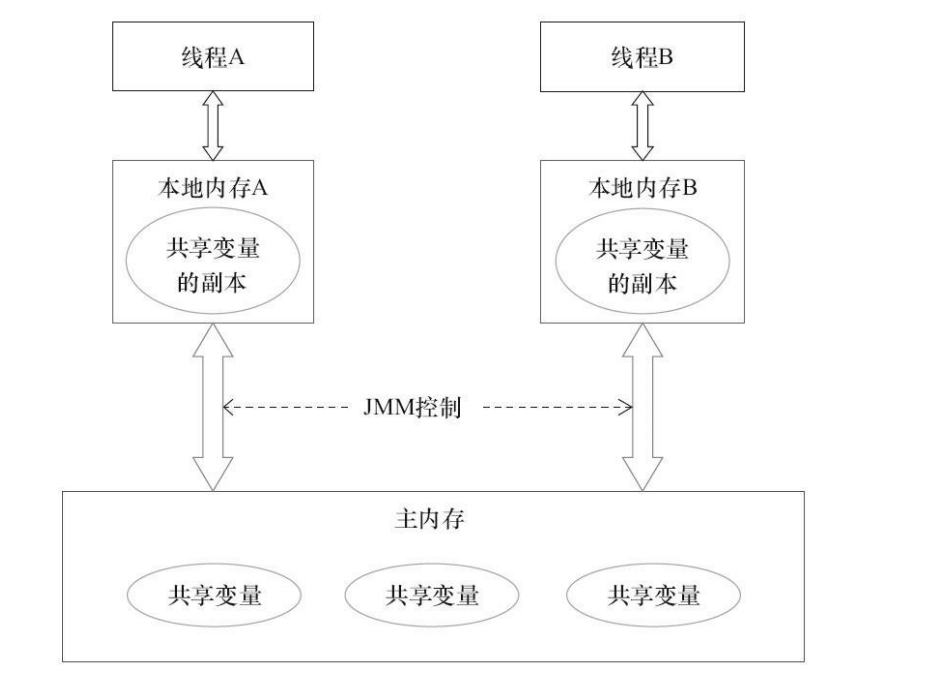
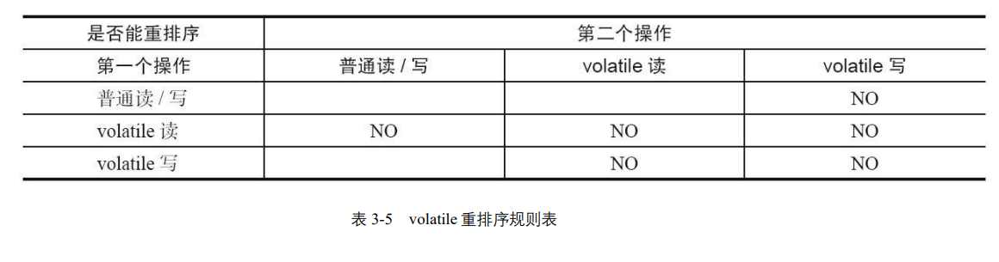
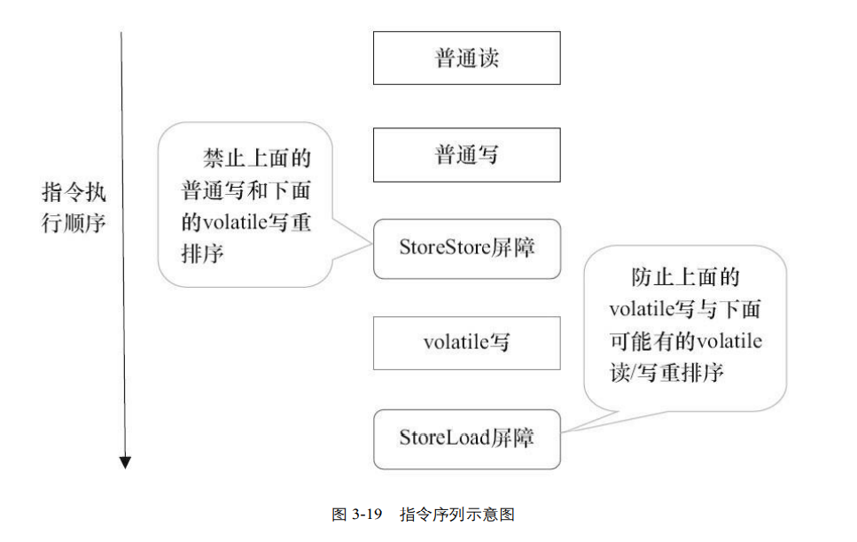
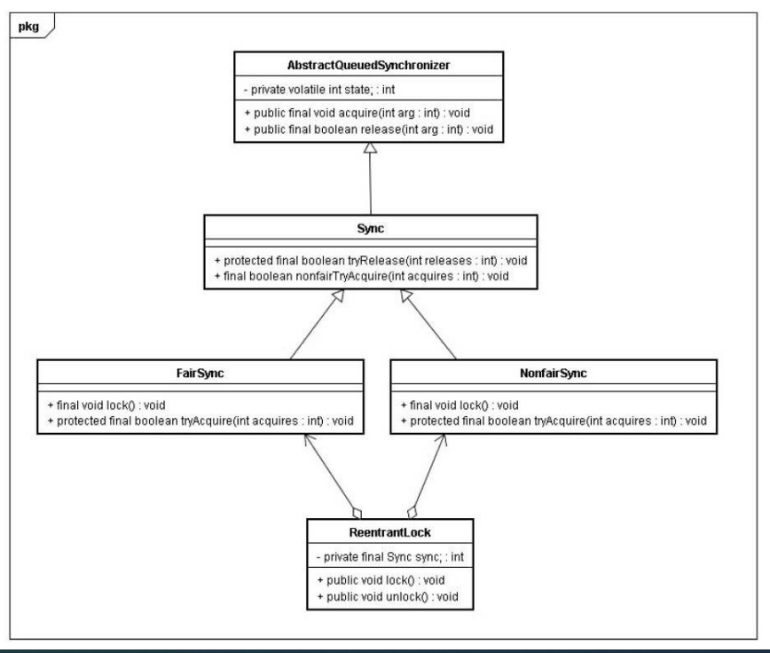
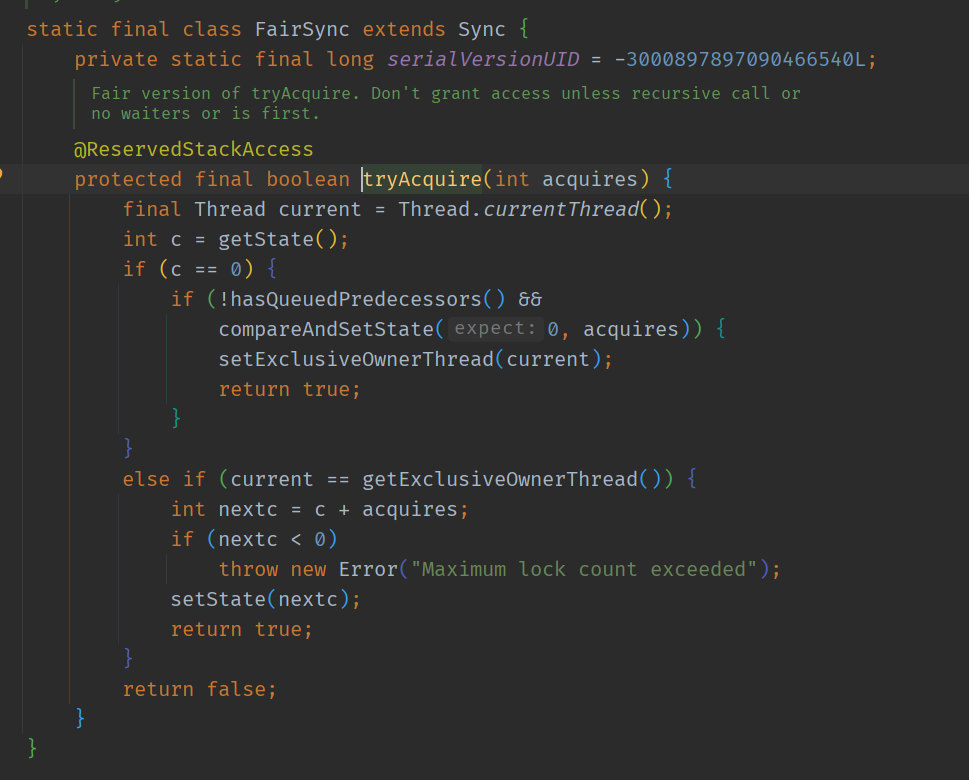
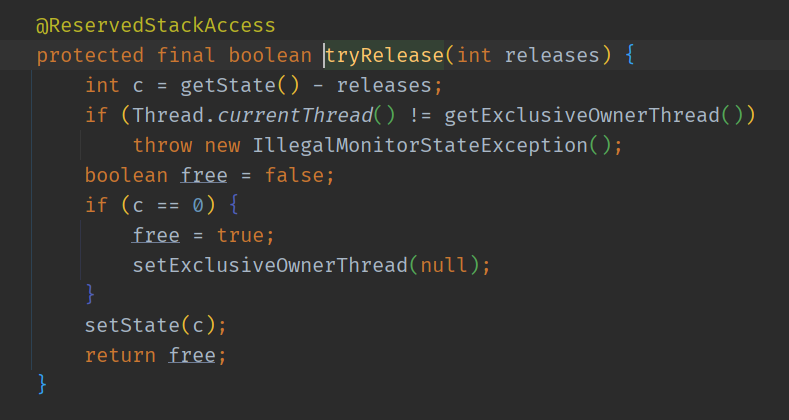
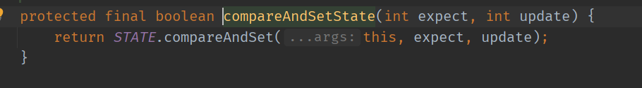
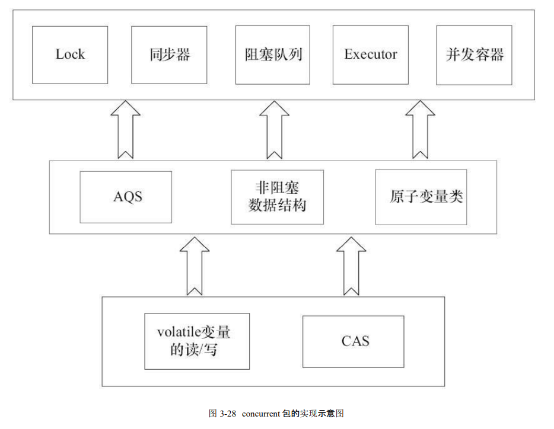
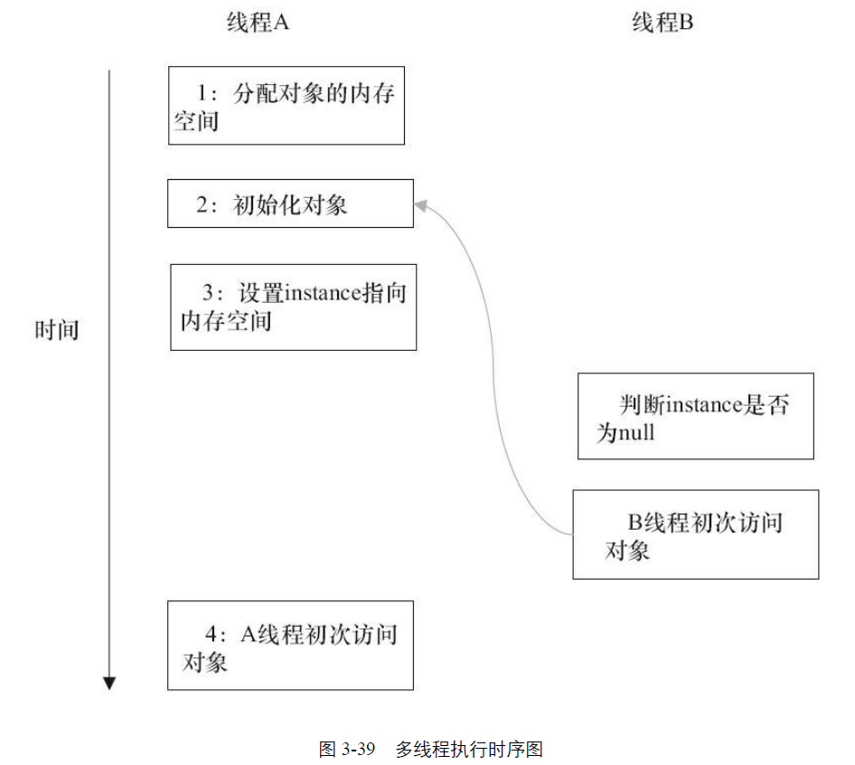
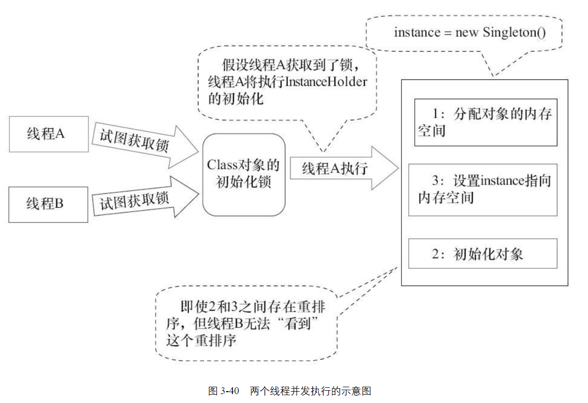

# Java 并发编程

## 1.1

<br>

### 1.1.1 Lock 与 Synchronized 的区别

<br>

Lock 会有放弃加锁的逻辑，Synchronized 没有

先来看下利用synchronized实现同步的基础：

Java 中的每一个对象都可以作为锁。具体表现为以下3种形式。

* 对于普通同步方法，锁是当前实例对象。
* 对于静态同步方法，锁是当前类的Class 对象
* 对于同步方法块，锁是Synchonized括号里配置的对象

<br>

### 1.1.2 Condition

<br>

Condition 可以有多个

<br>

### 1.1.3 可重入锁与不可重入锁

<br>

<strong>可重入</strong>：同一线程对某一锁多次加锁不会产生死锁

例如:

```java
lock.lock();
lock.lock();
System.out.println(Thread.currentThread().getName());
lock.unlock();
lock.unlock();
```

如果**不可重入**，这段代码就是自己和自己死锁了。

<br>

### 1.1.4 顺序一致性内存模型

<br>

当程序未正确同步时，就可能会存在数据竞争。Java 内存模型规范对数据竞争的定义如下。

⚫ 在一个线程中写一个变量，

⚫ 在另一个线程读同一个变量，

⚫ 而且写和读没有通过同步来排序。

<br>

**顺序一致性内存模型**有两大特性

<br>

⚫ 一个线程中的所有操作必须按照程序的顺序来执行。

⚫ （不管程序是否同步）所有线程都只能看到一个单一的操作执行顺序。在顺序一致性内存模型中，每个操作都必须原子执行且立刻对所有线程可见。

<br>

### 1.1.5 避免死锁的方法

<br>

* 避免一个线程同时获取多个锁
* 避免一个线程在锁内同时占用多个资源，尽量保证每个锁只占用一个资源。
* 尝试使用定时锁，使用lock.tryLock(timeout)来替代使用内部锁机制。
* 对于数据库锁，加锁和解锁必须在一个数据库连接李，否则会出现解锁失败的情况。

<br>

### 1.1.6 锁到底存在哪里呢？锁里面会存储什么信息呢？

<br>

从 JVM 规范中可以看到 Synchonized 在 JVM 里的实现原理，**JVM 基于进入和退出 Monitor 对象来实现方法同步和代码块同步**，但两者的实现细节不一样。**代码块同步是使用 monitorenter 和 monitorexit 指令实现的**，而方法同步是使用另外一种方式实现的，细 节在 JVM 规范里并没有详细说明。但是，**方法的同步同样可以使用这两个指令来实现**。

**monitorenter 指令是在编译后插入到同步代码块的开始位置**，而 **monitorexit 是插入到 方法结束处和异常处**，JVM 要保证每个 monitorenter 必须有对应的 monitorexit 与之配 对。任何对象都有一个 monitor 与之关联，**当且一个 monitor 被持有后，它将处于锁定状 态。线程执行到 monitorenter 指令时，将会尝试获取对象所对应的 monitor 的所有权，即 尝试获得对象的锁**。

<br>

### 1.1.7 锁的几种状态

<br>

在 Java SE 1.6 中，锁一共有 4 种状态，级别从低到高依次是：

* 无锁状态
* 偏向锁状态
* 轻量级锁状态
* 重量级锁状态

这几个状态会随着竞争情况逐渐升级。**锁可以升级但不能降级，意味着偏向锁升级成轻量级锁后不能降级成偏向锁**。

这种锁升级却不能降级的策略，目的是为了提高获得锁和释放锁的效率。

<br>

1. 偏向锁

<br>

当**一个线程访问同步块并获取锁**时，会在**对象头**和**栈帧**中的锁记录里存储锁偏向的线程 ID，**以后该线程在进入和退出同步块时不需要进行 CAS 操作来加锁和解锁**，只需简单地测试一下对象 头的 Mark Word 里是否存储着指向当前线程的偏向锁。如果测试成功，表示线程已经获 得了锁。如果测试失败，则需要再测试一下 Mark Word 中偏向锁的标识是否设置成 1 （表示当前是偏向锁）：如果没有设置，则使用 CAS 竞争锁；如果设置了，则尝试使用 CAS 将对象头的偏向锁指向当前线程。

<br>

偏向锁的撤销

<br>

**偏向锁使用了一种等到竞争出现才释放锁的机制**，所以当其他线程尝试竞争偏向锁时，持有偏向锁的线程才会释放锁。**偏向锁的撤销，需要等待全局安全点**（在这个时间 点上没有正在执行的字节码）

<br>

关闭偏向锁

<br>

**偏向锁在 Java 6 和 Java 7 里是默认启用的**，但是它在应用程序启动几秒钟之后才激活，
如有必要可以使用 JVM 参数来关闭延迟：`-XX:BiasedLockingStartupDelay=0`。
如果你确定应用程序里所有的锁通常情况下处于竞争状态，可以通过 JVM 参数关闭偏向锁： `-XX:- UseBiasedLocking=false`，那么程序默认会进入轻量级锁状态

2. 轻量级锁

<br>

加锁

线程在执行同步块之前，JVM 会先在当前线程的栈桢中创建用于存储锁记录的空 间，并将对象头中的 Mark Word 复制到锁记录中，官方称为 Displaced Mark Word。然后 线程尝试使用 CAS 将对象头中的 Mark Word 替换为指向锁记录的指针。如果成功，当前 线程获得锁，如果失败，表示其他线程竞争锁，当前线程便尝试使用自旋来获取锁。

<br>

解锁

轻量级解锁时，会使用原子的 CAS 操作将 Displaced Mark Word 替换回到对象头， 如果成功，则表示没有竞争发生。如果失败，表示当前锁存在竞争，锁就会膨胀成重量 级锁。

因为自旋会消耗 CPU，为了避免无用的自旋（比如获得锁的线程被阻塞住了），一 旦锁升级成重量级锁，就不会再恢复到轻量级锁状态。当锁处于这个状态下，其他线程 试图获取锁时，都会被阻塞住，当持有锁的线程释放锁之后会唤醒这些线程，被唤醒的线程就会进行新一轮的夺锁之争。

<br>

### 2.3.2 处理器如何实现原子操作

<br>

处理器提供**总线锁定**和**缓存锁定**两个机制来保证复杂内存操作的原子性

所谓总线锁就是使用处理器提供的一个 LOCK＃ 信号，当一个处理器在总线上输出此信号时，其他处理器的请求将被阻塞住，那么该处理器可以独占共享内存

在同一时刻，我们只需保证对某个内存地址的操作是原子性即可，但**总线锁定把 CPU 和内存之间的通信锁住**了，
这使得锁定期间，其他处理器不能操作其他内存地址的数据，所以**总线锁定的开销比较大**，目前**处理器在某些场合下使用缓存锁定代替总线锁定来进行优化**。

频繁使用的内存会缓存在处理器的 L1、L2 和 L3 高速缓存里，那么原子操作就可以 直接在处理器**内部缓存**中进行，并不需要声明**总线锁**，在 Pentium 6 和目前的处理器中可以使用“**缓存锁定**”的方式来实现复杂的原子性。

所谓“**缓存锁定**”是指内存区域如果被缓存在处理器的缓存行中，并且在 Lock 操作期间被锁定，那么**当它执行锁操作回写到内存** 时，处理器不在总线上声言 LOCK＃信号，而是修改内部的内存地址，并允许它的缓存 一致性机制来保证操作的原子性，因为**缓存一致性机制**会阻止同时修改由两个以上处理器缓存的内存区域数据，当其他处理器回写已被锁定的缓存行的数据时，会使缓存行无效

但是有两种情况下处理器不会使用**缓存锁定**。

**第一种情况**是：当操作的数据不能被缓存在处理器内部，或操作的数据跨多个缓存 行（cache line）时，则处理器会调用总线锁定。
**第二种情况**是：有些处理器不支持缓存锁定。对于 Intel 486 和 Pentium 处理器，就 算锁定的内存区域在处理器的缓存行中也会调用总线锁定。

<br>

### 2.3.3 Java 如何实现原子操作

<br>

在 Java 中可以通过**锁**和**循环 CAS**（compareAndSet）的方式来实现原子操作。

使用循环 CAS 实现原子操作：JVM 中的 CAS 操作正是利用了处理器提供的 CMPXCHG 指令实现的。自旋 CAS 实 现的基本思路就是循环进行 CAS 操作直到成功为止

<br>

**CAS 实现原子操作的三大问题**

<br>

ABA 问题，循环时间长开销大，以及只能保证一个共享变量的原子操 作。

**ABA 问题的解决思路就是使用版本号**。在变量前面追加上版本号，每次变量更新的时候把版本号加 1，那么 A→B→A 就会变成 1A→2B→3A。

compareAndSet 方法的作用是**首先检查当前引用是否等于预期引用，并且检查当前标志是否等于预期标志，如果全部相等，则以原子方式将该引用和该标志的值设置为给定的更新值**

<br>

**使用锁机制实现原子操作**

<br>

**锁机制保证了只有获得锁的线程才能够操作锁定的内存区域**。JVM 内部实现了很多 种锁机制，有偏向锁、轻量级锁和互斥锁。有意思的是除了偏向锁，JVM 实现锁的方式 都用了循环 CAS，即当一个线程想进入同步块的时候使用循环 CAS 的方式来获取锁， 当它退出同步块的时候使用循环 CAS 释放锁。

<br>

### 3.1.1 并发编程模型的两个关键问题

<br>

在并发编程中，需要处理两个关键问题：**线程之间如何通信**及**线程之间如何同步** （这里的线程是指并发执行的活动实体）。**通信是指线程之间以何种机制来交换信息**。在 命令式编程中，线程之间的通信机制有两种：**共享内存**和**消息传递**。

在**共享内存**的并发模型里，线程之间共享程序的公共状态，**通过写-读内存中的公共状态进行隐式通信**。

在**消息传递**的并发模型里，线程之间没有公共状态，线程之间必须**通过发送消息来显式进行通信**。

**同步是指程序中用于控制不同线程间操作发生相对顺序的机制**。

**在共享内存并发模型里，同步是显式进行的**。程序员必须显式指定某个方法或某段代码需要在线程之间互斥执行。

在**消息传递**的并发模型里，由于消息的发送必须在消息的接收之前，因此**同步是隐式进行的**。

<mark style="background-color: #FFFF00">Java 的并发采用的是**共享内存模型**，Java 线程之间的通信总是隐式进行，**整个通信过程对程序员完全透明**。</mark>  

<br>

### 3.1.2 Java 内存模型的抽象结构

<br>

在 Java 中，**所有实例域、静态域和数组元素**都存储在**堆内存**中，**堆内存在线程之间共享**（本章用“共享变量”这个术语代指实例域，静态域和数组元素）。

**局部变量**（Local Variables），**方法定义参数**（Java 语言规范称之为 Formal Method Parameters）和**异常处理器参数**（ExceptionHandler Parameters）**不会在线程之间共享，它们不会有内存可见性问题，也不受内存模型的影响**。

Java 线程之间的通信由 Java 内存模型（本文简称为 JMM）控制。

JMM 决定一个线程对共享变量的写入何时对另一个线程可见。

从抽象的角度来看，JMM 定义了线程和主内存之间的抽象关系：

线程之间的共享变量存储在主内存（Main Memory）中，每个线程都有一个私有的本地内存（Local Memory），**本地内存中存储了该线程以读/写共享变量的副本**。本地内存是 JMM 的一个抽象概念，并不真实存在。它涵盖了缓存、写缓冲 区、寄存器以及其他的硬件和编译器优化。



从图 3-1 来看，如果线程 A 与线程 B 之间要通信的话，必须要经历下面 2 个步骤。

<br>

1. 线程 A 把本地内存 A 中更新过的共享变量刷新到主内存中去。

2. 线程 B 到主内存中去读取线程 A 之前已更新过的共享变量

<br>

从整体来看，**这两个步骤实质上是线程 A 在向线程 B 发送消息**，而且这个通信过程必须要经过主内存。**JMM 通过控制主内存与每个线程的本地内存之间的交互，来为 Java 程序员提供内存可见性保证**。

<br>

### 3.1.5 happens-before 简介

<br>

从 JDK 5 开始，Java 使用新的 JSR-133 内存模型（除非特别说明，本文针对的都是 JSR-133 内存模型）。

<mark>JSR-133 使用 happens-before 的概念来阐述操作之间的内存可见性。 在JMM中，如果一个操作执行的结果需要对另一个操作可见，那么这两个操作之间必须要存在 happens-before 关系。</mark>

与程序员密切相关的 happens-before 规则如下。

⚫ 程序顺序规则：一个线程中的每个操作，happens-before 于该线程中的任意后续 操作。

⚫ 监视器锁规则：对一个锁的解锁，happens-before 于随后对这个锁的加锁。

⚫ volatile 变量规则：对一个 volatile 域的写，happens-before 于任意后续对这个 volatile 域的读。

⚫ 传递性：如果 A happens-before B，且 B happens-before C，那么 A happens-before C。

<br>

## 3.2 重排序

<br>

**重排序是指编译器和处理器为了优化程序性能而对指令序列进行重新排序的一种手段**。

<br>

### 3.2.2 as-if-serial 语义

<br>

**as-if-serial** 语义的意思是：不管怎么重排序（编译器和处理器为了提高并行度），（单 线程）程序的执行结果不能被改变。编译器、runtime 和处理器都必须遵守 as-if-serial 语义。

<br>

## 3.3 顺序一致性

顺序一致性内存模型是一个理论参考模型，在设计的时候，处理器的内存模型和编 程语言的内存模型都会以顺序一致性内存模型作为参照。

<br>

### 3.3.1 数据竞争与顺序一致性

<br>

当程序未正确同步时，就可能会存在数据竞争。Java 内存模型规范对数据竞争的定 义如下。

⚫ 在一个线程中写一个变量，

⚫ 在另一个线程读同一个变量，

⚫ 而且写和读没有通过同步来排序。

当代码中包含数据竞争时，程序的执行往往产生违反直觉的结果（前一章的示例正 是如此）。

如果一个多线程程序能正确同步，这个程序将是一个没有数据竞争的程序。

这里的同步是指广义上的同步，包括对常用同步原语（**synchronized、volatile 和 final）**的正确使用。

顺序一致性内存模型有两大特性。

⚫ 一个线程中的所有操作必须按照程序的顺序来执行。

⚫ （不管程序是否同步）所有线程都只能看到一个单一的操作执行顺序。

在顺序一致性内存模型中，每个操作都必须原子执行且立刻对所有线程可见。

<br>

### 3.3.3 同步程序的顺序一致性效果

<br>

## 3.4 volatile 的内存语义

<br>

### 3.4.1 volatile 的特性

<br>

理解 volatile 特性的一个好方法是把**对 volatile 变量的单个读/写，看成是使用同一个锁对这些单个读/写操作做了同步**。

简而言之，volatile 变量自身具有下列特性。

⚫ 可见性。对一个 volatile 变量的读，总是能看到（任意线程）对这个 volatile 变量 最后的写入。

⚫ 原子性：对任意单个 volatile 变量的读/写具有原子性，但类似于 volatile++这种 复合操作不具有原子性。

<br>

### 3.4.2 volatile 写-读建立的 happens-before 关系

<br>

从 JSR-133 开始（即从 JDK5 开始），volatile 变量的写-读可以实现线程之间的通信。

从内存语义的角度来说，

⚫ volatile 的写-读与锁的释放-获取有相同的内存效果：

⚫ volatile 写和锁的释放有相同的内存语义；

⚫ volatile 读与锁的获取有相同的内存语义。

<br>

### 3.4.4 volatile 内存语义的实现

<br>



从表3-5我们可以看出 。

当**第二个操作是volatile写**时，不管第一个操作是什么，都不能重排序。
这个规则确保volatile写之前的操作不会被编译器重排序到volatile写之后。

当第一个操作是volatile读时，不管第二个操作是什么，都不能重排序。这个规则确保volatile读之后的操作不会被编译器重排序到volatile读之前。

当第一个操作是volatile写，第二个操作是volatile读时，不能重排序。


为了实现 volatile 的内存语义，编译器在生成字节码时，会在指令序列中插入**内存屏障**来禁止特定类型的处理器重排序。
对于编译器来说，发现一个最优布置来最小化插入屏障的总数几乎不可能。
为此，JMM 采取保守策略。


下面是基于保守策略的 JMM 内存 屏障插入策略。 

⚫ 在每个 volatile 写操作的前面插入一个 StoreStore 屏障。

⚫ 在每个 volatile 写操作的后面插入一个 StoreLoad 屏障。

⚫ 在每个 volatile 读操作的后面插入一个 LoadLoad 屏障。 

⚫ 在每个 volatile 读操作的后面插入一个 LoadStore 屏障。 

上述内存屏障插入策略非常保守，但它可以保证在任意处理器平台，任意的程序中 都能得到正确的 volatile 内存语义。




图 3-19 中的 StoreStore 屏障可以保证在 volatile 写之前，其前面的所有普通写操作已 经对任意处理器可见了。这是因为 StoreStore 屏障将保障上面所有的普通写在 volatile 写之前刷新到主内存。

这里比较有意思的是，**volatile 写后面的 StoreLoad 屏障。此屏障的作用是避免volatile写与后面可能有的 volatile 读/写操作重排序**.

由于 <mark>volatile 仅仅保证对单个 volatile 变量的读/写具有原子性</mark>，而锁的互斥执行的特性可以确保对整个临界区代码的执行具有原子性。<mark>在功能上，锁比 volatile 更强大；在可伸缩性和执行性能上，volatile 更有优势。</mark>

<br>

## 3.5 锁的内存语义

<br>

众所周知，锁可以让临界区互斥执行。这里将介绍锁的另一个同样重要，但常常被忽视的功能：锁的内存语义。 

<br>

### 3.5.1 锁的释放-获取建立的 happens-before 关系 

<br>

<mark>锁是 Java 并发编程中最重要的同步机制。锁除了让临界区互斥执行外，还可以让释放锁的线程向获取同一个锁的线程发送消息。</mark>

<br>

### 3.5.2 锁的释放和获取的内存语义

<br>

**当线程释放锁时，JMM 会把该线程对应的本地内存中的共享变量刷新到主内存中**。

**当线程获取锁时，JMM 会把该线程对应的本地内存置为无效。从而使得被监视器保护的临界区代码必须从主内存中读取共享变量**。

下面对锁释放和锁获取的内存语义做个总结。

⚫ 线程 A 释放一个锁，实质上是线程 A 向接下来**将要获取这个锁的某个线程发出了（线程 A 对共享变量所做修改的）消息**。 

⚫ 线程 B 获取一个锁，实质上是**线程B接收了之前某个线程发出的（在释放这个 锁之前对共享变量所做修改的）消息**。 

⚫ 线程 A 释放锁，随后线程 B 获取这个锁，这个过程实质上是**线程 A 通过主内存向线程B发送消息**。

<br>

### 3.5.3 锁内存语义的实现

<br>

本文将借助 ReentrantLock 的源代码，来分析锁内存语义的具体实现机制。请看下面 的示例代码。

在 ReentrantLock 中，调用 lock()方法获取锁；调用 unlock()方法释放锁。


ReentrantLock 的实现依赖于 Java 同步器框架 **AbstractQueuedSynchronizer（本文简称 之为 AQS）**。
AQS 使用一个整型的 volatile 变量（命名为 state）来维护同步状态，马上我们会看到，**这个 volatile 变量是 ReentrantLock 内存语义实现的关键**。



<br>

ReentrantLock 分为**公平锁**和**非公平锁**，我们首先分析公平锁。使用公平锁时，加锁方法 lock()调用轨迹如下。

1. `ReentrantLock:lock()`
2. `FairSync:lock()`
3. `AbstractQueuedSynchronizer:acquire(int arg)`
4. `ReentrantLock:tryAcquire(int acquires)`


在**第 4 步真正开始加锁**，下面是该方法的源代码。 




上面源代码中我们可以看出，加锁方法首先读volatile变量state。

在使用公平锁时，解锁方法 unlock()调用轨迹如下

1. `ReentrantLock:unlock()`
2. `AbstractQueuedSynchronizer:release(int arg)`
3. `Sync:tryRelease(int releases)`

在第 3 步真正开始释放锁，下面是该方法的源代码。 



从上面的源代码可以看出，**在释放锁的最后写 volatile 变量 state**。

<br>


公平锁在释放锁的最后写volatile变量state，在获取锁时首先读这个volatile变量。

根据volatile的happens-before 规则，释放锁的线程在写volatile变量之前可见的共享变量，
在获取锁的线程读取同一个 volatile 变量后将立即变得对获取锁的线程可见。


我们来分析非公平锁的内存语义的实现。**非公平锁的释放和公平锁完全一样**， 所以这里仅仅分析**非公平锁的获取**。使用非公平锁时，加锁方法lock()调用轨迹如下。 


1. `ReentrantLock:lock()`
2. `NonfairSync:lock()` 
3. `AbstractQueuedSynchronizer:compareAndSetState(int expect,int update)`

在第 3 步真正开始加锁，下面是该方法的源代码。 

<br>



<br>

该方法以原子操作的方式更新 state 变量，本文把 Java 的 compareAndSet()方法调用 简称为 CAS。

<br>

JDK 文档对该方法的说明如下：**如果当前状态值等于预期值，则以原子方式将同步状态设置为给定的更新值。此操作具有 volatile 读和写的内存语义**。

编译器不会对 volatile 读与 volatile 读后面的任意内存操作重排序；

编译器不会对 volatile 写与 volatile 写前面的任意内存操作重排序。

组合这两个条件，意味着为了同时实现 volatile 读和 volatile 写的内存语义，

编译器不能对 CAS 与 CAS 前面和后面的任意内存操作重排序。

现在对**公平锁和非公平锁的内存语义**做个总结。 

公平锁和非公平锁释放时，最后都要**写一个volatile变量state**。 

公平锁获取时，首先会去**读 volatile 变量**。

非公平锁获取时，首先会**用CAS更新 volatile 变量，这个操作同时具有 volatile读和volatile写的内存语义**。

从本文对 ReentrantLock 的分析可以看出，

> ℹ️ 锁释放-获取的内存语义的实现至少有下面两种方式
> 1. **利用 volatile 变量的写-读所具有的内存语义**。 
> 2. **利用 CAS 所附带的 volatile 读和 volatile 写的内存语义**。

<br>

### 3.5.4 concurrent 包的实现 

<br>

由于Java的CAS同时具有 volatile 读和 volatile 写的内存语义，因此 Java 线程之间 的通信现在有了下面 4 种方式。 

1. A 线程写 volatile 变量，随后 B 线程读这个 volatile 变量。 

2. A 线程写 volatile 变量，随后 B 线程用 CAS 更新这个 volatile 变量。 

3. A 线程用 CAS 更新一个 volatile 变量，随后 B 线程用 CAS 更新这个 volatile 变量。 

4. A 线程用 CAS 更新一个 volatile 变量，随后 B 线程读这个 volatile 变量。 

同 时，**volatile 变量的读/写和 CAS 可以实现线程之间的通信**。把这些特性整合在一起，**就形成了整个concurrent包得以实现的基石**。

如果我们仔细分析 concurrent 包的源代码实现，会发现一个通用化的实现模式。

<mark>首先，声明共享变量为 volatile。</mark>

<mark>然后，使用 CAS 的原子条件更新来实现线程之间的同步。 </mark>

<mark>同时，配合以 volatile 的读/写和 CAS 所具有的 volatile 读和写的内存语义来实现线 程之间的通信。  </mark>


**AQS，非阻塞数据结构和原子变量类（java.util.concurrent.atomic 包中的类），
这些concurrent包中的基础类都是使用这种模式来实现的，
而concurrent包中的高层类又是依赖于这些基础类来实现的。**

从整体来看，concurrent 包的实现示意图如 3-28 所示。 



<br>

## 3.6 final 域的内存语义 

<br>

与前面介绍的锁和 volatile 相比，**对 final 域的读和写更像是普通的变量访问**。 
下面 将介绍 final 域的内存语义。 

<br>

### 3.6.1 final 域的重排序规则 

<br>

对于 final 域，编译器和处理器要遵守两个重排序规则。 

在构造函数内对一个final域的写入，与随后把这个被构造对象的引用赋值给一个引用变量，这两个操作之间不能重排序。 

<br>

### 3.6.2 写 final 域的重排序规则 

<br>

写 final 域的重排序规则禁止把 final 域的写重排序到构造函数之外。这个规则的实现 包含下面 2 个方面。 

⚫ JMM 禁止编译器把 final 域的写重排序到构造函数之外。 

⚫ 编译器会在 final 域的写之后，构造函数 return 之前，插入一个 StoreStore 屏障。 这个屏障禁止处理器把 final 域的写重排序到构造函数之外。 

<br>

### 3.7.3 happens-before 规则 

<br>

《JSR-133:Java Memory Model and Thread Specification》定义了如下 happens-before 规则。 

<br>

1. 程序顺序规则：一个线程中的每个操作，happens-before 于该线程中的任意后续操作。 

2. 监视器锁规则：对一个锁的解锁，happens-before 于随后对这个锁的加锁。 

3. volatile 变量规则：对一个 volatile 域的写，happens-before 于任意后续对这个 volatile 域的读。 

4. 传递性：如果 A happens-before B，且 B happens-before C，那么 A happens-before C。 

5. start()规则：如果线程 A 执行操作 ThreadB.start()（启动线程 B），那么 A 线程的 ThreadB.start()操作 happens-before 于线程 B 中的任意操作。 

6. join()规则：如果线程 A 执行操作 ThreadB.join()并成功返回，那么线程 B 中的任 意操作 happens-before 于线程 A 从 ThreadB.join()操作成功返回。 

<br>

### 3.8 双重检查锁定与延迟初始化 

<br>

在 Java 多线程程序中，有时候需要采用延迟初始化来降低初始化类和创建对象的开销。 

**双重检查锁定是常见的延迟初始化技术，但它是一个错误的用法**。 

本文将分析双重检查锁定的错误根源，以及两种线程安全的延迟初始化方案。 

在 Java 程序中，有时候可能需要推迟一些高开销的对象初始化操作，并且只有在使用这些对象时才进行初始化。此时，程序员可能会采用延迟初始化。 


```java
public class SafeLazyInitialization{
    private static Instance instance;

    public synchronized static Instance getInstance(){
        if(instance == null){
            instance = new Instance();
        }
        return instance;
    }
}
```

> ⚠️ 
> 
> 由于对 getInstance()方法做了同步处理，synchronized 将导致性能开销。
> 
> 如果 getInstance()方法被多个线程频繁的调用，将会导致程序执行性能的下降。
> 
> 反之，如果 getInstance()方法不会被多个线程频繁的调用，那么这个延迟初始化方案将能提供令人满意的性能。

因此，人们想出了一个“聪明”的技巧：双重检查锁定（Double-Checked Locking）。人们想通过双重检查锁定来降低同步的开销。


```java
public class DoubleCheckedLocking{//1
    private static Instance instance;//2

    public static Instance getInstance(){//3
        if(instance == null){//4. 第一次检查
            synchronized (DoubleCheckedLocking.class){//5. 加锁
                if(instance == null){//6. 第二次检查
                    instance = new Instance();//7. 问题的根源出现在这里
                }
            }
        }
        return instance;
    }
}
```

如上面代码所示，如果第一次检查 instance 不为 null，那么就不需要执行下面的加锁和初始化操作。
因此，可以大幅降低 synchronized 带来的性能开销。

上面代码表面上看起来，似乎两全其美。 

1. 多个线程试图在同一时间创建对象时，会通过加锁来保证只有一个线程能创建对象。
2. 在对象创建好之后，执行 getInstance()方法将不需要获取锁，直接返回已创建好的对象。

> ⚠️ 
> 
> **<mark>双重检查锁定看起来似乎很完美，但这是一个错误的优化！在线程执行到第 4 行， 代码读取到 instance 不为 null 时，instance 引用的对象有可能还没有完成初始化。 </mark>**

前面的双重检查锁定示例代码的第 7 行（instance=new Singleton();）创建了一个对 象。这一行代码可以分解为如下的 3 行伪代码 

```java
memory = allocate();// 1: 分配对象的内存空间
ctorInstance(memory); // 2: 初始化对象
instance = memory; // 3: 设置instance指向刚分配的内存地址
```

上面 3 行伪代码中的 2 和 3 之间，可能会被重排序（在一些 JIT 编译器上，这种重 排序是真实发生的，详情见参考文献 1 的“Out-of-order writes”部分）。2 和 3 之间重排序 之后的执行时序如下。 

<mark >3-27</mark>
<mark >3-28</mark>


由于单线程内要遵守 intra-thread semantics，从而能保证 A 线程的执行结果不会被改变。但是，当线程 A 和 B 按图 3-38 的时序执行时，B 线程将看到一个还没有被初始化的对象。 


在知晓了问题发生的根源之后，我们可以想出两个办法来实现线程安全的延迟初始 化。 

**1) 不允许 2 和 3 重排序。**

**2) 允许 2 和 3 重排序，但不允许其他线程“看到”这个重排序。** 

### 3.8.3 基于 volatile的解决方案

> ✅ 
> 
> 对于前面的基于双重检查锁定来实现延迟初始化的方案（指 DoubleCheckedLocking 示例代码），
> 只需要做一点小的修改（把 instance 声明为 volatile 型），就可以实现线程安全的延迟初始化。 


```java
public class SafeDoubleCheckedLocking{
    private volatile static Instance instance;
    public static Instance getInstance (){
        if(instance == null){
            synchronized (SafeDoubleCheckedLocking.class){
                if (instance == null){
                    instance = new Instance(); // instance 为 volatile ，现在没问题了
                }
            }
        }
        return instance;
    }
}
```



<br>

这个方案本质上是通过禁止图3-39中的2和3之间的重排序，来保证线程安全的延迟初始化。


### 3.8.4 基于 类 初始化的解决方案

**JVM在类的初始化阶段（即在 Class被加载后，且被线程使用之前），会执行类的初
始化。在执行类的初始化期间， JVM会去获取一个锁。这个锁可以同步多个线程对同一
个类的初始化。**

基于这个特性，可以实现另一种线程安全的延迟初始化方案（这个方案被称之为
Initialization On Demand Holder idiom）。

```java
public class InstanceFactory{
    private static class InstanceHolder{
        public static Instance instance = new Instance();
    }
    public static Instance getInstance(){
        return InstanceHolder.instance ; // 这里将导致 InstanceHolder 类被初始化
    }
}
```



这个方案的实质是：**允许3.8.2节中的3行伪代码中的2和3重排序，但不允许非构造线程（这里指线程 B））“看到”这个重排序**。


> ✅ 对比基于 volatile 的双重检查锁定的方案和基于类初始化的方案
> 
> 我们会发现基 于类初始化的方案的实现代码更简洁。
> 
> 但基于 volatile 的双重检查锁定的方案有一个额外 的优势：**除了可以对静态字段实现延迟初始化外，还可以对实例字段实现延迟初始化。** 字段延迟初始化降低了初始化类或创建实例的开销，但增加了访问被延迟初始化的字段的开销。


**在大多数时候，正常的初始化要优于延迟初始化。**

**如果确实需要对实例字段使用线程安全的延迟初始化，请使用上面介绍的基于volatile的延迟初始化的方案；**

**如果确实需要对静态字段使用线程安全的延迟初始化，请使用上面介绍的基于类初始化的
方案**。

<br>

### 4.1.5 Daemon 线程 

<br>

Daemon 线程是一种支持型线程(常被叫做守护线程)，**因为它主要被用作程序中后台 调度以及支持性工作**。这意味着，当一个 Java 虚拟机中不存在非 Daemon 线程的时候， Java 虚拟机将会退出。

运行 Daemon 程序，可以看到在终端或者命令提示符上没有任何输出。
main 线程 （非 Daemon 线程）在启动了线程 DaemonRunner 之后随着 main 方法执行完毕而终止， 而此时 Java 虚拟机中已经没有非 Daemon 线程，虚拟机需要退出。Java 虚拟机中的所有 Daemon 线程都需要立即终止，因此 DaemonRunner 立即终止，但是 DaemonRunner 中的 finally 块并没有执行。 

<br>

### 4.2.1 构造线程 

<br>

在运行线程之前首先要构造一个线程对象，线程对象在构造的时候需要提供线程所需要的属性，如线程所属的线程组、线程优先级、是否是 Daemon 线程等信息。

<br>

### 4.2.2 启动线程 

<br>

线程对象在初始化完成之后，调用 start()方法就可以启动这个线程。线程 start()方法 的含义是：**当前线程（即 parent 线程）同步告知 Java 虚拟机，只要线程规划器空闲，应 立即启动调用 start()方法的线程**。 


> ⚠️ 注意
> 
> 启动一个线程前，最好为这个线程设置线程名称，因为这样在使用 jstack 分析程序或者进行问题排查时，就会给开发人员提供一些提示，自定义的线程最好能够 起个名字。


### 4.2.4 过期的 suspend()、resume()和 stop()


> 🚫 不建议使用的原因主要有
> 
> 以 suspend()方法为例，在调用后，线程不会释放已经占 有的资源（比如锁），而是占有着资源进入睡眠状态，这样容易引发死锁问题。
> 
>同样， stop()方法在终结一个线程时不会保证线程的资源正常释放，通常是没有给予线程完成资 源释放工作的机会，因此会导致程序可能工作在不确定状态下。 


