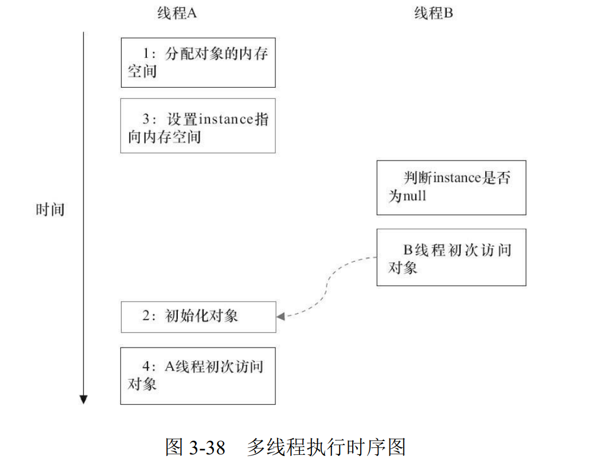
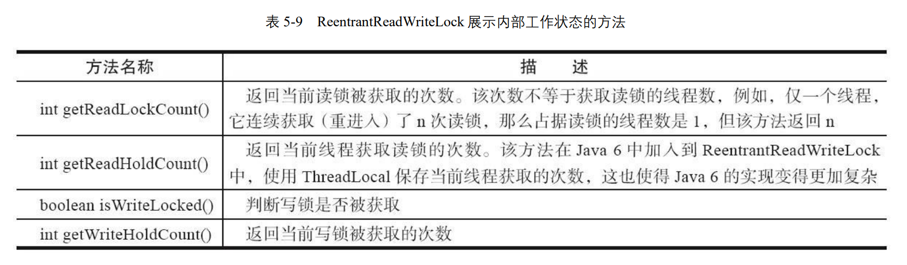

# Java 并发编程

## 1.1

<br>

### 1.1.1 Lock 与 Synchronized 的区别

<br>

Lock 会有放弃加锁的逻辑，Synchronized 没有

先来看下利用 synchronized 实现同步的基础：

Java 中的每一个对象都可以作为锁。具体表现为以下 3 种形式。

- 对于普通同步方法，锁是当前实例对象。
- 对于静态同步方法，锁是当前类的 Class 对象
- 对于同步方法块，锁是 Synchonized 括号里配置的对象

<br>

### 1.1.2 Condition

<br>

Condition 可以有多个

<br>

### 1.1.3 可重入锁与不可重入锁

<br>

<strong>可重入</strong>：同一线程对某一锁多次加锁不会产生死锁

例如:

```java
lock.lock();
lock.lock();
System.out.println(Thread.currentThread().getName());
lock.unlock();
lock.unlock();
```

如果**不可重入**，这段代码就是自己和自己死锁了。

<br>

### 1.1.4 顺序一致性内存模型

<br>

当程序未正确同步时，就可能会存在数据竞争。Java 内存模型规范对数据竞争的定义如下。

:black_circle: 在一个线程中写一个变量，

:black_circle: 在另一个线程读同一个变量，

:black_circle: 而且写和读没有通过同步来排序。

<br>

**顺序一致性内存模型**有两大特性

<br>

:black_circle: 一个线程中的所有操作必须按照程序的顺序来执行。

:black_circle: （不管程序是否同步）所有线程都只能看到一个单一的操作执行顺序。在顺序一致性内存模型中，每个操作都必须原子执行且立刻对所有线程可见。

<br>

### 1.1.5 避免死锁的方法

<br>

- 避免一个线程同时获取多个锁
- 避免一个线程在锁内同时占用多个资源，尽量保证每个锁只占用一个资源。
- 尝试使用定时锁，使用 lock.tryLock(timeout)来替代使用内部锁机制。
- 对于数据库锁，加锁和解锁必须在一个数据库连接李，否则会出现解锁失败的情况。

<br>

### 1.1.6 锁到底存在哪里呢？锁里面会存储什么信息呢？

<br>

从 JVM 规范中可以看到 Synchonized 在 JVM 里的实现原理，**JVM 基于进入和退出 Monitor 对象来实现方法同步和代码块同步**，但两者的实现细节不一样。**代码块同步是使用 monitorenter 和 monitorexit 指令实现的**，而方法同步是使用另外一种方式实现的，细 节在 JVM 规范里并没有详细说明。但是，**方法的同步同样可以使用这两个指令来实现**。

**monitorenter 指令是在编译后插入到同步代码块的开始位置**，而 **monitorexit 是插入到 方法结束处和异常处**，JVM 要保证每个 monitorenter 必须有对应的 monitorexit 与之配 对。任何对象都有一个 monitor 与之关联，**当且一个 monitor 被持有后，它将处于锁定状 态。线程执行到 monitorenter 指令时，将会尝试获取对象所对应的 monitor 的所有权，即 尝试获得对象的锁**。

<br>

### 1.1.7 锁的几种状态

<br>

在 Java SE 1.6 中，锁一共有 4 种状态，级别从低到高依次是：

- 无锁状态
- 偏向锁状态
- 轻量级锁状态
- 重量级锁状态

这几个状态会随着竞争情况逐渐升级。**锁可以升级但不能降级，意味着偏向锁升级成轻量级锁后不能降级成偏向锁**。

这种锁升级却不能降级的策略，目的是为了提高获得锁和释放锁的效率。

<br>

1. 偏向锁

<br>

当**一个线程访问同步块并获取锁**时，会在**对象头**和**栈帧**中的锁记录里存储锁偏向的线程 ID，**以后该线程在进入和退出同步块时不需要进行 CAS 操作来加锁和解锁**，只需简单地测试一下对象 头的 Mark Word 里是否存储着指向当前线程的偏向锁。如果测试成功，表示线程已经获 得了锁。如果测试失败，则需要再测试一下 Mark Word 中偏向锁的标识是否设置成 1 （表示当前是偏向锁）：如果没有设置，则使用 CAS 竞争锁；如果设置了，则尝试使用 CAS 将对象头的偏向锁指向当前线程。

<br>

偏向锁的撤销

<br>

**偏向锁使用了一种等到竞争出现才释放锁的机制**，所以当其他线程尝试竞争偏向锁时，持有偏向锁的线程才会释放锁。**偏向锁的撤销，需要等待全局安全点**（在这个时间 点上没有正在执行的字节码）

<br>

关闭偏向锁

<br>

**偏向锁在 Java 6 和 Java 7 里是默认启用的**，但是它在应用程序启动几秒钟之后才激活。

如有必要可以使用 JVM 参数来关闭延迟：`-XX:BiasedLockingStartupDelay=0`。

如果你确定应用程序里所有的锁通常情况下处于竞争状态，可以通过 JVM 参数关闭偏向锁：`-XX:- UseBiasedLocking=false`
，那么程序默认会进入轻量级锁状态

2. 轻量级锁

<br>

加锁

线程在执行同步块之前，JVM 会先在当前线程的栈桢中创建用于存储锁记录的空 间，并将对象头中的 Mark Word 复制到锁记录中，官方称为 Displaced Mark Word。然后 线程尝试使用 CAS 将对象头中的 Mark Word 替换为指向锁记录的指针。如果成功，当前 线程获得锁，如果失败，表示其他线程竞争锁，当前线程便尝试使用自旋来获取锁。

<br>

解锁

轻量级解锁时，会使用原子的 CAS 操作将 Displaced Mark Word 替换回到对象头， 如果成功，则表示没有竞争发生。如果失败，表示当前锁存在竞争，锁就会膨胀成重量 级锁。

因为自旋会消耗 CPU，为了避免无用的自旋（比如获得锁的线程被阻塞住了），一 旦锁升级成重量级锁，就不会再恢复到轻量级锁状态。当锁处于这个状态下，其他线程 试图获取锁时，都会被阻塞住，当持有锁的线程释放锁之后会唤醒这些线程，被唤醒的线程就会进行新一轮的夺锁之争。

<br>

### 2.3.2 处理器如何实现原子操作

<br>

处理器提供**总线锁定**和**缓存锁定**两个机制来保证复杂内存操作的原子性

所谓总线锁就是使用处理器提供的一个 LOCK＃ 信号，当一个处理器在总线上输出此信号时，其他处理器的请求将被阻塞住，那么该处理器可以独占共享内存

在同一时刻，我们只需保证对某个内存地址的操作是原子性即可，但**总线锁定把 CPU 和内存之间的通信锁住**了，
这使得锁定期间，其他处理器不能操作其他内存地址的数据，所以**总线锁定的开销比较大**，目前**处理器在某些场合下使用缓存锁定代替总线锁定来进行优化**。

频繁使用的内存会缓存在处理器的 L1、L2 和 L3 高速缓存里，那么原子操作就可以 直接在处理器**内部缓存**中进行，并不需要声明**总线锁**，在 Pentium 6 和目前的处理器中可以使用“**缓存锁定**”的方式来实现复杂的原子性。

所谓“**缓存锁定**”是指内存区域如果被缓存在处理器的缓存行中，并且在 Lock 操作期间被锁定，那么**当它执行锁操作回写到内存** 时，处理器不在总线上声言 LOCK＃信号，而是修改内部的内存地址，并允许它的缓存 一致性机制来保证操作的原子性，因为**缓存一致性机制**会阻止同时修改由两个以上处理器缓存的内存区域数据，当其他处理器回写已被锁定的缓存行的数据时，会使缓存行无效

但是有两种情况下处理器不会使用**缓存锁定**。

**第一种情况**是：当操作的数据不能被缓存在处理器内部，或操作的数据跨多个缓存 行（cache line）时，则处理器会调用总线锁定。
**第二种情况**是：有些处理器不支持缓存锁定。对于 Intel 486 和 Pentium 处理器，就 算锁定的内存区域在处理器的缓存行中也会调用总线锁定。

<br>

### 2.3.3 Java 如何实现原子操作

<br>

在 Java 中可以通过**锁**和**循环 CAS**（compareAndSet）的方式来实现原子操作。

使用循环 CAS 实现原子操作：JVM 中的 CAS 操作正是利用了处理器提供的 CMPXCHG 指令实现的。自旋 CAS 实 现的基本思路就是循环进行 CAS 操作直到成功为止

<br>

**CAS 实现原子操作的三大问题**

<br>

ABA 问题，循环时间长开销大，以及只能保证一个共享变量的原子操 作。

**ABA 问题的解决思路就是使用版本号**。在变量前面追加上版本号，每次变量更新的时候把版本号加 1，那么 A→B→A 就会变成 1A→2B→3A。

compareAndSet 方法的作用是**首先检查当前引用是否等于预期引用，并且检查当前标志是否等于预期标志，如果全部相等，则以原子方式将该引用和该标志的值设置为给定的更新值**

<br>

**使用锁机制实现原子操作**

<br>

**锁机制保证了只有获得锁的线程才能够操作锁定的内存区域**。JVM 内部实现了很多 种锁机制，有偏向锁、轻量级锁和互斥锁。有意思的是除了偏向锁，JVM 实现锁的方式 都用了循环 CAS，即当一个线程想进入同步块的时候使用循环 CAS 的方式来获取锁， 当它退出同步块的时候使用循环 CAS 释放锁。

<br>

### 3.1.1 并发编程模型的两个关键问题

<br>

在并发编程中，需要处理两个关键问题：**线程之间如何通信**及**线程之间如何同步** （这里的线程是指并发执行的活动实体）。**通信是指线程之间以何种机制来交换信息**。在 命令式编程中，线程之间的通信机制有两种：**共享内存**和**消息传递**。

在**共享内存**的并发模型里，线程之间共享程序的公共状态，**通过写-读内存中的公共状态进行隐式通信**。

在**消息传递**的并发模型里，线程之间没有公共状态，线程之间必须**通过发送消息来显式进行通信**。

**同步是指程序中用于控制不同线程间操作发生相对顺序的机制**。

**在共享内存并发模型里，同步是显式进行的**。程序员必须显式指定某个方法或某段代码需要在线程之间互斥执行。

在**消息传递**的并发模型里，由于消息的发送必须在消息的接收之前，因此**同步是隐式进行的**。

<mark style="background-color: #FFFF00">Java 的并发采用的是**共享内存模型**，Java 线程之间的通信总是隐式进行，**整个通信过程对程序员完全透明**。</mark>

<br>

### 3.1.2 Java 内存模型的抽象结构

<br>

在 Java 中，**所有实例域、静态域和数组元素**都存储在**堆内存**中，**堆内存在线程之间共享**（本章用“共享变量”这个术语代指实例域，静态域和数组元素）。

**局部变量**（Local Variables），**方法定义参数**（Java 语言规范称之为 Formal Method Parameters）和**异常处理器参数**（ExceptionHandler Parameters）**不会在线程之间共享，它们不会有内存可见性问题，也不受内存模型的影响**。

Java 线程之间的通信由 Java 内存模型（本文简称为 JMM）控制。

JMM 决定一个线程对共享变量的写入何时对另一个线程可见。

从抽象的角度来看，JMM 定义了线程和主内存之间的抽象关系：

线程之间的共享变量存储在主内存（Main Memory）中，每个线程都有一个私有的本地内存（Local Memory），**本地内存中存储了该线程以读/写共享变量的副本**。本地内存是 JMM 的一个抽象概念，并不真实存在。它涵盖了缓存、写缓冲 区、寄存器以及其他的硬件和编译器优化。


从图 3-1 来看，如果线程 A 与线程 B 之间要通信的话，必须要经历下面 2 个步骤。

<br>

1. 线程 A 把本地内存 A 中更新过的共享变量刷新到主内存中去。

2. 线程 B 到主内存中去读取线程 A 之前已更新过的共享变量

<br>

从整体来看，**这两个步骤实质上是线程 A 在向线程 B 发送消息**，而且这个通信过程必须要经过主内存。**JMM 通过控制主内存与每个线程的本地内存之间的交互，来为 Java 程序员提供内存可见性保证**。

<br>

### 3.1.5 happens-before 简介

<br>

从 JDK 5 开始，Java 使用新的 JSR-133 内存模型（除非特别说明，本文针对的都是 JSR-133 内存模型）。

<mark>JSR-133 使用 happens-before 的概念来阐述操作之间的内存可见性。 在 JMM 中，如果一个操作执行的结果需要对另一个操作可见，那么这两个操作之间必须要存在 happens-before 关系。</mark>

与程序员密切相关的 happens-before 规则如下。

:black_circle: 程序顺序规则：一个线程中的每个操作，happens-before 于该线程中的任意后续 操作。

:black_circle: 监视器锁规则：对一个锁的解锁，happens-before 于随后对这个锁的加锁。

:black_circle: volatile 变量规则：对一个 volatile 域的写，happens-before 于任意后续对这个 volatile 域的读。

:black_circle: 传递性：如果 A happens-before B，且 B happens-before C，那么 A happens-before C。

<br>

## 3.2 重排序

<br>

**重排序是指编译器和处理器为了优化程序性能而对指令序列进行重新排序的一种手段**。

<br>

### 3.2.2 as-if-serial 语义

<br>

**as-if-serial** 语义的意思是：不管怎么重排序（编译器和处理器为了提高并行度），（单 线程）程序的执行结果不能被改变。编译器、runtime 和处理器都必须遵守 as-if-serial 语义。

<br>

## 3.3 顺序一致性

顺序一致性内存模型是一个理论参考模型，在设计的时候，处理器的内存模型和编 程语言的内存模型都会以顺序一致性内存模型作为参照。

<br>

### 3.3.1 数据竞争与顺序一致性

<br>

当程序未正确同步时，就可能会存在数据竞争。Java 内存模型规范对数据竞争的定 义如下。

:black_circle: 在一个线程中写一个变量，

:black_circle: 在另一个线程读同一个变量，

:black_circle: 而且写和读没有通过同步来排序。

当代码中包含数据竞争时，程序的执行往往产生违反直觉的结果（前一章的示例正 是如此）。

如果一个多线程程序能正确同步，这个程序将是一个没有数据竞争的程序。

这里的同步是指广义上的同步，包括对常用同步原语（**synchronized、volatile 和 final）**的正确使用。

顺序一致性内存模型有两大特性。

:black_circle: 一个线程中的所有操作必须按照程序的顺序来执行。

:black_circle: （不管程序是否同步）所有线程都只能看到一个单一的操作执行顺序。

在顺序一致性内存模型中，每个操作都必须原子执行且立刻对所有线程可见。

<br>

### 3.3.3 同步程序的顺序一致性效果

<br>

## 3.4 volatile 的内存语义

<br>

### 3.4.1 volatile 的特性

<br>

理解 volatile 特性的一个好方法是把**对 volatile 变量的单个读/写，看成是使用同一个锁对这些单个读/写操作做了同步**。

简而言之，volatile 变量自身具有下列特性。

:black_circle: 可见性。对一个 volatile 变量的读，总是能看到（任意线程）对这个 volatile 变量 最后的写入。

:black_circle: 原子性：对任意单个 volatile 变量的读/写具有原子性，但类似于 volatile++这种 复合操作不具有原子性。

<br>

### 3.4.2 volatile 写-读建立的 happens-before 关系

<br>

从 JSR-133 开始（即从 JDK5 开始），volatile 变量的写-读可以实现线程之间的通信。

从内存语义的角度来说，

:black_circle: volatile 的写-读与锁的释放-获取有相同的内存效果：

:black_circle: volatile 写和锁的释放有相同的内存语义；

:black_circle: volatile 读与锁的获取有相同的内存语义。

<br>

### 3.4.4 volatile 内存语义的实现

<br>


从表 3-5 我们可以看出 。

当**第二个操作是 volatile 写**时，不管第一个操作是什么，都不能重排序。
这个规则确保 volatile 写之前的操作不会被编译器重排序到 volatile 写之后。

当第一个操作是 volatile 读时，不管第二个操作是什么，都不能重排序。这个规则确保 volatile 读之后的操作不会被编译器重排序到 volatile 读之前。

当第一个操作是 volatile 写，第二个操作是 volatile 读时，不能重排序。

为了实现 volatile 的内存语义，编译器在生成字节码时，会在指令序列中插入**内存屏障**来禁止特定类型的处理器重排序。
对于编译器来说，发现一个最优布置来最小化插入屏障的总数几乎不可能。
为此，JMM 采取保守策略。

下面是基于保守策略的 JMM 内存 屏障插入策略。

:black_circle: 在每个 volatile 写操作的前面插入一个 StoreStore 屏障。

:black_circle: 在每个 volatile 写操作的后面插入一个 StoreLoad 屏障。

:black_circle: 在每个 volatile 读操作的后面插入一个 LoadLoad 屏障。

:black_circle: 在每个 volatile 读操作的后面插入一个 LoadStore 屏障。

上述内存屏障插入策略非常保守，但它可以保证在任意处理器平台，任意的程序中 都能得到正确的 volatile 内存语义。


图 3-19 中的 StoreStore 屏障可以保证在 volatile 写之前，其前面的所有普通写操作已 经对任意处理器可见了。这是因为 StoreStore 屏障将保障上面所有的普通写在 volatile 写之前刷新到主内存。

这里比较有意思的是，**volatile 写后面的 StoreLoad 屏障。此屏障的作用是避免 volatile 写与后面可能有的 volatile 读/写操作重排序**.

由于 <mark>volatile 仅仅保证对单个 volatile 变量的读/写具有原子性</mark>，而锁的互斥执行的特性可以确保对整个临界区代码的执行具有原子性。<mark>在功能上，锁比 volatile 更强大；在可伸缩性和执行性能上，volatile 更有优势。</mark>

<br>

## 3.5 锁的内存语义

<br>

众所周知，锁可以让临界区互斥执行。这里将介绍锁的另一个同样重要，但常常被忽视的功能：锁的内存语义。

<br>

### 3.5.1 锁的释放-获取建立的 happens-before 关系

<br>

<mark>锁是 Java 并发编程中最重要的同步机制。锁除了让临界区互斥执行外，还可以让释放锁的线程向获取同一个锁的线程发送消息。</mark>

<br>

### 3.5.2 锁的释放和获取的内存语义

<br>

**当线程释放锁时，JMM 会把该线程对应的本地内存中的共享变量刷新到主内存中**。

**当线程获取锁时，JMM 会把该线程对应的本地内存置为无效。从而使得被监视器保护的临界区代码必须从主内存中读取共享变量**。

下面对锁释放和锁获取的内存语义做个总结。

:black_circle: 线程 A 释放一个锁，实质上是线程 A 向接下来**将要获取这个锁的某个线程发出了（线程 A 对共享变量所做修改的）消息**。

:black_circle: 线程 B 获取一个锁，实质上是**线程 B 接收了之前某个线程发出的（在释放这个 锁之前对共享变量所做修改的）消息**。

:black_circle: 线程 A 释放锁，随后线程 B 获取这个锁，这个过程实质上是**线程 A 通过主内存向线程 B 发送消息**。

<br>

### 3.5.3 锁内存语义的实现

<br>

本文将借助 ReentrantLock 的源代码，来分析锁内存语义的具体实现机制。请看下面 的示例代码。

在 ReentrantLock 中，调用 lock()方法获取锁；调用 unlock()方法释放锁。

ReentrantLock 的实现依赖于 Java 同步器框架 **AbstractQueuedSynchronizer（本文简称 之为 AQS）**。
AQS 使用一个整型的 volatile 变量（命名为 state）来维护同步状态，马上我们会看到，**这个 volatile 变量是 ReentrantLock 内存语义实现的关键**。


<br>

ReentrantLock 分为**公平锁**和**非公平锁**，我们首先分析公平锁。使用公平锁时，加锁方法 lock()调用轨迹如下。

1. `ReentrantLock:lock()`
2. `FairSync:lock()`
3. `AbstractQueuedSynchronizer:acquire(int arg)`
4. `ReentrantLock:tryAcquire(int acquires)`

在**第 4 步真正开始加锁**，下面是该方法的源代码。


上面源代码中我们可以看出，加锁方法首先读 volatile 变量 state。

在使用公平锁时，解锁方法 unlock()调用轨迹如下

1. `ReentrantLock:unlock()`
2. `AbstractQueuedSynchronizer:release(int arg)`
3. `Sync:tryRelease(int releases)`

在第 3 步真正开始释放锁，下面是该方法的源代码。


从上面的源代码可以看出，**在释放锁的最后写 volatile 变量 state**。

<br>

公平锁在释放锁的最后写 volatile 变量 state，在获取锁时首先读这个 volatile 变量。

根据 volatile 的 happens-before 规则，释放锁的线程在写 volatile 变量之前可见的共享变量，
在获取锁的线程读取同一个 volatile 变量后将立即变得对获取锁的线程可见。

我们来分析非公平锁的内存语义的实现。**非公平锁的释放和公平锁完全一样**， 所以这里仅仅分析**非公平锁的获取**。使用非公平锁时，加锁方法 lock()调用轨迹如下。

1. `ReentrantLock:lock()`
2. `NonfairSync:lock()`
3. `AbstractQueuedSynchronizer:compareAndSetState(int expect,int update)`

在第 3 步真正开始加锁，下面是该方法的源代码。

<br>


<br>

该方法以原子操作的方式更新 state 变量，本文把 Java 的 compareAndSet()方法调用 简称为 CAS。

<br>

JDK 文档对该方法的说明如下：**如果当前状态值等于预期值，则以原子方式将同步状态设置为给定的更新值。此操作具有 volatile 读和写的内存语义**。

编译器不会对 volatile 读与 volatile 读后面的任意内存操作重排序；

编译器不会对 volatile 写与 volatile 写前面的任意内存操作重排序。

组合这两个条件，意味着为了同时实现 volatile 读和 volatile 写的内存语义，

编译器不能对 CAS 与 CAS 前面和后面的任意内存操作重排序。

现在对**公平锁和非公平锁的内存语义**做个总结。

公平锁和非公平锁释放时，最后都要**写一个 volatile 变量 state**。

公平锁获取时，首先会去**读 volatile 变量**。

非公平锁获取时，首先会**用 CAS 更新 volatile 变量，这个操作同时具有 volatile 读和 volatile 写的内存语义**。

从本文对 ReentrantLock 的分析可以看出，

> :exclamation: 锁释放-获取的内存语义的实现至少有下面两种方式
>
> 1. **利用 volatile 变量的写-读所具有的内存语义**。
> 2. **利用 CAS 所附带的 volatile 读和 volatile 写的内存语义**。

<br>

### 3.5.4 concurrent 包的实现

<br>

由于 Java 的 CAS 同时具有 volatile 读和 volatile 写的内存语义，因此 Java 线程之间 的通信现在有了下面 4 种方式。

1. A 线程写 volatile 变量，随后 B 线程读这个 volatile 变量。

2. A 线程写 volatile 变量，随后 B 线程用 CAS 更新这个 volatile 变量。

3. A 线程用 CAS 更新一个 volatile 变量，随后 B 线程用 CAS 更新这个 volatile 变量。

4. A 线程用 CAS 更新一个 volatile 变量，随后 B 线程读这个 volatile 变量。

同 时，**volatile 变量的读/写和 CAS 可以实现线程之间的通信**。把这些特性整合在一起，**就形成了整个 concurrent 包得以实现的基石**。

如果我们仔细分析 concurrent 包的源代码实现，会发现一个通用化的实现模式。

<mark>首先，声明共享变量为 volatile。</mark>

<mark>然后，使用 CAS 的原子条件更新来实现线程之间的同步。 </mark>

<mark>同时，配合以 volatile 的读/写和 CAS 所具有的 volatile 读和写的内存语义来实现线 程之间的通信。 </mark>

**AQS，非阻塞数据结构和原子变量类（java.util.concurrent.atomic 包中的类），
这些 concurrent 包中的基础类都是使用这种模式来实现的，
而 concurrent 包中的高层类又是依赖于这些基础类来实现的。**

从整体来看，concurrent 包的实现示意图如 3-28 所示。


<br>

## 3.6 final 域的内存语义

<br>

与前面介绍的锁和 volatile 相比，**对 final 域的读和写更像是普通的变量访问**。
下面将介绍 final 域的内存语义。

<br>

### 3.6.1 final 域的重排序规则

<br>

对于 final 域，编译器和处理器要遵守两个重排序规则。

在构造函数内对一个 final 域的写入，与随后把这个被构造对象的引用赋值给一个引用变量，这两个操作之间不能重排序。

<br>

### 3.6.2 写 final 域的重排序规则

<br>

写 final 域的重排序规则禁止把 final 域的写重排序到构造函数之外。这个规则的实现 包含下面 2 个方面。

:black_circle: JMM 禁止编译器把 final 域的写重排序到构造函数之外。

:black_circle: 编译器会在 final 域的写之后，构造函数 return 之前，插入一个 StoreStore 屏障。 这个屏障禁止处理器把 final 域的写重排序到构造函数之外。

<br>

### 3.7.3 happens-before 规则

<br>

《JSR-133:Java Memory Model and Thread Specification》定义了如下 happens-before 规则。

<br>

1. 程序顺序规则：一个线程中的每个操作，happens-before 于该线程中的任意后续操作。

2. 监视器锁规则：对一个锁的解锁，happens-before 于随后对这个锁的加锁。

3. volatile 变量规则：对一个 volatile 域的写，happens-before 于任意后续对这个 volatile 域的读。

4. 传递性：如果 A happens-before B，且 B happens-before C，那么 A happens-before C。

5. start()规则：如果线程 A 执行操作 ThreadB.start()（启动线程 B），那么 A 线程的 ThreadB.start()操作 happens-before 于线程 B 中的任意操作。

6. join()规则：如果线程 A 执行操作 ThreadB.join()并成功返回，那么线程 B 中的任 意操作 happens-before 于线程 A 从 ThreadB.join()操作成功返回。

<br>

### 3.8 双重检查锁定与延迟初始化

<br>

在 Java 多线程程序中，有时候需要采用延迟初始化来降低初始化类和创建对象的开销。

**双重检查锁定是常见的延迟初始化技术，但它是一个错误的用法**。

本文将分析双重检查锁定的错误根源，以及两种线程安全的延迟初始化方案。

在 Java 程序中，有时候可能需要推迟一些高开销的对象初始化操作，并且只有在使用这些对象时才进行初始化。此时，程序员可能会采用延迟初始化。

```java
public class SafeLazyInitialization{
    private static Instance instance;

    public synchronized static Instance getInstance(){
        if(instance == null){
            instance = new Instance();
        }
        return instance;
    }
}
```

> :warning:
>
> 由于对 getInstance()方法做了同步处理，synchronized 将导致性能开销。
>
> 如果 getInstance()方法被多个线程频繁的调用，将会导致程序执行性能的下降。
>
> 反之，如果 getInstance()方法不会被多个线程频繁的调用，那么这个延迟初始化方案将能提供令人满意的性能。

因此，人们想出了一个“聪明”的技巧：双重检查锁定（Double-Checked Locking）。人们想通过双重检查锁定来降低同步的开销。

```java
public class DoubleCheckedLocking{//1
    private static Instance instance;//2

    public static Instance getInstance(){//3
        if(instance == null){//4. 第一次检查
            synchronized (DoubleCheckedLocking.class){//5. 加锁
                if(instance == null){//6. 第二次检查
                    instance = new Instance();//7. 问题的根源出现在这里
                }
            }
        }
        return instance;
    }
}
```

如上面代码所示，如果第一次检查 instance 不为 null，那么就不需要执行下面的加锁和初始化操作。
因此，可以大幅降低 synchronized 带来的性能开销。

上面代码表面上看起来，似乎两全其美。

1. 多个线程试图在同一时间创建对象时，会通过加锁来保证只有一个线程能创建对象。
2. 在对象创建好之后，执行 getInstance()方法将不需要获取锁，直接返回已创建好的对象。

> :warning:
>
> **<mark>双重检查锁定看起来似乎很完美，但这是一个错误的优化！在线程执行到第 4 行， 代码读取到 instance 不为 null 时，instance 引用的对象有可能还没有完成初始化。 </mark>**

前面的双重检查锁定示例代码的第 7 行（instance=new Singleton();）创建了一个对 象。这一行代码可以分解为如下的 3 行伪代码

```java
memory = allocate();// 1: 分配对象的内存空间
ctorInstance(memory); // 2: 初始化对象
instance = memory; // 3: 设置instance指向刚分配的内存地址
```

上面 3 行伪代码中的 2 和 3 之间，可能会被重排序（在一些 JIT 编译器上，这种重 排序是真实发生的，详情见参考文献 1 的“Out-of-order writes”部分）。2 和 3 之间重排序 之后的执行时序如下。




由于单线程内要遵守 intra-thread semantics，从而能保证 A 线程的执行结果不会被改变。但是，当线程 A 和 B 按图 3-38 的时序执行时，B 线程将看到一个还没有被初始化的对象。

在知晓了问题发生的根源之后，我们可以想出两个办法来实现线程安全的延迟初始 化。

**1) 不允许 2 和 3 重排序。**

**2) 允许 2 和 3 重排序，但不允许其他线程“看到”这个重排序。**

### 3.8.3 基于 volatile 的解决方案

> :white_check_mark:
>
> 对于前面的基于双重检查锁定来实现延迟初始化的方案（指 DoubleCheckedLocking 示例代码），
> 只需要做一点小的修改（把 instance 声明为 volatile 型），就可以实现线程安全的延迟初始化。

```java
public class SafeDoubleCheckedLocking{
    private volatile static Instance instance;
    public static Instance getInstance (){
        if(instance == null){
            synchronized (SafeDoubleCheckedLocking.class){
                if (instance == null){
                    instance = new Instance(); // instance 为 volatile ，现在没问题了
                }
            }
        }
        return instance;
    }
}
```


<br>

这个方案本质上是通过禁止图 3-39 中的 2 和 3 之间的重排序，来保证线程安全的延迟初始化。

### 3.8.4 基于 类 初始化的解决方案

**JVM 在类的初始化阶段（即在 Class 被加载后，且被线程使用之前），会执行类的初
始化。在执行类的初始化期间， JVM 会去获取一个锁。这个锁可以同步多个线程对同一
个类的初始化。**

基于这个特性，可以实现另一种线程安全的延迟初始化方案（这个方案被称之为
Initialization On Demand Holder idiom）。

```java
public class InstanceFactory{
    private static class InstanceHolder{
        public static Instance instance = new Instance();
    }
    public static Instance getInstance(){
        return InstanceHolder.instance ; // 这里将导致 InstanceHolder 类被初始化
    }
}
```


这个方案的实质是：**允许 3.8.2 节中的 3 行伪代码中的 2 和 3 重排序，但不允许非构造线程（这里指线程 B））“看到”这个重排序**。

> :white_check_mark: 对比基于 volatile 的双重检查锁定的方案和基于类初始化的方案
>
> 我们会发现基 于类初始化的方案的实现代码更简洁。
>
> 但基于 volatile 的双重检查锁定的方案有一个额外 的优势：**除了可以对静态字段实现延迟初始化外，还可以对实例字段实现延迟初始化。** 字段延迟初始化降低了初始化类或创建实例的开销，但增加了访问被延迟初始化的字段的开销。

**在大多数时候，正常的初始化要优于延迟初始化。**

**如果确实需要对实例字段使用线程安全的延迟初始化，请使用上面介绍的基于 volatile 的延迟初始化的方案；**

**如果确实需要对静态字段使用线程安全的延迟初始化，请使用上面介绍的基于类初始化的
方案**。

<br>

### 4.1.5 Daemon 线程

<br>

Daemon 线程是一种支持型线程(常被叫做守护线程)，**因为它主要被用作程序中后台 调度以及支持性工作**。这意味着，当一个 Java 虚拟机中不存在非 Daemon 线程的时候， Java 虚拟机将会退出。

运行 Daemon 程序，可以看到在终端或者命令提示符上没有任何输出。
main 线程 （非 Daemon 线程）在启动了线程 DaemonRunner 之后随着 main 方法执行完毕而终止， 而此时 Java 虚拟机中已经没有非 Daemon 线程，虚拟机需要退出。Java 虚拟机中的所有 Daemon 线程都需要立即终止，因此 DaemonRunner 立即终止，但是 DaemonRunner 中的 finally 块并没有执行。

<br>

### 4.2.1 构造线程

<br>

在运行线程之前首先要构造一个线程对象，线程对象在构造的时候需要提供线程所需要的属性，如线程所属的线程组、线程优先级、是否是 Daemon 线程等信息。

<br>

### 4.2.2 启动线程

<br>

线程对象在初始化完成之后，调用 start()方法就可以启动这个线程。线程 start()方法 的含义是：**当前线程（即 parent 线程）同步告知 Java 虚拟机，只要线程规划器空闲，应 立即启动调用 start()方法的线程**。

> :warning: 注意
>
> 启动一个线程前，最好为这个线程设置线程名称，因为这样在使用 jstack 分析程序或者进行问题排查时，就会给开发人员提供一些提示，自定义的线程最好能够 起个名字。

### 4.2.3 理解中断

<br>

中断可以理解为线程的一个标识位属性，它表示一个运行中的线程是否被其他线程
进行了中断操作。中断好比其他线程对该线程打了个招呼，其他线程通过调用该线程的
interrupt()方法对其进行中断操作。

### 4.2.4 过期的 suspend()、resume()和 stop()

<br>

> :no_entry_sign: 不建议使用的原因主要有
>
> 以 suspend()方法为例，在调用后，线程不会释放已经占 有的资源（比如锁），而是占有着资源进入睡眠状态，这样容易引发死锁问题。
>
> 同样， stop()方法在终结一个线程时不会保证线程的资源正常释放，通常是没有给予线程完成资 源释放工作的机会，因此会导致程序可能工作在不确定状态下。

### 4.2.5 安全地终止线程

<br>

在 4.2.3 节中提到的中断状态是线程的一个标识位，而中断操作是一种简便的线程间交互方式，而这种交互方式最适合用来取消或停止任务。

**除了中断以外，还可以利用一 个 boolean 变量来控制是否需要停止任务并终止该线程**。

## 4.3 线 程 间 通信

### 4.3.2 等待/通知机制

<br>

一个线程修改了一个对象的值，而另一个线程感知到了变化，然后进行相应的操
作，整个过程开始于一个线程，而最终执行又是另一个线程。前者是生产者，后者就是
消费者，这种模式隔离了 “做什么 what）和 “怎么做 How），在功能层面上实现了解
耦，体系结构上具备了良好的伸缩性，但是在 Java 语言中如何实现类似的功能呢？

简单的办法是让消费者线程不断地循环检查变量是否符合预期，如下面代码所示，
在 while 循环中设置不满足的条件，如果条件满足则退出 while 循环，从而完成消费者的
工作。

```java
while(value!=desire){
    Thread.sleep(1000);
}
doSomething();
```

1. 难以确保及时性。在睡眠时，基本不消耗处理器资源，但是如果睡得过久，就不
   能及时发现条件已经变化，也就是及时性难以保证。

2. 难以降低开销。如果降低睡眠的时间，比如休眠 1 毫秒，这样消费者能更加迅速
   地发现条件变化，但是却可能消耗更多的处理器资源，造成了无端的浪费。

以上两个问题 ，看似矛盾难以调和，但是**Java 通过内置的等待/通知机制**能够很好地解决这个矛盾并实现所需的功能。

上面这段伪代码在条件不满足时就睡眠一段时间，这
样做的目的是防止过快的 “无
效 ”尝试，这种方式看似能够解实现所需的功能，但是却存在如下问题。

等待/通知机制，是指一个线程 A 调用了对象 O 的 wait()方法进入等待状态，而另一 个线程 B 调用了对象 O 的 notify()或者 notifyAll()方法，线程 A 收到通知后从对象 O 的 wait()方法返回，进而执行后续操作。上述两个线程通过对象 O 来完成交互，而对象上的 wait()和 notify/notifyAll()的关系就如同开关信号一样，用来完成等待方和通知方之间的 交互工作。

<br>

#### 4.3.3 等待/通知的经典范式 、

<br>

从 4.3.2 节中的 Concurrency 示例中可以提炼出等待/通知的经典范式，该范式分为两 部分，分别针对等待方（消费者）和通知方（生产者）。

> 等待方遵循如下原则:
>
> 1. 获取对象的锁。
> 2. 如果条件不满足，那么调用对象的 wait()方法，被通知后仍要检查条件。
> 3. 条件满足则执行对应的逻辑。

对应的伪代码如下。

```java
synchronized(对象){
    while(条件不满足){
        对象.wait();
    }
    对应的处理逻辑
}
```

> 通知方遵循如下原则 :
>
> 1. 获得对象的锁。
> 2. 改变条件。
> 3. 通知所有等待在对象上的线程。

对应的伪代码如下。

```java
synchronized(对象){
    改变条件
    对象.notifyAll();
}
```

<br>

### 4.3.4 管道输入/输出流

<br>

管道输入/输出流和普通的文件输入/输出流或者网络输入/输出流不同之处在于，**它主要用于线程之间的数据传输，而传输的媒介为内存**。管道输入/输出流主要包括了如下 4 种具体实现：**PipedOutputStream**、**PipedInputStream**、**PipedReader** 和 **PipedWriter**，前两种面向字节，而后两种面向字符。

### 4.3.5 Thread.join()的使用

如果一个线程 A 执行了 thread.join()语句，其含义是：**当前线程 A 等待 thread 线程终止之后才从 thread.join()返回**。**线程 Thread 除了提供 join()方法之外，还提供了 join(long millis)和 join(longmillis,int nanos)两个具备超时特性的方法**。这两个超时方法表示，如果线程 thread 在给定的超时时间里没有终止，那么将会从该超时方法中返回。

代码清单 4-14 是 JDK 中 Thread.join()方法的源码（进行了部分调整）。

```java
// 加锁当前线程对象
public final synchronized void join() throws InterruptedException{
    // 条件不满足，继续等待
    while(isAlive()){
        wait(0);
    }
    // 条件符合，方法返回
}
```

当线程终止时，会调用线程自身的 notifyAll()方法，会通知所有等待在该线程对象上的线程。可以看到 join 方法的逻辑结构与 4.3.3 节中描述的等待/通知经典范式一致，即加锁、循环和处理逻辑 3 个步骤。

<br>

### 4.3.6 ThreadLocal 的使用

<br>

**ThreadLocal，即线程变量**，是一个**以 ThreadLocal 对象为键、任意对象为值的存储 结构**。这个结构被附带在线程上，也就是说一个线程可以根据一个 ThreadLocal 对象查询到绑定在这个线程上的一个值。可以通过 set(T)方法来设置一个值，在当前线程下再通 过 get()方法获取到原先设置的值。

```java
public class Profiler{
    // 第一次 get() 方法调用时会进行初始化（如果set方法没有调用），每个线程会调用一次
    private static final ThreadLocal<Long> TIME_THREADLOCAL = new ThreadLocal<>();

    protected Long initivalValue(){
        return System.currentTimeMillis();
    }

    public static final void begin(){
        TIME_THREADLOCAL.set(System.currentTimeMillis());
    }

    public static final long end(){
        return System.currentTimeMillis() - TIME_THREADLOCAL.get();
    }

    public static void main(String[] args) throws Exception{
        Profiler.begin();
        TimeUnit.SECONDS.sleep(1);
        System.out.println("Cost: "+ Profiler.end()+ " mills");
    }
}
```

Profiler 可以被复用在方法调用耗时统计的功能上，在方法的入口前执行 begin()方 法，在方法调用后执行 end()方法，

好处是两个方法的调用不用在一个方法或者类中，比 如在 AOP（面向方面编程）中，
可以在方法调用前的切入点执行 begin()方法，而在方法 调用后的切入点执行 end()方法，
这样依旧可以获得方法的执行耗时。

<br>

## 4.4 线程应用实例

<br>

开发人员经常会遇到这样的方法调用场景：调用一个方法时等待一段时间（一般来
说是给定一个时间段），如果该方法能够在给定的时间段之内得到结果，那么将结果立刻
返回，反之，超时返回默认结果。

前面的章节介绍了**等待/通知的经典范式**，即**加锁、条件循环和处理逻辑 3 个步骤，而这种范式无法做到超时等待**。而超时等待的加入，只需要对经典范式做出非常小的改动，改动内容如下所示。假设超时时间段是 T，那么可以推断出在当前时间 now+T 之后
就会超时。定义如下变量。

:black_circle: 等待持续时间： REMAINING=T。

:black_circle: 超时时间： FUTURE=now+T。

这时仅需要`wait(REMAINING)`即可，在`wait(REMAINING)`返回之后会将执行：`REMAINING=FUTURE–now`。

如果 REMAINING 小于等于 0，表示已经超时，直接退出，否则将继续执行 wait(REMAINING)。

上述描述等待超时模式的伪代码如下。

```java
//对当前对象加锁
public synchronized Object get (long mills) throws InterruptedException{
    long future = System.currentTimeMillis () + mills;
    long remaining = mills;
    // 当超时大于 0 并且 result 返回值不满足要求
    while ((result == null ) && remaining > 0 ){
        wait(remaining);
        remaining = future - System.currentTimeMillis();
    }
    return result;
}
```

<br>

可以看出，**等待超时模式就是在等待/通知范式基础上增加了超时控制**，这使得该模
式相比原有范式更具有灵活性，因为即使方法执行时间过长，也不会 “永久 ”阻塞调用
者，而是会按照调用者的要求 “按时 ”返回。

<br>

### 4.4.3 线程池技术及其示例

<br>

线程池技术能够很好地解决这个问题，它预先创建了若干数量的线程，并且不能由用户直接对线程的创建进行控制，在这个前提下重复使用固定或较为固定数目的线程来完成任务的执行。

这样做的好处是，一方面，消除了频繁创建和消亡线程的系统资源开销，另一方面，面对过量任务的提交能够平缓的劣化。

**从线程池的实现可以看到，当客户端调用 execute(Job)方法时，会不断地向任务列表 jobs 中添加 Job，而每个工作者线程会不断地从 jobs 上取出一个 Job 进行执行，当 jobs 为空时，工作者线程进入等待状态。 添加一个 Job 后，对工作队列 jobs 调用了其 notify()方法，而不是 notifyAll()方法， 因为能够确定有工作者线程被唤醒，这时使用 notify()方法将会比 notifyAll()方法获得更 小的开销（避免将等待队列中的线程全部移动到阻塞队列中**）。

可以看到，**线程池的本质就是使用了一个线程安全的工作队列连接工作者线程和客户端线程**，**客户端线程将任务放入工作队列后便返回，而工作者线程则不断地从工作队列上取出工作并执行**。当工作队列为空时，所有的工作者线程均等待在工作队列上，当有客户端提交了一个任务之后会通知任意一个工作者线程，随着大量的任务被提交，更多的工作者线程会被唤醒。

<br>

# 5. Java 中的锁

<br>

内容主要围绕两个方面：

:black_circle:使用，通过示例演示这些组件的使用方法以及详细介绍与锁相关的 API；
:black_circle:实现，通过分析源码来剖析实现细节，因为理解实现的细节方 能更加得心应手且正确地使用这些组件。

<br>

## 5.1 Lock 接口

<br>

锁是用来控制多个线程访问共享资源的方式，一般来说，一个锁能够防止多个线程 同时访问共享资源（但是有些锁可以允许多个线程并发的访问共享资源，比如读写锁）。

在 Lock 接口出现之前，Java 程序是靠 synchronized 关键字实现锁功能的，而 Java SE 5 之后，并发包中新增了 Lock 接口（以及相关实现类）用来实现锁功能，它提供了与 synchronized 关键字类似的同步功能，只是在使用时需要显式地获取和释放锁。

虽然它缺少了（通过 synchronized 块或者方法所提供的）隐式获取释放锁的便捷性，但是却拥有了**锁获取与释放的可操作性**、**可中断的获取锁**以及**超时获取锁**等多种 synchronized 关键字所不具备的同步特性。

例如，针对一个场景，手把手进行锁获取和释放，先获得锁 A，然后再获取锁 B，当锁 B 获得后，释放锁 A 同时获取锁 C，当锁 C 获得后，再释放 B 同时获取锁 D，以此类推。这种场景下 synchronized 关键字就不那么容易实现了，而使用 Lock 却容易许多。

Lock 的使用也很简单，代码清单 5-1 是 Lock 的使用的方式。

```java
Lock lock = new ReentrantLock();
lock.lock();
try {} finally {
    lock.unlock();
}
```

在 finally 块中释放锁，目的是保证在获取到锁之后，最终能够被释放。

> :warning:
> 不要将获取锁的过程写在 try 块中，因为如果在获取锁（自定义锁的实现时发生了异常，异常抛出的同时 ，也会导致锁无故释放。

表 5-1 Lock 接口提供的 synchronized 关 键 字不具 备 的主要特性

| 特性               | 描述                                                                                                           |
| ------------------ | -------------------------------------------------------------------------------------------------------------- |
| 尝试非阻断式获取锁 | 当前线程尝试获取锁，如果这一时刻锁没有被其他线程获取到，则成功获取并持有锁                                     |
| 能被中断地获取锁   | 与 Synchronized 不同，获取到锁的线程能够响应中断，当获取到锁的线程被中断时，中断异常将会被抛出，同时锁会被释放 |
| 超时获取锁         | 在指定的截止时间之前获取锁，如果截止时间到了仍旧无法获取锁，则返回                                             |

<br>

## 5.2 队列同步器

<br>

**队列同步器 AbstractQueuedSynchronizer**（以下简称同步器），**是用来构建锁或者其他同步组件的基础框架**，**它使用了一个 int 成员变量表示同步状态**，**通过内置的 FIFO 队列来完成资源获取线程的排队工作**，并发包的作者（Doug Lea）期望它能够成为实现大部分同步需求的基础。

**同步器的主要使用方式是继承**，**子类通过继承同步器并实现它的抽象方法来管理同步状态**，在抽象方法的实现过程中免不了要对同步状态进行更改，这时就需要使用同步器提供的 3 个方法（**getState()、setState(int newState)和 compareAndSetState(int expect,int update)**）来进行操作，因为它们能够保证状态的改变是安全的。

子类推荐被定义为自定义同步组件的静态内部类，**同步器自身没有实现任何同步接口，它仅仅是定义了若干同步状态获取和释放的方法来供自定义同步组件使用，同步器既可以支持独占式地获取同步状态，也可以支持共享式地获取同步状态**，这样就可以方便实现不同类型的同步组件 （ReentrantLock、ReentrantReadWriteLock 和 CountDownLatch 等）。

**同步器是实现锁（也可以是任意同步组件）的关键，在锁的实现中聚合同步器，利用同步器实现锁的语义**。可以这样理解二者之间的关系：

锁是面向使用者的，它定义了使用者与锁交互的接口（比如可以允许两个线程并行访问），隐藏了实现细节；

同步器面向的是锁的实现者，它简化了锁的实现方式，屏蔽了同步状态管理、线程的排队、等待与唤醒等底层操作。

锁和同步器很好地隔离了使用者和实现者所需关注的领域。

### 5.2.1 队 列同步器的接口与示例

**同步器的设计是基于模板方法模式的**，也就是说，使用者需要继承同步器并重写指
定的方法，随后将同步器组合在自定义同步组件的实现中，并调用同步器提供的模板方
法，而这些模板方法将会调用使用者重写的方法。重写同步器指定的方法时，需要使用
同步器提供的如下 3 个方法来访问或修改同步状态。

:black_circle: getState(): 获取当前同步状态。
:black_circle: setState(int newState): 获取当前同步状态。
:black_circle: compareAndSetState(int expect, int update): 使用 CAS 设置当前状态，该方法能够保证状态设置的原子性。

同步器可重写的方法与描述如表 5-3 所示。

| 方法名称                              | 描述                                                                                                  |
| ------------------------------------- | ----------------------------------------------------------------------------------------------------- |
| protected boolean tryAcquire(int arg) | 独占式获取同步状态，实现该方法需要查询当前状态并判断同步状态是否符合预期，然后再进行 CAS 设置同步状态 |
| protected boolean tryRelease(int arg) | 独占式释放同步状态，等待获取同步状态的线程将有机会获取同步状态                                        |

| 方法名称                                     | 描述                                                                     |
| -------------------------------------------- | ------------------------------------------------------------------------ |
| protected boolean tryAcquireShared(int arg)  | 共享式获取同步状态，返回大于等于 0 的值，表示获取成功，反之, 获取失败    |
| protected boolean tryReleaseShared(int arg)  | 共享式释放同步状态                                                       |
| protected boolean isHeldExclusively(int arg) | 当前同步器是否再独占模式下被线程占用，一般该方法表示是否被当前线程所独占 |

表 5-4 同步器提供的模板方法


同步器提供的模板方法基本上分为 3 类：**独占式获取与释放同步状态**、**共享式获取与释放同步状态**和**查询同步队列中的等待线程情况**。

> ℹ️ 独占锁
> 顾名思义 ，独占锁就是在同一时刻只能有一个线程获取到锁 ，而其他获取锁的线程
> 只能处于同步队列中等待，只有获取锁的线程释放了锁 ，后继的线程才能够获取锁

### 5.2.2 队列同步器的实现分析

接下来将从实现角度分析同步器是如何完成线程同步的，主要包括：

:black_circle: 同步队列

:black_circle: 独占式同步状态获取与释放

:black_circle: 共享式同步状态获取与释放

:black_circle: 超时获取同步状态等同步器的核心数据结构与模板方法。

> ℹ️ 1. 同步队列
> 同步器依赖内部的同步队列（一个 FIFO 双向队列）来完成同步状态的管理，当前线程获取同步状态失败时 ，同步器会将当前线程以及等待状态等信息构造成为一个节点 Node）并将其加入同步队列，同时会阻塞当前线程，当同步状态释放时 ，会把首节点中的线程唤醒，使其再次尝试获取同步状态。

> ℹ️ 2. 独占式同步状态获取与释放
> 通过调用同步器的 acquire(int arg)方法可以获取同步状态，该方法对中断不敏感，也就是由于线程获取同步状态 失 败 后 进 入同步 队 列中，**后续对线程进行中断操作时线程不会从同步队列中移出**，该方法代码如代码清单 5-3 所示。

```java
public final void acquire(int arg){
  (!tryAcquire(arg) && acquireQueued(addWaiter(Node.EXCLUSIVE), arg)){
    selfInterrupt();
  }
}
```

上述代码**主要完成了同步状态获取、节点构造、加入同步队列以及在同步队列中自旋等待的相关工作**。

其主要逻辑是：

首先调用自定义同步器实现的 tryAcquire(int arg)方法，该方法保证线程安全的获取同步状态.

如果同步状态获取失败，则构造同步节点（独占式 Node.EXCLUSIVE，同一时刻只能有一个线程成功获取同步状态）并通过 addWaiter(Node node) 方法将该节点加入到同步队列的尾部，最后调用 acquireQueued(Node node,int arg)方法，使得该节点以 “死循环 ”的方式获 取同步状态。

如果获取不到则阻塞节点中的线程，而被阻塞线程的唤醒主要依靠前驱节点的出队或阻塞线程被中断来实现。

分析了独占式同步状态获取和释放过程后，适当做个总结：

在获取同步状态时，同步器维护一个同步队列，获取状态失败的线程都会被加入到队列中并在队列中进行自旋；

移出队列（或停止自旋）的条件是**前驱节点为头节点且成功获取了同步状态**。**在释放同步状态时，同步器调用 tryRelease(int arg)方法释放同步状态，然后唤醒头节点的后继节点**。

> ℹ️ 3. 共享式同步状态获取与释放
> 共享式获取与独占式获取最主要的区别在于同一时刻能否有多个线程同时获取到同步状 态。

以文件的读写为例，如果一个程序在对文件进行读操作，那么这一时刻对于该文件的写操作均被阻塞，而读操作能够同时进行。写操作要求对资源的独占式访问 ，而读操作可以是共享式访问 ，两种不同的访问模式在同一时刻对文件或资源的访问情况.


图 5-6 共享式与独占式访问资源的对比

在图 5-6 中，左半部分，共享式访问资源时 ，其他共享式的访问均被允许，而独占式访问被阻塞，右半部分是独占式访问资源时，同一时刻其他访问均被阻塞。

在共享式获取的自旋过程中，成功获取到同步状态并退出自旋的条件就是 tryAcquireShared(int arg)方法返回值大于等于 0。可以看到，在 doAcquireShared(int arg)方法的自旋过程中，如果当前节点的前驱为头节点时，尝试获取同步状态，如果返回值大于等于 0，表示该次获取同步状态成功并从自旋过程中退出。

与独占式一样，共享式获取也需要释放同步状态，通过调用 releaseShared(int arg)方法可以释放同步状态，该方法代码如代码清单

```java
public final boolean releaseShared(int arg){
    if(tryReleaseShared(arg)){
        doReleaseShared();
        return true;
    }
    return false;
}
```

该方法在释放同步状态之后，将会唤醒后续处于等待状态的节点。对于能够支持多个线程同时访问的并发组件（比如 Semaphore），它和独占式主要区别**在于 tryReleaseShared(int arg) 方法必须确保同步状态（或者资源数）线程安全释放**，一般是通过循环和 CAS 来保证的，因为释放同步状态的操作会同时来自多个线程。

> ℹ️ 3. 共享式同步状态获取与释放
> 通过调用同步器的 doAcquireNanos(int arg,long nanosTimeout)方法可以超时获取同步状态，即在指定的时间段内获取同步状态，如果获取到同步状态则返回 true，否则，返回 false。该方法提供了传统 Java 同步操作（比如 synchronized 关键字）所不具备的特性。

> :warning:
> 如果 nanosTimeout 小于等于 spinForTimeoutThreshold(1000 纳秒）时，将不会使该线程进行超时等待，而是进入快速的自旋过程。原因在于，非常短的超时等待无法做到十分精确，如果这时再进行超时等待，相反会让 nanosTimeout 的超时从整体上表现得反而不精确。因此，在超时非常短的场景下，同步器会进入无条件的快速自旋。

## 5.3 重入锁

重入锁 ReentrantLock，顾名思义，就是支持重进入的锁，它表示该锁能够支持一个线程对资源的重复加锁。除此之外，该锁的还支持获取锁时的公平和非公平性选择。

ReentrantLock 虽然没能像 synchronized 关键字一样支持隐式的重进入，但是在调用 lock()方法时，已经获取到锁的线程，能够再次调用 lock()方法获取锁而不被阻塞。

> ⚠️ 锁获取的公平性问题
> 如果在绝对时间上，先对锁进行获取的请求一定先被满足，那么这个锁是公平的，反之，是不公平的。公平的获取锁，也就是等待时间最长的线程最优先获取锁，也可以说锁获取是顺序的。 ReentrantLock 提供了一个构造函数，能够控制锁是否是公平的。

**事实上，公平的锁机制往往没有非公平的效率高，但是，并不是任何场景都是以 TPS 作为唯一的指标，公平锁能够 减少 “饥饿 ”发生的概率，等待越久的请求越是能够得到优先满足**。

下面将着重分析 ReentrantLock 是如何实现重进入和公平性获取锁的特性，并通过测试来验证公平性获取锁对性能的影响。

> ℹ️ 1. 实现重进入
> 重进入是指任意线程在获取到锁之后能够再次获取该锁而不会被锁所阻塞

该特性的实现需要解决以下两个问题。

1. 线程再次获取锁。

锁需要去识别获取锁的线程是否为当前占据锁的线程，如果是，则再次成功获取。

2. 锁的最终释放。

线程重复 n 次获取了锁，随后在第 n 次释放该锁后，其他线程能够获取到该锁。锁的最终释放要求锁对于获取进行计数自增，计数表示当前锁被重复获取的次数，而锁被释放时计数自减，当计数等于 0 时表示锁已经成功释放。

该方法增加了再次获取同步状态的处理逻辑：

通过判断当前线程是否为获取锁的线程来决定获取操作是否成功，

如果是获取锁的线程再次请求，则将同步状态值进行增加并返回 true，表示获取同步状态成功。

成功获取锁的线程再次获取锁，只是增加了同步状态值，这也就要求 ReentrantLock 在释放同步状态时减少同步状态值.

可以看到，该方法将同步状态是否为 0 作为最终释放的条件，当同步状态为 0 时，将占有线程设置为 null，并返回 true，表示释放成功。

> ℹ️ 2. 公平与非公平获取锁的区别
> 公平性与否是针对获取锁而言的，如果一个锁是公平的，那么锁的获取顺序就应该符合请求的绝对时间顺序，也就是 FIFO。

对于非公平锁，只要 CAS 设置同步状态成功，则表示当前线程获取了锁，而公平锁则不同。

该方法与 nonfairTryAcquire(int acquires)比较，**唯一不同的位置为判断条件多了 hasQueuedPredecessors()方法**，**即加入了同步队列中当前节点是否有前驱节点的判断**，如果该方法返回 true，则**表示有线程比当前线程更早地请求获取锁**，因此**需要等待前驱线程获取并释放锁之后才能继续获取锁**。

> ℹ️
> 在测试中公平性锁与非公平性锁相比，总耗时是其 94.3 倍，总切换次数是其 133 倍。可以看出，公平性锁保证了锁的获取按照 FIFO 原则，而代价是进行大量的线程切换。非公平性锁虽然可能造成线程换。非公平性锁虽然可能造成线程“饥饿饥饿”，但极少的线程切换，保证了其更大的吞吐量。

## 5.4 读写锁

**之前提到锁（如 Mutex 和 ReentrantLock）基本都是排他锁**，**这些锁在同一时刻只允许一个线程进行访问**，**而读写锁在同一时刻可以允许多个读线程访问**，但是在写线程访问时，所有的读线程和其他写线程均被阻塞。读写锁维护了一对锁，一个读锁和一个写锁，通过分离读锁和写锁，使得并发性相比一般的排他锁有了很大提升。

除了保证写操作对读操作的可见性以及并发性的提升之外，读写锁能够简化读写交互场景的编程方式。


### 5.4.1 读写锁的接口与示例

ReadWriteLock 仅定义了**获取读锁和写锁**的两个方法，即**readLock()方法和 writeLock()**方法，而其实现——**ReentrantReadWriteLock，除了接口方法之外，还提供了 一些便于外界监控其内部工作状态的方法**，这些方法以及描述如表 5-9 所示。





### 5.4.2 读写锁的实现分析

接下来分析 ReentrantReadWriteLock 的实现，主要包括：

:black_circle:读写状态的设计

:black_circle: 写锁的获取与释放

:black_circle:读锁的获取与释放

:black_circle:锁降级

（以下没有特别说明读写锁均可认为是 ReentrantReadWriteLock）。

**1. 读写状态的设计**

读写锁同样依赖自定义同步器来实现同步功能，而读写状态就是其同步器的同步状态。

如果在一个整型变量上维护多种状态，就一定需要“按位切割使用”这个变量，读写锁将变量切分成了两个部分，**高16位表示读**，**低16位表示写**。


图 5-8 读写锁状态的划分方式当前同步状态表示一个线程已经获取了写锁，且重进入了两次，同时也连续获取了两次读锁。

读写锁是如何迅速确定读和写各自的状态呢？

答案是通过位运算。

假设当前同步状态值为 S，写状态等于 `S&0x0000FFFF`（将高 16 位全部抹去），读状态等于 S>>>16（无符号补 0 右移 16 位）。
当写状态增加 1 时，等 于 S+1，当读状态增加 1 时，等于 S+(1<<16)，也就是 S+0x00010000。

根据状态的划分能得出一个推论：S 不等于 0 时，当写状态（`S&0x0000FFFF`）等于 0 时，则读状态（S>>>16）大于 0，即读锁已被获取。 


**2. 写锁的获取与释放**

写锁是一个支持重进入的排它锁。如果当前线程已经获取了写锁，则增加写状态。

如果当前线程在获取写锁时，读锁已经被获取（读状态不为 0）或者该线程不是已经获取写锁的线程，则当前线程进入等待状态.

```java
protected final boolean tryAcquire(int acquires){
    Thread current = Thread.currentThread();
    int c = getState();
    int w = exclustiveCount(c);
    if(c !=0 ){
        // 存在读锁或者当前获取线程不是已经获取写锁的线程
        if(w == 0 || current != getExclusiveOwnerThread()) {
            return false;
        }

        if (w + exclusiveCount(acquires) > MAX_COUNT ) throw new Error("Maximum lock count exceeded");
        setState(c + acquires);
        return true;
    }

    if (writerShouldBlock() || !compareAndSetState(c, c+acquires))
    {
        return false;
    }
    setExclusiveOwnerThread(current);
    return true;
}
```


该方法除了重入条件（当前线程为获取了写锁的线程）之外，**增加了一个读锁是否存在的判断**。**如果存在读锁，则写锁不能被获取，原因在于：**


> ℹ️ 如果存在读锁，则写锁不能被获取
>
> 读写锁要确保写锁的操作对读锁可见，如果允许读锁在已被获取的情况下对写锁的获取，那么正在运行的其他读线程就无法感知到当前写线程的操作。因此，只有等待其他读线程都释放了读锁，写锁才能被当前线程获取，而写锁一旦被获取，则其他读写线程的后续访问均被阻塞。

写锁的释放与ReentrantLock的释放过程基本类似，每次释放均减少写状态，当写状态为0时表示写锁已被释放，从而等待的读写线程能够继续访问读写锁，同时前次写线程的修改对后续读写线程可见。

**3. 读锁的获取与释放**

读锁是一个支持重进入的共享锁，它能够被多个线程同时获取,在没有其他写线程访问（或者写状态为0）时，读锁总会被成功地获取，而所做的也只是（线程安全的）增加读状态。

读状态是所有线程获取读锁次数的总和，而每个线程各自获取读锁的次数只能选择保存在ThreadLocal中，由线程自身维护，这使得获取读锁的实现变得复杂。

```java
protected final int tryAcquireShared(int unused){
    for(;;){
        int c = getState();
        int nextc = c + (1 << 16);
        if (nextc < c) throw new Error("Maximum lock count exceeded");
        if (exclusiveCount(c) != 0 && owner != Thread.currentThread()) {
            return -1;
        }
        if( compareAndSetState(c, nextc)) return 1;
    }
}
```
在tryAcquireShared(int unused)方法中，如果其他线程已经获取了写锁，则当前线程获取读锁失败，进入等待状态。

如果当前线程获取了写锁或者写锁未被获取，则当前线程（线程安全，依靠CAS 保证）增加读状态，成功获取读锁。读锁的每次释放（线程安全的，可能有多个读线程同时释放读锁）均减少读状态， 减少的值是（1<<16）


4. 锁降级

**锁降级指的是写锁降级成为读锁**。如果当前线程拥有写锁，然后将其释放，最后再获取读锁，这种分段完成的过程不能称之为锁降级。**锁降级是指把持住（当前拥有的） 写锁，再获取到读锁，随后释放（先前拥有的）写锁的过程**。

接下来看一个锁降级的示例。因为数据不常变化，所以多个线程可以并发地进行数据处理，当数据变更后，如果当前线程感知到数据变化，则进行数据的准备工作，同时其他处理线程被阻塞，直到当前线程完成数据的准备工作.

```java
public void processData(){
    readLock.lock();
    if(!update){
        // 必须先释放读锁
        readLock.unlock();
        // 锁降级从写锁获取到开始
        writeLock.lock();
        try{
            if(!update){
                // 准备数据的流程（略）
                update = true;
            }
            readLock.lock();
        }finally {
            writeLock.unlock();
        }
        // 锁降级完成，写锁降级为读锁
    }
    try{
        // 使用数据的流程（略）
    }finally {
        readLock.unlock();
    }
}
```


当数据发生变更后，**update 变量（布尔类型且volatile 修饰）被设置为false**，此时**所有访问processData()方法的线程都能够感知到变化**，**但只有一个线程能够获取到写锁**，**其他线程会被阻塞在读锁和写锁的lock()方法上**。**当前线程获取写锁完成数据准备之后，再获取读锁，随后释放写锁，完成锁降级**。


> ℹ️ 锁降级中读锁的获取是否必要呢？
>
> 答案是必要的。
> 
> **主要是为了保证数据的可见性， 如果当前线程不获取读锁而是直接释放写锁**，**假设此刻另一个线程（记作线程T）获取了写锁并修改了数据，那么当前线程无法感知线程T 的数据更新**。
> 
> 如果当前线程获取读锁，即遵循锁降级的步骤，则线程T 将会被阻塞，直到当前线程使用数据并释放读锁之后，线程T 才能获取写锁进行数据更新。
> **ReentrantReadWriteLock 不支持锁升级**（把持读锁、获取写锁，最后释放读锁的过程）。目的也是保证数据可见性，如果读锁已被多个线程获取，其中任意线程成功获取了写锁并更新了数据，则其更
新对其他获取到读锁的线程是不可见的。

5.5 LockSupport 工具
回顾5.2 节，当需要阻塞或唤醒一个线程的时候，都会使用LockSupport 工具类来完成相应工作。LockSupport 定义了一组的公共静态方法，这些方法提供了最基本的线程阻塞和唤醒功能，而
LockSupport 也成为构建同步组件的基础工具。
LockSupport 定义了一组以park 开头的方法用来阻塞当前线程，以及unpark(Thread thread) 方法来唤醒一个被阻塞的线程。Park 有停车的意思，假设线程为车辆，那么park 方法代表着停车，而
unpark 方法则是指车辆启动离开.