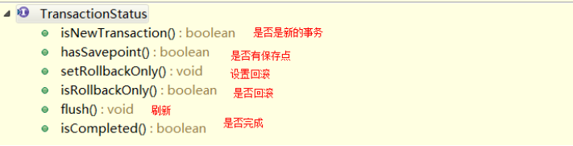

# 1. 事务相关概念

## 1.1 什么是事务？

事务是逻辑上的一组操作，组成这组操作的各个逻辑单元，要么一起成功，要么一起失败。

 

## 1.2 事务的特性（ACID）

⚫ 原子性（Atomicity）：事务是一个原子操作，由一系列动作组成。事务的原子性确保动作要么全部完成，要么完全不起作用。

⚫ 一致性（Consistency）：一旦事务完成（不管成功还是失败），系统必须确保它所建模的业务处于一致的状态，而不会是部分完成部分失败。在现实中的数据不应该被破坏。

⚫ 隔离性（Isolation）：可能有许多事务会同时处理相同的数据，因此每个事务都应该与其他事务隔离开来，防止数据损坏。

⚫ 持久性（Durability）：一旦事务完成，无论发生什么系统错误，它的结果都不应该受到影响，这样就能从任何系统崩溃中恢复过来。通常情况下，事务的结果被写到持久化存储器中。

 

## 1.3 TransactionDefinition：事务定义信息

事务定义信息有：

⚫ 隔离级别

⚫ 传播行为

⚫ 超时信息

⚫ 是否只读

 

## 1.4 如果不考虑隔离性会引发安全性问题

**隔离级别**：定义了一个事务可能受其他并发事务影响的程度。

**并发事务引起的问题**：典型的应用程序中，多个事务并发运行，经常会操作相同的数据来完成各自的任务。并发虽然是必须的，但可能会导致以下的问题。

⚫ 脏读（Dirty reads）——脏读发生在一个事务读取了另一个事务改写但尚未提交的数据时。如果改写在稍后被回滚了，那么第一个事务获取的数据就是无效的。

⚫ 不可重复读（Nonrepeatable read）——不可重复读发生在一个事务执行相同的查询两次或两次以上，但是每次都得到不同的数据时。这通常是因为另一个并发事务在两次查询期间进行了更新。

⚫ 幻读（Phantom read）——幻读与不可重复读类似。它发生在一个事务（T1）读取了几行数据，接着另一个并发事务（T2）插入了一些数据时。在随后的查询中，第一个事务（T1）就会发现多了一些原本不存在的记录。

 

## 1.5 解决读问题：设置事务的隔离级别

⚫ 未提交读：脏读，不可重复读，虚读都有可能发生

⚫ 已提交读：避免脏读。但是不可重复读和虚读都有可能发生

⚫ 可重复读：避免脏读和不可重复读。但是虚读有可能发生

⚫ 串行化的：避免以上所有读问题

mysql数据库的默认隔离级别就是**可重复读**,Oracle默认是已提交读

 

## 1.6 事务的传播行为

PROPAGATION_XXX：事务的传播行为。

* 保证在同一个事务中
  * PROPAGATION_REQUIRED：required , 必须。支持当前事务，如果不存在，就新建一个(默认)
  * PROPAGATION_SUPPORTS：supports ，支持。支持当前事务，如果不存在，就不使用事务
  * PROPAGATION_MANDATORY：mandatory ，强制。支持当前事务，如果不存在，就抛出异常

* 保证没有在同一个事务中
  * PROPAGATION_REQUIRES_NEW：requires_new，必须新的。如果有事务存在，挂起当前事务，创建一个新的事务
  * PROPAGATION_NOT_SUPPORTED：not_supported ,不支持。以非事务方式运行，如果有事务存在，挂起当前事务
  * PROPAGATION_NEVER：never，从不。以非事务方式运行，如果有事务存在，抛出异常
  * PROPAGATION_NESTED：nested ，嵌套。如果当前事务存在，则嵌套事务执行

 

## 1.7 事务超时

为了使应用程序很好地运行，事务不能运行太长的时间。因为事务可能涉及对后端数据库的锁定，所以长时间的事务会不必要的占用数据库资源。事务超时就是事务的一个定时器，在特定时间内事务如果没有执行完毕，那么就会自动回滚，而不是一直等待其结束。

 

## 1.8 只读

这是事务的第三个特性，是否为只读事务。如果事务只对后端的数据库进行该操作，数据库可以利用事务的只读特性来进行一些特定的优化。通过将事务设置为只读，你就可以给数据库一个机会，让它应用它认为合适的优化措施。

 

# 2. Spring 事务

 

## 2.1 PlatformTransactionManager：平台事务管理器

 

Spring进行事务操作时候，主要使用一个**PlatformTransactionManager**接口，它表示事务管理器，即**真正管理事务的对象**。

Spring并不直接管理事务，通过这个接口，Spring为各个平台如JDBC、Hibernate等都提供了对应的事务管理器，也就是**将事务管理的职责委托给Hibernate或者JTA等持久化机制所提供的相关平台框架的事务来实现**。

Spring针对不同的持久化框架，提供了不同PlatformTransactionManager接口的实现类：

⚫ org.springframework.jdbc.datasource.DataSourceTransactionManager ：使用 Spring JDBC或iBatis 进行持久化数据时使用

⚫ org.springframework.orm.hibernate3.HibernateTransactionManager ：使用 Hibernate版本进行持久化数据时使用

 

## 2.2 Spring的这组接口是如何进行事务管理的

 

平台事务管理器根据事务定义的信息进行事务的管理，事务管理的过程中产生一些状态，将这些状态记录到TrancactionStatus里面。

 

## 2.3 TransactionStatus：事务的状态

 

在上面 PlatformTransactionManager 接口有一个方法getTransaction()，这个方法返回的是 TransactionStatus对象，然后程序根据返回的对象来获取事务状态，然后进行相应的操作。

这个接口描述的是一些处理事务提供简单的控制事务执行和查询事务状态的方法，在回滚或提交的时候需要应用对应的事务状态。

 

## 2.4 Spring进行事务操作的方式

 

Spring提供了两种事务管理的方式：**编程式事务管理**和**声明式事务管理**

* 编程式事务管理
* 声明式事务管理
  * 基于xml配置文件方式
  * 基于注解方式

参考文章

https://blog.csdn.net/qq_34598667/article/details/83627563

