# 1. 大型网站架构演化

## 1.2大型网站架构演化发展历程

### 1.2.1 初始阶段的网站架构

大型网站都是从小型网站发展而来，网站架构也是一样，是从小型网站架构逐步演化而来。

小型网站最开始时没有太多人访问，只需要一台服务器就绰绰有余，这时的网站架构如图1.1所示。

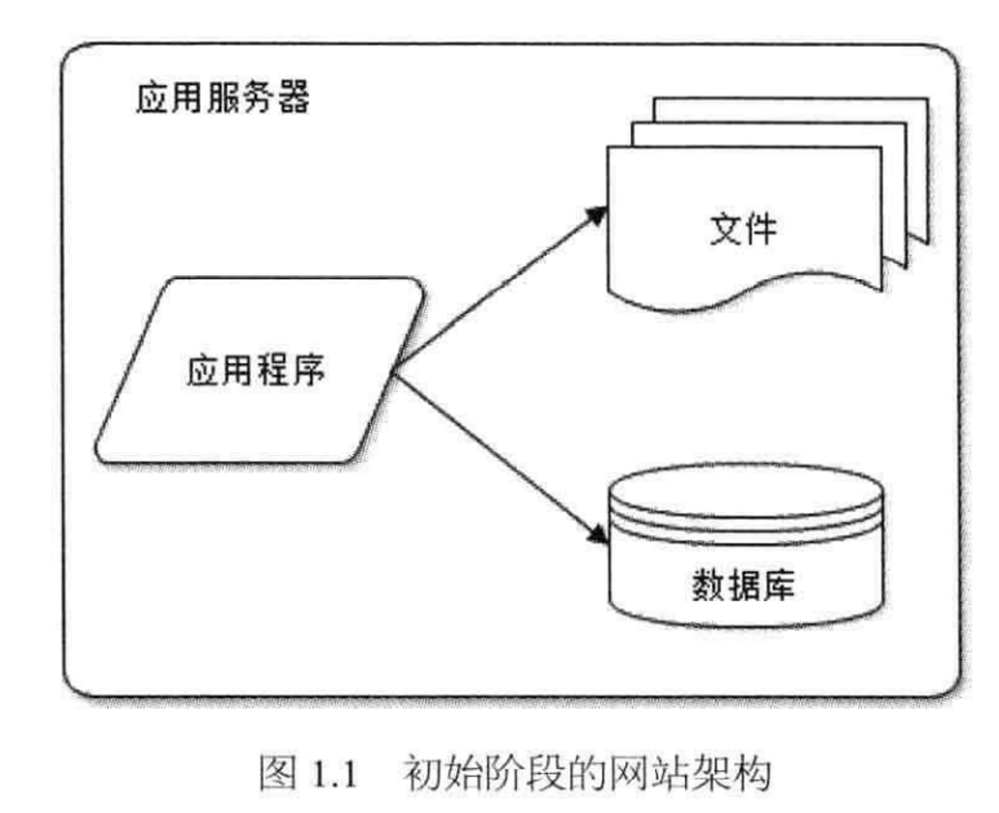

应用程序、数据库、文件等所有的资源都在一台服务器上。通常服务器操作系统使用Linux，应用程序使用PHP 开发，然后部署在Apache 上，数据库使用MySQL，汇集各种免费开源软件及一台廉价服务器就可以开始网站的发展之路了。

### 1.2.2 应用服务和数据服务分离

随着网站业务的发展，一台服务器逐渐不能满足需求:越来越多的用户访问导致性能越来越差越来越多的数据导致存储空间不足。这时就需要将应用和数据分离。应用和数据分离后整个网站使用三台服务器: **应用服务器**、**文件服务器**和**数据库服务器**。

如图1.2所示。这三台服务器对硬件资源的要求各不相同，**应用服务器需要处理大量的业务逻辑，因此需要更快更强大的CPU**;**数据库服务器需要快速磁盘检索和数据缓存，因此需要更快的硬盘和更大的内存**;**文件服务器需要存储大量用户上传的文件，因此需要更大的硬盘**。

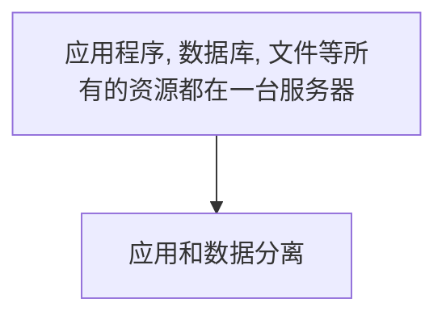

### 1.2.3 使用缓存改善网站性能

网站访问特点和现实世界的财富分配一样遵循二八定律，**80%的业务访问集中在20%**的数据上。

淘宝买家浏览的商品集中在少部分成交数多、评价良好的商品上;

百度搜索关键词集中在少部分热门词汇上;

只有经常登录的用户才会发微博、看微博，而这部分用户也只占总用户数目的一小部分。

既然大部分的业务访问集中在一小部分数据上，那么如果把这一小部分数据缓存在内存中，是不是就可以减少数据库的访问压力，提高整个网站的数据访问速度，改善数据库的写入性能了呢?

网站使用的缓存可以分为两种:

**缓存在应用服务器上的本地缓存**和**缓存在专门的分布式缓存服务器上的远程缓存**。

> ℹ️ 本地缓存
>
> 本地缓存的访问速度更快一些，但是受应用服务器内存限制，其缓存数据量有限，而且会出现和应用程序争用内存的情况。

> ℹ️ 远程缓存
>
> 远程分布式缓存可以使用集群的方式，部署大内存的服务器作为专门的缓存服务器，可以在理论上做到不受内存容量限制的缓存服务，如图1.3所示。

> ⚠️ 小心
> 使用缓存后，**数据访问压力得到有效缓解，但是单一应用服务器能够处理的请求连接有限，在网站访问高峰期，应用服务器成为整个网站的瓶颈**。

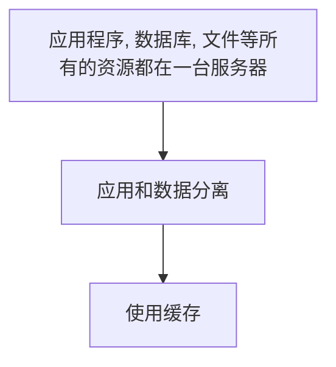

  

### 1.2.4 使用应用服务器集群改善网站的并发处理能力

**使用集群是网站解决高并发、海量数据问题的常用手段**。

当一台服务器的处理能力、存储空间不足时，不要企图去换更强大的服务器，对大型网站而言，不管多么强大的服务器，都满足不了网站持续增长的业务需求。这种情况下，更恰当的做法是增加一台服务器分担原有服务器的访问及存储压力。

对网站架构而言，只要能通过增加一台服务器的方式改善负载压力，就可以同样的方式持续增加服务器不断改善系统性能，从而实现系统的可伸缩性。

应用服务器实现集群是网站可伸缩集群架构设计中较为简单成熟的一种，如图1.4所示。

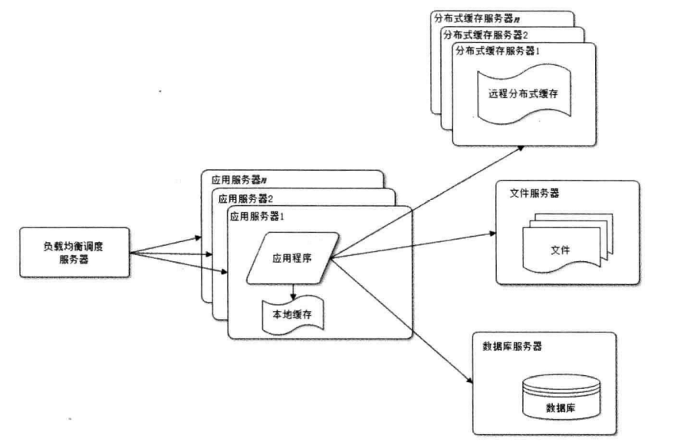

通过负载均衡调度服务器，可将来自用户浏览器的访问请求分发到应用服务器集群中的任何一台服务器上，如果有更多的用户，就在集群中加入更多的应用服务器，使应用服务器的负载压力不再成为整个网站的瓶颈。

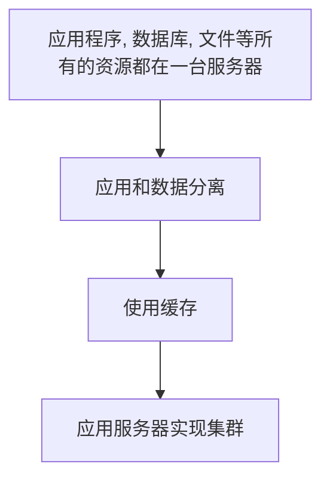

### 1.2.5 数据库读写分离

网站在使用缓存后，使绝大部分数据读操作访问都可以不通过数据库就能完成，但是仍有一部分读操作（缓存访问不命中、缓存过期)和全部的写操作需要访问数据库，在网站的用户达到一定规模后，**数据库因为负载压力过高而成为网站的瓶颈**。

**目前大部分的主流数据库都提供主从热备功能，通过配置两台数据库主从关系，可以将一台数据库服务器的数据更新同步到另一台服务器上**。

网站利用数据库的这一功能,实现数据库读写分离，从而改善数据库负载压力，如
图1.5所示。

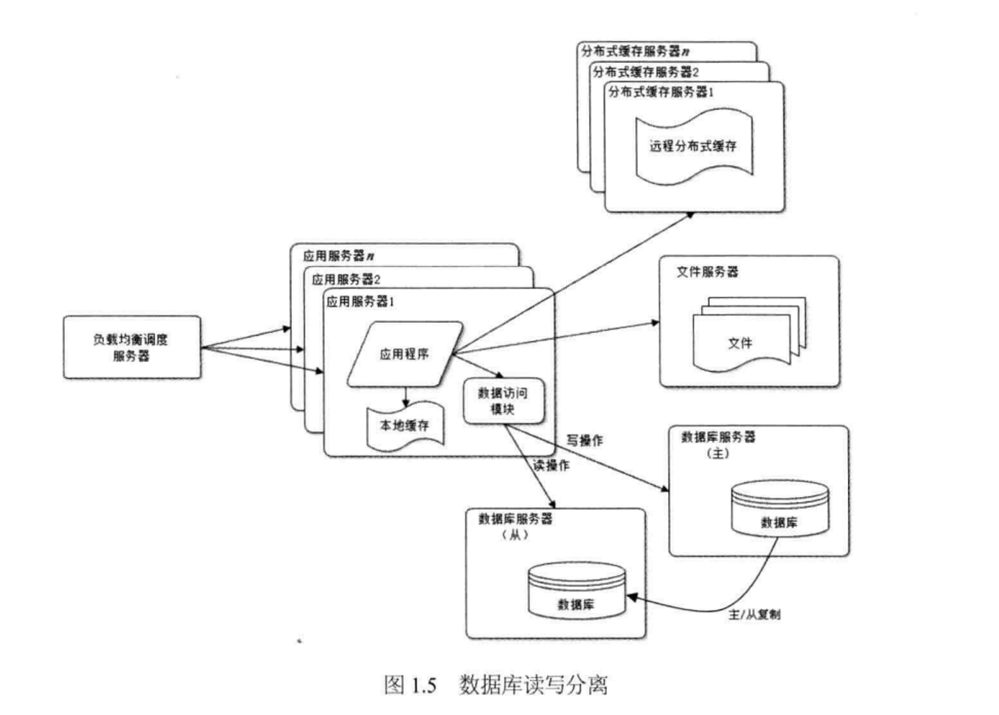

**应用服务器在写数据的时候，访问主数据库，主数据库通过主从复制机制将数据更新同步到从数据库，这样当应用服务器读数据的时候，就可以通过从数据库获得数据**。

**为了便于应用程序访问读写分离后的数据库，通常在应用服务器端使用专门的数据访问模块，使数据库读写分离对应用透明**。

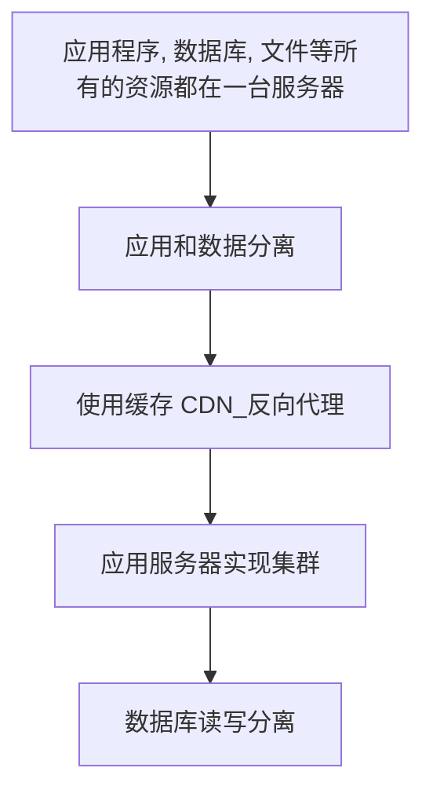

### 1.2.6 使用反向代理和CDN(Content Delivery Network)加速网站响应

随着网站业务不断发展，用户规模越来越大，由于中国复杂的网络环境，不同地区的用户访问网站时，速度差别也极大。有研究表明，网站访问延迟和用户流失率正相关，网站访问越慢，用户越容易失去耐心而离开。

[CDN是什么？使用CDN有什么优势？](https://www.zhihu.com/question/36514327?rf=37353035)

> ℹ️ CDN
> 
> Content Delivery Network，即内容分发网络
> 
> CDN是构建在现有网络基础之上的智能虚拟网络，依靠部署在各地的边缘服务器，通过中心平台的负载均衡、内容分发、调度等功能模块，**使用户就近获取所需内容，降低网络拥塞，提高用户访问响应速度和命中率**。CDN的关键技术主要有内容存储和分发技术。

> ℹ️ 
> 
> 为了提供更好的用户体验，留住用户，网站需要加速网站访问速度。主要手段有**使用CDN和反向代理**.

如图1.6所示。

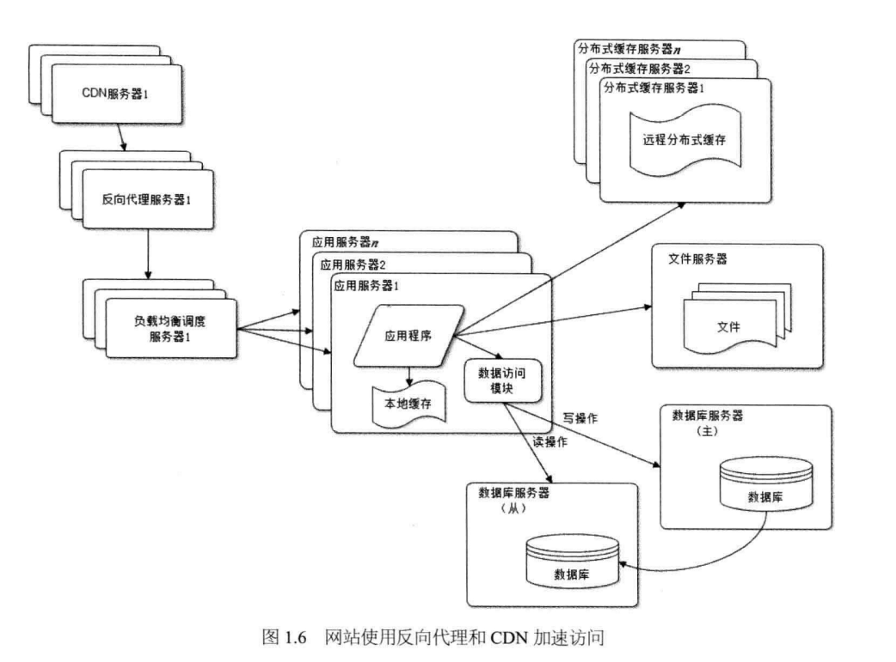

**CDN和反向代理的基本原理都是缓存**,区别在于

CDN部署在网络提供商的机房,使用户在请求网站服务时，可以从距离自己最近的网络提供商机房获取数据;

而反向代理则部署在网站的中心机房，当用户请求到达中心机房后，
首先访问的服务器是反向代理服务器，如果反向代理服务器中缓存着用户请求的资源，就将其直接返回给用户。

> ℹ️ 
> 
> 使用CDN和反向代理的目的都是尽早返回数据给用户，一方面加快用户访问速度，另一方面也减轻后端服务器的负载压力。

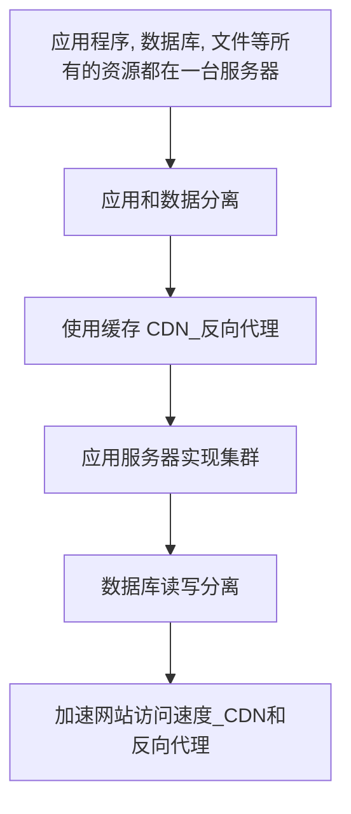

### 1.2.7 使用分布式文件系统和分布式数据库系统

任何强大的单一服务器都满足不了大型网站持续增长的业务需求。

**数据库经过读写分离后，从一台服务器拆分成两台服务器，但是随着网站业务的发展依然不能满足需求,这时需要使用分布式数据库**。

**文件系统也是一样,需要使用分布式文件系统**，如图1.7所示。

**分布式数据库是网站数据库拆分的最后手段，只有在单表数据规模非常庞大的时候才使用**。

**不到不得已时，网站更常用的数据库拆分手段是业务分库**，将不同业务的数据库部署在不同的物理服务器上。

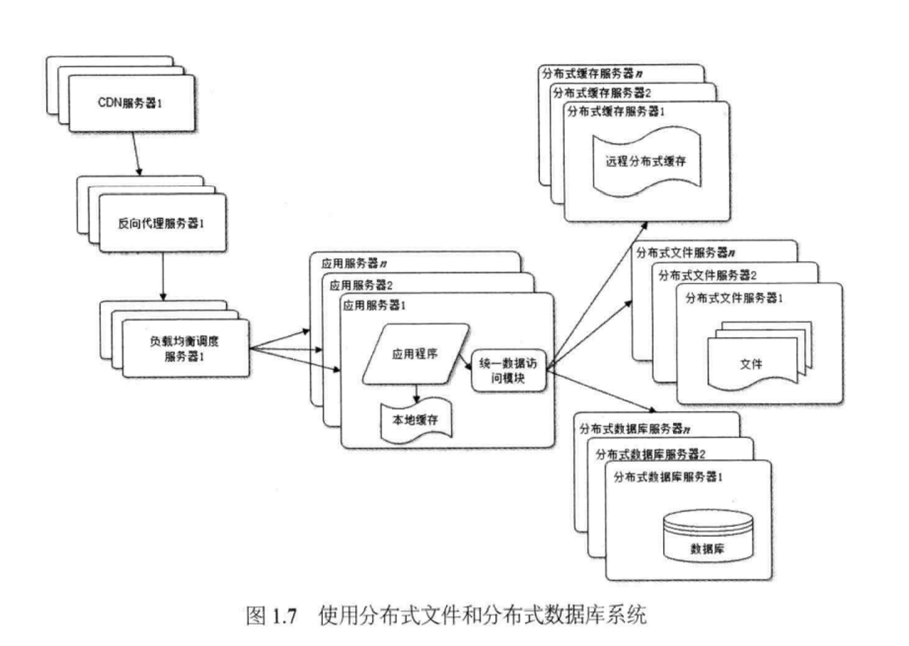

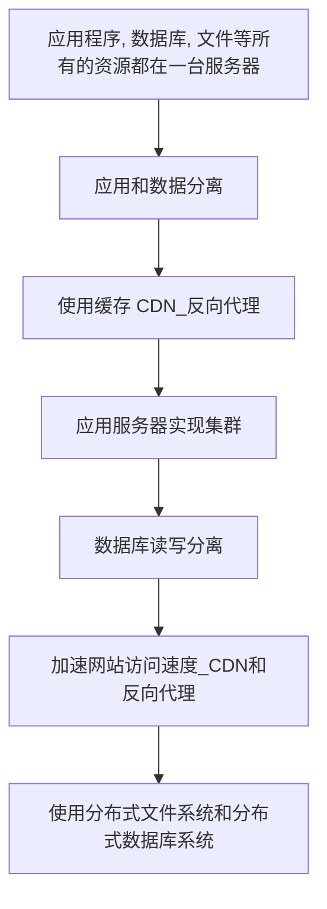

### 1.2.8 使用NoSQL和搜索引擎

随着网站业务越来越复杂，对数据存储和检索的需求也越来越复杂，网站需要采用一些非关系数据库技术如NoSQL和非数据库查询技术如搜索引擎，如图1.8所示。

NoSQL

NoSQL 和搜索引擎都是源自互联网的技术手段，对可伸缩的分布式特性具有更好的支持。

**应用服务器则通过一个统一数据访问模块访问各种数据**，减轻应用程序管理诸多数据源的麻烦。

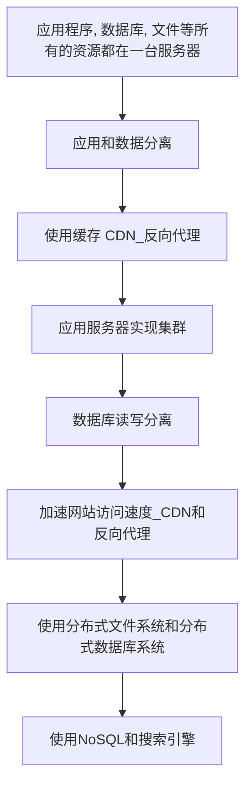

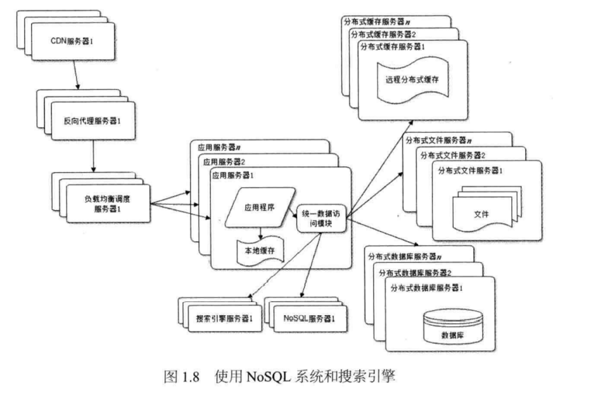

### 1.2.9 业务拆分

大型网站为了应对日益复杂的业务场景，通过使用分而治之的手段将整个网站业务分成不同的产品线，如大型购物交易网站就会将首页、商铺、订单、买家、卖家等拆分成不同的产品线，分归不同的业务团队负责。

具体到技术上，也会根据产品线划分，将一个网站拆分成许多不同的应用，每个应用独立部署维护。应用之间可以通过一个超链接建立关系（在首页上的导航链接每个都指向不同的应用地址)，也可以通过消息队列进行数据分发，当然最多的还是通过访问同一个数据存储系统来构成一个关联的完整系统，如图1.9所示。

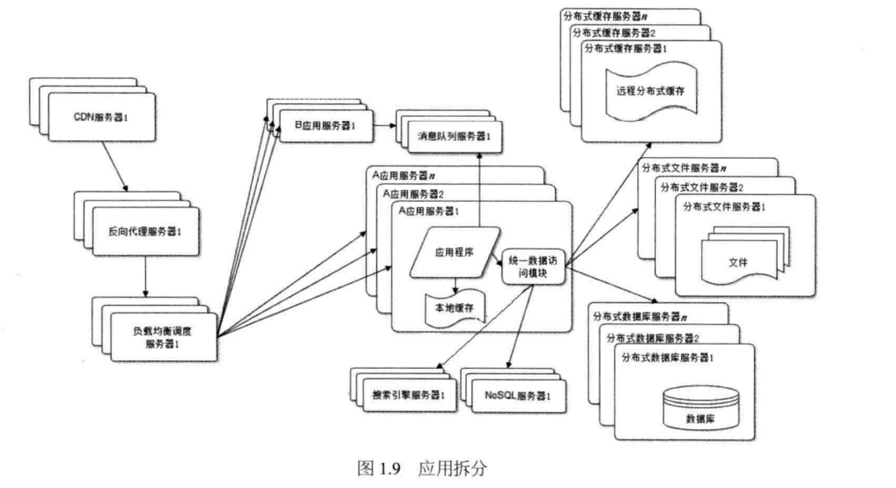

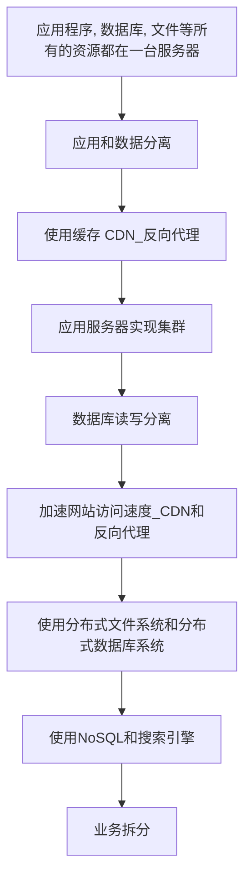

### 1.2.10 分布式服务

随着业务拆分越来越小，存储系统越来越庞大，应用系统的整体复杂度呈指数级增加，部署维护越来越困难。由于所有应用要和所有数据库系统连接，在数万台服务器规模的网站中，这些连接的数目是服务器规模的平方，导致存数据库接资源不足，拒绝服务。

既然每一个应用系统都需要执行许多相同的业务操作，比如用户管理、商品管理等，那么可以将这些共用的业务提取出来，独立部署。**由这些可复用的业务连接数据库，提供共用业务服务**，**而应用系统只需要管理用户界面，通过分布式服务调用共用业务服务完成具体业务操作**，如图1.10 所示。

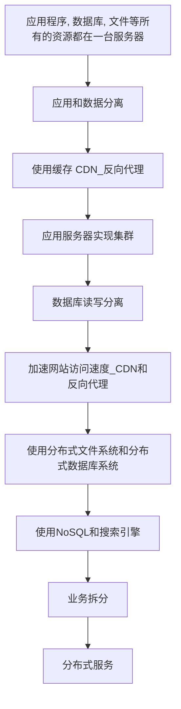

## 1.3 大型网站架构演化的价值观

这个世界没有哪个网站从诞生起就是大型网站;也没有哪个网站第一次发布就拥有庞大的用户，高并发的访问，海量的数据;大型网站都是从小型网站发展而来。

网站的价值在于它能为用户提供什么价值，在于网站能做什么，而不在于它是怎么做的，所以在网站还很小的时候就去追求网站的架构是舍本逐末，得不偿失的。

小型网站最需要做的就是为用户提供好的服务来创造价值，得到用户的认可，活下去，野蛮生长。

所以我们看到，一方面是随着互联网的高速发展，越来越多新的软件技术和产品从互联网公司诞生，挑战传统软件巨头的江湖地位。

另一方面却是中小网站十几年如一日地使用LAMP技术(Linux+Apache+MySQL+PHP)开发自己的网站，因为LAMP 既便宜又简单，而且对付一个中小型网站绰绰有余。

## 1.4网站架构设计误区

在大型网站架构发展过程中有如下几个容易出现的误区。

1. 一味追随大公司的解决方案

2. 为了技术而技术

3. 企图用技术解决所有问题

最典型的例子就是2012年年初12306故障事件后，软件开发技术界的反应。

各路专业和非专业人士众说纷纭地帮12306的技术架构出谋划策，甚至有人提议帮12306写一个开源的网站，解决其大规模并发访问的问题。

12306真正的问题**其实不在于它的技术架构，而在于它的业务架构**:

12306根本就不应该在几亿中国人一票难求的情况下以窗口售票的模式在网上售票（零点开始出售若干天后的车票)。

12306需要重构的不仅是它的技术架构，更重要的是它的业务架构:

调整业务需求，换一种方式卖票，而不要去搞促销秒杀这种噱头式的游戏。

后来证明12306确实是朝这个方向发展的:

**在售票方式上引入了排队机制、整点售票调整为分时段售票**。

其实如果能控制住并发访问的量，很多棘手的技术问题也就不是什么问题了。

**技术是用来解决业务问题的，而业务的问题，也可以通过业务的手段去解决**。

## 1.5小结

时至今日，大型网站的架构演化方案已经非常成熟，各种技术方案也逐渐产品化。

许多小型网站已经慢慢不需要再经历大型网站经历过的架构演化之路就可以逐步发展壮大，因为现在越来越多的网站从建立之初就是搭建在大型网站提供的云计算服务基础之上，所需要的一切技术资源:**计算、存储、网络都可以按需购买，线性伸缩，不需要自己一点一点地拼凑各种资源，综合使用各种技术方案逐步去完善自己的网站架构了**。

所以能亲身经历一个网站从小到大的架构演化过程的网站架构师越来越少，虽然过去有这种经历的架构师也很少(从小型网站发展成大型网站的机会本来就极少)，但是将来可能真就没有了。

**但也正因为网站架构技术演化过程难以重现，所以网站架构师更应该对这个过程深刻了解，理解已成熟的网站架构技术方案的来龙去脉和历史渊源，在技术选型和架构决策时才能有的放矢，直击要害**。

## 2.1网站架构模式

### 2.1.1 分层

分层结构在计算机世界中无处不在，网络的7层通信协议是一种分层结构;计算机硬件、操作系统、应用软件也可以看作是一种分层结构。

在大型网站架构中也采用分层结构，将网站软件系统分为应用层、服务层、数据层，如表2.1所示。

分层架构是**逻辑上的，在物理部署上，三层结构可以部署在同一个物理机器上**，但是随着网站业务的发展，**必然需要对已经分层的模块分离部署，即三层结构分别部署在不同的服务器上**，**使网站拥有更多的计算资源以应对越来越多的用户访问**。

所以虽然分层架构模式最初的目的是规划软件清晰的逻辑结构便于开发维护，**但在网站的发展过程中，分层结构对网站支持高并发向分布式方向发展至关重要**。

因此在网站规模还很小的时候就应该采用分层的架构，这样将来网站做大时才能有更好地应对。

### 2.1.2 分割

如果说**分层是将软件在横向方面进行切分**,那么**分割就是在纵向方面对软件进行切分**。

网站越大，功能越复杂，服务和数据处理的种类也越多，将这些不同的功能和服务分割开来，包装成高内聚低耦合的模块单元.

**一方面有助于软件的开发和维护**;

**另一方面，便于不同模块的分布式部署，提高网站的并发处理能力和功能扩展能力**。

大型网站分割的粒度可能会很小。

比如在应用层，将不同业务进行分割，例如将购物、论坛、搜索、广告分割成不同的应用，由独立的团队负责，部署在不同的服务器上;

在同一个应用内部，如果规模庞大业务复杂，会继续进行分割，比如购物业务，可以进一步分割成机票酒店业务、3C业务，小商品业务等更细小的粒度。

而即使在这个粒度上，还是可以继续分割成首页、搜索列表、商品详情等模块，
这些模块不管在逻辑上还是物理部署上，都可以是独立的。同样在服务层也可以根据需要将服务分割成合适的模块。

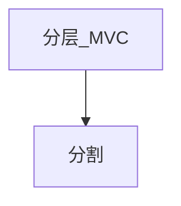

### 2.1.3 分布式

**对于大型网站，分层和分割的一个主要目的是为了切分后的模块便于分布式部署，即将不同模块部署在不同的服务器上，通过远程调用协同工作**。

分布式意味着可以使用更多的计算机完成同样的功能，计
算机越多，CPU、内存、存储资源也就越多，能够处理的并发访问和数据量就越大，进而能够为更多的用户提供服务。

> ⚠️ 但分布式在解决网站高并发问题的同时也带来了其他问题。
> 
> 首先，分布式意味着服务调用必须通过网络，这可能会对性能造成比较严重的影响;
> 其次，服务器越多，服务器宕机的概率也就越大，一台服务器宕机造成的服务不可用可能会导致很多应用不可访问，使网站可用性降低;
> 另外，数据在分布式的环境中保持数据一致性也非常困难，分布式事务也难以保证，这对网站业务正确性和业务流程有可能造成很大影响;

分布式还导致网站依赖错综复杂，开发管理维护困难。

因此分布式设计要根据具体情况量力而行，切莫为了分布式而分布式。

在网站应用中，常用的分布式方案有以下几种。

> ℹ️ 分布式应用和服务
> 
> 将分层和分割后的应用和服务模块分布式部署，除了可以改善网站性能和并发性、加快开发和发布速度、减少数据库连接资源消耗外;还可以使不同应用复用共同的服务，便于业务功能扩展。

> ℹ️ 分布式静态资源
> 
> 网站的静态资源如JS，CSS，Logo图片等资源独立分布式部署，并采用独立的域名，即人们常说的动静分离。静态资源分布式部署可以减轻应用服务器的负载压力;通过使用独立域名加快浏览器并发加载的速度;由负责用户体验的团队进行开发维护有利于网站分工合作，使不同技术工种术业有专攻。

> ℹ️ 分布式数据和存储
> 
> 大型网站需要处理以Р为单位的海量数据，单台计算机无法提供如此大的存储空间，这些数据需要分布式存储。除了对传统的关系数据库进行分布式部署外，为网站应用而生的各种NoSQL产品几乎都是分布式的。

> ℹ️ 分布式计算
> 
> 严格说来，**应用、服务、实时数据处理都是计算**，网站除了要处理这些在线业务，还有很大一部分用户没有直观感受的后台业务要处理，包括搜索引擎的索引构建、数据仓库的数据分析统计等。这些业务的计算规模非常庞大，目前网站普遍使用Hadoop及其MapReduce分布式计算框架进行此类批处理计算，其特点是移动计算而不是移动数据，将计算程序分发到数据所在的位置以加速计算和分布式计算。

**此外，还有可以支持网站线上服务器配置实时更新的分布式配置;分布式环境下实现并发和协同的分布式锁;支持云存储的分布式文件系统等**。

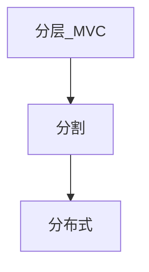

### 2.1.4 集群

使用分布式虽然已经将分层和分割后的模块独立部署，但是对于用户访问集中的模块（比如网站的首页)，还需要将独立部署的服务器集群化，即多台服务器部署相同应用构成一个集群，通过负载均衡设备共同对外提供服务。

因为**服务器集群有更多服务器提供相同服务，因此可以提供更好的并发特性**，当有更多用户访问的时候，只需要向集群中加入新的机器即可。同时因为一个应用由多台服务器提供，**当某台服务器发生故障时，负载均衡设备或者系统的失效转移机制会将请求转发到集群中其他服务器上，使服务器故障不影响用户使用**。

所以在网站应用中，即使是访问量很小的分布式应用和服务，也至少要部署两台服务器构成一个小的集群，目的就是提高系统的可用性。

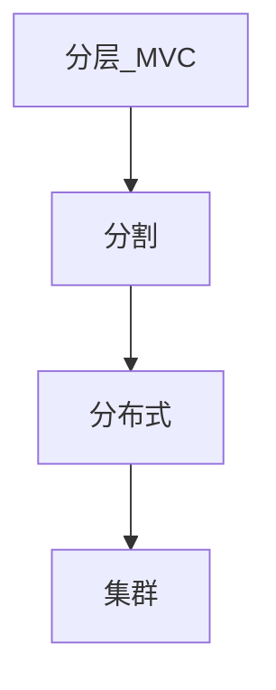

### 2.1.5 缓存

**缓存就是将数据存放在距离计算最近的位置以加快处理速度**。

**缓存是改善软件性能的第一手段**，现代CPU越来越快的一个重要因素就是使用了更多的缓存，在复杂的软件设计中，缓存几乎无处不在。大型网站架构设计在很多方面都使用了缓存设计。

**CDN:即内容分发网络，部署在距离终端用户最近的网络服务商**，用户的网络请求总是先到达他的网络服务商那里，在这里缓存网站的一些静态资源（较少变化的数据)，可以就近以最快速度返回给用户，如视频网站和门户网站会将用户访问量大的热点内容缓存在CDN。

**反向代理**:反向代理属于网站前端架构的一部分，部署在网站的前端，当用户请求到达网站的数据中心时，最先访问到的就是反向代理服务器，这里缓存网站的静态资源，无需将请求继续转发给应用服务器就能返回给用户。

**本地缓存**：在应用服务器本地缓存着热点数据，应用程序可以在本机内存中直接访问数据,而无需访问数据库。

**分布式缓存**:大型网站的数据量非常庞大，即使只缓存一小部分，需要的内存空间也不是单机能承受的，所以除了本地缓存，还需要分布式缓存，将数据缓存在一个专门的分布式缓存集群中，应用程序通过网络通信访问缓存数据。

使用缓存有两个前提条件，

一是数据访问热点不均衡，某些数据会被更频繁的访问，这些数据应该放在缓存中;

二是数据在某个时间段内有效，不会很快过期，否则缓存的数据就会因已经失效而产生脏
读，影响结果的正确性。

网站应用中，**缓存除了可以加快数据访问速度，还可以减轻后端应用和数据存储的负载压力**，

这一点对网站数据库架构至关重要，网站数据库几乎都是按照有缓存的前提进行负载
能力设计的。

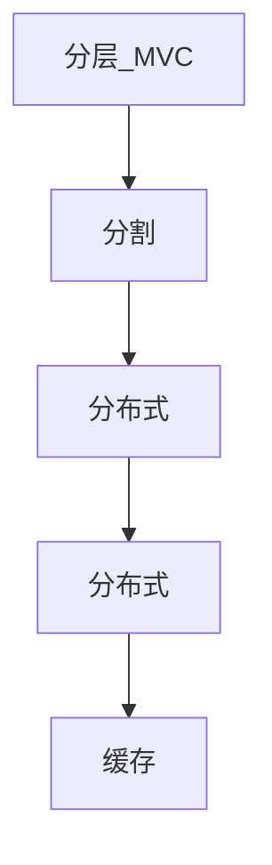

### 2.1.6 异步

计算机软件发展的一个重要目标和驱动力是降低软件耦合性。事物之间直接关系越少，就越少被彼此影响，越可以独立发展。**大型网站架构中，系统解耦合的手段除了前面提到的分层、分割、分布等，还有一个重要手段是异步**，业务之间的消息传递不是同步调用，而是**将一个业务操作分成多个阶段，每个阶段之间通过共享数据的方式异步执行进行协作**。

> ℹ️ 
> 
> **在单一服务器内部可通过多线程共享内存队列的方式实现异步**，处在业务操作前面的线程将输出写入到队列，后面的线程从队列中读取数据进行处理;
>
> **在分布式系统中，多个服务器集群通过分布式消息队列实现异步**，分布式消息队列可以看作内存队列的分布式部署。

异步架构是典型的生产者消费者模式，两者不存在直接调用，只要保持数据结构不变，彼此功能实现可以随意变化而不互相影响，这对网站扩展新功能非常便利。

除此之外，使用异步消息队列还有如下特性。

> ℹ️ 
> **提高系统可用性**。消费者服务器发生故障，数据会在消息队列服务器中存储堆积，生产者服务器可以继续处理业务请求，系统整体表现无故障。消费者服务器恢复正常后，继续处理消息队列中的数据。
> **加快网站响应速度**。处在业务处理前端的生产者服务器在处理完业务请求后，将数据写入消息队列，不需要等待消费者服务器处理就可以返回，响应延迟减少。
> **消除并发访问高峰**。用户访问网站是随机的，存在访问高峰和低谷，即使网站按照一般访问高峰进行规划和部署，也依然会出现突发事件，比如购物网站的促销活动，微博上的热点事件，都会造成网站并发访问突然增大，这可能会造成整个网站负载过重，响应延迟，严重时甚至会出现服务宕机的情况。使用消息队列将突然增加的访问请求数据放入消息队列中，等待消费者服务器依次处理，就不会对整个网站负载造成太大压力。

但需要注意的是，**使用异步方式处理业务可能会对用户体验、业务流程造成影响，需要网站产品设计方面的支持**。

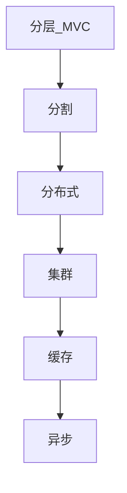

### 2.1.7 冗余

网站需要7×24小时连续运行，但是服务器随时可能出现故障，特别是服务器规模比较大时，出现某台服务器宕机是必然事件。

要想保证在服务器宕机的情况下网站依然可以继续服务，不丢失数据，就需要一定程度的服务器冗余运行，数据冗余备份，这样当某台服务器宕机时，可以将其上的服务和数据访问转移到其他机器上。

**访问和负载很小的服务也必须部署至少两台服务器构成一个集群**，其目的就是通过冗余实现服务高可用。数据库除了定期备份，存档保存，实现冷备份外，为了保证在线业务高可用，还需要对数据库进行主从分离，实时同步实现热备份。

> ℹ️ 
> 
> 数据库除了定期备份，存档保存，实现冷备份外，为了保证在线业务高可用，还需要对数据库进行主从分离，实时同步实现热备份。

为了抵御地震、海啸等不可抗力导致的网站完全瘫痪，某些大型网站会对整个数据中心进行备份，**全球范围内部署灾备数据中心**。**网站程序和数据实时同步到多个灾备数据中心**。

### 2.1.8 自动化

在无人值守的情况下网站可以正常运行，一切都可以自动化是网站的理想状态。目前大型网站的自动化架构设计主要集中在发布运维方面。

发布对网站都是头等大事，许多网站故障出在发布环节，网站工程师经常加班也是因为发布不顺利。通过减少人为干预，使发布过程自动化可有效减少故障。发布过程包括诸多环节。自动化代码管理，代码版本控制、代码分支创建合并等过程自动化，开发工程师只要提交自己参与开发的产品代号，系统就会自动为其创建开发分支，后期会自动进行代码合并;自动化测试，代码开发完成，提交测试后，系
统自动将代码部署到测试环境，启动自动化测试用例进行测试，向相关人员发送测试报告，向系统反馈测试结果;自动化安全检测，安全检测工具通过对代码进行静态安全扫描及部署到安全测试环境进行
安全攻击测试，评估其安全性;最后进行自动化部署，将工程代码自动部署到线上生产环境。
此外，网站在运行过程中可能会遇到各种问题:服务器宕机、程序Bug、存储空间不足、突然爆发的访问高峰。网站需要对线上生产环境进行自动化监控，对服务器进行心跳检测，并监控其各项性能指标和
应用程序的关键数据指标。如果发现异常、超出预设的阈值，就进行自动化报警，向相关人员发送报警信息，警告故障可能会发生。在检测到故障发生后，系统会进行自动化失效转移，将失效的服务器从
集群中隔离出去，不再处理系统中的应用请求。待故障消除后，系统进行自动化失效恢复，重新启动服务，同步数据保证数据的一致性。在网站遇到访问高峰，超出网站最大处理能力时，为了保证整个网
站的安全可用，还会进行自动化降级，通过拒绝部分请求及关闭部分不重要的服务将系统负载降至一个安全的水平，必要时，还需要自动化分配资源，将空闲资源分配给重要的服务，扩大其部署规模。
2.1.9安全
互联网的开放特性使得其从诞生起就面对巨大的安全挑战，网站在安全架构方面也积累了许多模式:通过密码和手机校验码进行身份认证;登录、交易等操作需要对网络通信进行加密，网站服务器上存储的
敏感数据如用户信息等也进行加密处理;为了防止机器人程序滥用网络资源攻击网站，网站使用验证码进行识别;对于常见的用于攻击网站的XSS攻击、SQL注入、进行编码转换等相应处理;对于垃圾信息、
敏感信息进行过滤;对交易转账等重要操作根据交易模式和交易信息进行风险控制。
2.2架

