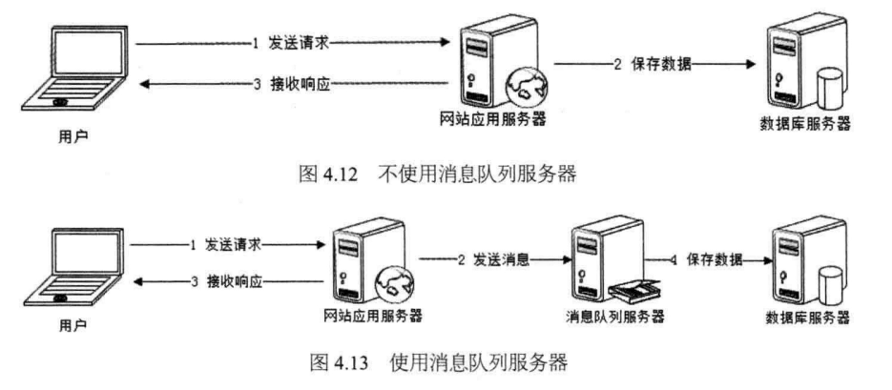

# 1. 大型网站架构演化

## 1.2大型网站架构演化发展历程

### 1.2.1 初始阶段的网站架构

大型网站都是从小型网站发展而来，网站架构也是一样，是从小型网站架构逐步演化而来。

小型网站最开始时没有太多人访问，只需要一台服务器就绰绰有余，这时的网站架构如图1.1所示。


应用程序、数据库、文件等所有的资源都在一台服务器上。通常服务器操作系统使用Linux，应用程序使用PHP 开发，然后部署在Apache 上，数据库使用MySQL，汇集各种免费开源软件及一台廉价服务器就可以开始网站的发展之路了。


### 1.2.2 应用服务和数据服务分离

随着网站业务的发展，一台服务器逐渐不能满足需求:越来越多的用户访问导致性能越来越差越来越多的数据导致存储空间不足。这时就需要将应用和数据分离。应用和数据分离后整个网站使用三台服务器: **应用服务器**、**文件服务器**和**数据库服务器**。

如图1.2所示。这三台服务器对硬件资源的要求各不相同，**应用服务器需要处理大量的业务逻辑，因此需要更快更强大的CPU**;**数据库服务器需要快速磁盘检索和数据缓存，因此需要更快的硬盘和更大的内存**;**文件服务器需要存储大量用户上传的文件，因此需要更大的硬盘**。


### 1.2.3 使用缓存改善网站性能

网站访问特点和现实世界的财富分配一样遵循二八定律，**80%的业务访问集中在20%**的数据上。

淘宝买家浏览的商品集中在少部分成交数多、评价良好的商品上;

百度搜索关键词集中在少部分热门词汇上;

只有经常登录的用户才会发微博、看微博，而这部分用户也只占总用户数目的一小部分。

既然大部分的业务访问集中在一小部分数据上，那么如果把这一小部分数据缓存在内存中，是不是就可以减少数据库的访问压力，提高整个网站的数据访问速度，改善数据库的写入性能了呢?

网站使用的缓存可以分为两种:

**缓存在应用服务器上的本地缓存**和**缓存在专门的分布式缓存服务器上的远程缓存**。

> ℹ️ 本地缓存
>
> 本地缓存的访问速度更快一些，但是受应用服务器内存限制，其缓存数据量有限，而且会出现和应用程序争用内存的情况。

> ℹ️ 远程缓存
>
> 远程分布式缓存可以使用集群的方式，部署大内存的服务器作为专门的缓存服务器，可以在理论上做到不受内存容量限制的缓存服务，如图1.3所示。


> ⚠️ 小心
> 使用缓存后，**数据访问压力得到有效缓解，但是单一应用服务器能够处理的请求连接有限，在网站访问高峰期，应用服务器成为整个网站的瓶颈**。


  

### 1.2.4 使用应用服务器集群改善网站的并发处理能力


**使用集群是网站解决高并发、海量数据问题的常用手段**。

当一台服务器的处理能力、存储空间不足时，不要企图去换更强大的服务器，对大型网站而言，不管多么强大的服务器，都满足不了网站持续增长的业务需求。这种情况下，更恰当的做法是增加一台服务器分担原有服务器的访问及存储压力。

对网站架构而言，只要能通过增加一台服务器的方式改善负载压力，就可以同样的方式持续增加服务器不断改善系统性能，从而实现系统的可伸缩性。

应用服务器实现集群是网站可伸缩集群架构设计中较为简单成熟的一种，如图1.4所示。


通过负载均衡调度服务器，可将来自用户浏览器的访问请求分发到应用服务器集群中的任何一台服务器上，如果有更多的用户，就在集群中加入更多的应用服务器，使应用服务器的负载压力不再成为整个网站的瓶颈。


### 1.2.5 数据库读写分离

网站在使用缓存后，使绝大部分数据读操作访问都可以不通过数据库就能完成，但是仍有一部分读操作（缓存访问不命中、缓存过期)和全部的写操作需要访问数据库，在网站的用户达到一定规模后，**数据库因为负载压力过高而成为网站的瓶颈**。

**目前大部分的主流数据库都提供主从热备功能，通过配置两台数据库主从关系，可以将一台数据库服务器的数据更新同步到另一台服务器上**。

网站利用数据库的这一功能,实现数据库读写分离，从而改善数据库负载压力，如
图1.5所示。


**应用服务器在写数据的时候，访问主数据库，主数据库通过主从复制机制将数据更新同步到从数据库，这样当应用服务器读数据的时候，就可以通过从数据库获得数据**。

**为了便于应用程序访问读写分离后的数据库，通常在应用服务器端使用专门的数据访问模块，使数据库读写分离对应用透明**。


### 1.2.6 使用反向代理和CDN(Content Delivery Network)加速网站响应

随着网站业务不断发展，用户规模越来越大，由于中国复杂的网络环境，不同地区的用户访问网站时，速度差别也极大。有研究表明，网站访问延迟和用户流失率正相关，网站访问越慢，用户越容易失去耐心而离开。

[CDN是什么？使用CDN有什么优势？](https://www.zhihu.com/question/36514327?rf=37353035)


> ℹ️ CDN
> 
> Content Delivery Network，即内容分发网络
> 
> CDN是构建在现有网络基础之上的智能虚拟网络，依靠部署在各地的边缘服务器，通过中心平台的负载均衡、内容分发、调度等功能模块，**使用户就近获取所需内容，降低网络拥塞，提高用户访问响应速度和命中率**。CDN的关键技术主要有内容存储和分发技术。

> ℹ️ 
> 
> 为了提供更好的用户体验，留住用户，网站需要加速网站访问速度。主要手段有**使用CDN和反向代理**.

如图1.6所示。


**CDN和反向代理的基本原理都是缓存**,区别在于

CDN部署在网络提供商的机房,使用户在请求网站服务时，可以从距离自己最近的网络提供商机房获取数据;

而反向代理则部署在网站的中心机房，当用户请求到达中心机房后，
首先访问的服务器是反向代理服务器，如果反向代理服务器中缓存着用户请求的资源，就将其直接返回给用户。


> ℹ️ 
> 
> 使用CDN和反向代理的目的都是尽早返回数据给用户，一方面加快用户访问速度，另一方面也减轻后端服务器的负载压力。


### 1.2.7 使用分布式文件系统和分布式数据库系统


任何强大的单一服务器都满足不了大型网站持续增长的业务需求。

**数据库经过读写分离后，从一台服务器拆分成两台服务器，但是随着网站业务的发展依然不能满足需求,这时需要使用分布式数据库**。

**文件系统也是一样,需要使用分布式文件系统**，如图1.7所示。

**分布式数据库是网站数据库拆分的最后手段，只有在单表数据规模非常庞大的时候才使用**。

**不到不得已时，网站更常用的数据库拆分手段是业务分库**，将不同业务的数据库部署在不同的物理服务器上。


### 1.2.8 使用NoSQL和搜索引擎

随着网站业务越来越复杂，对数据存储和检索的需求也越来越复杂，网站需要采用一些非关系数据库技术如NoSQL和非数据库查询技术如搜索引擎，如图1.8所示。

NoSQL


NoSQL 和搜索引擎都是源自互联网的技术手段，对可伸缩的分布式特性具有更好的支持。

**应用服务器则通过一个统一数据访问模块访问各种数据**，减轻应用程序管理诸多数据源的麻烦。


### 1.2.9 业务拆分

大型网站为了应对日益复杂的业务场景，通过使用分而治之的手段将整个网站业务分成不同的产品线，如大型购物交易网站就会将首页、商铺、订单、买家、卖家等拆分成不同的产品线，分归不同的业务团队负责。

具体到技术上，也会根据产品线划分，将一个网站拆分成许多不同的应用，每个应用独立部署维护。应用之间可以通过一个超链接建立关系（在首页上的导航链接每个都指向不同的应用地址)，也可以通过消息队列进行数据分发，当然最多的还是通过访问同一个数据存储系统来构成一个关联的完整系统，如图1.9所示。


### 1.2.10 分布式服务

随着业务拆分越来越小，存储系统越来越庞大，应用系统的整体复杂度呈指数级增加，部署维护越来越困难。由于所有应用要和所有数据库系统连接，在数万台服务器规模的网站中，这些连接的数目是服务器规模的平方，导致存数据库接资源不足，拒绝服务。

既然每一个应用系统都需要执行许多相同的业务操作，比如用户管理、商品管理等，那么可以将这些共用的业务提取出来，独立部署。**由这些可复用的业务连接数据库，提供共用业务服务**，**而应用系统只需要管理用户界面，通过分布式服务调用共用业务服务完成具体业务操作**，如图1.10 所示。


## 1.3 大型网站架构演化的价值观

这个世界没有哪个网站从诞生起就是大型网站;也没有哪个网站第一次发布就拥有庞大的用户，高并发的访问，海量的数据;大型网站都是从小型网站发展而来。

网站的价值在于它能为用户提供什么价值，在于网站能做什么，而不在于它是怎么做的，所以在网站还很小的时候就去追求网站的架构是舍本逐末，得不偿失的。

小型网站最需要做的就是为用户提供好的服务来创造价值，得到用户的认可，活下去，野蛮生长。

所以我们看到，一方面是随着互联网的高速发展，越来越多新的软件技术和产品从互联网公司诞生，挑战传统软件巨头的江湖地位。

另一方面却是中小网站十几年如一日地使用LAMP技术(Linux+Apache+MySQL+PHP)开发自己的网站，因为LAMP 既便宜又简单，而且对付一个中小型网站绰绰有余。


## 1.4网站架构设计误区

在大型网站架构发展过程中有如下几个容易出现的误区。

1. 一味追随大公司的解决方案

2. 为了技术而技术

3. 企图用技术解决所有问题

最典型的例子就是2012年年初12306故障事件后，软件开发技术界的反应。

各路专业和非专业人士众说纷纭地帮12306的技术架构出谋划策，甚至有人提议帮12306写一个开源的网站，解决其大规模并发访问的问题。

12306真正的问题**其实不在于它的技术架构，而在于它的业务架构**:

12306根本就不应该在几亿中国人一票难求的情况下以窗口售票的模式在网上售票（零点开始出售若干天后的车票)。

12306需要重构的不仅是它的技术架构，更重要的是它的业务架构:

调整业务需求，换一种方式卖票，而不要去搞促销秒杀这种噱头式的游戏。

后来证明12306确实是朝这个方向发展的:

**在售票方式上引入了排队机制、整点售票调整为分时段售票**。

其实如果能控制住并发访问的量，很多棘手的技术问题也就不是什么问题了。

**技术是用来解决业务问题的，而业务的问题，也可以通过业务的手段去解决**。


## 1.5小结

时至今日，大型网站的架构演化方案已经非常成熟，各种技术方案也逐渐产品化。

许多小型网站已经慢慢不需要再经历大型网站经历过的架构演化之路就可以逐步发展壮大，因为现在越来越多的网站从建立之初就是搭建在大型网站提供的云计算服务基础之上，所需要的一切技术资源:**计算、存储、网络都可以按需购买，线性伸缩，不需要自己一点一点地拼凑各种资源，综合使用各种技术方案逐步去完善自己的网站架构了**。


所以能亲身经历一个网站从小到大的架构演化过程的网站架构师越来越少，虽然过去有这种经历的架构师也很少(从小型网站发展成大型网站的机会本来就极少)，但是将来可能真就没有了。

**但也正因为网站架构技术演化过程难以重现，所以网站架构师更应该对这个过程深刻了解，理解已成熟的网站架构技术方案的来龙去脉和历史渊源，在技术选型和架构决策时才能有的放矢，直击要害**。


## 2.1网站架构模式

### 2.1.1 分层

分层结构在计算机世界中无处不在，网络的7层通信协议是一种分层结构;计算机硬件、操作系统、应用软件也可以看作是一种分层结构。

在大型网站架构中也采用分层结构，将网站软件系统分为应用层、服务层、数据层，如表2.1所示。


分层架构是**逻辑上的，在物理部署上，三层结构可以部署在同一个物理机器上**，但是随着网站业务的发展，**必然需要对已经分层的模块分离部署，即三层结构分别部署在不同的服务器上**，**使网站拥有更多的计算资源以应对越来越多的用户访问**。

所以虽然分层架构模式最初的目的是规划软件清晰的逻辑结构便于开发维护，**但在网站的发展过程中，分层结构对网站支持高并发向分布式方向发展至关重要**。

因此在网站规模还很小的时候就应该采用分层的架构，这样将来网站做大时才能有更好地应对。

### 2.1.2 分割

如果说**分层是将软件在横向方面进行切分**,那么**分割就是在纵向方面对软件进行切分**。

网站越大，功能越复杂，服务和数据处理的种类也越多，将这些不同的功能和服务分割开来，包装成高内聚低耦合的模块单元.

**一方面有助于软件的开发和维护**;

**另一方面，便于不同模块的分布式部署，提高网站的并发处理能力和功能扩展能力**。

大型网站分割的粒度可能会很小。

比如在应用层，将不同业务进行分割，例如将购物、论坛、搜索、广告分割成不同的应用，由独立的团队负责，部署在不同的服务器上;

在同一个应用内部，如果规模庞大业务复杂，会继续进行分割，比如购物业务，可以进一步分割成机票酒店业务、3C业务，小商品业务等更细小的粒度。

而即使在这个粒度上，还是可以继续分割成首页、搜索列表、商品详情等模块，
这些模块不管在逻辑上还是物理部署上，都可以是独立的。同样在服务层也可以根据需要将服务分割成合适的模块。


### 2.1.3 分布式

**对于大型网站，分层和分割的一个主要目的是为了切分后的模块便于分布式部署，即将不同模块部署在不同的服务器上，通过远程调用协同工作**。

分布式意味着可以使用更多的计算机完成同样的功能，计
算机越多，CPU、内存、存储资源也就越多，能够处理的并发访问和数据量就越大，进而能够为更多的用户提供服务。

> ⚠️ 但分布式在解决网站高并发问题的同时也带来了其他问题。
> 
> 首先，分布式意味着服务调用必须通过网络，这可能会对性能造成比较严重的影响;
> 其次，服务器越多，服务器宕机的概率也就越大，一台服务器宕机造成的服务不可用可能会导致很多应用不可访问，使网站可用性降低;
> 另外，数据在分布式的环境中保持数据一致性也非常困难，分布式事务也难以保证，这对网站业务正确性和业务流程有可能造成很大影响;

分布式还导致网站依赖错综复杂，开发管理维护困难。

因此分布式设计要根据具体情况量力而行，切莫为了分布式而分布式。

在网站应用中，常用的分布式方案有以下几种。

> ℹ️ 分布式应用和服务
> 
> 将分层和分割后的应用和服务模块分布式部署，除了可以改善网站性能和并发性、加快开发和发布速度、减少数据库连接资源消耗外;还可以使不同应用复用共同的服务，便于业务功能扩展。

> ℹ️ 分布式静态资源
> 
> 网站的静态资源如JS，CSS，Logo图片等资源独立分布式部署，并采用独立的域名，即人们常说的动静分离。静态资源分布式部署可以减轻应用服务器的负载压力;通过使用独立域名加快浏览器并发加载的速度;由负责用户体验的团队进行开发维护有利于网站分工合作，使不同技术工种术业有专攻。


> ℹ️ 分布式数据和存储
> 
> 大型网站需要处理以Р为单位的海量数据，单台计算机无法提供如此大的存储空间，这些数据需要分布式存储。除了对传统的关系数据库进行分布式部署外，为网站应用而生的各种NoSQL产品几乎都是分布式的。

> ℹ️ 分布式计算
> 
> 严格说来，**应用、服务、实时数据处理都是计算**，网站除了要处理这些在线业务，还有很大一部分用户没有直观感受的后台业务要处理，包括搜索引擎的索引构建、数据仓库的数据分析统计等。这些业务的计算规模非常庞大，目前网站普遍使用Hadoop及其MapReduce分布式计算框架进行此类批处理计算，其特点是移动计算而不是移动数据，将计算程序分发到数据所在的位置以加速计算和分布式计算。

**此外，还有可以支持网站线上服务器配置实时更新的分布式配置;分布式环境下实现并发和协同的分布式锁;支持云存储的分布式文件系统等**。


### 2.1.4 集群

使用分布式虽然已经将分层和分割后的模块独立部署，但是对于用户访问集中的模块（比如网站的首页)，还需要将独立部署的服务器集群化，即多台服务器部署相同应用构成一个集群，通过负载均衡设备共同对外提供服务。

因为**服务器集群有更多服务器提供相同服务，因此可以提供更好的并发特性**，当有更多用户访问的时候，只需要向集群中加入新的机器即可。同时因为一个应用由多台服务器提供，**当某台服务器发生故障时，负载均衡设备或者系统的失效转移机制会将请求转发到集群中其他服务器上，使服务器故障不影响用户使用**。

所以在网站应用中，即使是访问量很小的分布式应用和服务，也至少要部署两台服务器构成一个小的集群，目的就是提高系统的可用性。


### 2.1.5 缓存

**缓存就是将数据存放在距离计算最近的位置以加快处理速度**。

**缓存是改善软件性能的第一手段**，现代CPU越来越快的一个重要因素就是使用了更多的缓存，在复杂的软件设计中，缓存几乎无处不在。大型网站架构设计在很多方面都使用了缓存设计。

**CDN:即内容分发网络，部署在距离终端用户最近的网络服务商**，用户的网络请求总是先到达他的网络服务商那里，在这里缓存网站的一些静态资源（较少变化的数据)，可以就近以最快速度返回给用户，如视频网站和门户网站会将用户访问量大的热点内容缓存在CDN。

**反向代理**:反向代理属于网站前端架构的一部分，部署在网站的前端，当用户请求到达网站的数据中心时，最先访问到的就是反向代理服务器，这里缓存网站的静态资源，无需将请求继续转发给应用服务器就能返回给用户。

**本地缓存**：在应用服务器本地缓存着热点数据，应用程序可以在本机内存中直接访问数据,而无需访问数据库。

**分布式缓存**:大型网站的数据量非常庞大，即使只缓存一小部分，需要的内存空间也不是单机能承受的，所以除了本地缓存，还需要分布式缓存，将数据缓存在一个专门的分布式缓存集群中，应用程序通过网络通信访问缓存数据。

使用缓存有两个前提条件，

一是数据访问热点不均衡，某些数据会被更频繁的访问，这些数据应该放在缓存中;

二是数据在某个时间段内有效，不会很快过期，否则缓存的数据就会因已经失效而产生脏
读，影响结果的正确性。

网站应用中，**缓存除了可以加快数据访问速度，还可以减轻后端应用和数据存储的负载压力**，

这一点对网站数据库架构至关重要，网站数据库几乎都是按照有缓存的前提进行负载
能力设计的。


### 2.1.6 异步

计算机软件发展的一个重要目标和驱动力是降低软件耦合性。事物之间直接关系越少，就越少被彼此影响，越可以独立发展。**大型网站架构中，系统解耦合的手段除了前面提到的分层、分割、分布等，还有一个重要手段是异步**，业务之间的消息传递不是同步调用，而是**将一个业务操作分成多个阶段，每个阶段之间通过共享数据的方式异步执行进行协作**。

> ℹ️ 
> 
> **在单一服务器内部可通过多线程共享内存队列的方式实现异步**，处在业务操作前面的线程将输出写入到队列，后面的线程从队列中读取数据进行处理;
>
> **在分布式系统中，多个服务器集群通过分布式消息队列实现异步**，分布式消息队列可以看作内存队列的分布式部署。

异步架构是典型的生产者消费者模式，两者不存在直接调用，只要保持数据结构不变，彼此功能实现可以随意变化而不互相影响，这对网站扩展新功能非常便利。

除此之外，使用异步消息队列还有如下特性。

> ℹ️ 
> **提高系统可用性**。消费者服务器发生故障，数据会在消息队列服务器中存储堆积，生产者服务器可以继续处理业务请求，系统整体表现无故障。消费者服务器恢复正常后，继续处理消息队列中的数据。
> **加快网站响应速度**。处在业务处理前端的生产者服务器在处理完业务请求后，将数据写入消息队列，不需要等待消费者服务器处理就可以返回，响应延迟减少。
> **消除并发访问高峰**。用户访问网站是随机的，存在访问高峰和低谷，即使网站按照一般访问高峰进行规划和部署，也依然会出现突发事件，比如购物网站的促销活动，微博上的热点事件，都会造成网站并发访问突然增大，这可能会造成整个网站负载过重，响应延迟，严重时甚至会出现服务宕机的情况。使用消息队列将突然增加的访问请求数据放入消息队列中，等待消费者服务器依次处理，就不会对整个网站负载造成太大压力。

但需要注意的是，**使用异步方式处理业务可能会对用户体验、业务流程造成影响，需要网站产品设计方面的支持**。


### 2.1.7 冗余

网站需要7×24小时连续运行，但是服务器随时可能出现故障，特别是服务器规模比较大时，出现某台服务器宕机是必然事件。

要想保证在服务器宕机的情况下网站依然可以继续服务，不丢失数据，就需要一定程度的服务器冗余运行，数据冗余备份，这样当某台服务器宕机时，可以将其上的服务和数据访问转移到其他机器上。

**访问和负载很小的服务也必须部署至少两台服务器构成一个集群**，其目的就是通过冗余实现服务高可用。数据库除了定期备份，存档保存，实现冷备份外，为了保证在线业务高可用，还需要对数据库进行主从分离，实时同步实现热备份。

> ℹ️ 
> 
> 数据库除了定期备份，存档保存，实现冷备份外，为了保证在线业务高可用，还需要对数据库进行主从分离，实时同步实现热备份。

为了抵御地震、海啸等不可抗力导致的网站完全瘫痪，某些大型网站会对整个数据中心进行备份，**全球范围内部署灾备数据中心**。**网站程序和数据实时同步到多个灾备数据中心**。

### 2.1.8 自动化

在无人值守的情况下网站可以正常运行，一切都可以自动化是网站的理想状态。目前大型网站的自动化架构设计主要集中在发布运维方面。

发布对网站都是头等大事，许多网站故障出在发布环节，网站工程师经常加班也是因为发布不顺利。

通过减少人为干预，使发布过程自动化可有效减少故障。发布过程包括诸多环节。

**自动化代码管理**，代码版本控制、代码分支创建合并等过程自动化，开发工程师只要提交自己参与开发的产品代号，系统就会自动为其创建开发分支，后期会自动进行代码合并;

**自动化测试**，代码开发完成，提交测试后，系统自动将代码部署到测试环境，启动自动化测试用例进行测试，向相关人员发送测试报告，向系统反馈测试结果;

**自动化安全检测**，安全检测工具通过对代码进行静态安全扫描及部署到安全测试环境进行安全攻击测试，评估其安全性;

**最后进行自动化部署**，将工程代码自动部署到线上生产环境。

此外，网站在运行过程中可能会遇到各种问题:

**服务器宕机、程序Bug、存储空间不足、突然爆发的访问高峰**。

网站需要对线上生产环境进行自动化监控，对服务器进行心跳检测，并监控其各项性能指标和应用程序的关键数据指标。

如果**发现异常、超出预设的阈值，就进行自动化报警，向相关人员发送报警信息，警告故障可能会发生**。

在检测到故障发生后，**系统会进行自动化失效转移，将失效的服务器从集群中隔离出去，不再处理系统中的应用请求**。

待故障消除后，**系统进行自动化失效恢复，重新启动服务，同步数据保证数据的一致性**。

在网站遇到访问高峰，超出网站最大处理能力时，**为了保证整个网站的安全可用，还会进行自动化降级**，通过拒绝部分请求及关闭部分不重要的服务将系统负载降至一个安全的水平，必要时，还需要自动化分配资源，将空闲资源分配给重要的服务，扩大其部署规模。

### 2.1.9安全

互联网的开放特性使得其从诞生起就面对巨大的安全挑战，网站在安全架构方面也积累了许多模式:

通过密码和手机校验码进行身份认证;

登录、交易等操作需要对网络通信进行加密，网站服务器上存储的敏感数据如用户信息等也进行加密处理;

为了防止机器人程序滥用网络资源攻击网站，网站使用验证码进行识别;

对于常见的用于攻击网站的XSS攻击、SQL注入、进行编码转换等相应处理;对于垃圾信息、敏感信息进行过滤;

**对交易转账等重要操作根据交易模式和交易信息进行风险控制**。

## 2.2 架构模式在新浪微博的应用

短短几年时间新浪微博的用户数就从零增长到数亿，明星用户的粉丝数达数千万，围绕着新浪微博正在发展一个集社交、媒体、游戏、电商等多位一体的生态系统。

同大多数网站一样，新浪微博也是从一个小网站发展起来的。简单的LAMP( Linux+Apache+MySQL+PHP）架构，支撑起最初的新浪微博，应用程序用PHP开发，所有的数据，包括微博、用户、关系都存储在MySQL 数据库中。

这样简单的架构无法支撑新浪微博快速发展的业务需求，随着访问用户的逐渐增加，系统不堪重负。新浪微博的架构在较短时间内几经重构，最后形成现在的架构，如图2.1所示。


系统分为三个层次，最下层是**基础服务层**，提供数据库、缓存、存储、搜索等数据服务，以及其他一些基础技术服务，这些服务支撑了新浪微博的海量数据和高并发访问,是整个系统的技术基础。

中间层是**平台服务和应用服务层**，新浪微博的核心服务是微博、关系和用户，它们是新浪微博业务大厦的支柱。**这些服务被分割为独立的服务模块，通过依赖调用和共享基础数据构成新浪微博的业务基础**。

最上层是**API和新浪微博的业务层**，各种客户端（包括Web网站)和第三方应用，通过调用API集成到新浪微博的系统中，共同组成一个生态系统。

由于微博频繁刷新，新浪微博**使用多级缓存策略**，**热门微博和明星用户的微博缓存在所有的微博服务器上**，**在线用户的微博和近期微博缓存在分布式缓存集群**中，对于微博操作中最常见的“刷微博”操作，**几乎全部都是缓存访问操作**，可以获得很好的系统性能。

为了提高系统的整体可用性和性能，**新浪微博启用了多个数据中心**。这些数据中心既是地区用户访问中心，用户可以就近访问最近的数据中心以加快访问速度，改善系统性能;同时也是数据冗余复制的灾备中心，所有的用户和微博数据通过远程消息系统在不同的数据中心之间同步，提高系统可用性。

同时，**新浪微博还开发了一系列自动化工具**，包括自动化监控，自动化发布，自动化故障修复等，这些自动化工具还在持续开发中，以改善运维水平提高系统可用性。

由于微博的开放特性，新浪微博也遇到了一系列的安全挑战，垃圾内容、僵尸粉、微博攻击从未停止，除了使用一般网站常见的安全策略，新浪微博在开放平台上使用多级安全审核的策略以保护系统和用户。

## 2.3 小结

在程序设计与架构设计领域，模式正变得越来越受人关注，许多人寄希望通过模式一劳永逸地解决自己的问题。正确使用模式可以更好地利用业界和前人的思想与实践，用更少的时间开发出更好的系统，使设计者的水平也达到更高的境界。

但是模式受其适用场景限制，对系统的要求和约束也很多，不恰当地使用模式只会画虎不成反类犬，不但没有解决原来的老问题，反而带来了更棘手的新问题。

好的设计绝对不是模仿，不是生搬硬套某个模式，而是对问题深刻理解之上的创造与创新，即使是“微创新”，也是让人耳目一新的似曾相识。**山寨与创新的最大区别不在于是否抄袭，是否模仿，而在于对问题和需求是否真正理解与把握**。

# 3. 大型网站核心架构要素

一般说来，除了当前的系统功能需求外，软件架构还需要关注**性能、可用性、伸缩性、扩展性和安全性**这5个架构要素，架构设计过程中需要平衡这5个要素之间的关系以实现需求和架构目标，也可以通过考察这些架构要素来衡量一个软件架构设计的优劣，判断其是否满足期望。

## 3.1 性能

也正是因为性能问题几乎无处不在，所以优化网站性能的手段也非常多，从用户浏览器到数据库，影响用户请求的所有环节都可以进行性能优化。


> ℹ️ 浏览器端
》
> 在浏览器端，可以通过浏览器缓存、使用页面压缩、合理布局页面、减少Cookie传输等手段改善性能。
> 还可以使用CDN，将网站静态内容分发至离用户最近的网络服务商机房，使用户通过最短访问路径获取数据。
> 可以在网站机房部署反向代理服务器，缓存热点文件，加快请求响应速度，减轻应用服务器负载压力。

> ℹ️ 在应用服务器端
》
> 可以使用服务器本地缓存和分布式缓存，通过缓存在内存中的热点数据处理用户请求，加快请求处理过程,减轻数据库负载压力。
> 也可以通过异步操作将用户请求发送至消息队列等待后续任务处理，而当前请求直接返回响应给用户。
> 在网站有很多用户高并发请求的情况下，可以将多台应用服务器组成一个集群共同对外服务，提高整体处理能力，改善性能。

> ℹ️ 在代码层面
> 在代码层面，也可以通过使用多线程、改善内存管理等手段优化性能。

> ℹ️ 在数据库服务器端
> 索引、缓存、SQL优化等性能优化手段都已经比较成熟。
> 而方兴未艾的NoSQL数据库通过优化数据模型、存储结构、伸缩特性等手段在性能方面的优势也日趋明显。

衡量网站性能有一系列指标，重要的有**响应时间、TPS、系统性能计数器**等，通过测试这些指标以确定系统设计是否达到目标。这些指标也是网站监控的重要参数，通过监控这些指标可以分析系统瓶颈，预测网站容量，并对异常指标进行报警，保障系统可用性。

对于网站而言，**性能符合预期仅仅是必要条件，因为无法预知网站可能会面临的访问压力，所以必须要考察系统在高并发访问情况下，超出负载设计能力的情况下可能会出现的性能问题**。**网站需要长时间持续运行，还必须保证系统在持续运行且访问压力不均匀的情况下保持稳定的性能特性**。


## 3.2可用性

对于大型网站而言，特别是知名网站，网站宕掉、服务不可用是一个重大的事故，轻则影响网站声誉，重则可能会摊上官司。对于电子商务类网站，网站不可用还意味着损失金钱和用户。因此几乎所有网站都承诺7×24可用，但事实上任何网站都不可能达到完全的7x24可用，总会有一些故障时间，扣除这些故障时间，就是网站的总可用时间，这个时间可以换算成网站的可用性指标，以此衡量网站的可用性，一些知名大型网站可以做到4个9以上的可用性,也就是可用性超过99.99%。

**网站高可用的主要手段是冗余**，应用部署在多台服务器上同时提供访问，数据存储在多台服务器上互相备份，任何一台服务器宕机都不会影响应用的整体可用，也不会导致数据丢失。

除了运行环境，网站的高可用还需要软件开发过程的质量保证。通过**预发布验证、自动化测试、自动化发布、灰度发布**等手段，减少将故障引入线上环境的可能，避免故障范围扩大。

衡量一个系统架构设计是否满足高可用的目标，就是假设系统中任何一台或者多台服务器宕机时，以及出现各种不可预期的问题时，系统整体是否依然可用。


## 3.3伸缩性

大型网站需要面对大量用户的高并发访问和存储海量数据，不可能只用一台服务器就处理全部用户请求，存储全部数据。网站通过集群的方式将多台服务器组成一个整体共同提供服务。

所谓伸缩性是指通过不断向集群中加入服务器的手段来缓解不断上升的用户并发访问压力和不断增长的数据存储需求。

> ℹ️
》
> 衡量架构伸缩性的主要标准就是**是否可以用多台服务器构建集群**，**是否容易向集群中添加新的服务器**。**加入新的服务器后是否可以提供和原来的服务器无差别的服务**。**集群中可容纳的总的服务器数量是否有限制**。

> ℹ️
> 对于**应用服务器集群**，只要服务器上不保存数据，所有服务器都是对等的，通过使用合适的负载均衡设备就可以向集群中不断加入服务器。

> ℹ️
> 对于**缓存服务器集群**，加入新的服务器可能会导致缓存路由失效，进而导致集群中大部分缓存数据都无法访问。虽然缓存的数据可以通过数据库重新加载，但是如果应用已经严重依赖缓存，可能会导致整个网站崩溃。需要改进缓存路由算法保证缓存数据的可访问性。

> ℹ️
> 关系数据库虽然支持数据复制，主从热备等机制，但是**很难做到大规模集群的可伸缩性，因此关系数据库的集群伸缩性方案**必须在数据库之外实现，通过路由分区等手段将部署有多个数据库的服务器组成一个集群。
> 
> 至于大部分NoSQL数据库产品，由于其先天就是为海量数据而生，因此其对伸缩性的支持通常都非常好，可以做到在较少运维参与的情况下实现集群规模的线性伸缩。

## 3.4扩展性

不同于其他架构要素主要关注非功能性需求，网站的扩展性架构直接关注网站的功能需求。网站快速发展，功能不断扩展，**如何设计网站的架构使其能够快速响应需求变化**，是网站可扩展架构主要的目的。

**衡量网站架构扩展性好坏的主要标准就是在网站增加新的业务产品时，是否可以实现对现有产品透明无影响，不需要任何改动或者很少改动既有业务功能就可以上线新产品**。不同产品之间是否很少耦合，一个产品改动对其他产品无影响，其他产品和功能不需要受牵连进行。

> ℹ️
>
> 网站可伸缩架构的主要手段是**事件驱动架构**和**分布式服务**。

> ℹ️ 事件驱动架构
> 
> **在网站通常利用消息队列实现，将用户请求和其他业务事件构造成消息发布到消息队列**，**消息的处理者作为消费者从消息队列中获取消息进行处理**。**通过这种方式将消息产生和消息处理分离开来**，可以透明地增加新的消息生产者任务或者新的消息消费者任务。

> ℹ️ 分布式服务
> 分布式服务则是将业务和可复用服务分离开来，通过分布式服务框架调用。新增产品可以通过调用可复用的服务实现自身的业务逻辑，而对现有产品没有任何影响。可复用服务升级变更的时候，也可以通过提供多版本服务对应用实现透明升级，不需要强制应用同步变更。

大型网站为了保持市场地位，还会吸引第三方开发者，调用网站服务，使用网站数据开发周边产品，扩展网站业务。

第三方开发者使用网站服务的主要途径是大型网站提供的开放平台接口。


## 3.5 安全性

互联网是开放的，任何人在任何地方都可以访问网站。网站的安全架构就是保护网站不受恶意访问和攻击，保护网站的重要数据不被窃取。
衡量网站安全架构的标准就是针对现存和潜在的各种攻击与窃密手段，是否有可靠的应对策略。


# 架构

瞬时响应:网站的高性能架构

## 4.1网站性能测试

### 4.1.1 不同视角下的网站性能

1．用户视角的网站性能

在实践中，使用一些前端架构优化手段，通过**优化页面HTML式样、利用浏览器端的并发和异步特性、调整浏览器缓存策略、使用CDN服务、反向代理**等手段，使浏览器尽快地显示用户感兴趣的内容、尽可能近地获取页面内容，即使不优化应用程序和架构，也可以很大程度地改善用户视角下的网站性能。

2．开发人员视角的网站性能

开发人员关注的主要是应用程序本身及其相关子系统的性能，包括**响应延迟、系统吞吐量、并发处理能力、系统稳定性**等技术指标。

主要的优化手段有**使用缓存加速数据读取**，**使用集群提高吞吐能力**，**使用异步消息加快请求响应及实现削峰**，**使用代码优化手段改善程序性能**。

3．运维人员视角的网站性能

运维人员更关注基础设施性能和资源利用率，如**网络运营商的带宽能力**、**服务器硬件的配置**、**数据中心网络架构**、**服务器和网络带宽的资源利用**率等。主要优化手段有**建设优化骨干网、使用高性价比定制服务器、利用虚拟化技术优化资源利用**等。

### 4.1.2 性能测试指标

不同视角下有不同的性能标准，不同的标准有不同的性能测试指标，从开发和测试人员的视角，网站性能测试的主要指标有响应时间、并发数、吞吐量、性能计数器等。

> ℹ️ 1. 响应时间
> 指应用执行一个操作需要的时间，包括**从发出请求开始到收到最后响应数据所需要的时间**。响应时间是系统最重要的性能指标，直观地反映了系统的“快慢”。表4.1列出了一些常用的系统操作需要的响应时间。


实践中通常采用的办法是重复请求，比如一个请求操作重复执行一万次，测试一万次执行需要的总响应时间之和，然后除以一万，得到单次请求的响应时间。

> ℹ️ 2．并发数
> 指**系统能够同时处理请求的数目，这个数字也反映了系统的负载特性**。对于网站而言，并发数即网站并发用户数，指同时提交请求的用户数目。

与网站并发用户数相对应的还有网站在线用户数（当前登录网站的用户总数）和网站系统用户数(可能访问系统的总用户数，对多数网站而言就是注册用户数)。其数量比较关系为:

```
网站系统用户数>>网站在线用户数>>网站并发用户数
```

现实中，经常看到某些网站，特别是电商类网站，市场推广人员兴致勃勃地打广告打折促销，用户兴致勃勃地去抢购，结果活动刚一开始，就因为并发用户数超过网站最大负载而响应缓慢，急性子的用户不停刷新浏览器，导致系统并发数更高，最后以服务器系统崩溃，用户浏览器显示“Service is too busy”而告终。

出现这种情况，有可能是网站技术准备不充分导致，也有可能是运营人员错误地评估并发用户数导致。

**测试程序通过多线程模拟并发用户的办法来测试系统的并发处理能力**，为了真实模拟用户行为，测试程序并不是启动多线程然后不停地发送请求，而是在两次请求之间加入一个随机等待时间，这个时间被称作思考时间。

> ℹ️ 3．吞吐量
> **指单位时间内系统处理的请求数量，体现系统的整体处理能力**。

对于网站，可以用“请求数/秒”或是“页面数/秒”来衡量，也可以用“访问人数/天”或是“处理的业务数J/小时”等来衡量。**TPS(每秒事务数）是吞吐量的一个常用量化指标，此外还有HPS(每秒HTTP请求数)、QPS(每秒查询数）等**。

系统吞吐量和系统并发数，以及响应时间的关系可以形象地理解为高速公路的通行状况:

吞吐量是每天通过收费站的车辆数目（可以换算成收费站收取的高速费)，

并发数是高速公路上的正在行驶的车辆数目，响应时间是车速。

车辆很少时，车速很快，但是收到的高速费也相应较少;随着高速公路上车辆数目的增多，车速略受影响，但是收到的高速费增加很快;随着车辆的继续增加，车速变得越来越慢，高速公路越来越堵，收费不增反降;如果车流量继续增加，超过某个极限后，任何偶然因素都会导致高速全部瘫痪，车走不动，费当然也收不着，而高速公路成了停车场(资源耗尽)。

**网站性能优化的目的，除了改善用户体验的响应时间，还要尽量提高系统吞吐量，最大限度利用服务器资源。**

> ℹ️ 4．性能计数器
> 它是描述服务器或操作系统性能的一些数据指标。包括System Load、对象与线程数、内存使用、CPU使用、磁盘与网络IOО 等指标。这些指标也是系统监控的重要参数，对这些指标设置报警阈值，当监控系统发现性能计数器超过阈值时，就向运维和开发人员报警，及时发现处理系统异常。

在Linux系统中使用top命令查看，该值是三个浮点数，表示最近1分钟，10分钟，15分钟的运行队列平均进程数。如图4.2所示。


### 4.1.3性能测试方法

性能测试是一个总称，具体可细分为性能测试、负载测试、压力测试、稳定性测试。


> ℹ️ 性能测试
> 以系统设计初期规划的性能指标为预期目标，对系统不断施加压力，验证系统在资源可接受范围内，是否能达到性能预期。

> ℹ️ 负载测试
> 对系统不断地增加并发请求以增加系统压力，直到系统的某项或多项性能指标达到安全临界值，如某种资源已经呈饱和状态，这时继续对系统施加压力，系统的处理能力不但不能提高，反而会下降。

> ℹ️ 压力测试
> **超过安全负载的情况下**，对系统继续施加压力，直到系统崩溃或不能再处理任何请求，**以此获得系统最大压力承受能力**。

> ℹ️ 稳定性测试
> 被测试系统在特定硬件、软件、网络环境条件下，给系统加载一定业务压力，使系统运行一段较长时间，以此检测系统是否稳定。在不同生产环境、不同时间点的请求压力是不均匀的，呈波浪特性，因此为了更好地模拟生产环境，稳定性测试也应不均匀地对系统施加压力。


性能测试反应的是系统在实际生产环境中使用时，随着用户并发访问数量的增加，系统的处理能力。与性能曲线相对应的是用户访问的等待时间（系统响应时间)，如图4.4所示。


在日常运行区间，可以获得最好的用户响应时间，随着并发用户数的增加，响应延迟越来越大，直到系统崩溃，用户失去响应。

### 4.1.4

测试结果报告应能够反映上述性能测试曲线的规律，阅读者可以得到系统性能是否满足设计目标和业务要求、系统最大负载能力、系统最大压力承受能力等重要信息，表4.2是一个简单示例。


### 4.1.5 性能优化策略

1．性能分析

排查一个网站的性能瓶颈和排查一个程序的性能瓶颈的手法基本相同:

检查请求处理的各个环节的日志，分析哪个环节响应时间不合理、超过预期;

然后检查监控数据，分析影响性能的主要因素是内存、磁盘、网络、还是CPU，

是代码问题还是架构设计不合理,或者系统资源确实不足。

2．性能优化

定位产生性能问题的具体原因后，就需要进行性能优化，根据网站分层架构，可分为**Web前端性能优化**、**应用服务器性能优化**、**存储服务器性能优化**3大类。

### 4.2.1浏览器访问优化

> ℹ️ 1．减少http请求
> 减少HTTP的主要手段是合并CSS、合并Javascript、合并图片。将浏览器一次访问需要的Javascript、CSS合并成一个文件。


> ℹ️ 2．使用浏览器缓存
> 对于一个网站而言，CSS、JavaScript、Logo、图标这些静态资源文件更新的频率都比较低，而这些文件又几乎是每次HTTP请求都需要的，如果将这些文件缓存在浏览器中，可以极好地改善性能。通过设置HTTP头中 Cache-Control和Expires 的属性，可设定浏览器缓存,缓存时间可以是数天，甚至是几个月。
>
>在某些时候，静态资源文件变化需要及时应用到客户端浏览器，这种情况，可通过改变文件名实现，即**更新JavaScript文件并不是更新JavaScript文件内容，而是生成一个新的JS文件并更新HTML文件中的引用**。
>
> 使用浏览器缓存策略的网站在更新静态资源时，应采用批量更新的方法，比如需要更新10个图标文件，不宜把10个文件一次全部更新，而是应一个文件一个文件逐步更新，并有一定的间隔时间，以免用户浏览器突然大量缓存失效，集中更新缓存，造成服务器负载骤增、网络堵塞的情况。

> ℹ️ 3．启用压缩
> 在服务器端对文件进行压缩，在浏览器端对文件解压缩，可有效减少通信传输的数据量。
> 文本文件的压缩效率可达80%以上，因此HTML、CSS、JavaScript文件启用GZip压缩可达到较好的效果。
> 但是压缩对服务器和浏览器产生一定的压力，在通信带宽良好，而服务器资源不足的情况下要权衡考虑。

> ℹ️ 4. CSS放在页面最上面、JavaScript放在页面最下面
> 浏览器会在下载完全部 CSS之后才对整个页面进行渲染，因此最好的做法是将CSS放在页面最上面，让浏览器尽快下载CSS。
> JavaScript 则相反，浏览器在加载JavaScript后立即执行，有可能会阻塞整个页面，造成页面显示缓慢，因此JavaScript最好放在页面最下面。但如果页面解析时就需要用到JavaScript，这时放在底部就不合适了。

> ℹ️ 5．减少Cookie 传输
> 一方面，Cookie包含在每次请求和响应中，太大的Cookie 会严重影响数据传输，因此哪些数据需要写入Cookie需要慎重考虑,尽量减少Cookie中传输的数据量。
> 另一方面,对于某些静态资源的访问，如CSS、Script等，发送 Cookie没有意义，可以考虑静态资源使用独立域名访问，避免请求静态资源时发送Cookie，减少Cookie传输的次数。

### 4.2.2 CDN加速

CDN ( Content Distribute Network，内容分发网络)的本质仍然是一个缓存，而且将数据缓存在离用户最近的地方，使用户以最快速度获取数据，即**所谓网络访问第一跳**，如图4.5所示。

由于**CDN部署在网络运营商的机房**，这些运营商又是终端用户的网络服务提供商，因此用户请求路由的第一跳就到达了CDN服务器,当CDN中存在浏览器请求的资源时，从**CDN直接返回给浏览器**，最短路径返回响应，加快用户访问速度，**减少数据中心负载压力**。

CDN能够缓存的一般是静态资源，如图片、文件、CSS、Script脚本、静态网页等，但是这些文件访问频度很高，将其缓存在CDN可极大改善网页的打开速度。

### 4.2.3反向代理

和传统代理服务器可以保护浏览器安全一样，反向代理服务器也具有保护网站安全的作用，来自互联网的访问请求必须经过代理服务器，相当于在Web服务器和可能的网络攻击之间建立了一个屏障。

除了安全功能，**代理服务器也可以通过配置缓存功能加速 Web请求**。当用户第一次访问静态内容的时候，静态内容就被缓存在反向代理服务器上，这样当其他用户访问该静态内容的时候,就可以直接从反向代理服务器返回,加速 Web请求响应速度,减轻 Web服务器负载压力。事实上，有些网站会把动态内容也缓存在代理服务器上，比如维基百科及某些博客论坛网站，把热门词条、帖子、博客缓存在反向代理服务器上加速用户访问速度，当这些动态内容有变化时，通过内部通知机制通知反向代理缓存失效，反向代理会重新加载最新的动态内容再次缓存起来。

此外，**反向代理也可以实现负载均衡的功能，而通过负载均衡构建的应用集群可以提高系统总体处理能力**，进而改善网站高并发情况下的性能。

## 4.3 应用服务器性能优化

应用服务器就是处理网站业务的服务器，网站的业务代码都部署在这里，是网站开发最复杂，变化最多的地方，优化手段主要有**缓存、集群、异步**等。

### 4.3.1 分布式缓存

---

网站性能优化第一定律：优先考虑使用缓存优化性能。

---

> ℹ️ 1．缓存的基本原理
> 缓存指将数据存储在相对较高访问速度的存储介质中,以供系统处理。
> 一方面缓存访问速度快，可以减少数据访问的时间，另一方面如果缓存的数据是经过计算处理得到的,
> 那么被缓存的数据无需重复计算即可直接使用，因此缓存还起到减少计算时间的作用。

缓存主要用来存放那些**读写比很高、很少变化**的数据，如商品的类目信息，热门词的搜索列表信息，热门商品信息等。应用程序读取数据时，先到缓存中读取，如果读取不到或数据已失效，再访问数据库，并将数据写入缓存，如图4.8所示。


> ℹ️ 2．合理使用缓存
> 使用缓存对提高系统性能有很多好处，但是不合理使用缓存非但不能提高系统的性能，还会成为系统的累赘，甚至风险。实践中，缓存滥用的情景屡见不鲜---过分依赖低可用的缓存系统、不恰当地使用缓存的数据访问特性等。

**频繁修改的数据如果缓存中保存的是频繁修改的数据**，就会出现数据写入缓存后，应用还来不及读取缓存，数据就已失效的情形，徒增系统负担。

**一般说来，数据的读写比在2:1以上，即写入一次缓存，在数据更新前至少读取两次，缓存才有意义**。实践中，这个读写比通常非常高，比如新浪微博的热门微博，缓存以后可能会被读取数百万次。

**没有热点的访问**

**缓存使用内存作为存储，内存资源宝贵而有限，不可能将所有数据都缓存起来，只能将最新访问的数据缓存起来，而将历史数据清理出缓存**。如果应用系统访问数据没有热点，不遵循二八定律，即大部分数据访问并没有集中在小部分数据上，那么缓存就没有意义，因为大部分数据还没有被再次访问就已经被挤出缓存了。

**数据不一致与脏读**

一般会对缓存的数据设置失效时间，一旦超过失效时间，就要从数据库中重新加载。因此应用要容忍一定时间的数据不一致，如卖家已经编辑了商品属性，但是需要过一段时间才能被买家看到。在互联网应用中，这种延迟通常是可以接受的，但是具体应用仍需慎重对待。**还有一种策略是数据更新时立即更新缓存，不过这也会带来更多系统开销和事务一致性的问题**。


**缓存可用性**

缓存是为提高数据读取性能的，缓存数据丢失或者缓存不可用不会影响到应用程序的处理—─它可以从数据库直接获取数据。

> ℹ️ 缓存雪崩
> 但是随着业务的发展，缓存会承担大部分数据访问的压力，数据库已经习惯了有缓存的日子，所以当缓存服务崩溃时，数据库会因为完全不能承受如此大的压力而宕机，进而导致整个网站不可用。这种情况被称作缓存雪崩，发生这种故障，甚至不能简单地重启缓存服务器和数据库服务器来恢复网站访问。

**通过分布式缓存服务器集群，将缓存数据分布到集群多台服务器上可在一定程度上改善缓存的可用性**。当一台缓存服务器宕机的时候，只有部分缓存数据丢失，重新从数据库加载这部分数据不会对数据库产生很大影响。


> ℹ️ 缓存预热
> 缓存中存放的是热点数据，热点数据又是缓存系统利用LRU（最近最久未用算法)对不断访问的数据筛选淘汰出来的，这个过程需要花费较长的时间。新启动的缓存系统如果没有任何数据，在重建缓存数据的过程中，系统的性能和数据库负载都不太好，那么最好在缓存系统启动时就把热点数据加载好,这个缓存预加载手段叫作缓存预热( warmup )。**对于一些元数据如城市地名列表、类目信息，可以在启动时加载数据库中全部数据到缓存进行预热**。

> ℹ️ 缓存穿透
> 如果因为不恰当的业务、或者恶意攻击持续高并发地请求某个不存在的数据，由于缓存没有保存该数据，所有的请求都会落到数据库上，会对数据库造成很大压力，甚至崩溃。一个简单的对策是将不存在的数据也缓存起来（其 value值为null )。

### 4.3.2异步操作

使用消息队列将调用异步化，可改善网站的扩展性(参考本书第7章内容)。事实上，使用消息队列还可改善网站系统的性能，如图4.12和图4.13所示。



**在不使用消息队列的情况下，用户的请求数据直接写入数据库，在高并发的情况下，会对数据库造成巨大的压力，同时也使得响应延迟加剧**。在使用消息队列后，用户请求的数据发送给消息队列后立即返回，再由消息队列的消费者进程（通常情况下，该进程通常独立部署在专门的服务器集群上)从消息队列中获取数据，异步写入数据库。由于消息队列服务器处理速度远快于数据库（消息队列服务器也比数据库具有更好的伸缩性)，因此用户的响应延迟可得到有效改善。

消息队列具有很好的**削峰作用**—即通过异步处理，将短时间高并发产生的事务消息存储在消息队列中，从而削平高峰期的并发事务。**在电子商务网站促销活动中，合理使用消息队列,可有效抵御促销活动刚开始大量涌入的订单对系统造成的冲击**。如图4.14所示。


> ⚠️ 小心
> 需要注意的是，由于**数据写入消息队列后立即返回给用户**，数据在后续的业务校验、写数据库等操作可能失败，因此在使用消息队列进行业务异步处理后，**需要适当修改业务流程进行配合**，如订单提交后，订单数据写入消息队列，不能立即返回用户订单提交成功，需要在消息队列的订单消费者进程真正处理完该订单，甚至商品出库后，再通过电子邮件或SMS消息通知用户订单成功，以免交易纠纷。

### 4.3.3 使用集群

在网站高并发访问的场景下，使用负载均衡技术为一个应用构建一个由多台服务器组成的服务器集群，将并发访问请求分发到多台服务器上处理，避免单一服务器因负载压力过大而响应缓慢，使用户请求具有更好的响应延迟特性，如图4.15所示。


### 4.3.4 代码优化


**1．多线程**

网站的应用程序一般都被Web服务器容器管理，用户请求的多线程也通常被Web服务器容器管理，但不管是Web容器管理的线程，还是应用程序自己创建的线程，一台服务器上启动多少线程合适呢?

假设服务器上执行的都是相同类型任务，针对该类任务启动的线程数有个简化的估算公式可供参考:

```
启动线程数=[任务执行时间/(任务执行时间-IO等待时间)]xCPU内核数
```

> ℹ️ 
> 最佳启动线程数和CPU内核数量成正比,和IO阻塞时间成反比。
>
> 如果任务都是CPU计算型任务，那么线程数最多不超过CPU内核数，因为启动再多线程，CPU也来不及调度;
>
> 相反如果是任务需要等待磁盘操作，网络响应，那么多启动线程有助于提高任务并发度，提高系统吞吐能力，改善系统性能。

多线程编程一个需要注意的问题是线程安全问题，即多线程并发对某个资源进行修改，导致数据混乱。

这也是缺乏经验的网站工程师最容易犯错的地方，而线程安全Bug又难以测试和重现，网站故障中，许多所谓偶然发生的“灵异事件”都和多线程并发问题有关。

对网站而言，不管有没有进行多线程编程，工程师写的每一行代码都会被多线程执行，因为用户请求是并发提交的，也就是说，所有的资源-—对象、内存、文件、数据库，乃至另一个线程都可能被多线程并发访问。

编程上，解决线程安全的主要手段有如下几点。

> ℹ️ 
> **将对象设计为无状态对象**:
> 所谓无状态对象是指对象本身不存储状态信息(对象无成员变量，或者成员变量也是无状态对象)，这样多线程并发访问的时候就不会出现状态不一致，**Java Web开发中常用的Servlet对象就设计为无状态对象，可以被应用服务器多线程并发调用处理用户请求**。

而Web开发中常用的贫血模型对象都是些无状态对象。不过从面向对象设计的角度看，无状态对象是一种不良设计。

> ℹ️ 
> **使用局部对象**:即在方法内部创建对象，这些对象会被每个进入该方法的线程创建，除非程序有意识地将这些对象传递给其他线程，否则不会出现对象被多线程并发访问的情形。

> ℹ️ 
> **并发访问资源时使用锁**:即多线程访问资源的时候，通过锁的方式使多线程并发操作转化为顺序操作，从而避免资源被并发修改。随着操作系统和编程语言的进步，出现各种轻量级锁，使得运行期线程获取锁和释放锁的代价都变得更小，但是锁导致线程同步顺序执行，可能会对系统性能产生严重影响。

**2．资源复用**

系统运行时，**要尽量减少那些开销很大的系统资源的创建和销毁**，比如数据库连接、网络通信连接、线程、复杂对象等。

**从编程角度，资源复用主要有两种模式:单例( Singleton)和对象池（ ObjectPool )**。

单例虽然是GoF经典设计模式中较多被诟病的一个模式，但由于目前Web开发中主要使用贫血模式，从 Service到 Dao都是些无状态对象，无需重复创建，使用单例模式也就自然而然了。

事实上，Java开发常用的对象容器Spring 默认构造的对象都是单例(需要注意的是Spring的单例是Spring容器管理的单例，而不是用单例模式构造的单例)。

**对象池模式通过复用对象实例**，减少对象创建和资源消耗。对于数据库连接对象，每次创建连接，数据库服务端都需要创建专门的资源以应对，因此频繁创建关闭数据库连接，对数据库服务器而言是灾难性的，同时频繁创建关闭连接也需要花费较长的时间。

因此在实践中，应用程序的数据库连接基本都使用连接池( Connection Pool )的方式。数据库连接对象创建好以后，将连接对象放入对象池容器中，

应用程序要连接的时候，就从对象池中获取一个空闲的连接使用，使用完毕再将该对象归还到对象池中即可，不需要创建新的连接。

前面说过，对于每个Web请求(HTTP Request )，Web应用服务器都需要创建一个独立的线程去处理，这方面，应用服务器也采用线程池(Thread Pool )的方式。这些所谓的连接池、线程池，本质上都是对象池，即连接、线程都是对象，池管理方式也基本相同。

**3．数据结构**

早期关于程序的一个定义是，程序就是数据结构+算法，数据结构对于编程的重要性不言而喻。在不同场景中合理使用恰当的数据结构，灵活组合各种数据结构改善数据读写和计算特性可极大优化程序的性能。

**4．垃圾回收**

如果Web应用运行在JVM 等具有垃圾回收功能的环境中,那么垃圾回收可能会对系统的性能特性产生巨大影响。理解垃圾回收机制有助于程序优化和参数调优，以及编写内存安全的代码。
在JVM 分代垃圾回收机制中，将应用程序可用的堆空间分为年轻代( YoungGeneration)和年老代(Old Generation )，又将年轻代分为Eden 区( Eden Space )、From区和To区，新建对象总是在Eden 区
中被创建，当Eden区空间已满，就触发一次YoungGC ( Garbage Collection，垃圾回收)，将还被使用的对象复制到From区，这样整个Eden区都是未被使用的空间,可供继续创建对象，当Eden区再次用
完,再触发一次Young GC,将Eden区和From区还在被使用的对象复制到To区，下一次Young GC则是将Eden区和To区还被使用的对象复制到From区。因此,经过多次Young GC，某些对象会在From区和
To区多次复制，如果超过某个阈值对象还未被释放，则将该对象复制到OldGeneration。如果Old Generation空间也已用完，那么就会触发Full GC，即所谓的全量回收，全量回收会对系统性能产生较大
影响，因此应根据系统业务特点和对象生命周期，合理设置Young Generation和Old Generation大小，尽量减少Full GC。事实上，某些Web应用在整个运行期间可以做到从不进行Full GC。
