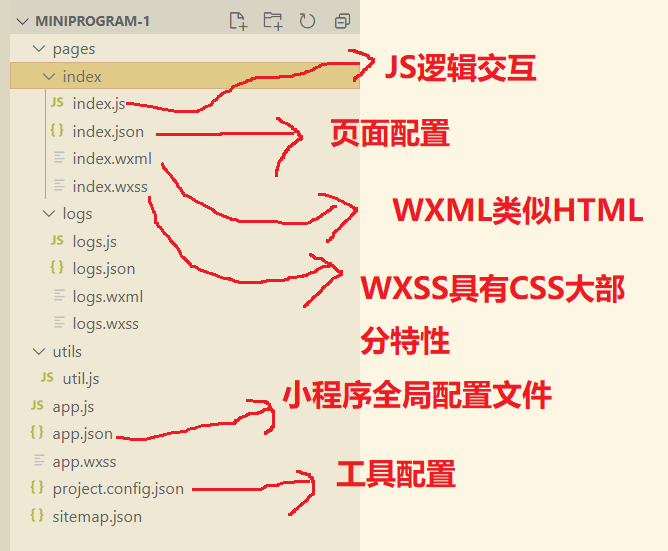

# 小程序代码结构



## 全局配置

`app.json` 文件用来对微信小程序进行全局配置，决定页面文件的路径、窗口表现、设置网络超时时间、设置多tab等。

### entryPagePath

指定小程序的默认启动路径。如果不填，将默认为pages列表的第一项。

```json
{
	"entryPagePath": "pages/index/index"
}
```

### pages

用于指定小程序由那些页面组成，每一项都对应一个页面的路径（含文件名）信息。<mark>文件名不需要写文件后缀</mark>，框架会自动去寻找对应位置的 `.json`,`.js`,`.wxml`,`.wxss`四个文件进行处理。

未指定 `entryPagePath`时，数组的第一项代表小程序的初始页面（首页）。

```json
{
    "pages": ["pages/index/index", "pages/logs/logs"]
}
```

### window

用于设置小程序的状态栏、导航条、标题、窗口背景色。

| 属性                         | 类型     | 描述                                         |
| ---------------------------- | -------- | -------------------------------------------- |
| navigationBarBackgroundColor | HexColor | 导航栏背景色                                 |
| navigationBarTextStyle       | String   | 导航栏标题颜色，仅支持 black / white         |
| navigationBarTitleText       | string   | 导航栏标题文字内容                           |
| navigationStyle              | string   | 导航栏样式                                   |
| backgroundColor              | HexColor | 窗口背景色                                   |
| backgroundTextStyle          | string   | 下拉loading的样式（ dark / light ）          |
| backgroundColorTop           | string   | 顶部窗口的背景色                             |
| backgroundColorBottom        | string   | 底部窗口的背景色                             |
| enablePullDownRefresh        | boolean  | 是否开启全局的下拉刷新                       |
| onReachBottomDistance        | number   | 页面上拉触底时间触发时距底部距离             |
| pageOrientation              | string   | 屏幕旋转设置，支持auto / portrait /landscape |

```json
{
  "pages":[
    "pages/index/index",
    "pages/logs/logs"
  ],
  "window":{
    "backgroundTextStyle":"light",
    "navigationBarBackgroundColor": "#fff",
    "navigationBarTitleText": "WeChat",
    "navigationBarTextStyle":"black"
  },
  "style": "v2",
  "sitemapLocation": "sitemap.json"
}

```

### tabBar

如果小程序是一个多tab应用（客户端窗口的底部或顶部有tab栏可以切换页面），可以通过`tabBar`配置项指定tab栏的表现以及tab切换时显示的对应页面。

| 属性            | 类型     | 描述                  |
| --------------- | -------- | --------------------- |
| color           | HexColor | tab上文字默认颜色     |
| selectedColor   | HexColor | tab上文字选中时的颜色 |
| backgroundColor | HexColor | tab的背景色           |
| borderStyle     | string   | tabbar上边框的颜色    |
| list            | Array    | tab的列表             |
| position        | stringn  | tabBar的位置          |
| custom          | boolean  | 自定义tabBar          |

### networkTimeout

各类网络请求的超时时间，单位均为毫秒。

| 属性          | 类型   | 说明                        |
| ------------- | ------ | --------------------------- |
| request       | number | wx.request 的超时时间       |
| connectSocket | number | wx.connectSocket 的超时时间 |
| uploadFile    | number | wx.upload的超时时间         |
| downloadFile  | number | wx.downloadFile的超时时间   |

### debug

可以在开发者工具中开发debug模式，在开发者工具的控制台面板，调试信息以info的形式给出，其信息有page的注册，页面路由，数据更新，事件触发等。

### functionalPages

插件所有者小程序需要设置这一项来启用

### subpackages

启用分包加载时，声明项目分包结构

### workers

使用Worker 处理多线程任务时，设置 worker 代码放置的目录

### requiredBackgroundModes

申明需要后台运行的能力，类型为数组。目前支持一下项目

* audio: 后台音乐播放
* location：后台定位

```json
{
	"pages": ["pages/index/index"],
	"requiredBackgroundModes": ["audio","location"]
}
```

### plugins

声明小程序需要使用的插件

### preloadRule

声明分包预下载的规则

### resizable

在iPad上运行的小程序可以设置支持屏幕旋转。

在PC上运行的小程序，用户可以按照任意比例拖动窗口大小，也可以在小程序菜单中最大化窗口。

### usingComponents

在此处声明的自定义组件视为全局自定义组件，在小程序内的页面或自定义组件中可以直接使用而不需再声明。

### permission

小程序接口权限相关设置。字段类型为Object

| 属性               | 类型             | 描述             |
| ------------------ | ---------------- | ---------------- |
| scope.userLocation | PermissionObject | 位置相关权限声明 |

### PermissionObject 结构

| 属性 | 类型   | 说明                                 |
| ---- | ------ | ------------------------------------ |
| desc | string | 小程序获取权限时展示的接口用途说明。 |

```json
{
    "pages": ["pages/index/index"],
    "permission": {
        "scope.userLocation": {
            "desc": "你的位置信息将用于小程序位置接口的效果展示"
        }
    }
}
```

## 页面配置

每一个小程序页面也可以使用同名 `.json`文件来对本页面的窗口表现进行配置。页面中配置项在当前页面会覆盖 `app.json`的window中相同的配置项。

## sitemap 配置

小程序根目录下的 `sitemap.json`文件用来配置小程序以及其页面是否允许被微信索引。

当开发者允许微信索引时，微信会通过爬虫的形式，为小程序的页面内容建立索引。

例1：

```json
{
    "rules": [{
        "action": "disallow",
        "page": "*"
    }]
}
```

所有页面都会被微信索引

例2：

```
{
	"rules":[{
		"action": "disallow",
		"page": "path/to/page"
	}]
}
```

配置 path/to/page页面不被索引，其余页面允许被索引。


# 小程序的一些概念

## 宿主环境
微信客户端给小程序所提供的环境。小程序借助宿主环境提供的能力，可以完成许多普通网页无法完成的功能。

## 渲染层和逻辑层

小程序的运行环境分成渲染层和逻辑层，其中<mark style="background-color: #00ff90">WXML模板和WXSS样式工作在渲染层</mark>, <mark>JS脚本工作在逻辑层</mark>。

小程序的渲染层和逻辑层分别由2个线程管理：渲染层的界面使用了WebView进行渲染；逻辑层采用JsCore线程运行JS脚本。一个小程序存在多个界面，所以渲染层存在多个WebView线程，这两个线程的通信会经由微信客户端（Native）做中转，逻辑层发送网络请求也经由Native转发


## 程序与页面

微信客户端在打开小程序之前，会把整个小程序的代码包下载到本地。

紧接着通过app.json 的pages字段就可以知道你当前的所有页面路径。

```json
{
  "pages":[
    "pages/index/index",
    "pages/logs/logs"
  ]
}
```

这个配置说明在QuickStart项目定义了两个页面，分别位于`pages/index/index` 和 `pages/logs/logs`。
而写在`pages`字段的第一个页面就是这小程序的首页（打开小程序看到的第一个页面）。

于是微信客户端就把首页的代码装载进来，通过小程序底层的一些机制，就可以渲染出这个首页。

小程序启动之后，在app.js定义的App实例的 onLaunch 回调会被执行：

```javascript
App({
  onLaunch() {
    console.log("launch");
  }
})
```

在`pages/logs/logs/`下包含4种文件，微信客户端会先根据 `logs.json`配置生成一个界面，顶部的颜色和文字你都可以在这个json文件里面定义好。紧接着客户端就会装载这个页面的 WXML 结构 和 WXSS 样式。 最后客户端会装载logs.js,你可以看到 logs.js的大体内容就是

```
Page({
  data: { // 参与页面渲染的数据
    logs: []
  },
  onLoad() {
    // 页面渲染后 执行
  }
})
```

Page 是一个页面构造器，这个构造器就生成了一个页面。小程序框架会把data数据和 index.wxml一起渲染出最终的结构，于是就得到了你看到的小程序的样子。

在渲染完页面之后，页面实例就会收到一个 onLoad 的回调，你可以在这个回调处理你的逻辑。

## 组件

在小程序里边，你只需要在WXML写上对应的组件标签名字就可以把该组件显示在界面上，例如，你需要在界面上显示地图，你需要这样写即可：

```html
<map></map>
```

使用组件的时候，还可以通过属性传递值给组件，让组件可以不同的状态去展现，例如，我们希望地图一开始的中心的经纬度是广州，那么你需要声明地图的 longitude （中心经度）和 latitude （中心纬度）两个属性：

```html
<map longitude="广州经度" latitude="广州纬度" ></map>
```

组件的内部行为也会通过事件的形式让开发者可以感知，例如用户点击了地图上的某个标记，你可以在 js 编写 marketap 函数来处理：

```html
<map bindmarkertap="markertap" longitude="广州经度" latitude="广州纬度"></map>
```

当然你也可以通过 style 或者 class 来控制组件的外层样式，以便适应你的界面宽度高度等等。

## API

为了让开发者可以很方便的调起微信提供的能力，例如获取用户信息、微信支付等等，小程序提供了很多API给开发者去使用。要获取用户的地理位置时，只需要：

```javascript
wx.getLocation({
	type: 'wgs84',
    success: (res) => {
        var latitude = res.latitude //纬度
        var longitude = res.longitude //经度
    }
})
```

调用微信扫一扫能力，只需要：

```javascript
wx.scanCode({
    success: (res) => {
        var latitude = res.latitude
        var longitude = res.longitude
    }
})
```

**需要注意的是：多数API的回调都是异步，你需要处理好代码逻辑的异步问题。**

## 

# 小程序框架

整个小程序框架系统分为两部分：<strong>逻辑层（App Service）和视图层（View）。小程序提供了自己的视图层描述语言 WXML 和 WXSS， 以及基于 JavaScript 的逻辑层框架，并在视图层与逻辑层间提供了数据传输和事件系统，让开发者能够专注于数据与逻辑。</strong>

**响应的数据绑定**

框架的核心是一个响应的数据绑定系统，可以让数据与视图非常简单地保持同步。当做数据修改的时候，只需要在逻辑层修改数据，视图层就会做相应的更新。

index.js

```javascript
// index.js
// 获取应用实例
const app = getApp()

var name = 'ricky';

Page({
  data: name,
  changeName: function(e){
    this.setData({
      name: 'MINA'
    })
  }
})
```

index.wxml

```html
<text>hello {{name}}</text>
<button bindtap="changeName">Click me!</button>
```


## 场景值

场景值用来描述用户进入小程序的路径。 

获取场景值

开发者可以通过下列方式获取场景值：

* 对于小程序，可以在App的onLaunch 和 onShow ， 或者 wx。getLaunchOptionsSync 中获取上述场景值。
* 对于小游戏，可以在 `wx.getLaunchOptionsSync`和`wx.onShow`中获取上述场景值。

| 场景值 | 场景                          |
| ------ | ----------------------------- |
| 1020   | 公众号profile页相关小程序列表 |
| 1035   | 公众号自定义菜单              |
| 1036   | App分享消息卡片               |
| 1037   | 小程序打开小程序              |
| 1038   | 从另一个小程序返回            |
| 1043   | 公众号模板消息                |

## 逻辑层

### 注册小程序

每个小程序都需要在 `app.js`中调用App方法注册小程序实例，绑定生命周期回调函数、错误监听和页面不存在监听函数等。

```javascript
// app.js
App({
    onLaunch(options){
        // Do something initial when launch.
    },
    onShow(options){
        // Do something when show.
    },
    onHide(){
        // Do something when hide.
    },
    onError(msg){
        console.log(msg)
    },
    globalData: 'I am global data'
})
```

整个小程序只要一个App实例，是全部页面共享的。<mark>开发者可以通过 `getApp` 方法获取到全局唯一的App 实例, 获取App上的数据或调用开发者注册在App上的函数</mark>。

```javascript
// xxx.js
const appInstance = getApp()
console.log(appInstance.globalData) // I am global data
```

### 注册页面

对于小程序中的每个页面，都需要在页面对应的`js`文件中进行注册，指定页面的初始数据、生命周期回调、事件处理函数等。

#### 使用Page构造器注册页面

简单的页面可以使用 `Page()`进行构造。

代码示例：

```javascript
//index.js
Page({
  data: {
    text: "This is page data."
  },
  onLoad: function(options) {
    // 页面创建时执行
  },
  onShow: function() {
    // 页面出现在前台时执行
  },
  onReady: function() {
    // 页面首次渲染完毕时执行
  },
  onHide: function() {
    // 页面从前台变为后台时执行
  },
  onUnload: function() {
    // 页面销毁时执行
  },
  onPullDownRefresh: function() {
    // 触发下拉刷新时执行
  },
  onReachBottom: function() {
    // 页面触底时执行
  },
  onShareAppMessage: function () {
    // 页面被用户分享时执行
  },
  onPageScroll: function() {
    // 页面滚动时执行
  },
  onResize: function() {
    // 页面尺寸变化时执行
  },
  onTabItemTap(item) {
    // tab 点击时执行
    console.log(item.index)
    console.log(item.pagePath)
    console.log(item.text)
  },
  // 事件响应函数
  viewTap: function() {
    this.setData({
      text: 'Set some data for updating view.'
    }, function() {
      // this is setData callback
    })
  },
  // 自由数据
  customData: {
    hi: 'MINA'
  }
})
```

#### 在页面中使用 behaviors

页面可以引用 behaviors 。 behaviors 可以用来让多个页面有相同的数据字段和方法。

```javascript
// my-behavior.js
module.exports = Behavior({
  data: {
    sharedText: 'This is a piece of data shared between pages.'
  },
  methods: {
    sharedMethod: function() {
      this.data.sharedText === 'This is a piece of data shared between pages.'
    }
  }
})
```

#### 使用 Component 构造器构造页面

`Page` 构造器适用于简单的页面。但对于复杂的页面， `Page` 构造器可能并不好用。

此时，可以使用 `Component` 构造器来构造页面。 `Component` 构造器的主要区别是：方法需要放在 `methods: { }` 里面。

```javascript
Component({
  data: {
    text: "This is page data."
  },
  methods: {
    onLoad: function(options) {
      // 页面创建时执行
    },
    onPullDownRefresh: function() {
      // 下拉刷新时执行
    },
    // 事件响应函数
    viewTap: function() {
      // ...
    }
  }
})
```

### 页面生命周期


### 页面路由

在小程序中所有页面的路由全部由框架进行管理。

#### 页面栈

框架以栈的形式维护了当前的所有页面。 当发生路由切换的时候，页面栈的表现如下：

| 路由方式   | 页面栈表现                        |
| :--------- | :-------------------------------- |
| 初始化     | 新页面入栈                        |
| 打开新页面 | 新页面入栈                        |
| 页面重定向 | 当前页面出栈，新页面入栈          |
| 页面返回   | 页面不断出栈，直到目标返回页      |
| Tab 切换   | 页面全部出栈，只留下新的 Tab 页面 |
| 重加载     | 页面全部出栈，只留下新的页面      |

开发者可以使用 `getCurrentPages()` 函数获取当前页面栈。

#### 路由方式

对于路由的触发方式以及页面生命周期函数如下：

| 路由方式   | 触发时机                                                     | 路由前页面 | 路由后页面         |
| :--------- | :----------------------------------------------------------- | :--------- | :----------------- |
| 初始化     | 小程序打开的第一个页面                                       |            | onLoad, onShow     |
| 打开新页面 | 调用 API [wx.navigateTo](https://developers.weixin.qq.com/miniprogram/dev/api/route/wx.navigateTo.html) 使用组件 [`<navigator open-type="navigateTo"/>`](https://developers.weixin.qq.com/miniprogram/dev/component/navigator.html) | onHide     | onLoad, onShow     |
| 页面重定向 | 调用 API [wx.redirectTo](https://developers.weixin.qq.com/miniprogram/dev/api/route/wx.redirectTo.html) 使用组件 [`<navigator open-type="redirectTo"/>`](https://developers.weixin.qq.com/miniprogram/dev/component/navigator.html) | onUnload   | onLoad, onShow     |
| 页面返回   | 调用 API [wx.navigateBack](https://developers.weixin.qq.com/miniprogram/dev/api/route/wx.navigateBack.html) 使用组件[`<navigator open-type="navigateBack">`](https://developers.weixin.qq.com/miniprogram/dev/component/navigator.html) 用户按左上角返回按钮 | onUnload   | onShow             |
| Tab 切换   | 调用 API [wx.switchTab](https://developers.weixin.qq.com/miniprogram/dev/api/route/wx.switchTab.html) 使用组件 [`<navigator open-type="switchTab"/>`](https://developers.weixin.qq.com/miniprogram/dev/component/navigator.html) 用户切换 Tab |            | 各种情况请参考下表 |
| 重启动     | 调用 API [wx.reLaunch](https://developers.weixin.qq.com/miniprogram/dev/api/route/wx.reLaunch.html) 使用组件 [`<navigator open-type="reLaunch"/>`](https://developers.weixin.qq.com/miniprogram/dev/component/navigator.html) | onUnload   | onLoad, onShow     |

Tab 切换对应的生命周期（以 A、B 页面为 Tabbar 页面，C 是从 A 页面打开的页面，D 页面是从 C 页面打开的页面为例）：

| 当前页面        | 路由后页面    | 触发的生命周期（按顺序）                           |
| :-------------- | :------------ | :------------------------------------------------- |
| A               | A             | Nothing happend                                    |
| A               | B             | A.onHide(), B.onLoad(), B.onShow()                 |
| A               | B（再次打开） | A.onHide(), B.onShow()                             |
| C               | A             | C.onUnload(), A.onShow()                           |
| C               | B             | C.onUnload(), B.onLoad(), B.onShow()               |
| D               | B             | D.onUnload(), C.onUnload(), B.onLoad(), B.onShow() |
| D（从转发进入） | A             | D.onUnload(), A.onLoad(), A.onShow()               |
| D（从转发进入） | B             | D.onUnload(), B.onLoad(), B.onShow()               |

### 模块化

可以将一些公共的代码抽离成为一个单独的 js 文件，作为一个模块。模块只有通过 [`module.exports`](https://developers.weixin.qq.com/miniprogram/dev/reference/api/module.html) 或者 `exports` 才能对外暴露接口。

注意：

- `exports` 是 [`module.exports`](https://developers.weixin.qq.com/miniprogram/dev/reference/api/module.html) 的一个引用，因此在模块里边随意更改 `exports` 的指向会造成未知的错误。所以更推荐开发者采用 `module.exports` 来暴露模块接口，除非你已经清晰知道这两者的关系。
- 小程序目前不支持直接引入 `node_modules` , 开发者需要使用到 `node_modules` 时候建议拷贝出相关的代码到小程序的目录中，或者使用小程序支持的 [npm](https://developers.weixin.qq.com/miniprogram/dev/devtools/npm.html) 功能。

```javascript
// common.js
function sayHello(name) {
  console.log(`Hello ${name} !`)
}
function sayGoodbye(name) {
  console.log(`Goodbye ${name} !`)
}

module.exports.sayHello = sayHello
exports.sayGoodbye = sayGoodbye
```

在需要使用这些模块的文件中，使用 `require` 将公共代码引入

```javascript
var common = require('common.js')
Page({
  helloMINA: function() {
    common.sayHello('MINA')
  },
  goodbyeMINA: function() {
    common.sayGoodbye('MINA')
  }
})
```

#### 文件作用域

在 JavaScript 文件中声明的变量和函数只在该文件中有效；不同的文件中可以声明相同名字的变量和函数，不会互相影响。

通过全局函数 `getApp` 可以获取全局的应用实例，如果需要全局的数据可以在 `App()` 中设置，如：

```javascript
// app.js
App({
  globalData: 1
})
// a.js
// The localValue can only be used in file a.js.
var localValue = 'a'
// Get the app instance.
var app = getApp()
// Get the global data and change it.
app.globalData++
// b.js
// You can redefine localValue in file b.js, without interference with the localValue in a.js.
var localValue = 'b'
// If a.js it run before b.js, now the globalData shoule be 2.
console.log(getApp().globalData)
```

### API

小程序开发框架提供丰富的微信原生 API，可以方便的调起微信提供的能力，如获取用户信息，本地存储，支付功能等。详细介绍请参考 [API 文档](https://developers.weixin.qq.com/miniprogram/dev/api/index.html)。

通常，在小程序 API 有以下几种类型：

#### 事件监听 API

我们约定，以 `on` 开头的 API 用来监听某个事件是否触发，如：[wx.onSocketOpen](https://developers.weixin.qq.com/miniprogram/dev/api/network/websocket/wx.onSocketOpen.html)，[wx.onCompassChange](https://developers.weixin.qq.com/miniprogram/dev/api/device/compass/wx.onCompassChange.html) 等。

这类 API 接受一个回调函数作为参数，当事件触发时会调用这个回调函数，并将相关数据以参数形式传入。

```javascript
wx.onCompassChange(function (res) {
  console.log(res.direction)
})
```

#### 同步 API

我们约定，以 `Sync` 结尾的 API 都是同步 API， 如 [wx.setStorageSync](https://developers.weixin.qq.com/miniprogram/dev/api/storage/wx.setStorageSync.html)，[wx.getSystemInfoSync](https://developers.weixin.qq.com/miniprogram/dev/api/base/system/system-info/wx.getSystemInfoSync.html) 等。此外，也有一些其他的同步 API，如 [wx.createWorker](https://developers.weixin.qq.com/miniprogram/dev/api/worker/wx.createWorker.html)，[wx.getBackgroundAudioManager](https://developers.weixin.qq.com/miniprogram/dev/api/media/background-audio/wx.getBackgroundAudioManager.html) 等，详情参见 API 文档中的说明。

同步 API 的执行结果可以通过函数返回值直接获取，如果执行出错会抛出异常。

**代码示例**

```
try {
  wx.setStorageSync('key', 'value')
} catch (e) {
  console.error(e)
}
```

#### 异步 API

大多数 API 都是异步 API，如 [wx.request](https://developers.weixin.qq.com/miniprogram/dev/api/network/request/wx.request.html)，[wx.login](https://developers.weixin.qq.com/miniprogram/dev/api/open-api/login/wx.login.html) 等。这类 API 接口通常都接受一个 `Object` 类型的参数，这个参数都支持按需指定以下字段来接收接口调用结果：

**Object 参数说明**

| 参数名   | 类型     | 必填 | 说明                                             |
| :------- | :------- | :--- | :----------------------------------------------- |
| success  | function | 否   | 接口调用成功的回调函数                           |
| fail     | function | 否   | 接口调用失败的回调函数                           |
| complete | function | 否   | 接口调用结束的回调函数（调用成功、失败都会执行） |
| 其他     | Any      | -    | 接口定义的其他参数                               |

**回调函数的参数**

`success`，`fail`，`complete` 函数调用时会传入一个 `Object` 类型参数，包含以下字段：

| 属性    | 类型   | 说明                                                         |
| :------ | :----- | :----------------------------------------------------------- |
| errMsg  | string | 错误信息，如果调用成功返回 `${apiName}:ok`                   |
| errCode | number | 错误码，仅部分 API 支持，具体含义请参考对应 API 文档，成功时为 `0`。 |
| 其他    | Any    | 接口返回的其他数据                                           |

异步 API 的执行结果需要通过 `Object` 类型的参数中传入的对应回调函数获取。部分异步 API 也会有返回值，可以用来实现更丰富的功能，如 [wx.request](https://developers.weixin.qq.com/miniprogram/dev/api/network/request/wx.request.html)，[wx.connectSocket](https://developers.weixin.qq.com/miniprogram/dev/api/network/websocket/wx.connectSocket.html) 等。

```javascript
wx.login({
  success(res) {
    console.log(res.code)
  }
})
```

#### 异步 API 返回 Promise

基础库 [2.10.2](https://developers.weixin.qq.com/miniprogram/dev/framework/compatibility.html) 版本起，异步 API 支持 callback & promise 两种调用方式。当接口参数 Object 对象中不包含 success/fail/complete 时将默认返回 promise，否则仍按回调方式执行，无返回值。

#### 注意事项

1. 部分接口如 `downloadFile`, `request`, `uploadFile`, `connectSocket`, `createCamera`（小游戏）本身就有返回值， 它们的 promisify 需要开发者自行封装。
2. 当没有回调参数时，异步接口返回 promise。此时若函数调用失败进入 fail 逻辑， 会报错提示 `Uncaught (in promise)`，开发者可通过 catch 来进行捕获。
3. [wx.onUnhandledRejection](https://developers.weixin.qq.com/miniprogram/dev/api/base/app/app-event/wx.onUnhandledRejection.html) 可以监听未处理的 Promise 拒绝事件。

```javascript
// callback 形式调用
wx.chooseImage({
  success(res) {
    console.log('res:', res)
  }
})

// promise 形式调用
wx.chooseImage().then(res => console.log('res: ', res))
```

#### 云开发 API

开通并使用[小程序云开发](https://developers.weixin.qq.com/miniprogram/dev/wxcloud/basis/getting-started.html)，即可使用云开发API，在小程序端直接调用服务端的[云函数](https://developers.weixin.qq.com/miniprogram/dev/wxcloud/guide/functions.html#云函数)。

```javascript
wx.cloud.callFunction({
  // 云函数名称
  name: 'cloudFunc',
  // 传给云函数的参数
  data: {
    a: 1,
    b: 2,
  },
  success: function(res) {
    console.log(res.result) // 示例
  },
  fail: console.error
})

// 此外，云函数同样支持promise形式调用
```

## 视图层 View

框架的视图层由 WXML 与 WXSS 编写，由组件来进行展示。

将逻辑层的数据反映成视图，同时将视图层的事件发送给逻辑层。

WXML(WeiXin Markup language) 用于描述页面的结构。

WXS(WeiXin Script) 是小程序的一套脚本语言，结合 `WXML`，可以构建出页面的结构。

WXSS(WeiXin Style Sheet) 用于描述页面的样式。

组件(Component)是视图的基本组成单元。

### WXML

WXML（WeiXin Markup Language）是框架设计的一套标签语言，结合[基础组件](https://developers.weixin.qq.com/miniprogram/dev/component/)、[事件系统](https://developers.weixin.qq.com/miniprogram/dev/framework/view/wxml/event.html)，可以构建出页面的结构。

要完整了解 WXML 语法，请参考[WXML 语法参考](https://developers.weixin.qq.com/miniprogram/dev/reference/wxml/)。

用以下一些简单的例子来看看 WXML 具有什么能力：

#### 数据绑定

```
<!--wxml-->
<view> {{message}} </view>
// page.js
Page({
  data: {
    message: 'Hello MINA!'
  }
})
```

#### 列表渲染

```
<!--wxml-->
<view wx:for="{{array}}"> {{item}} </view>
// page.js
Page({
  data: {
    array: [1, 2, 3, 4, 5]
  }
})
```

#### 条件渲染

```html
<!--wxml-->
<view wx:if="{{view == 'WEBVIEW'}}"> WEBVIEW </view>
<view wx:elif="{{view == 'APP'}}"> APP </view>
<view wx:else="{{view == 'MINA'}}"> MINA </view>
// page.js
Page({
  data: {
    view: 'MINA'
  }
})
```

#### 模板

```html
<!--wxml-->
<template name="staffName">
  <view>
    FirstName: {{firstName}}, LastName: {{lastName}}
  </view>
</template>

<template is="staffName" data="{{...staffA}}"></template>
<template is="staffName" data="{{...staffB}}"></template>
<template is="staffName" data="{{...staffC}}"></template>
// page.js
Page({
  data: {
    staffA: {firstName: 'Hulk', lastName: 'Hu'},
    staffB: {firstName: 'Shang', lastName: 'You'},
    staffC: {firstName: 'Gideon', lastName: 'Lin'}
  }
})
```

### WXSS

WXSS (WeiXin Style Sheets)是一套样式语言，用于描述 WXML 的组件样式。

WXSS 用来决定 WXML 的组件应该怎么显示。

为了适应广大的前端开发者，WXSS 具有 CSS 大部分特性。同时为了更适合开发微信小程序，WXSS 对 CSS 进行了扩充以及修改。

与 CSS 相比，WXSS 扩展的特性有：

- 尺寸单位
- 样式导入

#### 尺寸单位

- rpx（responsive pixel）: 可以根据屏幕宽度进行自适应。规定屏幕宽为750rpx。如在 iPhone6 上，屏幕宽度为375px，共有750个物理像素，则750rpx = 375px = 750物理像素，1rpx = 0.5px = 1物理像素。

| 设备         | rpx换算px (屏幕宽度/750) | px换算rpx (750/屏幕宽度) |
| :----------- | :----------------------- | :----------------------- |
| iPhone5      | 1rpx = 0.42px            | 1px = 2.34rpx            |
| iPhone6      | 1rpx = 0.5px             | 1px = 2rpx               |
| iPhone6 Plus | 1rpx = 0.552px           | 1px = 1.81rpx            |

**建议：** 开发微信小程序时设计师可以用 iPhone6 作为视觉稿的标准。

**注意：** 在较小的屏幕上不可避免的会有一些毛刺，请在开发时尽量避免这种情况。

#### 样式导入

使用`@import`语句可以导入外联样式表，`@import`后跟需要导入的外联样式表的相对路径，用`;`表示语句结束。

**示例代码：**

```less
/** common.wxss **/
.small-p {
  padding:5px;
}
/** app.wxss **/
@import "common.wxss";
.middle-p {
  padding:15px;
}
```

#### 内联样式

框架组件上支持使用 style、class 属性来控制组件的样式。

- style：静态的样式统一写到 class 中。style 接收动态的样式，在运行时会进行解析，请尽量避免将静态的样式写进 style 中，以免影响渲染速度。

```html
<view style="color:{{color}};" />
```

- class：用于指定样式规则，其属性值是样式规则中类选择器名(样式类名)的集合，样式类名不需要带上`.`，样式类名之间用空格分隔。

```html
<view class="normal_view" />
```

#### 选择器

目前支持的选择器有：

| 选择器           | 样例             | 样例描述                                       |
| :--------------- | :--------------- | :--------------------------------------------- |
| .class           | `.intro`         | 选择所有拥有 class="intro" 的组件              |
| #id              | `#firstname`     | 选择拥有 id="firstname" 的组件                 |
| element          | `view`           | 选择所有 view 组件                             |
| element, element | `view, checkbox` | 选择所有文档的 view 组件和所有的 checkbox 组件 |
| ::after          | `view::after`    | 在 view 组件后边插入内容                       |
| ::before         | `view::before`   | 在 view 组件前边插入内容                       |

#### 全局样式与局部样式

定义在 app.wxss 中的样式为全局样式，作用于每一个页面。在 page 的 wxss 文件中定义的样式为局部样式，只作用在对应的页面，并会覆盖 app.wxss 中相同的选择器。

### WXS

WXS（WeiXin Script）是小程序的一套脚本语言，结合 `WXML`，可以构建出页面的结构。

**注意**

1. WXS 不依赖于运行时的基础库版本，可以在所有版本的小程序中运行。
2. WXS 与 JavaScript 是不同的语言，有自己的语法，并不和 JavaScript 一致。
3. WXS 的运行环境和其他 JavaScript 代码是隔离的，WXS 中不能调用其他 JavaScript 文件中定义的函数，也不能调用小程序提供的API。
4. WXS 函数不能作为组件的事件回调。
5. 由于运行环境的差异，在 iOS 设备上小程序内的 WXS 会比 JavaScript 代码快 2 ~ 20 倍。在 android 设备上二者运行效率无差异。

以下是一些使用 WXS 的简单示例，要完整了解 WXS 语法，请参考[WXS 语法参考](https://developers.weixin.qq.com/miniprogram/dev/reference/wxs/)。

#### 页面渲染

```
<!--wxml-->
<wxs module="m1">
var msg = "hello world";

module.exports.message = msg;
</wxs>

<view> {{m1.message}} </view>
```

#### 数据处理

```js
// page.js
Page({
  data: {
    array: [1, 2, 3, 4, 5, 1, 2, 3, 4]
  }
})
```

```html
<!--wxml-->
<!-- 下面的 getMax 函数，接受一个数组，且返回数组中最大的元素的值 -->
<wxs module="m1">
var getMax = function(array) {
  var max = undefined;
  for (var i = 0; i < array.length; ++i) {
    max = max === undefined ?
      array[i] :
      (max >= array[i] ? max : array[i]);
  }
  return max;
}

module.exports.getMax = getMax;
</wxs>

<!-- 调用 wxs 里面的 getMax 函数，参数为 page.js 里面的 array -->
<view> {{m1.getMax(array)}} </view>
```

### 事件

#### 什么是事件

- 事件是视图层到逻辑层的通讯方式。
- 事件可以将用户的行为反馈到逻辑层进行处理。
- 事件可以绑定在组件上，当达到触发事件，就会执行逻辑层中对应的事件处理函数。
- 事件对象可以携带额外信息，如 id, dataset, touches。

#### 事件的使用方式

- 在组件中绑定一个事件处理函数。

如`bindtap`，当用户点击该组件的时候会在该页面对应的Page中找到相应的事件处理函数。

```html
<view id="tapTest" data-hi="Weixin" bindtap="tapName"> Click me! </view>
```

- 在相应的Page定义中写上相应的事件处理函数，参数是event。

```js
Page({
  tapName: function(event) {
    console.log(event)
  }
})
```

- 可以看到log出来的信息大致如下：

```json
{
  "type":"tap",
  "timeStamp":895,
  "target": {
    "id": "tapTest",
    "dataset":  {
      "hi":"Weixin"
    }
  },
  "currentTarget":  {
    "id": "tapTest",
    "dataset": {
      "hi":"Weixin"
    }
  },
  "detail": {
    "x":53,
    "y":14
  },
  "touches":[{
    "identifier":0,
    "pageX":53,
    "pageY":14,
    "clientX":53,
    "clientY":14
  }],
  "changedTouches":[{
    "identifier":0,
    "pageX":53,
    "pageY":14,
    "clientX":53,
    "clientY":14
  }]
}
```

#### 使用WXS函数响应事件

从基础库版本`2.4.4`开始，支持使用WXS函数绑定事件，WXS函数接受2个参数，第一个是event，在原有的event的基础上加了`event.instance`对象，第二个参数是`ownerInstance`，和`event.instance`一样是一个`ComponentDescriptor`对象。具体使用如下：

- 在组件中绑定和注册事件处理的WXS函数。

```html
<wxs module="wxs" src="./test.wxs"></wxs>
<view id="tapTest" data-hi="Weixin" bindtap="{{wxs.tapName}}"> Click me! </view>
**注：绑定的WXS函数必须用{{}}括起来**
```

- test.wxs文件实现tapName函数

```text
function tapName(event, ownerInstance) {
  console.log('tap Weixin', JSON.stringify(event))
}
module.exports = {
  tapName: tapName
}
```

`ownerInstance`包含了一些方法，可以设置组件的样式和class，具体包含的方法以及为什么要用WXS函数响应事件，请[点击查看详情](https://developers.weixin.qq.com/miniprogram/dev/framework/view/interactive-animation.html)。

#### 事件详解

##### 事件分类

事件分为冒泡事件和非冒泡事件：

1. 冒泡事件：当一个组件上的事件被触发后，该事件会向父节点传递。
2. 非冒泡事件：当一个组件上的事件被触发后，该事件不会向父节点传递。

WXML的冒泡事件列表：

| 类型               | 触发条件                                                     | 最低版本                                                     |
| :----------------- | :----------------------------------------------------------- | :----------------------------------------------------------- |
| touchstart         | 手指触摸动作开始                                             |                                                              |
| touchmove          | 手指触摸后移动                                               |                                                              |
| touchcancel        | 手指触摸动作被打断，如来电提醒，弹窗                         |                                                              |
| touchend           | 手指触摸动作结束                                             |                                                              |
| tap                | 手指触摸后马上离开                                           |                                                              |
| longpress          | 手指触摸后，超过350ms再离开，如果指定了事件回调函数并触发了这个事件，tap事件将不被触发 | [1.5.0](https://developers.weixin.qq.com/miniprogram/dev/framework/compatibility.html) |
| longtap            | 手指触摸后，超过350ms再离开（推荐使用longpress事件代替）     |                                                              |
| transitionend      | 会在 WXSS transition 或 wx.createAnimation 动画结束后触发    |                                                              |
| animationstart     | 会在一个 WXSS animation 动画开始时触发                       |                                                              |
| animationiteration | 会在一个 WXSS animation 一次迭代结束时触发                   |                                                              |
| animationend       | 会在一个 WXSS animation 动画完成时触发                       |                                                              |
| touchforcechange   | 在支持 3D Touch 的 iPhone 设备，重按时会触发                 | 1.9.90                                                       |

##### 普通事件绑定

事件绑定的写法类似于组件的属性，如：

```html
<view bindtap="handleTap">
    Click here!
</view>
```

如果用户点击这个 view ，则页面的 `handleTap` 会被调用。

事件绑定函数可以是一个数据绑定，如：

```html
<view bindtap="{{ handlerName }}">
    Click here!
</view>
```

此时，页面的 `this.data.handlerName` 必须是一个字符串，指定事件处理函数名；如果它是个空字符串，则这个绑定会失效（可以利用这个特性来暂时禁用一些事件）。

自基础库版本 [1.5.0](https://developers.weixin.qq.com/miniprogram/dev/framework/compatibility.html) 起，在大多数组件和自定义组件中， `bind` 后可以紧跟一个冒号，其含义不变，如 `bind:tap` 。基础库版本 [2.8.1](https://developers.weixin.qq.com/miniprogram/dev/framework/compatibility.html) 起，在所有组件中开始提供这个支持。

##### 绑定并阻止事件冒泡

除 `bind` 外，也可以用 `catch` 来绑定事件。<mark>与 `bind` 不同， `catch` 会阻止事件向上冒泡</mark>。

例如在下边这个例子中，点击 inner view 会先后调用`handleTap3`和`handleTap2`(因为tap事件会冒泡到 middle view，而 middle view 阻止了 tap 事件冒泡，不再向父节点传递)，点击 middle view 会触发`handleTap2`，点击 outer view 会触发`handleTap1`。

```html
<view id="outer" bindtap="handleTap1">
  outer view
  <view id="middle" catchtap="handleTap2">
    middle view
    <view id="inner" bindtap="handleTap3">
      inner view
    </view>
  </view>
</view>
```

##### 互斥事件绑定

自基础库版本 [2.8.2](https://developers.weixin.qq.com/miniprogram/dev/framework/compatibility.html) 起，除 `bind` 和 `catch` 外，<mark>还可以使用 `mut-bind` 来绑定事件</mark>。一个 `mut-bind` 触发后，如果事件冒泡到其他节点上，其他节点上的 `mut-bind` 绑定函数不会被触发，但 `bind` 绑定函数和 `catch` 绑定函数依旧会被触发。

换而言之，所有 `mut-bind` 是“互斥”的，只会有其中一个绑定函数被触发。同时，它完全不影响 `bind` 和 `catch` 的绑定效果。

例如在下边这个例子中，点击 inner view 会先后调用 `handleTap3` 和 `handleTap2` ，点击 middle view 会调用 `handleTap2` 和 `handleTap1` 。

```html
<view id="outer" mut-bind:tap="handleTap1">
  outer view
  <view id="middle" bindtap="handleTap2">
    middle view
    <view id="inner" mut-bind:tap="handleTap3">
      inner view
    </view>
  </view>
</view>
```

##### 事件的捕获阶段

自基础库版本 [1.5.0](https://developers.weixin.qq.com/miniprogram/dev/framework/compatibility.html) 起，触摸类事件支持捕获阶段。<mark>捕获阶段位于冒泡阶段之前，且在捕获阶段中，事件到达节点的顺序与冒泡阶段恰好相反</mark>。需要在捕获阶段监听事件时，可以采用`capture-bind`、`capture-catch`关键字，后者将中断捕获阶段和取消冒泡阶段。

在下面的代码中，点击 inner view 会先后调用`handleTap2`、`handleTap4`、`handleTap3`、`handleTap1`。

```html
<view id="outer" bind:touchstart="handleTap1" capture-bind:touchstart="handleTap2">
  outer view
  <view id="inner" bind:touchstart="handleTap3" capture-bind:touchstart="handleTap4">
    inner view
  </view>
</view>
```

如果将上面代码中的第一个`capture-bind`改为`capture-catch`，将只触发`handleTap2`。

```html
<view id="outer" bind:touchstart="handleTap1" capture-catch:touchstart="handleTap2">
  outer view
  <view id="inner" bind:touchstart="handleTap3" capture-bind:touchstart="handleTap4">
    inner view
  </view>
</view>
```

#### WXS响应事件

**背景**

有频繁用户交互的效果在小程序上表现是比较卡顿的，例如页面有 2 个元素 A 和 B，用户在 A 上做 touchmove 手势，要求 B 也跟随移动，[movable-view](https://developers.weixin.qq.com/miniprogram/dev/component/movable-view.html) 就是一个典型的例子。一次 touchmove 事件的响应过程为：

a、touchmove 事件从视图层（Webview）抛到逻辑层（App Service）

b、逻辑层（App Service）处理 touchmove 事件，再通过 setData 来改变 B 的位置

一次 touchmove 的响应需要经过 2 次的逻辑层和渲染层的通信以及一次渲染，通信的耗时比较大。此外 setData 渲染也会阻塞其它脚本执行，导致了整个用户交互的动画过程会有延迟。

**实现方案**

本方案基本的思路是减少通信的次数，让事件在视图层（Webview）响应。小程序的框架分为视图层（Webview）和逻辑层（App Service），这样分层的目的是管控，开发者的代码只能运行在逻辑层（App Service），而这个思路就必须要让开发者的代码运行在视图层（Webview），如下图所示的流程：


使用 [WXS](https://developers.weixin.qq.com/miniprogram/dev/framework/view/wxs/) 函数用来响应小程序事件，目前只能响应内置组件的事件，不支持自定义组件事件。WXS 函数的除了纯逻辑的运算，还可以通过封装好的`ComponentDescriptor` 实例来访问以及设置组件的 class 和样式，对于交互动画，设置 style 和 class 足够了。WXS 函数的例子如下：

```javascript
var wxsFunction = function(event, ownerInstance) {
    var instance = ownerInstance.selectComponent('.classSelector') // 返回组件的实例
    instance.setStyle({
        "font-size": "14px" // 支持rpx
    })
    instance.getDataset()
    instance.setClass(className)
    // ...
    return false // 不往上冒泡，相当于调用了同时调用了stopPropagation和preventDefault
}
```

其中入参 `event` 是小程序[事件对象](https://developers.weixin.qq.com/miniprogram/dev/framework/view/wxml/event.html)基础上多了 `event.instance` 来表示触发事件的组件的 `ComponentDescriptor` 实例。`ownerInstance` 表示的是触发事件的组件所在的组件的 `ComponentDescriptor` 实例，如果触发事件的组件是在页面内的，`ownerInstance` 表示的是页面实例。

`ComponentDescriptor`的定义如下：略

#### 使用方法

- WXML定义事件：

```html
<wxs module="test" src="./test.wxs"></wxs>
<view change:prop="{{test.propObserver}}" prop="{{propValue}}" bindtouchmove="{{test.touchmove}}" class="movable"></view>
```

上面的`change:prop`（属性前面带change:前缀）是在 prop 属性被设置的时候触发 WXS 函数，值必须用`{{}}`括起来。类似 Component 定义的 properties 里面的 observer 属性，在`setData({propValue: newValue})`调用之后会触发。

**注意**：WXS函数必须用`{{}}`括起来。当 prop 的值被设置 WXS 函数就会触发，而不只是值发生改变，所以在页面初始化的时候会调用一次`WxsPropObserver`的函数。

- WXS文件`test.wxs`里面定义并导出事件处理函数和属性改变触发的函数：

```text
module.exports = {
    touchmove: function(event, instance) {
        console.log('log event', JSON.stringify(event))
    },
    propObserver: function(newValue, oldValue, ownerInstance, instance) {
        console.log('prop observer', newValue, oldValue)
    }
}
```

### 简易双向绑定

#### 双向绑定语法

在 WXML 中，普通的属性的绑定是单向的。例如

```html
<input value="{{value}}" />
```

如果使用 `this.setData({ value: 'leaf' })` 来更新 `value` ，`this.data.value` 和输入框的中显示的值都会被更新为 `leaf` ；但如果用户修改了输入框里的值，却不会同时改变 `this.data.value` 。

如果需要在用户输入的同时改变 `this.data.value` ，需要<mark>借助简易双向绑定机制。此时，可以在对应项目之前加入 `model:` 前缀</mark>：

```html
<input model:value="{{value}}" />
```

这样，如果输入框的值被改变了， `this.data.value` 也会同时改变。同时， WXML 中所有绑定了 `value` 的位置也会被一同更新， [数据监听器](https://developers.weixin.qq.com/miniprogram/dev/framework/custom-component/observer.html) 也会被正常触发。

用于双向绑定的表达式有如下限制：

1. 只能是一个单一字段的绑定，如

```js
<input model:value="值为 {{value}}" />
<input model:value="{{ a + b }}" />
```

都是非法的；

1. 目前，尚不能 data 路径，如

```js
<input model:value="{{ a.b }}" />
```

这样的表达式目前暂不支持。

#### 在自定义组件中传递双向绑定

双向绑定同样可以使用在自定义组件上。如下的自定义组件：

```js
// custom-component.js
Component({
  properties: {
    myValue: String
  }
})
<!-- custom-component.wxml -->
<input model:value="{{myValue}}" />
```

这个自定义组件将自身的 `myValue` 属性双向绑定到了组件内输入框的 `value` 属性上。这样，如果页面这样使用这个组件：

```html
<custom-component model:my-value="{{pageValue}}" />
```

当输入框的值变更时，自定义组件的 `myValue` 属性会同时变更，这样，页面的 `this.data.pageValue` 也会同时变更，页面 WXML 中所有绑定了 `pageValue` 的位置也会被一同更新。

#### 在自定义组件中触发双向绑定更新

自定义组件还可以自己触发双向绑定更新，做法就是：使用 setData 设置自身的属性。例如：

```javascript
// custom-component.js
Component({
  properties: {
    myValue: String
  },
  methods: {
    update: function() {
      // 更新 myValue
      this.setData({
        myValue: 'leaf'
      })
    }
  }
})
```

如果页面这样使用这个组件：

```html
<custom-component model:my-value="{{pageValue}}" />
```

当组件使用 `setData` 更新 `myValue` 时，页面的 `this.data.pageValue` 也会同时变更，页面 WXML 中所有绑定了 `pageValue` 的位置也会被一同更新。

### 基础组件

框架为开发者提供了一系列基础组件，开发者可以通过组合这些基础组件进行快速开发。详细介绍请参考[组件文档](https://developers.weixin.qq.com/miniprogram/dev/component/)。

什么是组件：

- 组件是视图层的基本组成单元。
- 组件自带一些功能与微信风格一致的样式。
- 一个组件通常包括 `开始标签` 和 `结束标签`，`属性` 用来修饰这个组件，`内容` 在两个标签之内。

```html
<tagname property="value">
Content goes here ...
</tagname>
```

#### 属性类型

| 类型         | 描述           | 注解                                                         |
| :----------- | :------------- | :----------------------------------------------------------- |
| Boolean      | 布尔值         | 组件写上该属性，不管是什么值都被当作 `true`；只有组件上没有该属性时，属性值才为`false`。 如果属性值为变量，变量的值会被转换为Boolean类型 |
| Number       | 数字           | `1`, `2.5`                                                   |
| String       | 字符串         | `"string"`                                                   |
| Array        | 数组           | `[ 1, "string" ]`                                            |
| Object       | 对象           | `{ key: value }`                                             |
| EventHandler | 事件处理函数名 | `"handlerName"` 是 [Page](https://developers.weixin.qq.com/miniprogram/dev/framework/app-service/page.html) 中定义的事件处理函数名 |
| Any          | 任意属性       |                                                              |

#### 公共属性

所有组件都有以下属性：

| 属性名         | 类型         | 描述           | 注解                                                         |
| :------------- | :----------- | :------------- | :----------------------------------------------------------- |
| id             | String       | 组件的唯一标示 | 保持整个页面唯一                                             |
| class          | String       | 组件的样式类   | 在对应的 WXSS 中定义的样式类                                 |
| style          | String       | 组件的内联样式 | 可以动态设置的内联样式                                       |
| hidden         | Boolean      | 组件是否显示   | 所有组件默认显示                                             |
| data-*         | Any          | 自定义属性     | 组件上触发的事件时，会发送给事件处理函数                     |
| bind* / catch* | EventHandler | 组件的事件     | 详见[事件](https://developers.weixin.qq.com/miniprogram/dev/framework/view/wxml/event.html) |

#### 特殊属性

几乎所有组件都有各自定义的属性，可以对该组件的功能或样式进行修饰，请参考各个[组件](https://developers.weixin.qq.com/miniprogram/dev/component/)的定义。

### 获取界面上的节点信息

#### WXML节点信息

[节点信息查询 API](https://developers.weixin.qq.com/miniprogram/dev/api/wxml/wx.createSelectorQuery.html) 可以用于获取节点属性、样式、在界面上的位置等信息。

最常见的用法是使用这个接口来查询某个节点的当前位置，以及界面的滚动位置。

**示例代码：**

```js
const query = wx.createSelectorQuery()
query.select('#the-id').boundingClientRect(function(res){
  res.top // #the-id 节点的上边界坐标（相对于显示区域）
})
query.selectViewport().scrollOffset(function(res){
  res.scrollTop // 显示区域的竖直滚动位置
})
query.exec()
```

上述示例中， `#the-id` 是一个节点选择器，与 CSS 的选择器相近但略有区别，请参见 [SelectorQuery.select](https://developers.weixin.qq.com/miniprogram/dev/api/wxml/SelectorQuery.select.html) 的相关说明。

在自定义组件或包含自定义组件的页面中，推荐使用 `this.createSelectorQuery` 来代替 [wx.createSelectorQuery](https://developers.weixin.qq.com/miniprogram/dev/api/wxml/wx.createSelectorQuery.html) ，这样可以确保在正确的范围内选择节点。

#### WXML节点布局相交状态

[节点布局相交状态 API](https://developers.weixin.qq.com/miniprogram/dev/api/wxml/wx.createIntersectionObserver.html) 可用于监听两个或多个组件节点在布局位置上的相交状态。这一组API常常可以用于推断某些节点是否可以被用户看见、有多大比例可以被用户看见。

这一组API涉及的主要概念如下。

- 参照节点：监听的参照节点，取它的布局区域作为参照区域。如果有多个参照节点，则会取它们布局区域的 **交集** 作为参照区域。页面显示区域也可作为参照区域之一。
- 目标节点：监听的目标，默认只能是一个节点（使用 `selectAll` 选项时，可以同时监听多个节点）。
- 相交区域：目标节点的布局区域与参照区域的相交区域。
- 相交比例：相交区域占参照区域的比例。
- 阈值：相交比例如果达到阈值，则会触发监听器的回调函数。阈值可以有多个。

以下示例代码可以在目标节点（用选择器 `.target-class` 指定）每次进入或离开页面显示区域时，触发回调函数。

**示例代码：**

```js
Page({
  onLoad: function(){
    wx.createIntersectionObserver().relativeToViewport().observe('.target-class', (res) => {
      res.id // 目标节点 id
      res.dataset // 目标节点 dataset
      res.intersectionRatio // 相交区域占目标节点的布局区域的比例
      res.intersectionRect // 相交区域
      res.intersectionRect.left // 相交区域的左边界坐标
      res.intersectionRect.top // 相交区域的上边界坐标
      res.intersectionRect.width // 相交区域的宽度
      res.intersectionRect.height // 相交区域的高度
    })
  }
})
```

以下示例代码可以在目标节点（用选择器 `.target-class` 指定）与参照节点（用选择器 `.relative-class` 指定）在页面显示区域内相交或相离，且相交或相离程度达到目标节点布局区域的20%和50%时，触发回调函数。

**示例代码：**

```js
Page({
  onLoad: function(){
    wx.createIntersectionObserver(this, {
      thresholds: [0.2, 0.5]
    }).relativeTo('.relative-class').relativeToViewport().observe('.target-class', (res) => {
      res.intersectionRatio // 相交区域占目标节点的布局区域的比例
      res.intersectionRect // 相交区域
      res.intersectionRect.left // 相交区域的左边界坐标
      res.intersectionRect.top // 相交区域的上边界坐标
      res.intersectionRect.width // 相交区域的宽度
      res.intersectionRect.height // 相交区域的高度
    })
  }
})
```

注意：与页面显示区域的相交区域并不准确代表用户可见的区域，因为参与计算的区域是“布局区域”，布局区域可能会在绘制时被其他节点裁剪隐藏（如遇祖先节点中 overflow 样式为 hidden 的节点）或遮盖（如遇 fixed 定位的节点）。

在自定义组件或包含自定义组件的页面中，推荐使用 `this.createIntersectionObserver` 来代替 [wx.createIntersectionObserver](https://developers.weixin.qq.com/miniprogram/dev/api/wxml/wx.createIntersectionObserver.html) ，这样可以确保在正确的范围内选择节点。

### 响应显示区域变化

#### 显示区域尺寸

显示区域指小程序界面中可以自由布局展示的区域。在默认情况下，小程序显示区域的尺寸自页面初始化起就不会发生变化。但以下两种方式都可以改变这一默认行为。

#### 在手机上启用屏幕旋转支持

从小程序基础库版本 [2.4.0](https://developers.weixin.qq.com/miniprogram/dev/framework/compatibility.html) 开始，小程序在手机上支持屏幕旋转。使小程序中的页面支持屏幕旋转的方法是：在 `app.json` 的 `window` 段中设置 `"pageOrientation": "auto"` ，或在页面 json 文件中配置 `"pageOrientation": "auto"` 。

以下是在单个页面 json 文件中启用屏幕旋转的示例。

**代码示例：**

```json
{
  "pageOrientation": "auto"
}
```

如果页面添加了上述声明，则在屏幕旋转时，这个页面将随之旋转，显示区域尺寸也会随着屏幕旋转而变化。

从小程序基础库版本 [2.5.0](https://developers.weixin.qq.com/miniprogram/dev/framework/compatibility.html) 开始， `pageOrientation` 还可以被设置为 `landscape` ，表示固定为横屏显示。

#### 在 iPad 上启用屏幕旋转支持

从小程序基础库版本 [2.3.0](https://developers.weixin.qq.com/miniprogram/dev/framework/compatibility.html) 开始，在 iPad 上运行的小程序可以支持屏幕旋转。使小程序支持 iPad 屏幕旋转的方法是：在 `app.json` 中添加 `"resizable": true` 。

**代码示例：**

```json
{
  "resizable": true
}
```

如果小程序添加了上述声明，则在屏幕旋转时，小程序将随之旋转，显示区域尺寸也会随着屏幕旋转而变化。注意：在 iPad 上不能单独配置某个页面是否支持屏幕旋转。

#### Media Query

有时，对于不同尺寸的显示区域，页面的布局会有所差异。此时可以使用 media query 来解决大多数问题。

```css
.my-class {
  width: 40px;
}

@media (min-width: 480px) {
  /* 仅在 480px 或更宽的屏幕上生效的样式规则 */
  .my-class {
    width: 200px;
  }
}
```

在 WXML 中，可以使用 [match-media](https://developers.weixin.qq.com/miniprogram/dev/component/match-media.html) 组件来根据 media query 匹配状态展示、隐藏节点。

此外，可以在页面或者自定义组件 JS 中使用 `this.createMediaQueryObserver()` 方法来创建一个 [`MediaQueryObserver`](https://developers.weixin.qq.com/miniprogram/dev/api/wxml/MediaQueryObserver.html) 对象，用于监听指定的 media query 的匹配状态。

#### 屏幕旋转事件

有时，仅仅使用 media query 无法控制一些精细的布局变化。此时可以使用 js 作为辅助。

在 js 中读取页面的显示区域尺寸，可以使用 [selectorQuery.selectViewport](https://developers.weixin.qq.com/miniprogram/dev/api/wxml/SelectorQuery.selectViewport.html) 。

页面尺寸发生改变的事件，可以使用页面的 `onResize` 来监听。对于自定义组件，可以使用 resize 生命周期来监听。回调函数中将返回显示区域的尺寸信息。（从基础库版本 [2.4.0](https://developers.weixin.qq.com/miniprogram/dev/framework/compatibility.html) 开始支持。）

```js
Page({
  onResize(res) {
    res.size.windowWidth // 新的显示区域宽度
    res.size.windowHeight // 新的显示区域高度
  }
})
```

```js
Component({
  pageLifetimes: {
    resize(res) {
      res.size.windowWidth // 新的显示区域宽度
      res.size.windowHeight // 新的显示区域高度
    }
  }
})
```

### 动画

#### 界面动画的常见方式

在小程序中，通常可以使用 [CSS 渐变](https://developer.mozilla.org/zh-CN/docs/Web/CSS/CSS_Transitions/Using_CSS_transitions) 和 [CSS 动画](https://developer.mozilla.org/zh-CN/docs/Web/CSS/CSS_Animations/Using_CSS_animations) 来创建简易的界面动画。

[在开发者工具中预览效果](https://developers.weixin.qq.com/s/oHKxDPm47h5k)

动画过程中，可以使用 `bindtransitionend` `bindanimationstart` `bindanimationiteration` `bindanimationend` 来监听动画事件。

### 初始渲染缓存

#### 初始渲染缓存工作原理

小程序页面的初始化分为两个部分。

- 逻辑层初始化：载入必需的小程序代码、初始化页面 this 对象（也包括它涉及到的所有自定义组件的 this 对象）、将相关数据发送给视图层。
- 视图层初始化：载入必需的小程序代码，然后等待逻辑层初始化完毕并接收逻辑层发送的数据，最后渲染页面。

在启动页面时，尤其是小程序冷启动、进入第一个页面时，逻辑层初始化的时间较长。在页面初始化过程中，用户将看到小程序的标准载入画面（冷启动时）或可能看到轻微的白屏现象（页面跳转过程中）。

启用初始渲染缓存，可以使视图层不需要等待逻辑层初始化完毕，而直接提前将页面初始 data 的渲染结果展示给用户，这可以使得页面对用户可见的时间大大提前。它的工作原理如下：

- 在小程序页面第一次被打开后，将页面初始数据渲染结果记录下来，写入一个持久化的缓存区域（缓存可长时间保留，但可能因为小程序更新、基础库更新、储存空间回收等原因被清除）；
- 在这个页面被第二次打开时，检查缓存中是否还存有这个页面上一次初始数据的渲染结果，如果有，就直接将渲染结果展示出来；
- 如果展示了缓存中的渲染结果，这个页面暂时还不能响应用户事件，等到逻辑层初始化完毕后才能响应用户事件。

利用初始渲染缓存，可以：

- 快速展示出页面中永远不会变的部分，如导航栏；
- 预先展示一个骨架页，提升用户体验；
- 展示自定义的加载提示；
- 提前展示广告，等等。

#### 支持的组件

在初始渲染缓存阶段中，复杂组件不能被展示或不能响应交互。

目前支持的内置组件：

- `<view />`
- `<text />`
- `<button />`
- `<image />`
- `<scroll-view />`
- `<rich-text />`

自定义组件本身可以被展示（但它们里面用到的内置组件也遵循上述限制）。

#### 静态初始渲染缓存

若想启用初始渲染缓存，最简单的方法是在页面的 `json` 文件中添加配置项 `"initialRenderingCache": "static"` ：

```json
{
  "initialRenderingCache": "static"
}
```

如果想要对所有页面启用，可以在 `app.json` 的 `window` 配置段中添加这个配置：

```json
{
  "window": {
    "initialRenderingCache": "static"
  }
}
```

添加这个配置项之后，在手机中预览小程序首页，然后杀死小程序再次进入，就会通过初始渲染缓存来渲染首页。

注意：这种情况下，初始渲染缓存记录的是页面 data 应用在页面 WXML 上的结果，不包含任何 setData 的结果。

例如，如果想要在页面中展示出“正在加载”几个字，这几个字受到 `loading` 数据字段控制：

```html
<view wx:if="{{loading}}">正在加载</view>
```

这种情况下， `loading` 应当在 `data` 中指定为 `true` ，如：

```js
// 正确的做法
Page({
  data: {
    loading: true
  }
})
```

而不能通过 `setData` 将 `loading` 置为 `true` ：

```js
// 错误的做法！不要这么做！
Page({
  data: {},
  onLoad: function() {
    this.setData({
      loading: true
    })
  }
})
```

换而言之，这种做法只包含页面 `data` 的渲染结果，即页面的纯静态成分。

#### 在初始渲染缓存中添加动态内容

有些场景中，只是页面 `data` 的渲染结果会比较局限。有时会想要额外展示一些可变的内容，如展示的广告图片 URL 等。

这种情况下可以使用“动态”初始渲染缓存的方式。首先，配置 `"initialRenderingCache": "dynamic"` ：

```json
{
  "initialRenderingCache": "dynamic"
}
```

此时，初始渲染缓存不会被自动启用，还需要在页面中调用 `this.setInitialRenderingCache(dynamicData)` 才能启用。其中， `dynamicData` 是一组数据，与 `data` 一起参与页面 WXML 渲染。

```javascript
Page({
  data: {
    loading: true
  },
  onReady: function() {
    this.setInitialRenderingCache({
      loadingHint: '正在加载' // 这一部分数据将被应用于界面上，相当于在初始 data 基础上额外进行一次 setData
    })
  }
})
```

```html
<view wx:if="{{loading}}">{{loadingHint}}</view>
```

从原理上说，在动态生成初始渲染缓存的方式下，页面会在后台使用动态数据重新渲染一次，因而开销相对较大。因而要尽量避免频繁调用 `this.setInitialRenderingCache` ，如果在一个页面内多次调用，仅最后一次调用生效。

注意：

- `this.setInitialRenderingCache` 调用时机不能早于 `Page` 的 `onReady` 或 `Component` 的 `ready` 生命周期，否则可能对性能有负面影响。
- 如果想禁用初始渲染缓存，调用 `this.setInitialRenderingCache(null)` 。

# 小程序的运行环境

微信小程序运行在多种平台上：iOS（iPhone/iPad）微信客户端、Android 微信客户端、PC 微信客户端、Mac 微信客户端和用于调试的微信开发者工具。

各平台脚本执行环境以及用于渲染非原生组件的环境是各不相同的：

- 在 iOS 上，小程序逻辑层的 javascript 代码运行在 JavaScriptCore 中，视图层是由 WKWebView 来渲染的，环境有 iOS 12、iOS 13 等；
- 在 Android 上，小程序逻辑层的 javascript 代码运行在 [V8](https://developers.google.com/v8/) 中，视图层是由自研 XWeb 引擎基于 Mobile Chrome 内核来渲染的；
- 在 开发工具上，小程序逻辑层的 javascript 代码是运行在 [NW.js](https://nwjs.io/) 中，视图层是由 Chromium Webview 来渲染的。
- 在 PC 上，小程序逻辑层 javascript 和视图层 javascript 都是用 Chrome 内核
- 在 Mac 上，小程序逻辑层的 javascript 代码运行在 JavaScriptCore 中，视图层是由 WKWebView 来渲染的，与 iOS 一致

## 平台差异

尽管各运行环境是十分相似的，但是还是有些许区别：

- `JavaScript` 语法和 API 支持不一致：语法上开发者可以通过开启 `ES6` 转 `ES5` 的功能来规避（[详情](https://developers.weixin.qq.com/miniprogram/dev/devtools/codecompile.html#es6-转-es5)）；此外，小程序基础库内置了必要的Polyfill，来弥补API的差异（[详情](https://developers.weixin.qq.com/miniprogram/dev/framework/runtime/js-support.html))。
- `WXSS` 渲染表现不一致：尽管可以通过开启[样式补全](https://developers.weixin.qq.com/miniprogram/dev/devtools/codecompile.html#样式补全)来规避大部分的问题，还是建议开发者需要在 iOS 和 Android 上分别检查小程序的真实表现。

## JavaScript 支持情况

### 运行限制

基于安全考虑，小程序中不支持动态执行 JS 代码，即：

- 不支持使用 `eval` 执行 JS 代码
- 不支持使用 `new Function` 创建函数
  - `new Function('return this')` 除外

### 标准 ECMAScript 支持

小程序的 JS [执行环境](https://developers.weixin.qq.com/miniprogram/dev/framework/runtime/env) 在不同平台上的执行环境存在差异，因此导致不同平台对 ECMAScript 标准的支持存在差异。

小程序基础库为了尽量抹平这些差异，内置了一份 [`core-js` Polyfill](https://github.com/zloirock/core-js)。`core-js` 可以将平台环境缺失的标准 API 补齐。

需要注意的是，平台对 ECMAScript 语法的支持差异无法抹平，当你需要使用一些高级语法时（如 [`async/await`](https://developer.mozilla.org/zh-CN/docs/Web/JavaScript/Reference/Statements/async_function) 时，则需要借助[代码转换工具](https://developers.weixin.qq.com/miniprogram/dev/devtools/codecompile.html#es6-转-es5)来支持这些语法。

### 无法被 Polyfill 的 API

以下 API 在部分低版本客户端中无法使用，请注意尽量避免使用

- `Proxy` 对象

### 与标准的差异

#### Promise 时序差异

由于实现原因与 iOS JavaScriptCore 限制，iOS 环境下的 `Promise` 是一个使用 `setTimeout` 模拟的 Polyfill。这意味着 `Promise` 触发的任务为普通任务，而非微任务，进而导致 **在 iOS 下的 `Promise` 时序会和标准存在差异**。

```javascript
var arr = []

setTimeout(() => arr.push(6), 0)
arr.push(1)
const p = new Promise(resolve => {
  arr.push(2)
  resolve()
})
arr.push(3)
p.then(() => arr.push(5))
arr.push(4)
setTimeout(() => arr.push(7), 0)

setTimeout(() => {
  // 应该输出 [1,2,3,4,5,6,7]
  // 在 iOS 小程序环境，这里会输出 [1,2,3,4,6,5,7]
  console.log(arr)
}, 1000)
```

关于普通任务和微任务的区别可以查看[这篇文章](https://developer.mozilla.org/zh-CN/docs/Web/API/HTML_DOM_API/Microtask_guide/In_depth)

## 小程序运行机制

### 前台/后台状态

小程序启动后，界面被展示给用户，此时小程序处于**前台**状态。

当用户点击右上角胶囊按钮关闭小程序，或者按了设备 Home 键离开微信时，小程序并没有完全终止运行，而是进入了**后台**状态，小程序还可以运行一小段时间。

当用户再次进入微信或再次打开小程序，小程序又会从后台进入**前台**。但如果用户很久没有再进入小程序，或者系统资源紧张，小程序可能被**销毁**，即完全终止运行。

### 小程序启动

这样，小程序启动可以分为两种情况，一种是**冷启动**，一种是**热启动**。

- 冷启动：如果用户首次打开，或小程序销毁后被用户再次打开，此时小程序需要重新加载启动，即冷启动。
- 热启动：如果用户已经打开过某小程序，然后在一定时间内再次打开该小程序，此时小程序并未被销毁，只是从后台状态进入前台状态，这个过程就是热启动。

### 小程序销毁时机

通常，只有当小程序进入后台一定时间，或者系统资源占用过高，才会被销毁。具体而言包括以下几种情形：

- 当小程序进入后台，可以维持一小段时间的运行状态，如果这段时间内都未进入前台，小程序会被销毁。
- 当小程序占用系统资源过高，可能会被系统销毁或被微信客户端主动回收。
  - 在 iOS 上，当微信客户端在一定时间间隔内连续收到系统内存告警时，会根据一定的策略，主动销毁小程序，并提示用户 「运行内存不足，请重新打开该小程序」。具体策略会持续进行调整优化。
  - 建议小程序在必要时使用 [wx.onMemoryWarning](https://developers.weixin.qq.com/miniprogram/dev/api/device/performance/wx.onMemoryWarning.html) 监听内存告警事件，进行必要的内存清理。

## 小程序更新机制

### 未启动时更新

开发者在管理后台发布新版本的小程序之后，如果某个用户本地有小程序的历史版本，此时打开的可能还是旧版本。微信客户端会有若干个时机去检查本地缓存的小程序有没有更新版本，如果有则会静默更新到新版本。总的来说，开发者在后台发布新版本之后，无法立刻影响到所有现网用户，但最差情况下，也在发布之后 24 小时之内下发新版本信息到用户。用户下次打开时会先更新最新版本再打开。

### 启动时更新

小程序每次**冷启动**时，都会检查是否有更新版本，如果发现有新版本，将会异步下载新版本的代码包，并同时用客户端本地的包进行启动，即新版本的小程序需要等下一次冷启动才会应用上。

如果需要马上应用最新版本，可以使用 [wx.getUpdateManager](https://developers.weixin.qq.com/miniprogram/dev/api/base/update/wx.getUpdateManager.html) API 进行处理。

```js
const updateManager = wx.getUpdateManager()

updateManager.onCheckForUpdate(function (res) {
  // 请求完新版本信息的回调
  console.log(res.hasUpdate)
})

updateManager.onUpdateReady(function () {
  wx.showModal({
    title: '更新提示',
    content: '新版本已经准备好，是否重启应用？',
    success(res) {
      if (res.confirm) {
        // 新的版本已经下载好，调用 applyUpdate 应用新版本并重启
        updateManager.applyUpdate()
      }
    }
  })
})

updateManager.onUpdateFailed(function () {
  // 新版本下载失败
})
```

# 自定义组件

从小程序基础库版本 [1.6.3](https://developers.weixin.qq.com/miniprogram/dev/framework/compatibility.html) 开始，小程序支持简洁的组件化编程。所有自定义组件相关特性都需要基础库版本 [1.6.3](https://developers.weixin.qq.com/miniprogram/dev/framework/compatibility.html) 或更高。

开发者可以将页面内的功能模块抽象成自定义组件，以便在不同的页面中重复使用；也可以将复杂的页面拆分成多个低耦合的模块，有助于代码维护。自定义组件在使用时与基础组件非常相似。

**创建自定义组件**

类似于页面，一个自定义组件由 `json` `wxml` `wxss` `js` 4个文件组成。要编写一个自定义组件，首先需要在 `json` 文件中进行自定义组件声明（将 `component` 字段设为 `true` 可将这一组文件设为自定义组件）：

```json
{
	"component": true
}
```

同时，还要在 `wxml` 文件中编写组件模板，在 `wxss` 文件中加入组件样式，它们的写法与页面的写法类似。具体细节和注意事项参见 [组件模板和样式](https://developers.weixin.qq.com/miniprogram/dev/framework/custom-component/wxml-wxss.html) 。

```html
<!-- 这是自定义组件的内部WXML结构 -->
<view class="inner">
  {{innerText}}
</view>
<slot></slot>
```

```css
.inner {
    color: red;
}
```

**注意：在组件`wxss`中不应使用ID选择器、属性选择器和标签名选择器。**

在自定义组件的 `js` 文件中，需要使用 `Component()` 来注册组件，并提供组件的属性定义、内部数据和自定义方法。

组件的属性值和内部数据将被用于组件 `wxml` 的渲染，其中，属性值是可由组件外部传入的。更多细节参见 [Component构造器](https://developers.weixin.qq.com/miniprogram/dev/framework/custom-component/component.html) 。

```
Component({
  properties: {
    // 这里定义了innerText属性，属性值可以在组件使用时指定
    innerText: {
      type: String,
      value: 'default value',
    }
  },
  data: {
    // 这里是一些组件内部数据
    someData: {}
  },
  methods: {
    // 这里是一个自定义方法
    customMethod: function(){}
  }
})
```

**使用自定义组件**

使用已注册的自定义组件前，首先要在页面的 `json` 文件中进行引用声明。此时需要提供每个自定义组件的标签名和对应的自定义组件文件路径：

```json
{
  "usingComponents": {
    "component-tag-name": "path/to/the/custom/component"
  }
}
```

这样，在页面的 `wxml` 中就可以像使用基础组件一样使用自定义组件。节点名即自定义组件的标签名，节点属性即传递给组件的属性值。

```html
<view>
  <!-- 以下是对一个自定义组件的引用 -->
  <component-tag-name inner-text="Some text"></component-tag-name>
</view>
```

自定义组件的 `wxml` 节点结构在与数据结合之后，将被插入到引用位置内。

## 组件模板和样式

类似于页面，自定义组件拥有自己的 `wxml` 模板和 `wxss` 样式。

### 组件模板

组件模板的写法与页面模板相同。组件模板与组件数据结合后生成的节点树，将被插入到组件的引用位置上。

在组件模板中可以提供一个 `<slot>` 节点，用于承载组件引用时提供的子节点。

```html
<!-- 组件模板 -->
<view class="wrapper">
  <view>这里是组件的内部节点</view>
  <slot></slot>
</view>
```

```html
<!-- 引用组件的页面模板 -->
<view>
  <component-tag-name>
    <!-- 这部分内容将被放置在组件 <slot> 的位置上 -->
    <view>这里是插入到组件slot中的内容</view>
  </component-tag-name>
</view>
```

### 模板数据绑定

与普通的 WXML 模板类似，可以使用数据绑定，这样就可以向子组件的属性传递动态数据。

```html
<!-- 引用组件的页面模板 -->
<view>
  <component-tag-name prop-a="{{dataFieldA}}" prop-b="{{dataFieldB}}">
    <!-- 这部分内容将被放置在组件 <slot> 的位置上 -->
    <view>这里是插入到组件slot中的内容</view>
  </component-tag-name>
</view>
```

在以上例子中，组件的属性 `propA` 和 `propB` 将收到页面传递的数据。页面可以通过 `setData` 来改变绑定的数据字段。

注意：这样的数据绑定只能传递 JSON 兼容数据。自基础库版本 [2.0.9](https://developers.weixin.qq.com/miniprogram/dev/framework/compatibility.html) 开始，还可以在数据中包含函数（但这些函数不能在 WXML 中直接调用，只能传递给子组件）。

### 组件 wxml 的 slot

在组件的 wxml 中可以包含 `slot` 节点，用于承载组件使用者提供的 wxml 结构。

默认情况下，一个组件的 `wxml` 中只能有一个 slot 。需要使用多 slot 时，可以在组件 `js` 中声明启用。

```javascript
Component({
  options: {
    multipleSlots: true // 在组件定义时的选项中启用多slot支持
  },
  properties: { /* ... */ },
  methods: { /* ... */ }
})
```

此时，可以在这个组件的 `wxml` 中使用多个 slot ，以不同的 `name` 来区分。

```html
<!-- 组件模板 -->
<view class="wrapper">
  <slot name="before"></slot>
  <view>这里是组件的内部细节</view>
  <slot name="after"></slot>
</view>
```

使用时，用 `slot` 属性来将节点插入到不同的 slot 上。

```html
<!-- 引用组件的页面模板 -->
<view>
  <component-tag-name>
    <!-- 这部分内容将被放置在组件 <slot name="before"> 的位置上 -->
    <view slot="before">这里是插入到组件slot name="before"中的内容</view>
    <!-- 这部分内容将被放置在组件 <slot name="after"> 的位置上 -->
    <view slot="after">这里是插入到组件slot name="after"中的内容</view>
  </component-tag-name>
</view>
```

### 组件样式

组件对应 `wxss` 文件的样式，只对组件wxml内的节点生效。编写组件样式时，需要注意以下几点：

- 组件和引用组件的页面不能使用id选择器（`#a`）、属性选择器（`[a]`）和标签名选择器，请改用class选择器。
- 组件和引用组件的页面中使用后代选择器（`.a .b`）在一些极端情况下会有非预期的表现，如遇，请避免使用。
- 子元素选择器（`.a>.b`）只能用于 `view` 组件与其子节点之间，用于其他组件可能导致非预期的情况。
- 继承样式，如 `font` 、 `color` ，会从组件外继承到组件内。
- 除继承样式外， `app.wxss` 中的样式、组件所在页面的的样式对自定义组件无效（除非更改组件样式隔离选项）。

```
#a { } /* 在组件中不能使用 */
[a] { } /* 在组件中不能使用 */
button { } /* 在组件中不能使用 */
.a > .b { } /* 除非 .a 是 view 组件节点，否则不一定会生效 */
```

除此以外，组件可以指定它所在节点的默认样式，使用 `:host` 选择器（需要包含基础库 [1.7.2](https://developers.weixin.qq.com/miniprogram/dev/framework/compatibility.html) 或更高版本的开发者工具支持）。

```css
/* 组件 custom-component.wxss */
:host {
  color: yellow;
}
```

```html
<!-- 页面的 WXML -->
<custom-component>这段文本是黄色的</custom-component>
```

### 组件样式隔离

默认情况下，自定义组件的样式只受到自定义组件 wxss 的影响。除非以下两种情况：

- `app.wxss` 或页面的 `wxss` 中使用了标签名选择器（或一些其他特殊选择器）来直接指定样式，这些选择器会影响到页面和全部组件。通常情况下这是不推荐的做法。
- 指定特殊的样式隔离选项 `styleIsolation` 。

```javascript
Component({
  options: {
    styleIsolation: 'isolated'
  }
})
```

`styleIsolation` 选项从基础库版本 [2.6.5](https://developers.weixin.qq.com/miniprogram/dev/framework/compatibility.html) 开始支持。它支持以下取值：

- `isolated` 表示启用样式隔离，在自定义组件内外，使用 class 指定的样式将不会相互影响（一般情况下的默认值）；
- `apply-shared` 表示页面 wxss 样式将影响到自定义组件，但自定义组件 wxss 中指定的样式不会影响页面；
- `shared` 表示页面 wxss 样式将影响到自定义组件，自定义组件 wxss 中指定的样式也会影响页面和其他设置了 `apply-shared` 或 `shared` 的自定义组件。（这个选项在插件中不可用。）

**使用后两者时，请务必注意组件间样式的相互影响。**

如果这个 [Component 构造器用于构造页面](https://developers.weixin.qq.com/miniprogram/dev/framework/custom-component/component.html) ，则默认值为 `shared` ，且还有以下几个额外的样式隔离选项可用：

- `page-isolated` 表示在这个页面禁用 app.wxss ，同时，页面的 wxss 不会影响到其他自定义组件；
- `page-apply-shared` 表示在这个页面禁用 app.wxss ，同时，页面 wxss 样式不会影响到其他自定义组件，但设为 `shared` 的自定义组件会影响到页面；
- `page-shared` 表示在这个页面禁用 app.wxss ，同时，页面 wxss 样式会影响到其他设为 `apply-shared` 或 `shared` 的自定义组件，也会受到设为 `shared` 的自定义组件的影响。

从小程序基础库版本 [2.10.1](https://developers.weixin.qq.com/miniprogram/dev/framework/compatibility.html) 开始，也可以在页面或自定义组件的 json 文件中配置 `styleIsolation` （这样就不需在 js 文件的 `options` 中再配置）。例如：

```
{
  "styleIsolation": "isolated"
}
```

此外，小程序基础库版本 [2.2.3](https://developers.weixin.qq.com/miniprogram/dev/framework/compatibility.html) 以上支持 `addGlobalClass` 选项，即在 `Component` 的 `options` 中设置 `addGlobalClass: true` 。 这个选项等价于设置 `styleIsolation: apply-shared` ，但设置了 `styleIsolation` 选项后这个选项会失效。

```javascript
/* 组件 custom-component.js */
Component({
  options: {
    addGlobalClass: true,
  }
})
```

```html
<!-- 组件 custom-component.wxml -->
<text class="red-text">这段文本的颜色由 `app.wxss` 和页面 `wxss` 中的样式定义来决定</text>
```

```css
/* app.wxss */
.red-text {
  color: red;
}
```

### 外部样式类

有时，组件希望接受外部传入的样式类。此时可以在 `Component` 中用 `externalClasses` 定义段定义若干个外部样式类。

这个特性可以用于实现类似于 `view` 组件的 `hover-class` 属性：页面可以提供一个样式类，赋予 `view` 的 `hover-class` ，这个样式类本身写在页面中而非 `view` 组件的实现中。

**注意：在同一个节点上使用普通样式类和外部样式类时，两个类的优先级是未定义的，因此最好避免这种情况。**

**代码示例**：

```javascript
/* 组件 custom-component.js */
Component({
  externalClasses: ['my-class']
})
```

```html
<!-- 组件 custom-component.wxml -->
<custom-component class="my-class">这段文本的颜色由组件外的 class 决定</custom-component>
```

这样，组件的使用者可以指定这个样式类对应的 class ，就像使用普通属性一样。在 [2.7.1](https://developers.weixin.qq.com/miniprogram/dev/framework/compatibility.html) 之后，可以指定多个对应的 class 。

```html
<!-- 页面的 WXML -->
<custom-component my-class="red-text" />
<custom-component my-class="large-text" />
<!-- 以下写法需要基础库版本 2.7.1 以上 -->
<custom-component my-class="red-text large-text" />
```

```css
.red-text {
  color: red;
}
.large-text {
  font-size: 1.5em;
}
```

### 引用页面或父组件的样式

即使启用了样式隔离 `isolated` ，组件仍然可以在局部引用组件所在页面的样式或父组件的样式。

例如，如果在页面 wxss 中定义了：

```css
.blue-text {
  color: blue;
}
```

在这个组件中可以使用 `~` 来引用这个类的样式：

```html
<view class="~blue-text"> 这段文本是蓝色的 </view>
```

如果在一个组件的父组件 wxss 中定义了：

```css
.red-text {
  color: red;
}
```

在这个组件中可以使用 `^` 来引用这个类的样式：

```html
<view class="^red-text"> 这段文本是红色的 </view>
```

也可以连续使用多个 `^` 来引用祖先组件中的样式。

**注意：如果组件是比较独立、通用的组件，请优先使用外部样式类的方式，而非直接引用父组件或页面的样式。**

### 虚拟化组件节点

默认情况下，自定义组件本身的那个节点是一个“普通”的节点，使用时可以在这个节点上设置 `class` `style` 、动画、 flex 布局等，就如同普通的 view 组件节点一样。

```html
<!-- 页面的 WXML -->
<view style="display: flex">
  <!-- 默认情况下，这是一个普通的节点 -->
  <custom-component style="color: blue; flex: 1">蓝色、满宽的</custom-component>
</view>
```

但有些时候，自定义组件并不希望这个节点本身可以设置样式、响应 flex 布局等，而是希望自定义组件内部的第一层节点能够响应 flex 布局或者样式由自定义组件本身完全决定。

这种情况下，可以将这个自定义组件设置为“虚拟的”：

```javascript
Component({
  options: {
    virtualHost: true
  },
  properties: {
    style: { // 定义 style 属性可以拿到 style 属性上设置的值
      type: String,
    }
  },
  externalClasses: ['class'], // 可以将 class 设为 externalClasses
})
```

这样，可以将 flex 放入自定义组件内：

```html
<!-- 页面的 WXML -->
<view style="display: flex">
  <!-- 如果设置了 virtualHost ，节点上的样式将失效 -->
  <custom-component style="color: blue">不是蓝色的</custom-component>
</view>
```

```html
<!-- custom-component.wxml -->
<view style="flex: 1">
  满宽的
  <slot></slot>
</view>
```

需要注意的是，自定义组件节点上的 `class` `style` 和动画将不再生效，但仍可以：

- 将 style 定义成 `properties` 属性来获取 style 上设置的值；
- 将 class 定义成 `externalClasses` 外部样式类使得自定义组件 `wxml` 可以使用 class 值。

## Component 构造器

`Component` 构造器可用于定义组件，调用 `Component` 构造器时可以指定组件的属性、数据、方法等。

详细的参数含义和使用请参考 [Component 参考文档](https://developers.weixin.qq.com/miniprogram/dev/reference/api/Component.html)。

```javascript
Component({

  behaviors: [],

  properties: {
    myProperty: { // 属性名
      type: String,
      value: ''
    },
    myProperty2: String // 简化的定义方式
  },
  
  data: {}, // 私有数据，可用于模板渲染

  lifetimes: {
    // 生命周期函数，可以为函数，或一个在methods段中定义的方法名
    attached: function () { },
    moved: function () { },
    detached: function () { },
  },

  // 生命周期函数，可以为函数，或一个在methods段中定义的方法名
  attached: function () { }, // 此处attached的声明会被lifetimes字段中的声明覆盖
  ready: function() { },

  pageLifetimes: {
    // 组件所在页面的生命周期函数
    show: function () { },
    hide: function () { },
    resize: function () { },
  },

  methods: {
    onMyButtonTap: function(){
      this.setData({
        // 更新属性和数据的方法与更新页面数据的方法类似
      })
    },
    // 内部方法建议以下划线开头
    _myPrivateMethod: function(){
      // 这里将 data.A[0].B 设为 'myPrivateData'
      this.setData({
        'A[0].B': 'myPrivateData'
      })
    },
    _propertyChange: function(newVal, oldVal) {

    }
  }

})
```

### 使用 Component 构造器构造页面

事实上，小程序的页面也可以视为自定义组件。因而，页面也可以使用 `Component` 构造器构造，拥有与普通组件一样的定义段与实例方法。但此时要求对应 json 文件中包含 `usingComponents` 定义段。

此时，组件的属性可以用于接收页面的参数，如访问页面 `/pages/index/index?paramA=123&paramB=xyz` ，如果声明有属性 `paramA` 或 `paramB` ，则它们会被赋值为 `123` 或 `xyz` 。

页面的生命周期方法（即 `on` 开头的方法），应写在 `methods` 定义段中。

```
{
  "usingComponents": {}
}
```

```javascript
Component({

  properties: {
    paramA: Number,
    paramB: String,
  },

  methods: {
    onLoad: function() {
      this.data.paramA // 页面参数 paramA 的值
      this.data.paramB // 页面参数 paramB 的值
    }
  }

})
```

使用 `Component` 构造器来构造页面的一个好处是可以使用 `behaviors` 来提取所有页面中公用的代码段。

例如，在所有页面被创建和销毁时都要执行同一段代码，就可以把这段代码提取到 `behaviors` 中。

```javascript
// page-common-behavior.js
module.exports = Behavior({
  attached: function() {
    // 页面创建时执行
    console.info('Page loaded!')
  },
  detached: function() {
    // 页面销毁时执行
    console.info('Page unloaded!')
  }
})
```

```javascript
// 页面 A
var pageCommonBehavior = require('./page-common-behavior')
Component({
  behaviors: [pageCommonBehavior],
  data: { /* ... */ },
  methods: { /* ... */ },
})
```

```javascript
// 页面 B
var pageCommonBehavior = require('./page-common-behavior')
Component({
  behaviors: [pageCommonBehavior],
  data: { /* ... */ },
  methods: { /* ... */ },
})
```

## 组件间通信与事件

### 组件间通信

组件间的基本通信方式有以下几种。

- WXML 数据绑定：用于父组件向子组件的指定属性设置数据，仅能设置 JSON 兼容数据（自基础库版本 [2.0.9](https://developers.weixin.qq.com/miniprogram/dev/framework/compatibility.html) 开始，还可以在数据中包含函数）。具体在 [组件模板和样式](https://developers.weixin.qq.com/miniprogram/dev/framework/custom-component/wxml-wxss.html) 章节中介绍。
- 事件：用于子组件向父组件传递数据，可以传递任意数据。
- 如果以上两种方式不足以满足需要，父组件还可以通过 `this.selectComponent` 方法获取子组件实例对象，这样就可以直接访问组件的任意数据和方法。

### 监听事件

事件系统是组件间通信的主要方式之一。自定义组件可以触发任意的事件，引用组件的页面可以监听这些事件。关于事件的基本概念和用法，参见 [事件](https://developers.weixin.qq.com/miniprogram/dev/framework/view/wxml/event.html) 。

监听自定义组件事件的方法与监听基础组件事件的方法完全一致：

**代码示例：**

```html
<!-- 当自定义组件触发“myevent”事件时，调用“onMyEvent”方法 -->
<component-tag-name bindmyevent="onMyEvent" />
<!-- 或者可以写成 -->
<component-tag-name bind:myevent="onMyEvent" />
```

```javascript
Page({
  onMyEvent: function(e){
    e.detail // 自定义组件触发事件时提供的detail对象
  }
})
```

### 触发事件

自定义组件触发事件时，需要使用 `triggerEvent` 方法，指定事件名、detail对象和事件选项：

```html
<!-- 在自定义组件中 -->
<button bindtap="onTap">点击这个按钮将触发“myevent”事件</button>
```

```javascript
Component({
  properties: {},
  methods: {
    onTap: function(){
      var myEventDetail = {} // detail对象，提供给事件监听函数
      var myEventOption = {} // 触发事件的选项
      this.triggerEvent('myevent', myEventDetail, myEventOption)
    }
  }
})
```

触发事件的选项包括：

| 选项名       | 类型    | 是否必填 | 默认值 | 描述                                                         |
| :----------- | :------ | :------- | :----- | :----------------------------------------------------------- |
| bubbles      | Boolean | 否       | false  | 事件是否冒泡                                                 |
| composed     | Boolean | 否       | false  | 事件是否可以穿越组件边界，为false时，事件将只能在引用组件的节点树上触发，不进入其他任何组件内部 |
| capturePhase | Boolean | 否       | false  | 事件是否拥有捕获阶段                                         |

```html
// 页面 page.wxml
<another-component bindcustomevent="pageEventListener1">
  <my-component bindcustomevent="pageEventListener2"></my-component>
</another-component>

// 组件 another-component.wxml
<view bindcustomevent="anotherEventListener">
  <slot />
</view>

// 组件 my-component.wxml
<view bindcustomevent="myEventListener">
  <slot />
</view>


```

```javascript
// 组件 my-component.js
Component({
  methods: {
    onTap: function(){
      this.triggerEvent('customevent', {}) // 只会触发 pageEventListener2
      this.triggerEvent('customevent', {}, { bubbles: true }) // 会依次触发 pageEventListener2 、 pageEventListener1
      this.triggerEvent('customevent', {}, { bubbles: true, composed: true }) // 会依次触发 pageEventListener2 、 anotherEventListener 、 pageEventListener1
    }
  }
})
```

### 获取组件实例

可在父组件里调用 `this.selectComponent` ，获取子组件的实例对象。

调用时需要传入一个匹配选择器 `selector`，如：`this.selectComponent(".my-component")`。

```javascript
// 父组件
Page({
  data: {},
  getChildComponent: function () {
    const child = this.selectComponent('.my-component');
    console.log(child)
  }
})
```

在上例中，父组件将会获取 `class` 为 `my-component` 的子组件实例对象，即子组件的 `this` 。

**注意** ：默认情况下，小程序与插件之间、不同插件之间的组件将无法通过 `selectComponent` 得到组件实例（将返回 `null`）。如果想让一个组件在上述条件下依然能被 `selectComponent` 返回，可以自定义其返回结果（见下）。

### 自定义的组件实例获取结果

若需要自定义 `selectComponent` 返回的数据，可使用内置 `behavior`: `wx://component-export`

从基础库版本 [2.2.3](https://developers.weixin.qq.com/miniprogram/dev/framework/compatibility.html) 开始提供支持。

使用该 behavior 时，自定义组件中的 `export` 定义段将用于指定组件被 `selectComponent` 调用时的返回值。

```javascript
// 自定义组件 my-component 内部
Component({
  behaviors: ['wx://component-export'],
  export() {
    return { myField: 'myValue' }
  }
})
```

```html
<!-- 使用自定义组件时 -->
<my-component id="the-id" />
```

```javascript
// 父组件调用
const child = this.selectComponent('#the-id') // 等于 { myField: 'myValue' }
```

在上例中，父组件获取 `id` 为 `the-id` 的子组件实例的时候，得到的是对象 `{ myField: 'myValue' }` 。

## 组件生命周期

组件的生命周期，指的是组件自身的一些函数，这些函数在特殊的时间点或遇到一些特殊的框架事件时被自动触发。

其中，最重要的生命周期是 `created` `attached` `detached` ，包含一个组件实例生命流程的最主要时间点。

- 组件实例刚刚被创建好时， `created` 生命周期被触发。此时，组件数据 `this.data` 就是在 `Component` 构造器中定义的数据 `data` 。 **此时还不能调用 `setData` 。** 通常情况下，这个生命周期只应该用于给组件 `this` 添加一些自定义属性字段。
- 在组件完全初始化完毕、进入页面节点树后， `attached` 生命周期被触发。此时， `this.data` 已被初始化为组件的当前值。这个生命周期很有用，绝大多数初始化工作可以在这个时机进行。
- 在组件离开页面节点树后， `detached` 生命周期被触发。退出一个页面时，如果组件还在页面节点树中，则 `detached` 会被触发。

### 定义生命周期方法

生命周期方法可以直接定义在 `Component` 构造器的第一级参数中。

自小程序基础库版本 [2.2.3](https://developers.weixin.qq.com/miniprogram/dev/framework/compatibility.html) 起，组件的的生命周期也可以在 `lifetimes` 字段内进行声明（这是推荐的方式，其优先级最高）。

**代码示例：**

```javascript
Component({
  lifetimes: {
    attached: function() {
      // 在组件实例进入页面节点树时执行
    },
    detached: function() {
      // 在组件实例被从页面节点树移除时执行
    },
  },
  // 以下是旧式的定义方式，可以保持对 <2.2.3 版本基础库的兼容
  attached: function() {
    // 在组件实例进入页面节点树时执行
  },
  detached: function() {
    // 在组件实例被从页面节点树移除时执行
  },
  // ...
})
```

在 behaviors 中也可以编写生命周期方法，同时不会与其他 behaviors 中的同名生命周期相互覆盖。但要注意，如果一个组件多次直接或间接引用同一个 behavior ，这个 behavior 中的生命周期函数在一个执行时机内只会执行一次。

可用的全部生命周期如下表所示。

| 生命周期 | 参数           | 描述                                     | 最低版本                                                     |
| :------- | :------------- | :--------------------------------------- | :----------------------------------------------------------- |
| created  | 无             | 在组件实例刚刚被创建时执行               | [1.6.3](https://developers.weixin.qq.com/miniprogram/dev/framework/compatibility.html) |
| attached | 无             | 在组件实例进入页面节点树时执行           | [1.6.3](https://developers.weixin.qq.com/miniprogram/dev/framework/compatibility.html) |
| ready    | 无             | 在组件在视图层布局完成后执行             | [1.6.3](https://developers.weixin.qq.com/miniprogram/dev/framework/compatibility.html) |
| moved    | 无             | 在组件实例被移动到节点树另一个位置时执行 | [1.6.3](https://developers.weixin.qq.com/miniprogram/dev/framework/compatibility.html) |
| detached | 无             | 在组件实例被从页面节点树移除时执行       | [1.6.3](https://developers.weixin.qq.com/miniprogram/dev/framework/compatibility.html) |
| error    | `Object Error` | 每当组件方法抛出错误时执行               | [2.4.1](https://developers.weixin.qq.com/miniprogram/dev/framework/compatibility.html) |

### 组件所在页面的生命周期

还有一些特殊的生命周期，它们并非与组件有很强的关联，但有时组件需要获知，以便组件内部处理。这样的生命周期称为“组件所在页面的生命周期”，在 `pageLifetimes` 定义段中定义。其中可用的生命周期包括：

| 生命周期 | 参数          | 描述                         | 最低版本                                                     |
| :------- | :------------ | :--------------------------- | :----------------------------------------------------------- |
| show     | 无            | 组件所在的页面被展示时执行   | [2.2.3](https://developers.weixin.qq.com/miniprogram/dev/framework/compatibility.html) |
| hide     | 无            | 组件所在的页面被隐藏时执行   | [2.2.3](https://developers.weixin.qq.com/miniprogram/dev/framework/compatibility.html) |
| resize   | `Object Size` | 组件所在的页面尺寸变化时执行 | [2.4.0](https://developers.weixin.qq.com/miniprogram/dev/framework/compatibility.html) |

```javascript
Component({
  pageLifetimes: {
    show: function() {
      // 页面被展示
    },
    hide: function() {
      // 页面被隐藏
    },
    resize: function(size) {
      // 页面尺寸变化
    }
  }
})
```

## behaviors

`behaviors` 是用于组件间代码共享的特性，类似于一些编程语言中的 “mixins” 或 “traits”。

每个 `behavior` 可以包含一组属性、数据、生命周期函数和方法。**组件引用它时，它的属性、数据和方法会被合并到组件中，生命周期函数也会在对应时机被调用。** 每个组件可以引用多个 `behavior` ，`behavior` 也可以引用其它 `behavior` 。

### 组件中使用

组件引用时，在 `behaviors` 定义段中将它们逐个列出即可。

```javascript
// my-component.js
var myBehavior = require('my-behavior')
Component({
  behaviors: [myBehavior],
  properties: {
    myProperty: {
      type: String
    }
  },
  data: {
    myData: 'my-component-data'
  },
  created: function () {
    console.log('[my-component] created')
  },
  attached: function () { 
    console.log('[my-component] attached')
  },
  ready: function () {
    console.log('[my-component] ready')
  },
  methods: {
    myMethod: function () {
      console.log('[my-component] log by myMethod')
    },
  }
})
```

在上例中， `my-component` 组件定义中加入了 `my-behavior`，

而 `my-behavior` 结构为：

- 属性：`myBehaviorProperty`
- 数据字段：`myBehaviorData`
- 方法：`myBehaviorMethod`
- 生命周期函数：`attached`、`created`、`ready`

这将使 `my-component` 最终结构为：

- 属性：`myBehaviorProperty`、`myProperty`
- 数据字段：`myBehaviorData`、`myData`
- 方法：`myBehaviorMethod`、`myMethod`
- 生命周期函数：`attached`、`created`、`ready`

当组件触发生命周期时，上例生命周期函数执行顺序为：

1. `[my-behavior] created`
2. `[my-component] created`
3. `[my-behavior] attached`
4. `[my-component] attached`
5. `[my-behavior] ready`
6. `[my-component] ready`

详细规则参考 **同名字段的覆盖和组合规则**。

### 同名字段的覆盖和组合规则

组件和它引用的 `behavior` 中可以包含同名的字段，对这些字段的处理方法如下：

- 如果有同名的属性 (properties) 或方法 (methods)：
  1. 若组件本身有这个属性或方法，则组件的属性或方法会覆盖 `behavior` 中的同名属性或方法；
  2. 若组件本身无这个属性或方法，则在组件的 `behaviors` 字段中定义靠后的 `behavior` 的属性或方法会覆盖靠前的同名属性或方法；
  3. 在 2 的基础上，若存在嵌套引用 `behavior` 的情况，则规则为：`父 behavior` 覆盖 `子 behavior` 中的同名属性或方法。
- 如果有同名的数据字段 (data)：
  - 若同名的数据字段都是对象类型，会进行对象合并；
  - 其余情况会进行数据覆盖，覆盖规则为：组件 > `父 behavior` > `子 behavior` 、 `靠后的 behavior` > `靠前的 behavior`。（优先级高的覆盖优先级低的，最大的为优先级最高）
- 生命周期函数不会相互覆盖，而是在对应触发时机被逐个调用：
  - 对于不同的生命周期函数之间，遵循组件生命周期函数的执行顺序；
  - 对于同种生命周期函数，遵循如下规则：
    - `behavior` 优先于组件执行；
    - `子 behavior` 优先于 `父 behavior` 执行；
    - `靠前的 behavior` 优先于 `靠后的 behavior` 执行；
  - 如果同一个 `behavior` 被一个组件多次引用，它定义的生命周期函数只会被执行一次。

### 内置 behaviors

自定义组件可以通过引用内置的 `behavior` 来获得内置组件的一些行为。

```js
Component({
  behaviors: ['wx://form-field']
})
```

在上例中， `wx://form-field` 代表一个内置 `behavior` ，它使得这个自定义组件有类似于表单控件的行为。

内置 `behavior` 往往会为组件添加一些属性。在没有特殊说明时，组件可以覆盖这些属性来改变它的 `type` 或添加 `observer` 。

#### wx://form-field

使自定义组件有类似于表单控件的行为。 form 组件可以识别这些自定义组件，并在 submit 事件中返回组件的字段名及其对应字段值。

详细用法以及代码示例可见：[form 组件参考文档](https://developers.weixin.qq.com/miniprogram/dev/component/form)

#### wx://form-field-group

从基础库版本 [2.10.2](https://developers.weixin.qq.com/miniprogram/dev/framework/compatibility.html) 开始提供支持。

使 form 组件可以识别到这个自定义组件内部的所有表单控件。

详细用法以及代码示例可见：[form 组件参考文档](https://developers.weixin.qq.com/miniprogram/dev/component/form)

#### wx://form-field-button

从基础库版本 [2.10.3](https://developers.weixin.qq.com/miniprogram/dev/framework/compatibility.html) 开始提供支持。

使 form 组件可以识别到这个自定义组件内部的 button 。如果自定义组件内部有设置了 form-type 的 button ，它将被组件外的 form 接受。

详细用法以及代码示例可见：[form 组件参考文档](https://developers.weixin.qq.com/miniprogram/dev/component/form)

#### wx://component-export

从基础库版本 [2.2.3](https://developers.weixin.qq.com/miniprogram/dev/framework/compatibility.html) 开始提供支持。

使自定义组件支持 `export` 定义段。这个定义段可以用于指定组件被 `selectComponent` 调用时的返回值。

详细用法以及代码示例可见：[selectComponent 参考文档](https://developers.weixin.qq.com/miniprogram/dev/framework/custom-component/events)

## 组件间关系

### 定义和使用组件间关系

有时需要实现这样的组件：

```html
<custom-ul>
  <custom-li> item 1 </custom-li>
  <custom-li> item 2 </custom-li>
</custom-ul>
```

这个例子中， `custom-ul` 和 `custom-li` 都是自定义组件，它们有相互间的关系，相互间的通信往往比较复杂。此时在组件定义时加入 `relations` 定义段，可以解决这样的问题。示例：

```javascript
// path/to/custom-ul.js
Component({
  relations: {
    './custom-li': {
      type: 'child', // 关联的目标节点应为子节点
      linked: function(target) {
        // 每次有custom-li被插入时执行，target是该节点实例对象，触发在该节点attached生命周期之后
      },
      linkChanged: function(target) {
        // 每次有custom-li被移动后执行，target是该节点实例对象，触发在该节点moved生命周期之后
      },
      unlinked: function(target) {
        // 每次有custom-li被移除时执行，target是该节点实例对象，触发在该节点detached生命周期之后
      }
    }
  },
  methods: {
    _getAllLi: function(){
      // 使用getRelationNodes可以获得nodes数组，包含所有已关联的custom-li，且是有序的
      var nodes = this.getRelationNodes('path/to/custom-li')
    }
  },
  ready: function(){
    this._getAllLi()
  }
})
```

```javascript
// path/to/custom-li.js
Component({
  relations: {
    './custom-ul': {
      type: 'parent', // 关联的目标节点应为父节点
      linked: function(target) {
        // 每次被插入到custom-ul时执行，target是custom-ul节点实例对象，触发在attached生命周期之后
      },
      linkChanged: function(target) {
        // 每次被移动后执行，target是custom-ul节点实例对象，触发在moved生命周期之后
      },
      unlinked: function(target) {
        // 每次被移除时执行，target是custom-ul节点实例对象，触发在detached生命周期之后
      }
    }
  }
})
```

**注意：必须在两个组件定义中都加入relations定义，否则不会生效。**

### 关联一类组件

有时，需要关联的是一类组件，如：

```html
<custom-form>
  <view>
    input
    <custom-input></custom-input>
  </view>
  <custom-submit> submit </custom-submit>
</custom-form>
```

`custom-form` 组件想要关联 `custom-input` 和 `custom-submit` 两个组件。此时，如果这两个组件都有同一个behavior：

```js
// path/to/custom-form-controls.js
module.exports = Behavior({
  // ...
})
// path/to/custom-input.js
var customFormControls = require('./custom-form-controls')
Component({
  behaviors: [customFormControls],
  relations: {
    './custom-form': {
      type: 'ancestor', // 关联的目标节点应为祖先节点
    }
  }
})
// path/to/custom-submit.js
var customFormControls = require('./custom-form-controls')
Component({
  behaviors: [customFormControls],
  relations: {
    './custom-form': {
      type: 'ancestor', // 关联的目标节点应为祖先节点
    }
  }
})
```

则在 `relations` 关系定义中，可使用这个behavior来代替组件路径作为关联的目标节点：

```js
// path/to/custom-form.js
var customFormControls = require('./custom-form-controls')
Component({
  relations: {
    'customFormControls': {
      type: 'descendant', // 关联的目标节点应为子孙节点
      target: customFormControls
    }
  }
})
```

### relations 定义段

`relations` 定义段包含目标组件路径及其对应选项，可包含的选项见下表。

| 选项        | 类型     | 是否必填 | 描述                                                         |
| :---------- | :------- | :------- | :----------------------------------------------------------- |
| type        | String   | 是       | 目标组件的相对关系，可选的值为 `parent` 、 `child` 、 `ancestor` 、 `descendant` |
| linked      | Function | 否       | 关系生命周期函数，当关系被建立在页面节点树中时触发，触发时机在组件attached生命周期之后 |
| linkChanged | Function | 否       | 关系生命周期函数，当关系在页面节点树中发生改变时触发，触发时机在组件moved生命周期之后 |
| unlinked    | Function | 否       | 关系生命周期函数，当关系脱离页面节点树时触发，触发时机在组件detached生命周期之后 |
| target      | String   | 否       | 如果这一项被设置，则它表示关联的目标节点所应具有的behavior，所有拥有这一behavior的组件节点都会被关联 |

## 数据监听器

数据监听器可以用于监听和响应任何属性和数据字段的变化。从小程序基础库版本 [2.6.1](https://developers.weixin.qq.com/miniprogram/dev/framework/compatibility.html) 开始支持。

### 使用数据监听器

有时，在一些数据字段被 setData 设置时，需要执行一些操作。

例如， `this.data.sum` 永远是 `this.data.numberA` 与 `this.data.numberB` 的和。此时，可以使用数据监听器进行如下实现。

```js
Component({
  attached: function() {
    this.setData({
      numberA: 1,
      numberB: 2,
    })
  },
  observers: {
    'numberA, numberB': function(numberA, numberB) {
      // 在 numberA 或者 numberB 被设置时，执行这个函数
      this.setData({
        sum: numberA + numberB
      })
    }
  }
})
```

### 监听字段语法

数据监听器支持监听属性或内部数据的变化，可以同时监听多个。一次 setData 最多触发每个监听器一次。

同时，监听器可以监听子数据字段，如下例所示。

```js
Component({
  observers: {
    'some.subfield': function(subfield) {
      // 使用 setData 设置 this.data.some.subfield 时触发
      // （除此以外，使用 setData 设置 this.data.some 也会触发）
      subfield === this.data.some.subfield
    },
    'arr[12]': function(arr12) {
      // 使用 setData 设置 this.data.arr[12] 时触发
      // （除此以外，使用 setData 设置 this.data.arr 也会触发）
      arr12 === this.data.arr[12]
    },
  }
})
```

如果需要监听所有子数据字段的变化，可以使用通配符 `**` 。

```js
Component({
  observers: {
    'some.field.**': function(field) {
      // 使用 setData 设置 this.data.some.field 本身或其下任何子数据字段时触发
      // （除此以外，使用 setData 设置 this.data.some 也会触发）
      field === this.data.some.field
    },
  },
  attached: function() {
    // 这样会触发上面的 observer
    this.setData({
      'some.field': { /* ... */ }
    })
    // 这样也会触发上面的 observer
    this.setData({
      'some.field.xxx': { /* ... */ }
    })
    // 这样还是会触发上面的 observer
    this.setData({
      'some': { /* ... */ }
    })
  }
})
```

特别地，仅使用通配符 `**` 可以监听全部 setData 。

```js
Component({
  observers: {
    '**': function() {
      // 每次 setData 都触发
    },
  },
})
```

**Bugs & Tips:**

- 数据监听器监听的是 setData 涉及到的数据字段，即使这些数据字段的值没有发生变化，数据监听器依然会被触发。
- 如果在数据监听器函数中使用 setData 设置本身监听的数据字段，可能会导致死循环，需要特别留意。
- 数据监听器和属性的 observer 相比，数据监听器更强大且通常具有更好的性能。

## 纯数据字段

纯数据字段是一些不用于界面渲染的 data 字段，可以用于提升页面更新性能。从小程序基础库版本 [2.8.2](https://developers.weixin.qq.com/miniprogram/dev/framework/compatibility.html) 开始支持

### 组件数据中的纯数据字段

有些情况下，某些 `data` 中的字段（包括 `setData` 设置的字段）既不会展示在界面上，也不会传递给其他组件，仅仅在当前组件内部使用。

此时，可以指定这样的数据字段为“纯数据字段”，它们将仅仅被记录在 `this.data` 中，而不参与任何界面渲染过程，这样有助于提升页面更新性能。

**指定“纯数据字段”的方法是在 `Component` 构造器的 `options` 定义段中指定 `pureDataPattern` 为一个正则表达式，字段名符合这个正则表达式的字段将成为纯数据字段。**

```js
Component({
  options: {
    pureDataPattern: /^_/ // 指定所有 _ 开头的数据字段为纯数据字段
  },
  data: {
    a: true, // 普通数据字段
    _b: true, // 纯数据字段
  },
  methods: {
    myMethod() {
      this.data._b // 纯数据字段可以在 this.data 中获取
      this.setData({
        c: true, // 普通数据字段
        _d: true, // 纯数据字段
      })
    }
  }
})
```

上述组件中的纯数据字段不会被应用到 WXML 上：

```html
<view wx:if="{{a}}"> 这行会被展示 </view>
<view wx:if="{{_b}}"> 这行不会被展示 </view>
```

### 组件属性中的纯数据字段

属性也可以被指定为纯数据字段（遵循 `pureDataPattern` 的正则表达式）。

属性中的纯数据字段可以像普通属性一样接收外部传入的属性值，但不能将它直接用于组件自身的 WXML 中。

**代码示例：**

```js
Component({
  options: {
    pureDataPattern: /^_/
  },
  properties: {
    a: Boolean,
    _b: {
      type: Boolean,
      observer() {
        // 不要这样做！这个 observer 永远不会被触发
      }
    },
  }
})
```

注意：属性中的纯数据字段的属性 observer 永远不会触发！如果想要监听属性值变化，使用 [数据监听器](https://developers.weixin.qq.com/miniprogram/dev/framework/custom-component/observer.html) 代替。

从小程序基础库版本 [2.10.1](https://developers.weixin.qq.com/miniprogram/dev/framework/compatibility.html) 开始，也可以在页面或自定义组件的 json 文件中配置 `pureDataPattern` （这样就不需在 js 文件的 `options` 中再配置）。此时，其值应当写成字符串形式：

```json
{
  "pureDataPattern": "^_"
}
```

### 使用数据监听器监听纯数据字段

[数据监听器](https://developers.weixin.qq.com/miniprogram/dev/framework/custom-component/observer.html) 可以用于监听纯数据字段（与普通数据字段一样）。这样，可以通过监听、响应纯数据字段的变化来改变界面。

下面的示例是一个将 JavaScript 时间戳转换为可读时间的自定义组件。

```js
Component({
  options: {
    pureDataPattern: /^timestamp$/ // 将 timestamp 属性指定为纯数据字段
  },
  properties: {
    timestamp: Number,
  },
  observers: {
    timestamp: function () {
      // timestamp 被设置时，将它展示为可读时间字符串
      var timeString = new Date(this.data.timestamp).toLocaleString()
      this.setData({
        timeString: timeString
      })
    }
  }
})
```

```html
<view>{{timeString}}</view>
```

## 抽象节点

### 在组件中使用抽象节点

**有时，自定义组件模板中的一些节点，其对应的自定义组件不是由自定义组件本身确定的，而是自定义组件的调用者确定的。这时可以把这个节点声明为“抽象节点”。**

例如，我们现在来实现一个“选框组”（selectable-group）组件，它其中可以放置单选框（custom-radio）或者复选框（custom-checkbox）。这个组件的 wxml 可以这样编写：

```html
<!-- selectable-group.wxml -->
<view wx:for="{{labels}}">
  <label>
    <selectable disabled="{{false}}"></selectable>
    {{item}}
  </label>
</view>
```

其中，“selectable”不是任何在 json 文件的 `usingComponents` 字段中声明的组件，而是一个抽象节点。**它需要在 `componentGenerics` 字段中声明:**

```json
{
  "componentGenerics": {
    "selectable": true
  }
}
```

### 使用包含抽象节点的组件

在使用 selectable-group 组件时，必须指定“selectable”具体是哪个组件：

```html
<selectable-group generic:selectable="custom-radio" />
```

这样，在生成这个 selectable-group 组件的实例时，“selectable”节点会生成“custom-radio”组件实例。类似地，如果这样使用：

```html
<selectable-group generic:selectable="custom-checkbox" />
```

“selectable”节点则会生成“custom-checkbox”组件实例。

注意：上述的 `custom-radio` 和 `custom-checkbox` 需要包含在这个 wxml 对应 json 文件的 `usingComponents` 定义段中。

```json
{
  "usingComponents": {
    "custom-radio": "path/to/custom/radio",
    "custom-checkbox": "path/to/custom/checkbox"
  }
}
```

### 抽象节点的默认组件

抽象节点可以指定一个默认组件，当具体组件未被指定时，将创建默认组件的实例。默认组件可以在 `componentGenerics` 字段中指定：

```json
{
  "componentGenerics": {
    "selectable": {
      "default": "path/to/default/component"
    }
  }
}
```

**Tips:**

- 节点的 generic 引用 `generic:xxx="yyy"` 中，值 `yyy` 只能是静态值，不能包含数据绑定。因而抽象节点特性并不适用于动态决定节点名的场景。

## 自定义组件扩展

为了更好定制自定义组件的功能，可以使用自定义组件扩展机制。从小程序基础库版本 [2.2.3](https://developers.weixin.qq.com/miniprogram/dev/framework/compatibility.html) 开始支持。

### 扩展后的效果

为了更好的理解扩展后的效果，先举一个例子：

```js
// behavior.js
module.exports = Behavior({
  definitionFilter(defFields) {
    defFields.data.from = 'behavior'
  },
})

// component.js
Component({
  data: {
    from: 'component'
  },
  behaviors: [require('behavior.js')],
  ready() {
    console.log(this.data.from) // 此处会发现输出 behavior 而不是 component
  }
})
```

通过例子可以发现，自定义组件的扩展其实就是提供了修改自定义组件定义段的能力，上述例子就是修改了自定义组件中的 `data` 定义段里的内容。

### 使用扩展

`Behavior()` 构造器提供了新的定义段 `definitionFilter` ，用于支持自定义组件扩展。 **`definitionFilter` 是一个函数，在被调用时会注入两个参数，第一个参数是使用该 behavior 的 component/behavior 的定义对象，第二个参数是该 behavior 所使用的 behavior 的 `definitionFilter` 函数列表**。

以下举个例子来说明：

```js
// behavior3.js
module.exports = Behavior({
    definitionFilter(defFields, definitionFilterArr) {},
})

// behavior2.js
module.exports = Behavior({
  behaviors: [require('behavior3.js')],
  definitionFilter(defFields, definitionFilterArr) {
    // definitionFilterArr[0](defFields)
  },
})

// behavior1.js
module.exports = Behavior({
  behaviors: [require('behavior2.js')],
  definitionFilter(defFields, definitionFilterArr) {},
})

// component.js
Component({
  behaviors: [require('behavior1.js')],
})
```

上述代码中声明了1个自定义组件和3个 behavior，每个 behavior 都使用了 `definitionFilter` 定义段。那么按照声明的顺序会有如下事情发生：

1. 当进行 behavior2 的声明时就会调用 behavior3 的 `definitionFilter` 函数，其中 `defFields` 参数是 behavior2 的定义段， `definitionFilterArr` 参数即为空数组，因为 behavior3 没有使用其他的 behavior 。
2. 当进行 behavior1 的声明时就会调用 behavior2 的 `definitionFilter` 函数，其中 `defFields` 参数是 behavior1 的定义段， `definitionFilterArr` 参数是一个长度为1的数组，`definitionFilterArr[0]` 即为 behavior3 的 `definitionFilter` 函数，因为 behavior2 使用了 behavior3。用户在此处可以自行决定在进行 behavior1 的声明时要不要调用 behavior3 的 `definitionFilter` 函数，如果需要调用，在此处补充代码 `definitionFilterArr[0](defFields)` 即可，`definitionFilterArr` 参数会由基础库补充传入。
3. 同理，在进行 component 的声明时就会调用 behavior1 的 `definitionFilter` 函数。

简单概括，`definitionFilter` 函数可以理解为当 A 使用了 B 时，A 声明就会调用 B 的 `definitionFilter` 函数并传入 A 的定义对象让 B 去过滤。此时如果 B 还使用了 C 和 D ，那么 B 可以自行决定要不要调用 C 和 D 的 `definitionFilter` 函数去过滤 A 的定义对象

### 真实案例

下面利用扩展简单实现自定义组件的计算属性功能:

```js
// behavior.js
module.exports = Behavior({
  lifetimes: {
    created() {
      this._originalSetData = this.setData // 原始 setData
      this.setData = this._setData // 封装后的 setData
    }
  },
  definitionFilter(defFields) {
    const computed = defFields.computed || {}
    const computedKeys = Object.keys(computed)
    const computedCache = {}

    // 计算 computed
    const calcComputed = (scope, insertToData) => {
      const needUpdate = {}
      const data = defFields.data = defFields.data || {}

      for (let key of computedKeys) {
        const value = computed[key].call(scope) // 计算新值
        if (computedCache[key] !== value) needUpdate[key] = computedCache[key] = value
        if (insertToData) data[key] = needUpdate[key] // 直接插入到 data 中，初始化时才需要的操作
      }

      return needUpdate
    }

    // 重写 setData 方法
    defFields.methods = defFields.methods || {}
    defFields.methods._setData = function (data, callback) {
      const originalSetData = this._originalSetData // 原始 setData
      originalSetData.call(this, data, callback) // 做 data 的 setData
      const needUpdate = calcComputed(this) // 计算 computed
      originalSetData.call(this, needUpdate) // 做 computed 的 setData
    }

    // 初始化 computed
    calcComputed(defFields, true) // 计算 computed
  }
})
```

在组件中使用：

```js
const beh = require('./behavior.js')
Component({
  behaviors: [beh],
  data: {
    a: 0,
  },
  computed: {
    b() {
      return this.data.a + 100
    },
  },
  methods: {
    onTap() {
      this.setData({
        a: ++this.data.a,
      })
    }
  }
})
```

```html
<view>data: {{a}}</view>
<view>computed: {{b}}</view>
<button bindtap="onTap">click</button>
```

实现原理很简单，对已有的 `setData` 进行二次封装，在每次 `setData` 的时候计算出 computed 里各字段的值，然后设到 data 中，已达到计算属性的效果。

## 开发第三方自定义组件

小程序从基础库版本 [2.2.1](https://developers.weixin.qq.com/miniprogram/dev/framework/compatibility.html) 开始支持使用 npm 安装第三方包，因此也支持开发和使用第三方自定义组件包。关于 npm 功能的详情可先阅读[相关文档]((npm 支持))。

### 准备

开发一个开源的自定义组件包给他人使用，首先需要明确他人是要如何使用这个包的，如果只是拷贝小程序目录下直接使用的话，可以跳过此文档。此文档中后续内容是以 npm 管理自定义组件包的前提下进行说明的。

在开发之前，**要求开发者具有基础的 node.js 和 npm 相关的知识**，同时**需要准备好支持 npm 功能的开发者工具**，[点此下载](https://developers.weixin.qq.com/miniprogram/dev/devtools/download.html)。

### 下载模板

为了方便开发者能够快速搭建好一个可用于开发、调试、测试的自定义组件包项目，官方提供了一个[项目模板](https://github.com/wechat-miniprogram/miniprogram-custom-component)，下载使用模板的方式有三种：

- 直接从 github 上下载 zip 文件并解压。
- 直接将 github 上的仓库 clone 下来。
- 使用官方提供的命令行工具初始化项目，下面会进行介绍。

项目模板中的构建是基于 gulp + webpack 来执行的，支持开发、构建、测试等命令，详情可参阅项目模板的 [README.md](https://github.com/wechat-miniprogram/miniprogram-custom-component/blob/master/README.md) 文件

### 命令行工具

官方提供了[命令行工具](https://github.com/wechat-miniprogram/miniprogram-cli)，用于快速初始化一个项目。执行如下命令安装命令行工具：

```text
npm install -g @wechat-miniprogram/miniprogram-cli
```

然后新建一个空目录作为项目根目录，在此根目录下执行：

```text
miniprogram init --type custom-component
```

命令执行完毕后会发现项目根目录下生成了许多文件，这是根据官方的[项目模板](https://github.com/wechat-miniprogram/miniprogram-custom-component)生成的完整项目，之后开发者可直接在此之上进行开发修改。

命令行工具的更多用法可以查看 github 仓库上的 [README.md](https://github.com/wechat-miniprogram/miniprogram-cli/blob/master/README.md) 文件。

### 测试工具

针对自定义组件的单元测试，可参阅文档[单元测试](https://developers.weixin.qq.com/miniprogram/dev/framework/custom-component/unit-test.html)。

### 自定义组件示例

以下为官方提供的自定义组件，可以参考并使用：

- [weui-miniprogram](https://github.com/wechat-miniprogram/weui-miniprogram)
- [recycle-view](https://github.com/wechat-miniprogram/recycle-view)

### 自定义组件扩展示例

以下为官方提供的自定义组件扩展，可以参考并使用：

- [computed](https://github.com/wechat-miniprogram/computed)

## 单元测试

在编写高质量的自定义组件过程中，单元测试是永远避不开的一个话题。完善的测试用例是提高自定义组件可用性的保证，同时测试代码覆盖率也是必不可少的一个环节。小程序从基础库版本 [2.2.1](https://developers.weixin.qq.com/miniprogram/dev/framework/compatibility.html) 开始拥抱开源，支持使用 npm 安装自定义组件，那针对自定义组件的单元测试也是必须支持的。

以下就来介绍如何对自定义组件进行单元测试。

### 测试框架

现在市面上流行的测试框架均可使用，只要它能兼顾 nodejs 端和 dom 环境。因为我们需要依赖到 nodejs 的一些库来完善测试环境，同时 dom 环境也是必须的，因为我们需要建成完整的 dom 树结构，才能更好的模拟自定义组件的运行。例如可以选用 mocha + jsdom 的组合，亦可选用 jest，下述例子选用 jest 作为测试框架来说明。

### 自定义组件测试工具集

小程序的运行环境比较特殊，不同于常见的浏览器环境，它采用的是双线程的架构。而在进行单元测试时，我们并不需要用到这样复杂的架构带来的利好，我们进行的是功能测试而无需苛求性能、安全等因素，因此我们提供了一个测试工具集以支持自定义组件在 nodejs 单线程中也能运行起来。

我们先安装一下测试工具集——[miniprogram-simulate](https://github.com/wechat-miniprogram/miniprogram-simulate)：

```text
npm i --save-dev miniprogram-simulate
```

### 编写测试用例

假设我们有如下自定义组件：

```html
<!-- /components/index.wmxl -->
<view class="index">{{prop}}</view>
// /components/index.js
Component({
  properties: {
    prop: {
      type: String,
      value: 'index.properties'
    },
  },
})
/* /components/index.wxss */
.index {
  color: green;
}
```

我们想要测试渲染的结果，可以按照如下方式编写测试用例：

```js
// /test/components/index.test.js
const simulate = require('miniprogram-simulate')

test('components/index', () => {
    const id = simulate.load('/components/index') // 此处必须传入绝对路径
    const comp = simulate.render(id) // 渲染成自定义组件树实例

    const parent = document.createElement('parent-wrapper') // 创建父亲节点
    comp.attach(parent) // attach 到父亲节点上，此时会触发自定义组件的 attached 钩子

    const view = comp.querySelector('.index') // 获取子组件 view
    expect(view.dom.innerHTML).toBe('index.properties') // 测试渲染结果
    expect(window.getComputedStyle(view.dom).color).toBe('green') // 测试渲染结果
})
```

> PS：测试工具集中的 wx 对象和内置组件都不会实现真正的功能，如果需要测试一些特殊场景的话，可以自行覆盖掉测试工具集中的 api 接口和内置组件。
>
> PS：目前因为有部分自定义组件功能仍未支持（如抽象节点等），故测试工具暂无法全部覆盖自定义组件的特性，后续会继续完善。

测试工具集中提供了一些方便测试的接口，比如：

- 模拟 touch 事件、自定义事件触发
- 选取子节点
- 更新自定义组件数据
- 触发生命周期
- ...

更多详细的用法可以参阅 [github 仓库](https://github.com/wechat-miniprogram/miniprogram-simulate)上的文档。