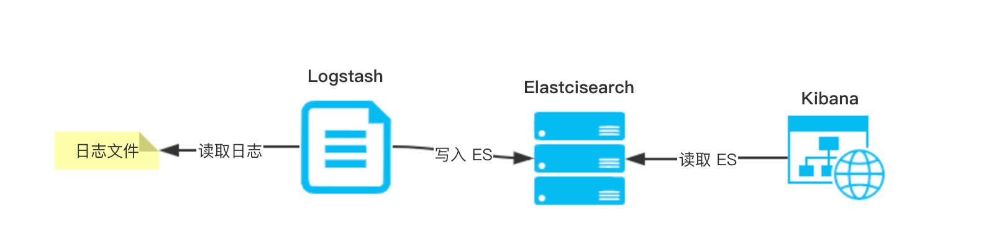

此时我们需要一个统一的实时【日志服务】，将我们需要的日志全部收集在一起，并提供灵活的查询功能

一般来说，一个完整的日志服务，需要提供如下 5 个功能：

1. 收集 ：能够采集多个来源的日志数据。

2. 传输 ：能够稳定的把日志数据传输到日志服务。

3. 存储 ：能够存储海量的日志数据。

4. 查询 ：能够灵活且高效的查询日志数据，并提供一定的分析能力。

5. 告警 ：能够提供提供告警功能，通知开发和运维等等。

# 解决方案

目前，市面上有非常多的日志服务的解决方案。

**开源解决方案**

- ELK

- Apache Chukwa

- Apache Kafka

- Cloudera Fluentd

- Syslog、Rsyslog、Syslog-ng

- Facebook Scribe

**商业解决方案**

- 阿里云 SLS、腾讯云 CLS、华为云 LTS

- Splunk

我们目前线上采用阿里云 SLS 日志服务，主要考虑使用方便，成本合算。阿里云打钱~

目前采用最多的日志服务的解决方案，是 ELK 搭建的日志服务。

# ELK

那么 ELK 是什么呢？

“ELK” 是三个开源项目的首字母缩写，这三个项目分别是：Elasticsearch、Logstash 和 Kibana。

- Elasticsearch 是一个搜索和分析引擎。

- Logstash 是服务器端数据处理管道，能够同时从多个来源采集数据，转换数据，然后将数据发送到诸如 Elasticsearch 等“存储库”中。

- Kibana 则可以让用户在 Elasticsearch 中使用图形和图表对数据进行可视化。




https://www.iocoder.cn/Elasticsearch/ELK-install/?self

Install Elasticsearch with Docker

https://www.elastic.co/guide/en/elasticsearch/reference/current/docker.html

SpringBoot-starter-data整合Elasticsearch

https://blog.csdn.net/qq_38011415/article/details/112241548

Elasticvue is a free and open-source elasticsearch gui for the browser.

https://elasticvue.com/

mobz/elasticsearch-head

https://hub.fastgit.xyz/mobz/elasticsearch-head.git

Elasticsearch7.17.0新版本的JavaApi使用

https://blog.csdn.net/wtl1992/article/details/123144901

狂神elasticsearch笔记(纯手敲)

https://blog.csdn.net/lisen01070107/article/details/108288037

```
keytool -importcert -file ./es01.cer  -cacerts -keypass changeit -storepass changeit -noprompt -alias es01
```