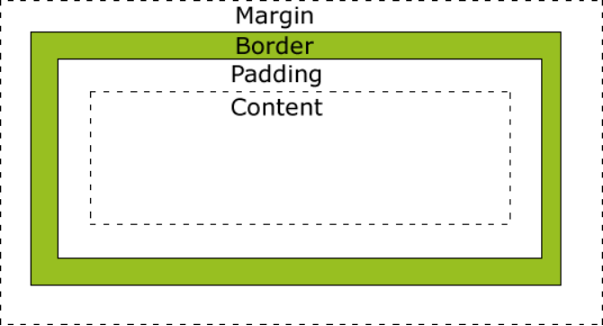

# 声明

最近一次编辑：2020/6/8

# HTML 标签

## 文档声明

```html
<!doctype html>
<!-- html 5 文档声明 -->
```

## 元数据

```html
<meta/>
<!-- meta 标签用来设置网页的一些元数据，比如网页的字符集，关键字，简介 -->
```

## 标题标签

```html
<h1>一级标题</h1>
<h2>二级标题</h2>
<h3>三级标题</h3>
<h4>四级标题</h4>
<h5>五级标题</h5>
<h6>六级标题</h6>
```

## 段落标签

```html
<p>
```

## 主体标签

```html
<main>
```

## 符号

```html
&lt;
<!-- < -->
&gt;
<!-- > -->
&nbsp;
<!-- 空格 -->
&copy; 
<!-- @ -->
```

## 图片

```html

<!-- src: 设置图片路径 -->
<!-- alt: 对图片的描述 -->

<!-- 图片格式 -->
<!-- JPEG（JPG）支持的颜色比较多，但是不支持透明 -->
<!-- GIF 支持的颜色少，支持简单的透明，支持动态图 -->
<!-- PNG 支持的颜色多，并且支持复杂的透明 -->
```

## 超链接

```
<a href=""></a>
<!-- href:跳转地址，可以写相对路径，也可以写一个完整路径 -->
<!-- 若地址不确定可以写一个占位符“#” -->
<!-- 跳转到当前任意位置：#id -->
<!-- 发送邮件的超链接：点击链接以后可以自动打开计算机中默认的邮件客户端 href="mailto:邮件地址" -->
<!-- target="_blank" 打开一个全新的窗口 -->
```

## 块元素

```html
<div></div>
<!-- 块元素就是会独占一行的元素，无论内容有多少 -->
<!-- 块元素主要用来做页面的布局 -->
```

## 内联元素

```html
<span></span>
<!-- 内联元素 -->
<!-- 行内元素，指的是只占自身大小的元素，不会占用一行 -->
<!-- 内联元素，主要用来选中文本设置样式 -->
```

## center标签

```
<center></center>
<!-- center标签中的内容会居中显示 -->
```

## 文本标签

```html
<!-- em主要表示语气上的强调，em在浏览器中默认使用斜体显示 -->
<!-- strong表示强调的内容，比em更强烈，默认使用粗体显示 -->
<!-- i  以斜体显示 -->
<!-- b  以加粗显示 -->
<!-- small 标签中的内容会比他的父元素中的文字要小一些 -->
<!-- 比如合同中的小字，网站的版权声明都可以放到small中 -->
<!-- cite  表示参考的内容 -->
<!-- q 表示一个短的引用 -->
<!-- blockquote 表示一个长引用 -->
<!-- sup 设置一个上标 -->
<!-- sub 设置一个下标 -->
<!-- del 表示一个删除的内容 -->
<!-- ins 表示一个插入的内容，会自动添加下划线 -->
<!-- pre  预格式标签，会将代码中的格式保存，不会忽略多个空格 -->
<!-- code 专门用来表示代码 -->
```

## 无序列表

```html
<!-- 无序列表 -->
<ul></ul>
<!-- 使用ul标签来创建一个无序列表 -->
<!-- 使用li在ul中创建一个列表项 -->
<!-- 一个li就是一个列表项 -->
<!-- type： disc  默认值，实心的圆点  square 实心的方块  circle  空心的圆圈  注意：默认项目符号我们一般不使用 -->
<!-- 如果需要设置项目符号，则可以采用为li设置背景图片的方式来设置 -->
<!-- ul和li都是块元素 -->
```

## 有序列表

```html
<!-- 有序列表 -->
<!-- 使用ol来创建一个有序列表 -->
<!-- 里面使用li -->
```

## 定义列表

```html
<!--  -->
<!-- 定义列表用来对一些词汇或内容进行定义

使用dl来创建一个定义列表

dl中有两个子标签

dt:被定义的内容

dd：对定义内容的描述

同样dl和ul和ol之间都可以互相嵌套 -->

<dl>
<dt>武松</dt>
<dd>景阳岗打虎英雄，战斗力99</dd>
<dd>景阳岗打虎英雄，战斗力99</dd>
<dt>武松</dt> 
<dd>景阳岗打虎英雄，战斗力99</dd>
</dl>
```

## 表格

```html
<!-- 在HTML中使用table标签来创建一个表格 
在table标签中使用tr来表示行
使用td表示几个单元格
默认是没有边框
最好使用CSS来显示 -->

<!-- 长表格 -->
<!-- 有一些情况下表格是非常的长的，
这时就需要将表格分为三个部分，表头，表格的主体，表格的底部
在HTML中为我们提供了三个标签，
thead 表头 tbody 表格主体 tfoot 表格的底部 -->
<!-- 这三个标签的作用，就是来区分表格的不同的部分，它们都是table的子标签都需要直接写到table中,tr需要写在这些标签当中 -->
<!-- thead中的内容，永遠會显示在表格的头部
tfoot中的内容，永遠會显示在表格的底部
tbody中的内容，永遠會显示在表格的中间 -->
```

## 表单项

使用form标签创建一个表单

form标签中必须指定一个action属性,该属性指向的是一个服务器的地址

当我们提交表单时将会提交到action属性对应的地址

使用form创建的仅仅是一个空白的表格,我们还需要向form中添加不同的表单项

```html
<form action="target.html" >
<-- 名字=属性值&属性名=属性值-->
		用户名<input type="text" name="username"/>

		密码<input type="password" name="passwd" />
		性别
		<input type="radio" name="r1" value="nan"/>男
		<input type="radio" name="r1" value="nv" checked="checked"/>女
		爱好
		<input type="checkbox" name="hobby" value="zq" />足球		
		<input type="checkbox" name="hobby" value="lq" checked="checked"/>篮球		
		<input type="checkbox" name="hobby" value="sq"/>手球		
		<input type="checkbox" name="hobby" value="pq"/>排球		
		你喜欢的明星
			<select name="star" multiple="multiple">
				<optgroup label="女明星">
					<option value ="fan" >范冰冰</option>
					<option value ="lin">林心如</option>
				</optgroup>
				<optgroup label="男明星">
					<option value ="zhao" >赵本山</option>
					<option value ="zhao" selected="selected">周杰伦</option>
					<option value ="zhao" >邓超</option> 	
				</optgroup>		
			</select>
			<input type="submit" value="提交按钮"/>
		</form>
```

# CSS

（Cascading Style Sheets）`css`可以用来为网页创建样式表，通过样式表可以对网页进行装饰。

**内联样式**

将`css`样式编写到元素的style属性当中

不方便后期的维护，不推荐使用

**内部样式**

将CSS样式编写到head中的style标签里

将样式表编写到style标签中，也可以使表现和结构进一步分离它也是我们推荐的使用方式

**外部样式表**

将样式表编写到外部的CSS文件中

```html
<link rel=”stylesheet”	type=”text/css”	href=”style.css”>
```

## 元素选择器

通过元素选择器可以选择页面中的所有指定元素

```css
p{
    color: red;
}
```

## id选择器

通过元素id属性选择唯一的一个元素

```css
#p1{
    font-size:30px;
}
```

## 类选择器

通过元素的class属性值选中一组元素

```css
.p2{
	color: red;
}
```

## 选择器分组

通过选择器分组可以同时选中多个选择器对应的元素

```css
#p1, .p2, h1{
    backgroud-color: yellow;
}
```

## 通配选择器

选中页面中的所有元素

```css
*{}
```

## 交集选择器

```css
.p3{
    background-color: yellow;
}
span.ps{
    background-color: blue;
}
```

## 后代元素选择器

选中指定元素的后代元素

```css
#d1 span{
    color:red;
}
#d1 p span{
    font-size: 30px
}
```

## 子元素的伪类

`:first-child`可以选中第一个子元素

`:last-child`可以选中最后一个子元素

`:nth-child(n)`可以选中任意位置的子元素，后边指定一个参数，指定要选中第几个元素，even表示偶数位置的子元素，odd表示奇数位置的子元素

## 兄弟元素选择器

为span后的一个p元素设置一个背景颜色为黄色

后一个兄弟选择器

作用：可以选中一个元素后紧挨着的指定的兄弟元素

语法：	前一个+后一个

选中后边的所有兄弟元素

语法：前一个-后边所有

## 伪类选择器

伪类专门用来表示元素的一种特殊状态

:link   :visited  :hover  :active

而这四个选择器的优先级

### :link

表示普通的链接（没访问过的链接）

### :visited

表示访问过的链接（浏览器是通过历史记录来判断一个链接是否被访问过）

由于涉及到用户隐私问题，所以使用visited伪类只能设置字体颜色

### :hover

表示鼠标移入的状态

### :active

表示超链接被点击的状态

### :focus

表示获取焦点

### ::selection

表示选中状态

**注意**：  hover和active也可以为其他元素设置

IE6中，不支持对超链接以外的元素设置hover和active

## 选择器的优先级

内联样式，优先级	1000

id选择器，优先级	100

类和伪类，优先级	10

元素选择器，	优先级	1

通配符*，	优先级	0

继承的样式没有优先级

## 长度单位

* **px**   一个像素就相当于我们屏幕中的一个小点
* **百分比**  创建一个自适应的页面时，经常使用百分比作为单位
* **em** 相对于当前元素的字体大小来计算 1em  =  1 font-size

## 字体

浏览器一般默认的文字大小都是16px；font-size设置的并不是文字本身的大小。设置格的高度

## 字体分类font-family

* serif(衬线字体)

* sans-serif（非衬线字体）

* monospace（等宽字体）

- cursive（草书字体）
- fantasy（虚幻字体）

## 字体样式

**font-style**

normal:默认值，文字正常显示

italic:文字以斜体显示

oblique:文字会以倾斜效果显示

**font-weight**

设置文字的加粗效果

normal 默认值，文字正常显示

bold 文字加粗显示

**font-variant**

设置小型大写字母

## 行高

在css并没有为我们提供一个直接设置行间距的方式，我们只能通过设置行高来间接设置行间距，行高越大行间距越大。

使用**line-height**来设置行高, **行间距= 行高-字体大小**

```css
.p1{
	   font-size: 20px;
	   line-height: 1.5;
}

```

对于单行文本来说，可以将行高设置为和父元素的高度一致

这样可以使单行文本在父元素中垂直居中

```css
.box{
   width:200px;
   height: 200px;
   background-color: #bfa;
   line-height: 200px;
}
```

## 文本样式

* text-transform
  * capitalize  单词首字母大写，通过空格来识别
  * uppercase 所有单词的字母都大写
  * lowercase 所有的字母都小写

* text-decoration

  * underline 为文本添加下划线
  * overline 为文本添加上划线
  * line-through 为文本添加删除线

* letter-spacing
  字符间距

* word-spacing

设置单词之间的距离

* text-align 设置文本对齐方式
  * left
  * right
  * center
  * justify

* text-indent 设置首行缩进
  * 正值，向右侧缩进指定的像素
  * 负值，向左侧缩进指定的像素

## 盒子模型



width和height设置内容区的宽度和高度

盒子的可见框大小有内容区，内边框和边框共同决定

* **border**  边框
  * border-width 边框的宽度
  * border-color 边框的颜色
  * border-style 边框样式

* padding  内边距  内边距会影响盒子的可见性的大小，元素背景会延伸到内边距中

* margin  外边距 当前盒子与其他盒子之间的距离，不会影响可见框的大小

**tip**

内联元素不能设置width和height

通过display样式可以设置修改元素的类型

* inline  可将一个元素作为内联元素
* block 可将一个元素设置块元素
* inline-block  将对象呈现为inline对象，但是对象的内容作为block对象呈现，可以使一个元素既有行内元素的特点又有块元素的特点。既可以设置宽高，又不会独占一行

visibility  可以设置元素的隐藏和显示状态

visible 、hidden   隐藏元素虽然不会显示它位置依然保持

## overflow

子元素默认是存在于父元素的内容去中，理论上讲子元素的最大可以等于父元素的内容区大小。如果子元素的大小超过父元素的内容区，则超过的大小会在父元素以外的位置显示。可以通过overflow设置父元素如何处理溢出内容

* visible：默认值，不会对溢出内容做出处理
* hidden：溢出的内容，会被修剪，不会显示