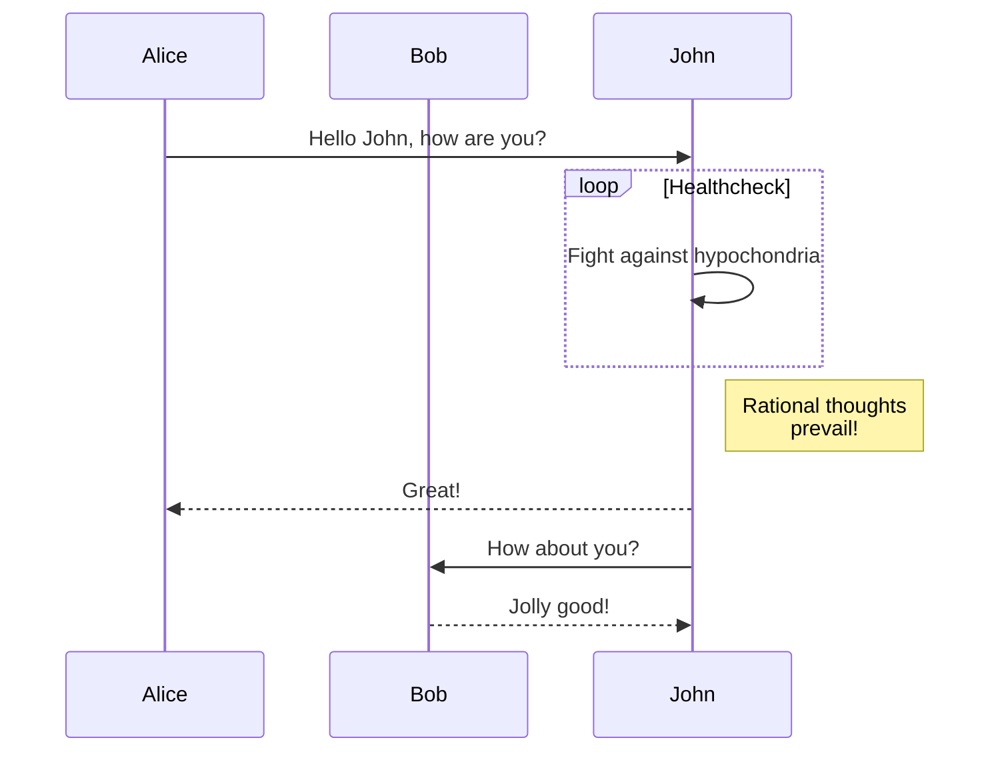
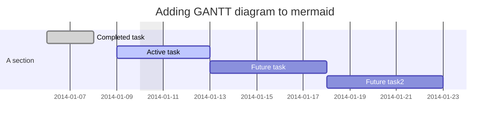

---
markdown:
  image_dir: /assets
  path: output.md
  ignore_from_front_matter: true
  absolute_image_path: false
---

> **Note**
> github.dev github 在线编辑器

> **Warning**
> This is a warning

> ℹ️ Información
> Información que el usuario debe notar incluso si hojea.

> :white_check_mark: You can put any title here.
> It's often important that the actual warning is in the title. 
> Also, "⚠️ Warning" is a bit redundant.

> ‼️ Use symbols not English
> Markdown was designed to not be English-centric.

> ⚠️ 小心
> 需要令牌“Warning”在其他語言中看起來很糟糕。

> 🚫 Do not feed the dragons 

The background color should be `#ffffff` for light mode and `#0d1117` for dark mode.

<picture>
  <source media="(prefers-color-scheme: dark)" srcset="https://user-images.githubusercontent.com/25423296/163456776-7f95b81a-f1ed-45f7-b7ab-8fa810d529fa.png">
  <source media="(prefers-color-scheme: light)" srcset="https://user-images.githubusercontent.com/25423296/163456779-a8556205-d0a5-45e2-ac17-42d089e3c3f8.png">
  
</picture>


- [x] #739
- [ ] https://github.com/octo-org/octo-repo/issues/740
- [ ] Add delight to the experience when all tasks are complete :tada:

https://docs.github.com/cn/get-started/writing-on-github/getting-started-with-writing-and-formatting-on-github/basic-writing-and-formatting-syntax


https://docs.github.com/cn/get-started/writing-on-github/working-with-advanced-formatting/creating-diagrams


https://docs.github.com/cn/get-started


https://github.com/ikatyang/emoji-cheat-sheet/blob/master/README.md

@octocat :+1: 这个 PR 看起来很棒 - 可以合并了！ :shipit:

https://shd101wyy.github.io/markdown-preview-enhanced/#/zh-cn/diagrams?id=flow-charts





```geojson
{
  "type": "FeatureCollection",
  "features": [
    {
      "type": "Feature",
      "id": 1,
      "properties": {
        "ID": 0
      },
      "geometry": {
        "type": "Polygon",
        "coordinates": [
          [
              [-90,35],
              [-90,30],
              [-85,30],
              [-85,35],
              [-90,35]
          ]
        ]
      }
    }
  ]
}
```

https://mermaid-js.github.io/mermaid/#/